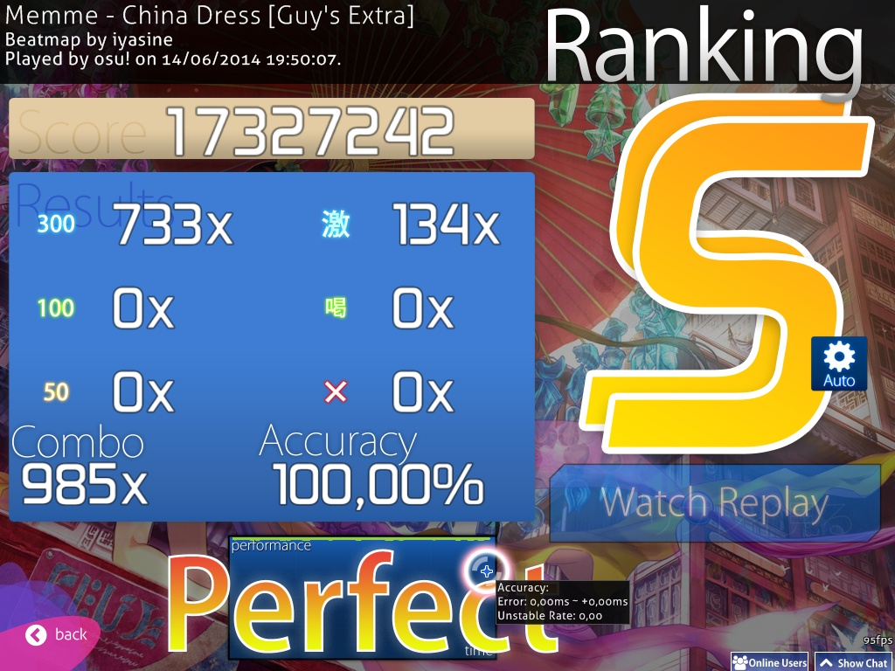

There are three types of accuracy - \[1\] per [beatmap](beatmap "wikilink")'s accuracy, \[2\] one's overall accuracy, and \[3\] [pp](pp "wikilink")'s accuracy.

In simple terms, the beatmap's accuracy is dependent on [Hit-scores](Score "wikilink") gained, overall accuracy dependent on each submitted best online score's accuracy, and pp's accuracy is dependent on submitted online score's accuracy which is eligible for pp gain.

\_\_TOC\_\_ Accuracy is calculated by the following formulas:

Standard
--------

In [Standard](Standard "wikilink"), accuracy is calculated by weighting the judgement gained on each note by its value and dividing by the maximum possible amount. In other words:

| *Variables* | Accuracy = Total points of hits / (Total number of hits * 300) |
| ------------| -------------------------------------------------------------- |
| Total points of hits | (Number of 50s * 50 + Number of 100s * 100 + Number of 300s * 300) |
| Total number of hits | (Number of misses + Number of 50's + Number of 100's + Number of 300's) |

For reference: 300 = 6/6, 100 = 2/6, 50 = 1/6, Miss = 0/6.

Taiko
-----

In [Taiko](Taiko "wikilink") mode, the song accuracy is calculated by sum of all note accuracy divided by number of notes. A GREAT (良) counts as 100%, a GOOD (可) as 50% (half) and a MISS/BAD (不可) as 0% (which breaks the combo). Drumrolls and spinners do not influence the accuracy.

| *Variables* | Accuracy = Total points of hits / (Total number of hits * 300) |
| ------------| -------------------------------------------------------------- |
| Total points of hits | (Number of Miss * 0 + Number of 100(GOOD) * 0.5 + Number of 300(GREAT) * 1) * 300 |
| Total number of hits | (Number of Miss + Number of 100 + Number of 300) |

Catch the Beat
--------------

In [Catch the Beat](Catch_the_Beat "wikilink"), the song accuracy is calculated as the number of non-spinner objects collected divided by the total number of non-spinner objects; fruits, large drops and small drops all have the same value.

| *Variables* | Accuracy = Total numbers of fruits caught / Total number of fruits |
| ------------| ------------------------------------------------------------------ |
| Total number of fruits caught | (Number of droplets + Number of 100s + Number of 300s) |
| Total number of fruits | (Number of misses + Number of droplets + Number of 100s + Number of 300s + Number of miss droplets) |
| Condition | "Bananas" (Spinner's fruits) do not count. |

Note that if you use the API to calculate the accuracy, number of droplets is under **count50** and number of miss droplets is under **countkatu**

Mania
-----

Accuracy is calculated similarly to [Standard](Standard "wikilink") in this mode.

| *Variables* | Accuracy = Total points of hits / (Total number of hits * 300) |
| ------------| -------------------------------------------------------------- |
| Total points of hits | (Number of droplets + Number of 100s + Number of 300s) |
| Total number of hits | (Number of misses + Number of 50s + Number of 100s + Number of 200s + Number of 300s + Number of MAXes) |

Note that MAX and 300 are both worth the maximum for calculating accuracy, despite a MAX being worth more in terms of score than a 300.

Results screen
--------------

### Ranking

  This shows your grade, an overview of your hits, as well as your actual accuracy percentage. For more details, see [Score](Score "wikilink").

### Performance Graph

  This shows a graph of your performance over the course of a play. Additional information is shown when you hover the cursor over it:

#### Accuracy
| Term | Meaning |
| ---- | ------- |
| Error | **These two values represent how far off your early hits are on average, and how far off your late hits are on average.** The higher the [OD value](../Song-Setup/en.md#Overall_Difficulty) of the beatmap you're playing, the lower these will have to be to do well. |
| Unstable Rate | **This value represents how consistently you time your hits**, with lower numbers being better (top players often score below 100). Note that this measures consistency, and not accuracy, so if you're consistent in hitting 15ms early, you'll get similar results to if you're consistent in hitting on time. The formula is essentially the standard deviation of your hit errors (in milliseconds) multiplied by 10. |

#### Spin [osu! only]
| Term | Meaning |
| ---- | ------- |
| Speed | **Average spinning speed on all the spinner(s) in the beatmap.** Max is the highest rpm(rounds per minute) achieved in one of the beatmap's spinner(s).
| Unstable Rate | **Values based on average against Max deviation**, the lower the better. Formula is unknown. |

**Notes**

-   The above four values are not saved and will disappear after you close osu!. You can only see them again by watching a saved replay.
-   Due to the way the Double Time and Half Time mods are implemented, the error and unstable rate values will be multiplied by the same factor as the song. To get the true values when playing DT, divide the results by 1.5. Similarly, multiply the results by 1.33 when playing HT.

<Category:Gameplay> <Category:Taiko> [Category:Catch The Beat](Category:Catch_The_Beat "wikilink") <Category:osu!mania> <Category:osu!Standard>
