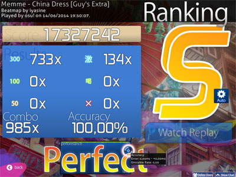
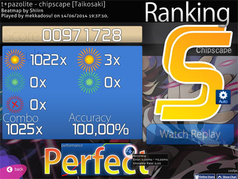
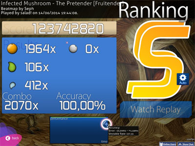
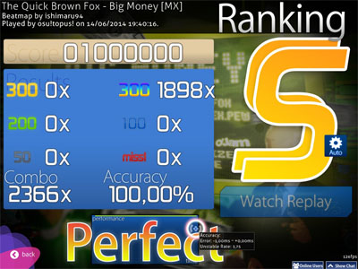
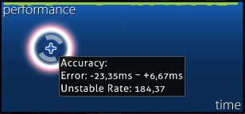

<!-- wiki -->
[osu! wikilink]: /wiki/Game_Modes/osu!/ "osu!"
[osu!taiko wikilink]: /wiki/Game_Modes/osu!taiko/ "osu!taiko"
[osu!catch wikilink]: /wiki/Game_Modes/osu!catch/ "osu!catch"
[osu!mania wikilink]: /wiki/Game_Modes/osu!mania/ "osu!mania"

[beatmap wikilink]: /wiki/Beatmaps "Beatmaps"
[pp wikilink]: /wiki/Performance_Points "Points de Performance"
[Score wikilink]: /wiki/Score "Score"

[OD wikilink]: /wiki/Beatmap_Editor/Song_Setup "plus d'informations peuvent être trouvées dans Configuration de la Musique sous Difficulté Générale"

# Précision

Il y a trois types de précision:

- la précision par [beatmap][beatmap wikilink],
- la précision globale personnelle,
- la précision des [Points de Performance (pp)][pp wikilink].

Pour faire simple:

- la précision par beatmap dépend des [Hit-scores][Score wikilink],
- la précision globale dépend des précisions de chaque score soumis,
  - notez que la précision sera calculée de sorte que les meilleurs scores influencent plus que les moins bons,
- la précision des pp dépend de la précision de chaque score éligible au gain de pp soumis en ligne.

## Modes de Jeu

### osu!standard

Dans [osu!standard][osu! wikilink], la précision est calculée en tenant compte du jugement de chaque note par sa valeur divisée par le nombre maxiumum de notes.

En d'autres termes: `Précision = Total des points de hits / (Nombre total de hits * 300)`

Terme | Formule
:---:|:---:
**Total des points de hits**   | Nombre de 50 \* 50 + Nombre de 100 \* 100 + Nombre de 300 \* 300
**Total des hits**   | Nombre de manqués + Nombre de 50 + Nombre de 100 + Nombre de 300

Pour référence:
-  300 = 6/6(100%),
-  100 = 2/6(33.33%),
-   50 = 1/6(16.66%),
- Manqué = 0/6(0%).

### osu!taiko

Dans [osu!taiko][osu!taiko wikilink], la précision de la musique est calculée en additionnant les précisions de toutes les notes divisées pas le nombre total de notes.
Un EXCELLENT (良) vaut 100%, un BIEN (可) vaut 50% (la moitié) et un MANQUÉ/MAUVAIS (不可) vaut 0% (ce qui casse le combo).
Les drumrolls et les spinners n'influencent pas la précision.

En d'autres termes: `Précision = Total des points de hits / (Nombre total de hits * 300)`

Terme | Formule
:---:|:---:
**Total des points de hits** | ((Nombre de Manqués \* 0) + (Nombre de 100(BIEN) \* 0.5) + (Nombre de 300(EXCELLENT) \* 1)) \* 300
**Total des hits** | Nombre de Manqués + Nombre de 100 + Nombre de 300

### osu!catch

Dans [osu!catch][osu!catch wikilink], la précision de la musique prend en compte tous les objets collectés sauf les spinners divisés par le nombre total d'objets non-spinners; les fruits, les large drops et les small drops (droplets) ont tous la même valeur.

En d'autres termes: `Précision = Nombre total de fruits collectés / Nombre total de fruits`

Terme | Formule
:---:|:---:
**Total des fruits collectés** | Nombre de droplets + Nombre de drops + Nombre de fruits
**Total des fruits**        | Nombre de manqués + Nombre de droplets manquées + Nombre de droplets + Nombre de drops + Nombre de fruits

Les "Bananas" (les fruits des spinners) ne comptent pas.

Sachez que si vous utilisez l'API pour calculer la précision, le nombre de droplets est sous **count50** et le nombre de droplets manqués sous **countkatu**.

### osu!mania

Dans [osu!mania][osu!mania wikilink], la précision est calculée de la même manière qu'[osu!standard][osu! wikilink].

En d'autres termes: `Précision = Total des points de hits / (Nombre total de hits * 300)`

Terme | Formule
:---:|:---
**Total des points de hits** | (Nombre de 50 \* 50 + Nombre de 100 \* 100 + Nombre de 200 \* 200 + Nombre de 300 \* 300 + Nombre de 300 arc-en-ciel \* 300)
**Total des hits** | (Nombre de manqués + Nombre de 50 + Nombre de 100 + Nombre de 200 + Nombre de 300 + Nombre de 300 arc-en-ciel)

Sachez qu'un MAX (ou 300 arc-en-ciel) et un 300 valent tous les deux le maximum pour la précision, malgré qu'un MAX ait plus de valeur pour le score qu'un 300.

## Écran de Résultats

### Classement

Le classement montre le grade, une vue d'ensemble des hits, ainsi que la précision actuelle du joueur.

Pour plus de détails, voir [Score][Score wikilink].

### Graphique de Performance

Un graphique de performance de la partie jouée.

Des informations supplémentaires sont affichées quand le curseur survole le graphique:

#### Précision

Terme | Signification
----- | -------
Error | **Ces deux valeurs représentent l'écart moyen en millisecondes des notes frappées trop tôt et trop tard.** Plus l'[OD](OD wikilink) de la beatmap est haut, plus ces écarts devront être faibles afin de bien réussir la beatmap.
Unstable Rate | **Cette valeur représente la consistance de vos frappes**. Plus cette valeur est faible plus vos frappes sont en rythme (les meilleurs joueurs ont en dessous de 100). Veuillez noter que cela mesure la consistance et non la précision, donc si vous tapez constamment 15ms en avance, vous aurez un résultat similaire dans le cas où vous tapez constamment sur le beat. La formule est essentiellement la déviation de la marge d'erreur multipliée par 10.

#### Spin

_Spin est seulement pour [osu!standard][osu! wikilink]_

Terme | Signification
----- | -------
Speed | **Vitesse moyenne sur chaque spinner de la beatmap.** Max étant la vitesse maximale en RPM (Rounds Per Minute) sur l'un des spinners de la beatmap..
Unstable Rate | **Valeur basée sur la variation moyenne de la vitesse de rotation**, plus la valeur est faible, mieux c'est. La formule est inconnue.

**Notes:**

- Les quatre valeurs ci-dessus ne sont pas sauvegardées et disparaîtront après avoir fermé _osu!_.
  Pour les revoir, regardez le replay exporté.
- Du fait de la façon dont les mods Double Time et Half Time sont implémentés, les valeurs "Error" et "Unstable Rate" seront multipliées par le facteur de vitesse de la beatmap.
  Afin d'obtenir les vraies valeurs en jouant DT, il faut diviser les résultats par 1.5.
  De même, il faut multiplier les résultats par 1.33 lorsque vous jouez en HT.
