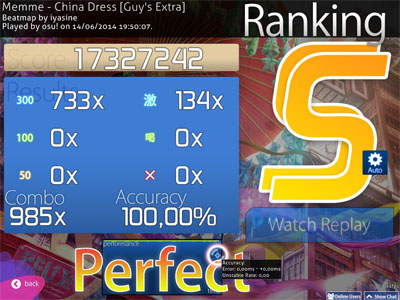
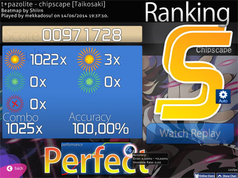
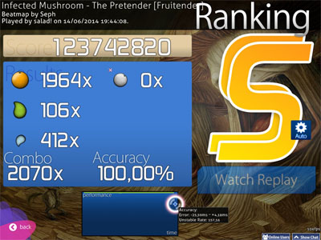
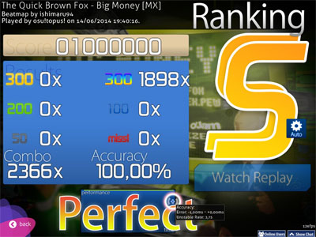
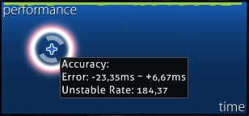

정확도
==========

세 가지 유형의 정확도가 있습니다.: [비트맵](/wiki/Beatmaps)의 정확도, 전체적인 정확도, 그리고, [pp](/wiki/Performance_Points)의 정확도가 있습니다.

간단하게 말해서, 비트맵의 정확도는 Hit-scores에 따라 달라지며, 전체적인 정확도는 각 최고점수의 정확도에 따라 달라집니다. (정확도는 어떤 식으로든 가중되므로, 점수가 나쁠수록 전체의 정확도에 영향을 미치는 점에 유의하세요.) PP의 정확도는 온라인 점수의 정확도에 따라 달라집니다.

Standard
----------

[Standard](/wiki/Game_Modes/osu!)에서 정확도는 각 노트에서 얻은 판단에, 그 값으로 가중치를 부여하고, 가능한 최대 양으로 나눔으로서 계산됩니다. 다른 말로 : 

**정확도 = 총합 점수의 히트 / (총합 히트의 수 * 300)**

| 총합 히트의 점수 | 총합 히트의 수 |
| ---------------------| ---------------------|
| (50s 의 수 * 50 + 100s의 수 * 100 + 300s의 수 * 300) | (miss의 수 + 50's 의 수 + 100's의 수 + 300's의 수) |

참고 :　300 = 6/6, 100 = 2/6, 50 = 1/6, Miss = 0/6.

Taiko
------

[Taiko](/wiki/Game_Modes/osu!taiko) 모드에서 노래 정확도는 노트 정확도를 노트 수로 나눈 값의 합으로 계산됩니다. A GREAT (良)는 100%, a GOOD (可)은 50% (반) 그리고, MISS/BAD (不可)는 0% (콤보 깨트림) 이라 간주합니다. 드럼 롤(Drumrolls)과 스피너는 정확도에 영향을 미치지 않습니다.

**정확도 = 총합 점수의 히트 / (총합 히트의 수 * 300)**

| 총합 Hits(히트)의 점수 | 총합 Hit(히트)의 수 |
| ---------------------| -------------------- |
| (Miss(미스)의 수 * 0 + 100(GOOD)의 수 300(GREAT)의 수* 1) * 300 | (Miss의 수 + 100의 수 + 300의 수) |

Catch the Beat
------------------

[Catch the Beat](/wiki/Game_Modes/osu!catch)에서 노래 정확도는 수집된 non-spinner 개체의 수를 non-spinner; 개체의 총 수로 나눈 값으로 계산됩니다. 과일, 큰 방울과 작은 방울은 모두 같은 가치를 지니게 됩니다.

**정확도 = 잡은 과일의 총 수 / 과일의 총 수**

| 잡은 과일의 총 수 | 과일의 총 수 |
| ------------------------------| ---------------------- | --------- |
| (방울의 수 + 100s의 수 + 300s의 수) | (Miss의 수 + 방울의 수 + + 100s의 수 + 300s의 수 + Miss 방울의 수) | “바나나” (스피너 과일)은 새지 않습니다. |

API를 사용하여 정확도를 계산할 경우, 방울의 수는 **count50** 미만이며 누락 된 방울의 수는 **countkatu** 미만입니다.

Mania
---------

정확도는 [Standard(스탠다드)](/wiki/Game_Modes/osu!)하고 유사하게 계산됩니다.

**정확도 = 총합 점수의 히트 / (총합 히트의 수 * 300)**

| 총합 히트의 점수 | 총합 히트의 수 |
| -------------------- | -------------------- |
| (방울의 수 + 100s의 수 + 300s의 수) | (Miss의 수 50s의 수 + 100s의 수+ 200s의수 + 300s의 수 + MAXes의 수) |

Max는 300점보다 점수에서 더 많은 가치를 지녔음에도 불구하고, MAX와 300, 모두 정확도를 계산할 때 최대값을 가집니다.

결과 화면
-----------------

### 랭킹

  여기에는 성적, 실제 히트수, 실제 정확도 백분율이 표시됩니다. 자세한 내용은 [점수](/wiki/Score)를 참고하세요.

 

[osu! 랭킹 패널](Accuracy_osu!.jpg "Larger version of osu! Ranking Panel")

[osu!Taiko 랭킹 패널](Accuracy_Taiko.jpg "Larger version of osu!Taiko Ranking Panel")

 

[osu!CtB 랭킹 패널](Accuracy_CtB.jpg "Larger version of Standard osu!CtB Panel")

[osu!Mania 랭킹 패널](Accuracy_Mania.jpg "Larger version of osu!Mania Ranking Panel")

### Performance(퍼포머스) 그래프

  이것은 Performance(퍼포머스) 그래프입니다. 커서를 가리키면 추가 정보가 표시됩니다.:

#### 정확도
| 용어 | 뜻 |
| ---- | ------- |
| Error | **두 값은 초기 히트가 평균에서 얼마나 떨어져 있는지 그리고 얼마나 늦은 히트가 평균에 얼마나 떨어져 있는지 나타냅니다.**  연주중인 비트맵의 [OD](/wiki/Beatmap_Editor/Song_Setup) 값이 높을 수 록, OD 수를 낮추면 더 잘할 수 있을 것입니다. |
| Unstable Rate (UR)| **이 값은 히트를 얼마나 일정하게 유지했는지 나타냅니다.** (상위 플레이어는 자주 100 점미만을 기록합니다.) 이것은 일관성을 측정하는 것이지 정확도가 아니라는 것을 유의하십시오. 따라서 15ms를 일찍 유지하는 것이 일관성이 있다면, 일관되게 시간을 맞추면 비슷한 결과를 얻을 수 있습니다. 공식은 기본적으로 히트 오류의 표준 편차 (밀리 초)에 10을 곱한 값입니다. |

#### Spin(스핀)

Spin(스핀)은 osu!Standard(스탠다드) 전용입니다.

| 용어 | 뜻 |
| ---- | ------- |
| speed | **비트맵에 있는 Spin(스핀)의 평균 회전속도입니다.** 최대속도는 비트맵의 Spin(스핀) 중 하나에서 달성 된 최고 rpm (분당 라운드)입니다. | 
| Unstable Rate (UR) | **최대 편차에 대한 평균을 기준으로 한 값은**, 낮을수록 좋습니다. 공식은 알려져 있지 않습니다. |

**Notes(노트)**

-   위에 4개 이상의 값이 저장되지 않으며, osu를 닫은 후에 사라집니다. 저장된 리플레이를 통해 다시 볼 수 있다.
-   Double Time 및 Half Time 모드가 구현되는 방식으로 인해 오류 및 불안정한 속도 값에 노래와 같은 요소가 곱해집니다. DT를 재생할 때 실제 값을 얻으려면 결과를 1.5로 나눕니다. 마찬가지로, HT를 할 때 결과에 1.33을 곱하십시오.
