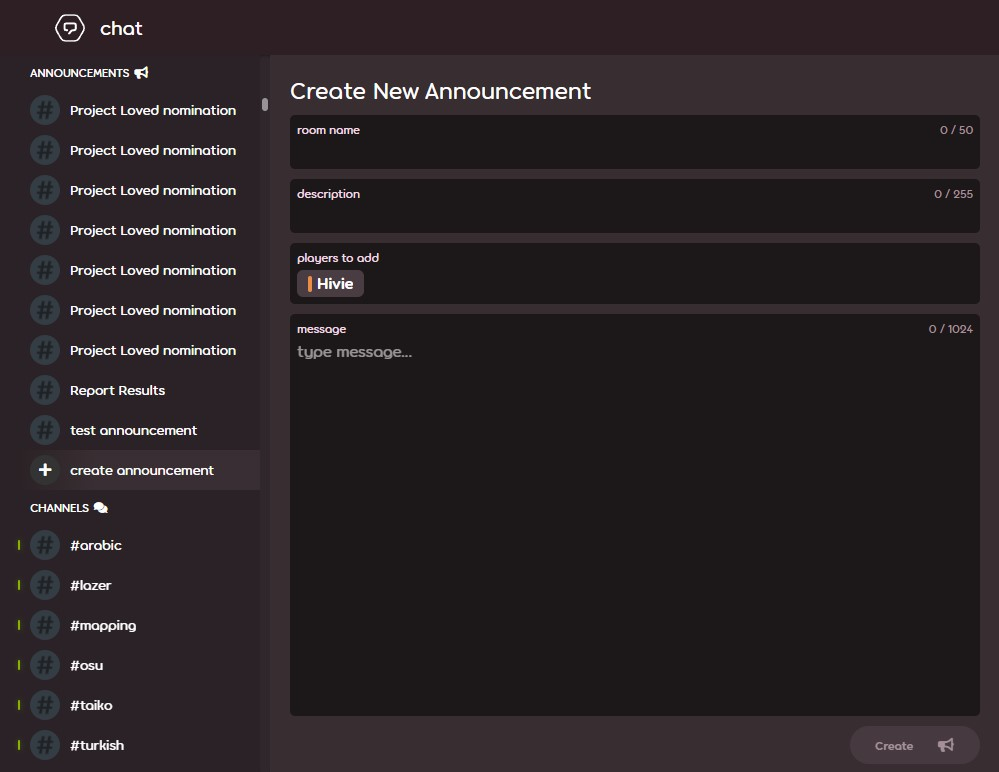

---
tags:
  - announce
  - announce usergroup
  - announce user group
  - annonce
  - annonces
---

# Messages d'annonce

Un **message d'annonce** est un type de message destiné à envoyer des messages plus longs et formatés à plusieurs utilisateurs à la fois. Les principales différences entre les messages d'annonce et les messages de tchat ordinaires sont les suivantes :

- Une limite de 1024 caractères au lieu de 450
- La prise en charge de la syntaxe Markdown[^note-images] pour la mise en forme du texte
- La possibilité de les envoyer à plusieurs utilisateurs à la fois
- La possibilité de contourner le paramètre `bloquer les messages privés des utilisateurs qui ne sont pas dans votre liste d’amis`.
- Seuls les utilisateurs qui peuvent envoyer des messages d'annonce peuvent y répondre.

## Éligibilité

L'envoi et la réponse aux messages d'annonce via le site web nécessitent d'être membre de la [Global Moderation Team](/wiki/People/Global_Moderation_Team), de la [Nomination Assessment Team](/wiki/People/Nomination_Assessment_Team), ou du [groupe d'utilisateurs](/wiki/People/User_group) nommé « Announce ». Cependant, seuls les membres du groupe d'utilisateurs Announce sont autorisés à envoyer des messages d'annonce via [l'API v2 d'osu!](https://osu.ppy.sh/docs/index.html#create-channel).

### Déposer une demande

Toute personne peut demander à rejoindre le groupe d'utilisateurs Announce en envoyant un mail à l'adresse e-mail [accounts@ppy.sh](mailto:accounts@ppy.sh) avec pour sujet `Announce Usergroup Request`. Ce mail doit être envoyé depuis l'adresse e-mail attachée au compte osu! de l'utilisateur.

Le mail doit contenir les éléments suivants :

- Le nom d'utilisateur osu! du demandeur.
- La raison pour laquelle l'utilisateur aurait besoin d'utiliser les messages d'annonce, et à quelle fréquence.

[L'Account Support Team](/wiki/People/Account_support_team) examinera la demande et informera l'utilisateur de sa décision.

## Envoyer des messages d'annonce

Pour envoyer un message d'annonce, ouvrez la [page du tchat](https://osu.ppy.sh/community/chat) et cliquez sur le bouton `créer une annonce`. Saisissez le nom du salon, la description[^note-desc], la liste des destinataires et le message à envoyer. Enfin, cliquez sur le bouton `créer` pour envoyer l'annonce.

## Le saviez-vous ?

- Les messages d'annonce sont destinés à remplacer directement les anciens messages du [forum](/wiki/Community/Forum).
- Une [première mise en œuvre](https://github.com/ppy/osu-web/pull/8418) du système d'annonces a été ajoutée au site web le 26 janvier 2022. Elle comprenait le groupe d'utilisateurs Announce et la possibilité d'envoyer des messages d'annonce par l'intermédiaire de l'API. L'interface utilisateur pour l'envoi de messages d'annonce, ainsi que la possibilité pour les modérateurs de les envoyer, ont été [ajoutées](https://github.com/ppy/osu-web/pull/8747) le 1er juin 2022.
- L'ID du groupe d'utilisateurs Announce est 47, il n'a pas de badge de groupe ni de couleur dédiés, et il n'est pas possible d'accéder à la liste des utilisateurs faisant partie du groupe.

## Notes

[^note-images]: Les images ne sont pas prises en charge dans les messages d'annonce.
[^note-desc]: Contrairement aux autres champs de saisie, les descriptions sont facultatives.
