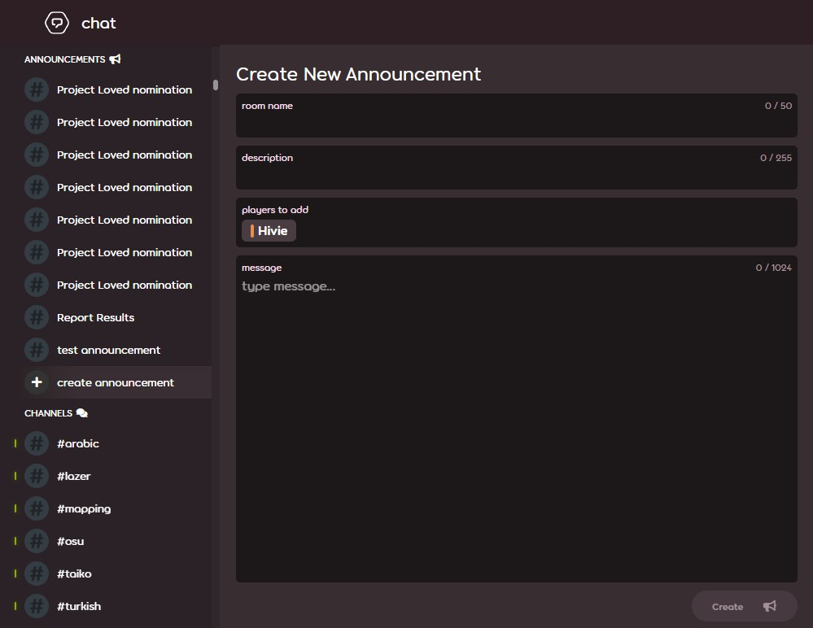

---
tags:
  - announce
  - announce usergroup
  - announce user group
---

# ข้อความประกาศ (Announcement messages)

**ข้อความประกาศ (Announcement message)** เป็นข้อความประเภทพิเศษที่ออกแบบมาเพื่อส่งข้อความที่มีความยาวและมีการจัดรูปแบบ (Format) ไปยังผู้ใช้หลายคนพร้อมกัน ข้อแตกต่างที่สำคัญระหว่างข้อความประกาศและข้อความแชทปกติคือ:

- จำกัดตัวอักษร 1024 ตัว (จากปกติ 450 ตัว)
- รองรับไวยากรณ์ Markdown[^note-images] สำหรับการจัดรูปแบบข้อความ
- ส่งข้อความถึงผู้ใช้หลายคนได้ในครั้งเดียว
- สามารถส่งผ่านการตั้งค่า `block private messages from people not on your friends list` (บล็อกข้อความส่วนตัวจากบุคคลที่ไม่ได้อยู่ในรายชื่อเพื่อน) ได้
- เฉพาะผู้ใช้ที่ได้รับสิทธิ์ส่งข้อความประกาศเท่านั้นที่สามารถตอบกลับข้อความเหล่านี้ได้

## สิทธิ์การใช้งาน (Eligibility)

การส่งและตอบกลับข้อความประกาศผ่านเว็บไซต์จำเป็นต้องเป็นสมาชิกในกลุ่ม [Global Moderation Team](/wiki/People/Global_Moderation_Team), [Nomination Assessment Team](/wiki/People/Nomination_Assessment_Team) หรือกลุ่มผู้ใช้ [Announce (User group)](/wiki/People/User_group) อย่างไรก็ตาม เฉพาะสมาชิกในกลุ่มผู้ใช้ Announce เท่านั้นที่ได้รับอนุญาตให้ส่งข้อความประกาศผ่าน [osu! API v2](https://osu.ppy.sh/docs/index.html#create-channel)

### การยื่นคำขอ

ทุกคนสามารถยื่นคำขอเข้าร่วมกลุ่มผู้ใช้ Announce ได้โดยการส่งอีเมลไปที่ [accounts@ppy.sh](mailto:accounts@ppy.sh) พร้อมระบุหัวข้ออีเมลว่า `Announce Usergroup Request` โดยต้องส่งจากที่อยู่อีเมลที่ผูกกับบัญชี osu! ของผู้ใช้รายนั้นเท่านั้น

เนื้อหาในอีเมลควรประกอบด้วยข้อมูลดังนี้:

- ชื่อผู้ใช้ (Username) ใน osu! ของผู้ยื่นคำขอ
- คำอธิบายเหตุผลที่จำเป็นต้องใช้ข้อความประกาศ และความถี่ในการใช้งาน

ทีมงาน [ฝ่ายสนับสนุนบัญชี (Account support team)](/wiki/People/Account_support_team) จะตรวจสอบคำขอและแจ้งผลการตัดสินใจให้ผู้ใช้ทราบ

## การส่งข้อความประกาศ

ในการส่งข้อความประกาศ ให้เปิดไปที่ [หน้าแชท (Chat page)](https://osu.ppy.sh/community/chat) แล้วคลิกปุ่ม `create announcement` จากนั้นกรอกชื่อแชนแนล (Channel name), คำอธิบาย (Description)[^note-desc], รายชื่อผู้รับ และข้อความที่ต้องการส่ง สุดท้ายให้คลิกปุ่ม `create` เพื่อส่งประกาศ

## เกร็ดน่ารู้ (Trivia)

- ข้อความประกาศถูกออกแบบมาเพื่อใช้แทนที่ข้อความใน [ฟอรัม (Forum)](/wiki/Community/Forum) แบบเก่าโดยตรง
- [การติดตั้งระบบพื้นฐาน](https://github.com/ppy/osu-web/pull/8418) ของระบบประกาศถูกเพิ่มเข้ามาในเว็บไซต์เมื่อวันที่ 26 มกราคม 2022 ซึ่งรวมถึงกลุ่มผู้ใช้ Announce และความสามารถในการส่งข้อความประกาศผ่าน API ส่วนหน้าจอสำหรับส่งข้อความประกาศและการอนุญาตให้ Moderator ส่งได้นั้นถูก [เพิ่มเข้ามา](https://github.com/ppy/osu-web/pull/8747) เมื่อวันที่ 1 มิถุนายน 2022
- กลุ่มผู้ใช้ Announce มี ID คือ 47 โดยไม่มีทั้งเหรียญตราประจำกลุ่ม (Group badge) และสีประจำกลุ่ม รวมถึงรายชื่อผู้ใช้ในกลุ่มนี้ถูกตั้งค่าเป็นส่วนตัว (Private)

## หมายเหตุ

[^note-images]: ไม่รองรับการใส่รูปภาพในข้อความประกาศ
[^note-desc]: คำอธิบาย (Descriptions) เป็นส่วนที่เลือกใส่หรือไม่ก็ได้ ต่างจากช่องข้อมูลอื่นที่จำเป็นต้องกรอก
