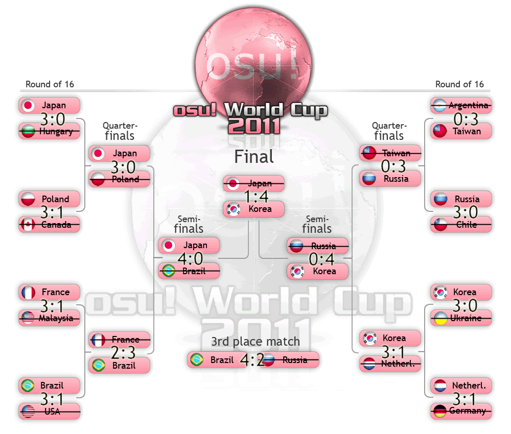

osu! World Cup #2
========================

Scoreboard
----------

TOURNAMENT SCHEDULE (GOOGLE DOCS) [Dokument bez tytułu](//docs.google.com/document/d/1aYgninqJ6OolEvkynUsirJMpt8ZcV4Eksb7p4xuU2Jg/edit)

Interviews
----------

Before the tournament, had interviewed the participants! Here is the [Pre osu! World Cup \#2 Interviews](//docs.google.com/document/d/1xgR7cfCf1yZD1j90_ObGKccS_9OMA6rDHhYJy8uRxNE/edit).

Groups
------

SLOTS: 32/32

### Group Stage

Group A — Japan \\ Australia \\ Denmark \\ Germany

Group B — Netherlands \\ Philippines \\ Hungary \\ New Zealand

Group C — Poland \\ Norway \\ Ukraine \\ Indonesia

Group D — Republic of Korea \\ Canada \\ Vietnam \\ Hong Kong

Group E — Chile \\ France \\ Portugal \\ Latvia

Group F — Russian Federation \\ Finland \\ Malaysia \\ Uruguay

Group G — Taiwan \\ Sweden \\ Bulgaria \\ Brazil

Group H — United States \\ Thailand \\ Austria \\ Argentina

Rules
-----

### Sign-ups

1.  The country will be represented by the captain, which will choose its players. The captain will be chosen in the forum national thread/IRC talk by the trusted members. Basic English language knowledge is required from the person of captain.
2.  To sign up, you need AT LEAST 4 players in the team. You can though sign-up with additional 2 players as the back-up in case of first players' absence. To sign-up simply post the team outline in this thread.
3.  The sign-up time lasts from the day of 28th October to 21st November, 23:59 GMT+0 (3 weeks + 3 days).
4.  The sign-ups automatically stop after reaching 32 participants.
5.  If there's more attention to the tournament than we expect, the number of participants might be raised.

An example of sign-up post:

    Country name:
    Captain: Nickname1
    Player1: Nickname2
    Player2: Nickname3
    Player3: Nickname4
    --------------------------
    Back-up Player1: Nickname5
    Back-up Player2: Nickname6

Time zone: GMT+0 (if you don't know your time zone, visit this site [Time and Date](http://www.timeanddate.com/worldclock/))

### Playing informations

1.  We are looking for 32 teams from 32 countries. If there are less participants than we want, the tournament will be modeled according to the reached number.
2.  In the first stage, the teams will be divided into 8 groups of 4 team in each one.
3.  All the teams from each group will face each other.
4.  2 teams with the largest amount of points are being promoted to the 1/16 Cup Stage.

### Match informations

1.  15 minutes before the match, the captains must contact each other and confirm the ready to play and the amount of players.
2.  During the match, there must be 8 players on the server hosted by one of the captains, 4 players from each team.
3.  One of the players (captain would be preferred) must capture screenshots of all of the map results.
4.  Each round, the staff will announce the list of 15 beatmaps, from which the captains will be able to choose. 1 team chooses 2 beatmaps to play, however, we'd prefer if you prepare the third and fourth choice in case the opposed team chooses same maps. That means you play to 3 maps won.
5.  In the case of a draw, an extra choosen map is played.
6.  The settings of the server will be: osu! standard mode, "Team vs" mode and win condition: score.
7.  The only allowed mod in-game is No Video.
8.  The country with best total score on the map wins.
9.  After the match, a captain of one of the teams must send a PM to fartownik or NatsumeRin with link to the Multiplayer History of the game and screenshots from all of the maps. If any of the captains won't do it, the match will be cancelled and a re-match will be needed.
10. The players can freely change themselves between the maps.

### Other

1.  No more team than 1 from 1 country can sign-up to the tournament.
2.  All of the team players' flag in the profile must be the same as their country's. However, it can be got around in special cases.
3.  Any form of unfair behaviour (such as cheating, insulting other players, racism) will be punished with an immediate banishment of the player/the team from the tournament.

### Important rule changes

Changes in the rules from [OWC 1](/wiki/Announcements/Tournaments/OWC/1) and this OWC

1.  3 maps won by one of the teams gives them a match win. Not 2 maps like it was in the 1st edition.
2.  The final maps will be chosen more carefully this time.
3.  The teams will be divided into 8 groups of 4 teams each. 2 teams with the largest amount of points passes into the next stage.
4.  The additional back-up players are not necessary, but we still prefer if you have at least 1 if there's a possibility.
5.  Timezone needed in the post of team sign-up.

Information
-----------

**03.12.11**

-   If you REALLY can't play your match at this weekend, there's a possibility of postponing it to the next week. The moved match will be marked as "delayed" and will be able to play until next Sunday. It won't affect the round deadline (3rd Round will start in the planned date).
-   The Christmas is on the way and we decide to give the players a ~2 week break from 20th December to 6th January. No matches will be played between these dates.

**25.12.11**

-   The teams are now allowed to make **2 changes** in their lineups (first players and back-ups) or add the back-ups if they had any free slots. If a change is made, the captain of the team should post the new lineup in this thread with a bold in the changed players nicknames. This "changing window" lasts for every team until the beginning of their first match in 1/16 Stage. Remember, you can change only 2 players at total.

Prizes
------

| Place | Prizes                                                                                                                            |
|-------|-----------------------------------------------------------------------------------------------------------------------------------|
| 1     | 6 months supporter tag for all players and a special profile badge for all players // this one:  |
| 2     | 1 month supporter tag for all players                                                                                             |
| 3     | 1 month supporter tag for all players                                                                                             |

Timetables and dates
--------------------

The Cup will start in the day of 21st November, 2011. The proposed hours of the matches will be posted, but the captains of both teams might change the date after the discussion.

Participants
------------

The members are listed in this order: `Caption, Player1, Player2, Player3 (Backup1, Backup2)`

| Country (time zone)                                           | Members                                                                                                                                                                                                                                      |
|---------------------------------------------------------------|----------------------------------------------------------------------------------------------------------------------------------------------------------------------------------------------------------------------------------------------|
| **Germany**  (GMT+1)            | **DoKoLP**, [SuperCracker](//osu.ppy.sh/u/145639), [Blacky](//osu.ppy.sh/u/268788), [ShadowSoul](//osu.ppy.sh/u/494970) (Asozial, Scanlatione)                                                                                               |
| **Denmark**  (GMT+1)            | **Emaal**, [PlasticSmoothie](//osu.ppy.sh/u/296565), m4w11, Circlemuncher ([BongHat](//osu.ppy.sh/u/369746))                                                                                                                                 |
| **Norway**  (GMT+1)             | **[kriers](//osu.ppy.sh/u/333241)**, [CXu](//osu.ppy.sh/u/84841), [AndreasHD](//osu.ppy.sh/u/369956), [Danzai](//osu.ppy.sh/u/73852) ([KinomiCandy](//osu.ppy.sh/u/375143), Oscarface92)                                                     |
| **Argentina**  (GMT-3)          | **Wishy22**, [Metro](//osu.ppy.sh/u/306737), Ever17, [Darksonic](//osu.ppy.sh/u/570042) ([Salvage](//osu.ppy.sh/u/242119), [Glazbom](//osu.ppy.sh/u/608277))                                                                                 |
| **Chile**  (GMT-3)              | **[nVidi4x](//osu.ppy.sh/u/203181)**, [Mesita](//osu.ppy.sh/u/201459), Ignacio, [Art-FzTT](//osu.ppy.sh/u/248453) ([b1choO](//osu.ppy.sh/u/461132), b4ss\_)                                                                                  |
| **Portugal**  (GMT+0 / GMT-1)   | **Mikutard**, [makkura](//osu.ppy.sh/u/344086), [Maraiga](//osu.ppy.sh/u/213335), [JonnyThatJonny](//osu.ppy.sh/u/201290) ([Pereira006](//osu.ppy.sh/u/537344), cococococo7528)                                                              |
| **Brazil**  (GMT-3 / GMT-2)     | **[Blue Dragon](//osu.ppy.sh/u/19048)**, [fabriciorby](//osu.ppy.sh/u/209664), Caco, [antsu](//osu.ppy.sh/u/92953) ([K3nsh1n\_H1mur4](//osu.ppy.sh/u/197834), [Katsuri](//osu.ppy.sh/u/701726))                                              |
| **Netherlands**  (GMT+1)        | **[GladiOol](//osu.ppy.sh/u/23326)**, [Lesjuh](//osu.ppy.sh/u/44308), [eddieee](//osu.ppy.sh/u/260284), Awoken ([Henkie](//osu.ppy.sh/u/16944), zozozofun)                                                                                   |
| **Ukraine**  (GMT+1)            | **[Gorlum](//osu.ppy.sh/u/347635)**, [rockleejkooo](//osu.ppy.sh/u/384003), [uljjang](//osu.ppy.sh/u/3784417), [\[milky\]](//osu.ppy.sh/u/288597)                                                                                            |
| **Vietnam**  (GMT+7)            | **[Misuzu-san](//osu.ppy.sh/u/358563)**, [JerryC](//osu.ppy.sh/u/279278), [Shin1801](//osu.ppy.sh/u/604492), [BridgetteLSatellizer](//osu.ppy.sh/u/854083) ([xLightningx](//osu.ppy.sh/u/1007806), [kira\_lacus1995](//osu.ppy.sh/u/996435)) |
| **Thailand**  (GMT+7)           | **[NonxE](//osu.ppy.sh/u/319312)**, Frostmourne, [bufo](//osu.ppy.sh/u/141605), [blackspell](//osu.ppy.sh/u/601173) ([aumu1995](//osu.ppy.sh/u/235752), [termerys](//osu.ppy.sh/u/84964))                                                    |
| **New Zealand**  (GMT+13)       | **[jiantz](//osu.ppy.sh/u/330252)**, [Kiiwa](//osu.ppy.sh/u/231111), numot123, [Bob\_the\_Cat](//osu.ppy.sh/u/121470) ([deadbeat](//osu.ppy.sh/u/128370), [kwk](//osu.ppy.sh/u/365586))                                                      |
| **Philippines**  (GMT+8)        | **C L O U D**, Pizzicatto, jannnnnn, dayun10 ([Osu Tatakae Ouendan](//osu.ppy.sh/u/594210), [usagijirosan](//osu.ppy.sh/u/714230))                                                                                                           |
| **Bulgaria**  (GMT+2)           | **Lolicore Flandre**, [r-Beatz](//osu.ppy.sh/u/472311), [Orihara Izaya](//osu.ppy.sh/u/513842), [las7h0p3](//osu.ppy.sh/u/113972) ([werewolf0girl](//osu.ppy.sh/u/213292), ColdChester)                                                      |
| **Sweden**  (GMT+1)             | **Hanyuu-chan**, [Holmir](//osu.ppy.sh/u/453435), m4w11, [Gyuunyu](//osu.ppy.sh/u/799102) (Failboat, [Nidert](//osu.ppy.sh/u/817211))                                                                                                        |
| **Indonesia**  (GMT+7)          | **Hakeru Prismriver**, xeqta, [dNextGen](//osu.ppy.sh/u/346320), gatitoneku ([awell](//osu.ppy.sh/u/341298), [awesomewithin](//osu.ppy.sh/u/81652))                                                                                          |
| **Uruguay**  (GMT-3)            | **[maay](//osu.ppy.sh/u/160970)**, Z e o n, [GonixZ](//osu.ppy.sh/u/612622), [H1ko](//osu.ppy.sh/u/58710) (Snepif, [AlrdyExists](//osu.ppy.sh/u/407022))                                                                                     |
| **France**  (GMT+1)             | **Odaril**, \_LRJ\_, [galvenize](//osu.ppy.sh/u/381444), [Kanna](//osu.ppy.sh/u/366059) ([XPJ38](//osu.ppy.sh/u/273531), [Mustaash](//osu.ppy.sh/u/1669213))                                                                                 |
| **Hungary**  (GMT+1)            | **[Kuroi Mato](//osu.ppy.sh/u/584921)**, [tasli](//osu.ppy.sh/u/59650), [Kozuki Kallen](//osu.ppy.sh/u/816305), [higurush](//osu.ppy.sh/u/602159) ([TaylorXIII](//osu.ppy.sh/u/351814), [TsukishimaKirari x]](//osu.ppy.sh/u/816358))        |
| **Canada**  (GMT-5)             | **[FurukawaPan](//osu.ppy.sh/u/32067)**, [Glass](//osu.ppy.sh/u/228532), [SilentWings](//osu.ppy.sh/u/118992), [shaNk](//osu.ppy.sh/u/905124) ([YodaSnipe](//osu.ppy.sh/u/673746), [Satonaka](//osu.ppy.sh/u/767009))                        |
| **Finland**  (GMT+2)            | **ragelewa**, [Zapy](//osu.ppy.sh/u/251395), [Orkel](//osu.ppy.sh/u/39385), [Sutsuka](//osu.ppy.sh/u/29089) ([heintsi](//osu.ppy.sh/u/63185), [ethox](//osu.ppy.sh/u/441380))                                                                |
| **Hong Kong**  (GMT+8)          | **[KanaRin](//osu.ppy.sh/u/310747)**, [Miu Matsuoka](//osu.ppy.sh/u/10641), Kirito470, henry04213 ([HineX](//osu.ppy.sh/u/13854), [Pokie](//osu.ppy.sh/u/207340))                                                                            |
| **Australia**  (GMT+11)         | **Mizorex**, damiaanzx, [Hark](//osu.ppy.sh/u/43265), [Frankcons](//osu.ppy.sh/u/594006) ([Mikey](//osu.ppy.sh/u/979780), [Neko_Lover](//osu.ppy.sh/u/596535))                                                                               |
| **Poland**  (GMT+1)             | **[fartownik](//osu.ppy.sh/u/56917)**, White Wolf, [rEdo](//osu.ppy.sh/u/49329), [Kubu](//osu.ppy.sh/u/29130) ([Piotrekol](//osu.ppy.sh/u/304520))                                                                                           |
| **Latvia**  (GMT+2)             | **[_Angel](//osu.ppy.sh/u/341851)**, [GummyChan](//osu.ppy.sh/u/757683), [LoGo](//osu.ppy.sh/u/750382), [Vmx](//osu.ppy.sh/u/967501)                                                                                                         |
| **Taiwan**                      | **Saya-Honmei**, SnowWhite, [YuyuKo sama](//osu.ppy.sh/u/234788), wizoza83098 ([BinJip](//osu.ppy.sh/u/261694), [ZRush](//osu.ppy.sh/u/398097))                                                                                              |
| **Republic of Korea**           | **[KRZY](//osu.ppy.sh/u/114017)**, mnto, [K i R i K a R u](//osu.ppy.sh/u/139670), [CheEZ](//osu.ppy.sh/u/272117) ([Remilia-Scarlet](//osu.ppy.sh/u/602783), [Reisen Udongein](//osu.ppy.sh/u/232942))                                       |
| **Malaysia**  (GMT+8)           | **[akupp](//osu.ppy.sh/u/249825)**, [xsrsbsns](//osu.ppy.sh/u/414427), RhaiizoN, [Gon](//osu.ppy.sh/u/583765) ([The 08 team_Bourdon](//osu.ppy.sh/u/275686), [zenki0013](//osu.ppy.sh/u/89646))                                              |
| **United States**  (GMT-5)      | **Kyou-kun**, [Cyclone](//osu.ppy.sh/u/18589), [Lybydose](//osu.ppy.sh/u/64501), [geckogates](//osu.ppy.sh/u/252524) (david huhh)                                                                                                            |
| **Japan**  (GMT+9)              | **[SiLviA](//osu.ppy.sh/u/409747)**, [Apricot](//osu.ppy.sh/u/438547), [Flute](//osu.ppy.sh/u/211278), [Iris](//osu.ppy.sh/u/758181) ([Sinch](//osu.ppy.sh/u/360552), [val0108](//osu.ppy.sh/u/243917))                                      |
| **Russian Federation**  (GMT+4) | **[Akai-](//osu.ppy.sh/u/649471)**, [Vpalach](//osu.ppy.sh/u/232729), [Kert](//osu.ppy.sh/u/119933), [Rost94](//osu.ppy.sh/u/490568) (646kapeh640, cr1m)                                                                                     |
| **Austria**  (GMT+1)            | **[-Lennox-](//osu.ppy.sh/u/489103)**, [Snowball](//osu.ppy.sh/u/152238), [Hanyuu](//osu.ppy.sh/u/73480), HakkeroHakkero ([novaaa](//osu.ppy.sh/u/953405), [M A R I O](//osu.ppy.sh/u/594424))                                               |

Staff
-----

### Main organizers

-    [fartownik](//osu.ppy.sh/u/56917) (also map choosing from semi-finals)
-    [NatsumeRin](//osu.ppy.sh/u/151679) (also map choosing)

### Map choosing

-    [Alace](//osu.ppy.sh/u/25993)
-    ~~[Natteke](//osu.ppy.sh/u/157177)~~
-    [Dangaard](//osu.ppy.sh/u/19488)
-    [SapphireGhost](//osu.ppy.sh/u/388602)
-    ~~[jericho2442](//osu.ppy.sh/u/88904)~~
-    [Gabi](//osu.ppy.sh/u/57057)

### Streaming/match coverages & interviews

-    [Metro](//osu.ppy.sh/u/306737)
-    [dvorak](//osu.ppy.sh/u/271359)
-    [YodaSnipe](//osu.ppy.sh/u/673746)
-    [dlovan](//osu.ppy.sh/u/190684)

Maps
----

Note: The asterisk ("[**\***]") at the end of the beatmap means that the beatmap is unavailable due to this [notice](//gist.github.com/peppy/99e6959772083cdfde8a)

### First Stage

-   [Hatsune Miku - BadBye [Goodbye]](http://osu.ppy.sh/b/101916)
-   [DystopiaGround - True Theory of Inheritance [Insane]](http://osu.ppy.sh/b/83215)
-   [Humanoid - Mendes [Another]](http://osu.ppy.sh/b/75831)
-   [Bomfunk MC's - Freestyler [Insane]](http://osu.ppy.sh/b/115352)
-   [Megurine Luka - Leia [gowww]](http://osu.ppy.sh/b/96587)
-   [Niko - Night of Fire [Insane]](http://osu.ppy.sh/b/66820)
-   [Dj Verstarker - Jump Jump (2008) [Jump like CRAZY!!!]](http://osu.ppy.sh/b/28152)
-   [Wiklund - The Digital Force [Magnetic Force]](http://osu.ppy.sh/b/43691)
-   [B0UNC3 - ALIVE [Hard]](http://osu.ppy.sh/b/62712)
-   [Nudarai - Nuclear Fusion [U235]](http://osu.ppy.sh/b/87207)
-   [Hana - Aerodynamics Girls and Boys Poem [Pook]](http://osu.ppy.sh/b/80784)
-   [TeddyLoid - Theme for Scanty & Knee Socks [Larto's Insane]](http://osu.ppy.sh/b/111142)
-   [Lia - Kokoro ni Todoku Uta [Holo]](http://osu.ppy.sh/b/89428)
-   [nomico - Bad Apple!! [Hard]](http://osu.ppy.sh/b/28755)

Extra (for 2:2 tie):

-   [supercell - Rock 'n' Roll Nan Desu no [Insane]](http://osu.ppy.sh/b/93021)

### Second Stage

-   [Jun.A - The Refrain of the Lovely Great War [Lunatic]](http://osu.ppy.sh/b/82734)
-   [REDALiCE - Selfish [Lunatic]](http://osu.ppy.sh/b/105531)
-   [Suzaku - VANESSA [Another]](http://osu.ppy.sh/b/97663)
-   [Tatsh - Fuushi Kaden [Hard]](http://osu.ppy.sh/b/56044)
-   [IOSYS - Chanteikku Sanyousei no Itazura Daisensou [Crazy Jay]](http://osu.ppy.sh/b/91462)
-   [Sum 41 - Thanks For Nothing [Hard]](http://osu.ppy.sh/b/80756)
-   [Hatsune Miku - Netoge Haijin Sprechchor [Insane]](http://osu.ppy.sh/b/87369)
-   [Kuripurin - Jutenija [Insane]](http://osu.ppy.sh/b/86377)
-   [capsule - JUMPER [Insane]](http://osu.ppy.sh/b/73494)
-   [kors k - Wuv U [dksslqj Style]](http://osu.ppy.sh/b/116739)
-   [Hatsune Miku - Subarashii Sekai [S.S]](http://osu.ppy.sh/b/96351)
-   [IOSYS - Poinsettia [Lunatic]](http://osu.ppy.sh/b/65233)
-   [Aizawa - Flutter Girl [Insane]](http://osu.ppy.sh/b/61124)
-   [Mutsuhiko Izumi - Russian Snowy Dance [Insane]](http://osu.ppy.sh/b/124275)

Extra map:

-   [Okui Masami - God Speed [Insane]](http://osu.ppy.sh/b/93947)

### Third Stage

-   [Ruru Ichinose - Hinarin's Relation of Misfortune [Lunatic]](http://osu.ppy.sh/b/46486)
-   [Furries in a Blender - Ridorii [Insane]](http://osu.ppy.sh/b/98496)
-   [DJ Sadan - Theme of Laura [Insane]](http://osu.ppy.sh/b/122776)
-   [Drop - Gensou Kidan (Kaguyahime+Mikotonori Ver.) [Lunatic]](http://osu.ppy.sh/b/57405)
-   [Tatsh - reunion [Insane]](http://osu.ppy.sh/b/83338)
-   [Hatsune Miku - Unhappy Refrain [Rin]](http://osu.ppy.sh/b/105534)
-   [Hate vs Brilliance - Quark [Extra]](http://osu.ppy.sh/b/85166)
-   [Nekomata Master - Far east nightbird [Another]](http://osu.ppy.sh/b/97942)
-   [sun3 - Higan Retour [Alazy]](http://osu.ppy.sh/b/54371)
-   [HHH (Ryu & Dai) - So Fabulous!! [Another]](http://osu.ppy.sh/b/57510)
-   [Yasuharu Takanashi - Fairy Tail Main Theme [KIRBY Mix]](http://osu.ppy.sh/b/50625)
-   [DJ YOSHITAKA - FLOWER [Intense]](http://osu.ppy.sh/b/104635)
-   [Pendulum - The Vulture [Insane]](http://osu.ppy.sh/b/82249)
-   [Hatsune Miku - Kusaregedou to Chocolate [Insane]](http://osu.ppy.sh/b/85494)

Extra:

-   [Hommarju feat. R.Cena - Chousai Kenbo Sengen [Insane]](http://osu.ppy.sh/b/99342)

### Round of 16

-   [xi - Halcyon [Another]](http://osu.ppy.sh/b/73699)
-   [Two Door Cinema Club - Cigarettes In The Theatre [Insane]](http://osu.ppy.sh/b/120461)
-   [Sakaue Nachi - Think of You [Lunatic]](http://osu.ppy.sh/b/84358)
-   [Akita Neru - Gotya Gotya Uruse~! [Insane]](http://osu.ppy.sh/b/76638)
-   [HOUJIROU - Maihime ~buki~ [Another]](http://osu.ppy.sh/b/95795)
-   [Max Coveri - Running in the 90's [Insane]](http://osu.ppy.sh/b/65417)
-   [Kagamine Rin - Tokyo Teddy Bear [Rin]](http://osu.ppy.sh/b/127138)
-   [SHK - Weep Irish [Another]](http://osu.ppy.sh/b/95360)
-   [Dark PHOENiX - Taketori Hishou [Lunatic]](http://osu.ppy.sh/b/68036)
-   [cranky - R176 [Another]](http://osu.ppy.sh/b/103102)
-   [Tamura Yukari - Endless Story [Insane]](http://osu.ppy.sh/b/123021)
-   [Katy Perry - E.T. [Futuristic]](http://osu.ppy.sh/b/116708)
-   [Megpoid GUMI - Chocolate [Insane]](http://osu.ppy.sh/b/89721)
-   [DCX - Flying High (DJ Splash Remix) [InoSane]](http://osu.ppy.sh/b/76663)

Extra:

-   [Hatsune Miku - Rubik's Cube [7x7x7]](http://osu.ppy.sh/b/114635)

### Quarter-finals

-   [Hatsune Miku - Recommended Spell [Spell]](http://osu.ppy.sh/b/96055)
-   [Demetori - Emotional Skyscraper ~ World's End [Lunatic]](http://osu.ppy.sh/b/48985)
-   [SHIKI - BABYLON [Another]](http://osu.ppy.sh/b/103132)
-   [Insert Rupee - Facing Fears (OC ReMix) [Insane]](http://osu.ppy.sh/b/118054)
-   [ALiCE'S EMOTiON - Lorelei [Lunatic]](http://osu.ppy.sh/b/59643)
-   [Hatsune Miku - the last effect [Holoid]](http://osu.ppy.sh/b/97423)
-   [Comp - Gensou no Satellite [Insane]](http://osu.ppy.sh/b/63604)
-   [Ryu - I'm so Happy [Extreme]](http://osu.ppy.sh/b/110915)
-   [Amane - Midsummer Festival [Lunatteke]](http://osu.ppy.sh/b/75822)
-   [Makou - Fermion [Maximum]](http://osu.ppy.sh/b/72284)
-   [seiya-murai feat.ALT - Sumidagawa Karenka [Extreme]](http://osu.ppy.sh/b/95870)
-   [Hatsune Miku & Megpoid Gumi - MATRYOSHKA [Insane]](http://osu.ppy.sh/b/69405)
-   [Lou Bega - Mambo No.5 [Insane]](http://osu.ppy.sh/b/108936)
-   [Pizuya's Cell x MyonMyon - Romantic Children [Lunatic]](http://osu.ppy.sh/b/68431)

Extra:

-   [Nanamori-chu * Goraku-bu - My Pace de Ikimashou [Yuri]](http://osu.ppy.sh/b/118226)

### Semi-finals

-   [Seiryu - Time to Air [DaRRi MIx]](http://osu.ppy.sh/b/24594)[**\***]
-   [Atoguru - Itoshi Kimi wo Mitsuke ni [Insane]](http://osu.ppy.sh/b/96523)
-   [Hatsune Miku - Hiatus [Insane]](http://osu.ppy.sh/b/105003)
-   [paraoka - Manima ni (Short Ver.) [0108]](http://osu.ppy.sh/b/131362)
-   [07th Expansion - Final Answer [Insane]](http://osu.ppy.sh/b/88633)
-   [DJ YOSHITAKA - Evans [Another]](http://osu.ppy.sh/b/77017)[**\***]
-   [Syuiro - Ama no Jaku [Insane]](http://osu.ppy.sh/b/126677)
-   [Mutsuhiko Izumi - Chinese Snowy Dance [Insane]](http://osu.ppy.sh/b/132013)
-   [Kucchy vs Akky - Yakumo ~ JOINT STRUGGLE [Lunatic]](http://osu.ppy.sh/b/48096)
-   [Rex - Heart of Witch [InoStyle]](http://osu.ppy.sh//b/71746)
-   [Team Nekokan - Can't Defeat Airman [Insane]](http://osu.ppy.sh//b/82033)
-   [Megpoid GUMI - Jinsei Reset Button [Ex.]](http://osu.ppy.sh/b/127426)
-   [Hatsune Miku - Kagerou Days [mizuki]](http://osu.ppy.sh/b/128668)
-   [Paramore - Looking Up [Hard]](http://osu.ppy.sh/b/66662)

Extra:

-   [DJ Fresh - Gold Dust [Insane]](http://osu.ppy.sh/b/93842)

### Finals

**(And third place maps)**

-   [44teru-K - F.I. [Insane]](http://osu.ppy.sh/b/106033)
-   [Sound Horizon - Raijin no Hidariude [Insane]](http://osu.ppy.sh/b/60089)
-   [Yousei Teikoku - Mischevious of Alice [Alice]](http://osu.ppy.sh/b/142356)
-   [SUPER STAR -MITSURU- - ALL MY TURN [Another]](http://osu.ppy.sh/b/101713)
-   [DJ Sharpnel - Exciting Hyper Highspeed Star [Highspeed]](http://osu.ppy.sh/b/62589)
-   [NicoNicoDouga - Owens [Another]](http://osu.ppy.sh/b/72469)
-   [Eoin O'Broin - Deep Space [Another]](http://osu.ppy.sh/b/85550)
-   [Dio ft. Sef - Tijdmachine [Lesjuh! '11]](http://osu.ppy.sh/b/129875)
-   [Seiryu x Donald - Time to Donald [Another]](http://osu.ppy.sh/b/30613)
-   [supercell - Rock 'n' Roll Nan Desu no [Insane]](http://osu.ppy.sh/b/93021)
-   [Okui Masami - God Speed [Insane]](http://osu.ppy.sh/b/93947)
-   [Hommarju feat. R.Cena - Chousai Kenbo Sengen [Insane]](http://osu.ppy.sh/b/99342)
-   [Hatsune Miku - Rubik's Cube [7x7x7]](http://osu.ppy.sh/b/114635)
-   [Nanamori-chu * Goraku-bu - My Pace de Ikimashou [Yuri]](http://osu.ppy.sh/b/118226)
-   [DJ Fresh - Gold Dust [Insane]](http://osu.ppy.sh/b/93842)

Extra:

-   [Loathing in Las Vegas - Just Awake [Insane]](http://osu.ppy.sh/b/139446)

<Category:Tournaments><Category:Osu! Standard Tournaments>
