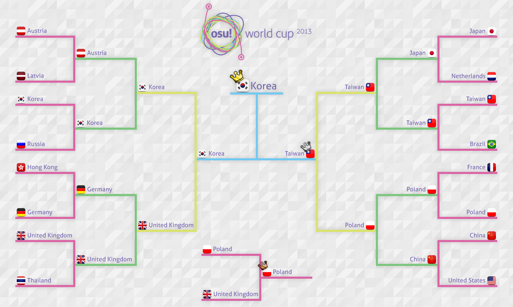

osu! World Cup 2013
======================

La ***osu! World Cup 2013*** (ou **OWC 2013**, littéralement « coupe du monde de osu! ») était la quatrième édition d'une compétition internationale annuelle où les meilleurs joueurs de osu! du monde entier s'affrontent en équipe pour remporter la victoire et représenter leur pays.
Cette compétition est terminée et a abouti au podium suivant :

| Placing                                                    | Country                                         |
|------------------------------------------------------------|-------------------------------------------------|
|    |  **Corée du Sud** |
|  |  **Taïwan**       |
|  |  **Pologne**      |

Calendrier
------------

| Event                    | Timestamp                        |
|--------------------------|----------------------------------|
| Inscription des équipes  | 15 au 28 octobre 2013            |
| Constitution des groupes | 31 octobre 2013 à 16 h 00 UTC+0  |
| Poules                   | 8 au 10 novembre 2013            |
| Huitièmes de finale      | 16 et 17 novembre 2013           |
| Quarts de finale         | 23 et 24 novembre 2013           |
| Demi-finales             | 30 novembre et 1er décembre 2013 |
| Finale et petite finale  | 7 et 8 décembre 2013             |

Lots attribués
----------------

Pour chaque participant :

| Placing                                                    | Prize(s)                                                                                                                                                                  |
|------------------------------------------------------------|---------------------------------------------------------------------------------------------------------------------------------------------------------------------------|
|    | Statut de supporter pendant 6 mois + un badge sur le profil + un trophée physique à l'effigie de l'OWC + une tablette graphique [osu!tablet](//osu.ppy.sh/forum/t/169139) |
|  | Statut de supporter pendant 3 mois                                                                                                                                        |
|  | Statut de supporter pendant 1 mois                                                                                                                                        |

Organisateurs
--------------

| Job                       | Person(s)                                                                                                                                                                                                                                                                                                                                                                                                                                                              |
|---------------------------|------------------------------------------------------------------------------------------------------------------------------------------------------------------------------------------------------------------------------------------------------------------------------------------------------------------------------------------------------------------------------------------------------------------------------------------------------------------------|
| Direction                 |  [Loctav](//osu.ppy.sh/u/71366),  [p3n](//osu.ppy.sh/u/123703),  [dkun](//osu.ppy.sh/u/154400)                                                                                                                                                                                                                                                                               |
| Arbitrage                 | Liste des arbitres disponible [à cette adresse](//osu.ppy.sh/g/26)                                                                                                                                                                                                                                                                                                                                                                                                     |
| Sélection des beatmaps    |  [Darksonic](//osu.ppy.sh/u/570042),  [Wishy](//osu.ppy.sh/u/495477),  [Chewin](//osu.ppy.sh/u/617323)                                                                                                                                                                                                                                                                       |
| Retransmission des matchs |  [peppy](//osu.ppy.sh/u/2),  [Zallius](//osu.ppy.sh/u/55),  [Nyquill](//osu.ppy.sh/u/682935),  [Makar](//osu.ppy.sh/u/686389)                                                                                                                                                                                                                  |
| Commentaires              |  [Mr Color](//osu.ppy.sh/u/116078),  [Agnes](//osu.ppy.sh/u/136982),  [ztrot](//osu.ppy.sh/u/6347),  [kriers](//osu.ppy.sh/u/333241),  [MillhioreF](//osu.ppy.sh/u/941094),  [LaVolpe024](//osu.ppy.sh/u/597796),  [deadbeat](//osu.ppy.sh/u/128370) |
| Statistiques              |  [Marcin](//osu.ppy.sh/u/722665)                                                                                                                                                                                                                                                                                                                                                                                                         |

Retransmission des matchs
--------------------------

La plupart des matchs ont été diffusés et sont disponibles pour une lecture différée sur Twitch [à cette adresse](//www.twitch.tv/osulive/profile/pastBroadcasts).

Équipes
-------------

Les capitaines sont représentés en gras.

### Top-seeded

| Country                                      | Members                                                                                                                                                                                                                                                                                                                                         |
|----------------------------------------------|-------------------------------------------------------------------------------------------------------------------------------------------------------------------------------------------------------------------------------------------------------------------------------------------------------------------------------------------------|
|  China         | **[Furudo\_Erika](http://osu.ppy.sh/u/169878)**, [wobeinimacao](http://osu.ppy.sh/u/350723), [N a n o](http://osu.ppy.sh/u/694114), [5231\_Kinoko](http://osu.ppy.sh/u/181057), [GGBY](http://osu.ppy.sh/u/629717), [Dsan](http://osu.ppy.sh/u/1266166), [InabaTewi](http://osu.ppy.sh/u/1078004), [GunS\_N\_Rose](http://osu.ppy.sh/u/1349849) |
|  Germany       | **[ShadowSoul](http://osu.ppy.sh/u/494970)**, [CookEasy](http://osu.ppy.sh/u/453226), [Michi](http://osu.ppy.sh/u/932342), [Dustice](http://osu.ppy.sh/u/754565), [BDDav](http://osu.ppy.sh/u/1164526), [cptnXn](http://osu.ppy.sh/u/495272), [Imamoto](http://osu.ppy.sh/u/1201224), [dukambe](http://osu.ppy.sh/u/880002)                     |
|  Japan         | **[Karuta](http://osu.ppy.sh/u/360552)**, [rrtyui](http://osu.ppy.sh/u/352328), [Potofu](http://osu.ppy.sh/u/657404), [serea](http://osu.ppy.sh/u/371961), [mugio3](http://osu.ppy.sh/u/491522), [Homura-](http://osu.ppy.sh/u/482120), [Gokuri](http://osu.ppy.sh/u/343865), [doctorindark](http://osu.ppy.sh/u/609227)                        |
|  Korea         | **[Dungeon](http://osu.ppy.sh/u/461720)**, [K i R i K a R u](http://osu.ppy.sh/u/139670), [dragonhuman](http://osu.ppy.sh/u/713266), [ffury](http://osu.ppy.sh/u/2056071), [CheEZ](http://osu.ppy.sh/u/272117), [- Hakurei Reimu-](http://osu.ppy.sh/u/948713), [Tengu](http://osu.ppy.sh/u/380836), [Shizuru-](http://osu.ppy.sh/u/1341421)    |
|  Poland        | **fartownik**, Niko, WubWoofWolf, AmaiHachimitsu, rEdo, worst fl player, Piotrekol, Beniek                                                                                                                                                                                                                                                      |
|  Taiwan        | **Uan**, Rucker, SnowWhite, Small K, I will be back, Yuyuko sama, dabanlong, onlyforyou                                                                                                                                                                                                                                                         |
|  Thailand      | **NonxE**, Frostmourne, 0OoMickeyoO0, Popo[Mikoto], Cint, Neolution                                                                                                                                                                                                                                                                             |
|  United States | **Kaoru**, Floks, Kyou-kun, Thatgooey, pielak213, Silynn, pooptartsonas, SapphireGhost                                                                                                                                                                                                                                                          |

### High-seeded

| Country                                           | Members                                                                                                                                                                                                                                                                                                                     |
|---------------------------------------------------|-----------------------------------------------------------------------------------------------------------------------------------------------------------------------------------------------------------------------------------------------------------------------------------------------------------------------------|
|  Argentina          | **[Metro](http://osu.ppy.sh/u/306737)**, [Glazbom](http://osu.ppy.sh/u/608277), [Salvage](http://osu.ppy.sh/u/242119), [Hernan](http://osu.ppy.sh/u/516680), [Fabi](http://osu.ppy.sh/u/173114), [druidxd](http://osu.ppy.sh/u/841441), [CBA-ES-CAB](http://osu.ppy.sh/u/1875237), [Mikumiku97](http://osu.ppy.sh/u/503749) |
|  Brazil             | **fabriciorby**, Blue Dragon, shoTt, nouk, Ghost Princess, powerstream89, AdRon Zh3Ro, antsu                                                                                                                                                                                                                                |
|  Hong Kong          | **SilviZ**, Akiko-, HineX, K47, Fir3k0, galen1922, Yakumo Yukarin, auweichun                                                                                                                                                                                                                                                |
|  Latvia             | **LoGo**, nomen, Forseen, Vmx, Suika Ibuki, NewNyuu, nek2high, PyramidX                                                                                                                                                                                                                                                     |
|  Norway             | **kriers**, KinomiCandy, Sniff, -GN, CXu, ivaz, 31415926535897, Amedis                                                                                                                                                                                                                                                      |
|  Russian Federation | **cr1m**, Kert, talala, Dremor, homu-homu-tan, Maemi, TheSpaceMan, JuZu                                                                                                                                                                                                                                                     |
|  Sweden             | **Xytox**, Shimox, Gnuu, Mayis, Slizzer, Blandar, Shilkey, Gyuunyu                                                                                                                                                                                                                                                          |
|  United Kingdom     | **jesus1412**, Doomsday, iLikeMudkipz, R a h a r u, Starry-, Charleyzard, Navi, Bubby963                                                                                                                                                                                                                                    |

### Low-seeded

| Country                                    | Members                                                                                |
|--------------------------------------------|----------------------------------------------------------------------------------------|
|  Australia   | **JappyBabes**, kamiyo-sama, flow, TimmyTimTims, Lach, Bauxe, Melt3dCheeze, smoogipooo |
|  Austria     | **Omgforz**, WhitePhoenixLP, M3tr01d, Alumetorz, Jin\_Back7, SunBurn                   |
|  Canada      | **Azer**, FunOrange, Hoozimajiget, Erotik, Mariya, mochi, Layne, Kairi                 |
|  Finland     | **Soarezi**, Subbie, Souko, ethox, Juzaa, fabbbyyy v2                                  |
|  France      | **-Kamui-**, Worne, NerO, Kynan, Timal75, Musty, The\_badin, My Not                    |
|  Indonesia   | **Avner**, Gatyaa420, C00LZ, [T]rickster, WVS, Hakeru, Method, Frizz                   |
|  Italy       | **Leader**, Jordan, Nemis, Andrea, Puncia, xiAmME, My Accuracy Sucks, Pagno            |
|  Netherlands | **happy30**, Yoeri, BiG\_ChilD, Kris, Synchrostar, R3laX3R, Kyshiro, Jackylam5         |

### Unseeded

| Country                                    | Members                                                                                |
|--------------------------------------------|----------------------------------------------------------------------------------------|
|  Belgium     | **DrakRainbow**, GoldenWolf, Sakisan, larshmellow, Friendzone King, KinkehW, Mithrane  |
|  Bulgaria    | **Scrublord**, Defacer, b1o, -Arthus-, Supbads, Angeloid\_Alpha, Hardatyou             |
|  Chile       | **Innocent** Steps, Neab, coflA, Cristian, BoopMos, Mesita, SwENeMbO, Revengexsoyah    |
|  Estonia     | **Noriko**, Manzz, Yumz, Kafaru, YellowManul, MaDBoY94, ShinseinaTenshi                |
|  New Zealand | **deadbeat**, buny, Kiiwa, TCN, B O X, Xiipher, shortpotato                            |
|  Philippines | **Pizzicato**, katayoki, Jann, dayun10, Mira-san, \[Accelerator\], MioMilo, -Gio       |
|  Singapore   | **Bardiche\_Z**, Alacartx, phox, Wishxrai, Theseanbei, deokoking, CloudNep, SenaAiriii |
|  Venezuela   | **MeowinTurtle**, S4suk3, CrymynaL, Baozis, Livean, Roli                               |

Résultats
---------

Consultez le [tableau des résultats et des statistiques](//docs.google.com/spreadsheet/ccc?key=0AsjrK0nkPsOfdGZmZ2VKZ05KV1pjdUE5VlpHYVlwZWc&usp=drive_web) pour tous les détails.
Le graphique suivant montre les équipes qui se sont qualifiées pour les huitièmes de finale :

### Poules

**Vendredi 8 novembre 2013**

| Équipe A                                          | Score          | Équipe B                                          | History                             |
|:--------------------------------------------------|:---------------|:-------------------------------------------------:|-------------------------------------|
|  **Taiwan**         | **4**  - 0     | Indonesia           | [#1](https://osu.ppy.sh/mp/2581408) |
|  **Poland**         | **4**  - 0     | Russian Federation  | [#1](https://osu.ppy.sh/mp/2587307) |
|  **Finland**        | **4**  - 0     | Estonia             | [#1](https://osu.ppy.sh/mp/2588205) |
|  **Germany**        | **4**  - 1     | Brazil              | [#1](https://osu.ppy.sh/mp/2589515) |
|  **United Kingdom** | **4**  - 1     | Belgium             | [#1](https://osu.ppy.sh/mp/2590563) |
|  Argentina          | 2      - **4** | **Netherlands**     | [#1](https://osu.ppy.sh/mp/2592453) |

**Samedi 9 novembre 2013**

| Équipe A                                              | Score          | Équipe B                                      | History                                                                      |
|:------------------------------------------------------|:---------------|:---------------------------------------------:|------------------------------------------------------------------------------|
|  **Indonesia**          | **4**  - 0     | Venezuela       | [#1](https://osu.ppy.sh/mp/2597698)                                          |
|  **Japan**              | **4**  - 1     | Canada          | [#1](https://osu.ppy.sh/mp/2598602)                                          |
|  **Korea**              | **4**  - 0     | Norway          | [#1](https://osu.ppy.sh/mp/2605519)                                          |
|  **Latvia**             | **4**  - 0     | New Zealand     | [#1](https://osu.ppy.sh/mp/2606800)                                          |
|  **Sweden**             | **4**  - 3     | Philippines     | [#1](https://osu.ppy.sh/mp/2606823)                                          |
|  **Germany**            | **4**  - 0     | Australia       | [#1](https://osu.ppy.sh/mp/2608440) [#2](https://osu.ppy.sh/mp/2607511)      |
|  China                  | 3      - **4** | **Austria**     | [#1](https://osu.ppy.sh/mp/2607534) [#2](https://osu.ppy.sh/mp/2608373)      |
|  **Taiwan**             | **4**  - 0     | Hong Kong       | [#1](https://osu.ppy.sh/mp/2609074)                                          |
|  **Japan**              | **4**  - 0     | United Kingdom  | [#1](https://osu.ppy.sh/mp/2609048)                                          |
|  **Korea**              | **4**  - 1     | France          | [#1](https://osu.ppy.sh/mp/2610159) [#2](https://osu.ppy.sh/mp/2612373)      |
|  **Norway**             | **4**  - 1     | Chile           | [#1](https://osu.ppy.sh/mp/2612443)                                          |
|  **Argentina**          | **4**  - 0     | Singapore       | [#1](https://osu.ppy.sh/mp/2614072)                                          |
|  **Austria**            | **4**  - 0     | Philippines     | [#1](https://osu.ppy.sh/mp/2614095)                                          |
|  **Thailand**           | **4**  - 1     | Netherlands     | [#1](https://osu.ppy.sh/mp/2618739) [#A](http://puu.sh/5dh2n/b90be32a79.jpg) |
|  **Hong Kong**          | **4**  - 0     | Venezuela       | _Win by default_                                                             |
|  **Russian Federation** | **4**  - 0     | Estonia         | [#1](https://osu.ppy.sh/mp/2617238)                                          |
|  **United States**      | **4**  - 1     | Latvia          | [#1](https://osu.ppy.sh/mp/2621519)                                          |
|  **Brazil**             | **4**  - 0     | Bulgaria        | [#1](https://osu.ppy.sh/mp/2622522)                                          |
|  **Poland**             | **4**  - 0     | Finland         | [#1](https://osu.ppy.sh/mp/2624015)                                          |

**Dimanche 10 novembre 2013**

| Équipe A                                              | Score          | Équipe B                                   | History                                                                                                     |
|:------------------------------------------------------|:---------------|:------------------------------------------:|-------------------------------------------------------------------------------------------------------------|
|  **Thailand**           | **4**  - 0     | Singapore    | [#1](https://osu.ppy.sh/mp/2644383)                                                                         |
|  **China**              | **4**  - 1     | Philippines  | [#1](https://osu.ppy.sh/mp/2642702) [#2](https://osu.ppy.sh/mp/2644022) [#3](https://osu.ppy.sh/mp/2644544) |
|  **Australia**          | **4**  - 0     | Bulgaria     | [#1](https://osu.ppy.sh/mp/2645416)                                                                         |
|  **Italy**              | **4**  - 0     | New Zealand  | [#1](https://osu.ppy.sh/mp/2645639)                                                                         |
|  **Hong Kong**          | **4**  - 1     | Indonesia    | [#1](https://osu.ppy.sh/mp/2646208)                                                                         |
|  **Japan**              | **4**  - 0     | Belgium      | [#1](https://osu.ppy.sh/mp/2647505)                                                                         |
|  **China**              | **4**  - 1     | Sweden       | [#1](https://osu.ppy.sh/mp/2648351)                                                                         |
|  **Latvia**             | **4**  - 3     | Italy        | [#1](https://osu.ppy.sh/mp/2648523)                                                                         |
|  **Taiwan**             | **4**  - 0     | Venezuela    | _Win by default_                                                                                            |
|  Norway                 | 0      - **4** | **France**   | [#1](https://osu.ppy.sh/mp/2651081)                                                                         |
|  **Netherlands**        | **4**  - 0     | Singapore    | [#1](https://osu.ppy.sh/mp/2649765)                                                                         |
|  **Thailand**           | **4**  - 0     | Argentina    | [#1](https://osu.ppy.sh/mp/2652001)                                                                         |
|  **Russian Federation** | **4**  - 0     | Finland      | [#1](https://osu.ppy.sh/mp/2653645)                                                                         |
|  **Germany**            | **4**  - 0     | Bulgaria     | [#1](https://osu.ppy.sh/mp/2655599)                                                                         |
|  **Poland**             | **4**  - 0     | Estonia      | [#1](https://osu.ppy.sh/mp/2656900)                                                                         |
|  **France**             | **4**  - 1     | Chile        | [#1](https://osu.ppy.sh/mp/2660496)                                                                         |
|  **United Kingdom**     | **4**  - 2     | Canada       | [#1](https://osu.ppy.sh/mp/2660446)                                                                         |
|  Sweden                 | 2      - **4** | **Austria**  | [#1](https://osu.ppy.sh/mp/2661584)                                                                         |
|  **Korea**              | **4**  - 2     | Chile        | [#1](https://osu.ppy.sh/mp/2662493)                                                                         |
|  Australia              | 1      - **4** | **Brazil**   | [#1](https://osu.ppy.sh/mp/2767400)                                                                         |

### Huitièmes de finale

**Samedi 16 novembre 2013**

| Équipe A                                          | Score          | Équipe B                                          | History                            |
|:--------------------------------------------------|:---------------|:-------------------------------------------------:|------------------------------------|
|  **Korea**          | **5**  - 0     | Russian Federation  | [#1](http://osu.ppy.sh/mp/2778204) |
|  Hong Kong          | 3      - **5** | **Germany**         | [#1](http://osu.ppy.sh/mp/2780657) |
|  **United Kingdom** | **5**  - 1     | Thailand            | [#1](http://osu.ppy.sh/mp/2783657) |

**Dimanche 17 novembre 2013**

| Équipe A                                   | Score          | Équipe B                                     | History                                                                                                  |
|:-------------------------------------------|:---------------|:--------------------------------------------:|----------------------------------------------------------------------------------------------------------|
|  **China**   | **5**  - 2     | United States  | [#1](http://osu.ppy.sh/mp/2805329) [#A](http://osu.ppy.sh/ss/1107405) [#B](http://osu.ppy.sh/ss/1107418) |
|  **Japan**   | **5**  - 1     | Netherlands    | [#1](http://osu.ppy.sh/mp/2811659)                                                                       |
|  **Taiwan**  | **5**  - 0     | Brazil         | [#1](http://osu.ppy.sh/mp/2814063)                                                                       |
|  France      | 4      - **5** | **Poland**     | [#1](http://osu.ppy.sh/mp/2817324)                                                                       |
|  **Austria** | **5**  - 0     | Latvia         | [#1](https://osu.ppy.sh/mp/2820030)                                                                      |

### Quarts de finale

**Dimanche 24 novembre 2013**

| Équipe A                                          | Score     | Équipe B                                  | History                                                                     |
|:--------------------------------------------------|:----------|:-----------------------------------------:|-----------------------------------------------------------------------------|
|  Japan              | 2 - **5** | **Taiwan**  | [#1](http://osu.ppy.sh/mp/2962477)                                          |
|  **Korea**          | **5** - 2 | Austria     | [#1](http://osu.ppy.sh/mp/2964278)                                          |
|  China              | 4 - **5** | **Poland**  | [#1](http://osu.ppy.sh/mp/2966197)                                          |
|  **United Kingdom** | **5** - 3 | Germany     | [#1](http://osu.ppy.sh/mp/2969031) [#A](http://puu.sh/5rT5F/9b2a7bfa74.jpg) |

### Demi-finales

**Dimanche 30 novembre 2013**

| Équipe A                                  | Score      | Équipe B                                      | History                            |
|:------------------------------------------|:-----------|:---------------------------------------------:|------------------------------------|
|  **Korea**  | **6**  - 1 | United Kingdom  | [#1](http://osu.ppy.sh/mp/3088440) |
|  **Taiwan** | **6**  - 0 | Poland          | [#1](http://osu.ppy.sh/mp/3091169) |

### Finales

**Samedi 7 décembre 2013 (finale)**

| Équipe A                                 | Score      | Équipe B                              | History                             |
|:-----------------------------------------|:-----------|:-------------------------------------:|-------------------------------------|
|  **Korea** | **6**  - 5 | Taiwan  | [#1](https://osu.ppy.sh/mp/3233030) |

**Dimanche 8 décembre 2013 (petite finale)**

| Équipe A                                      | Score       | Équipe B                                  | History                             |
|:----------------------------------------------|:------------|:-----------------------------------------:|-------------------------------------|
|  United Kingdom | 1   - **6** | **Poland**  | [#1](https://osu.ppy.sh/mp/3272199) |

Beatmaps à disposition
-----------------------------

### Poules

**[Cliquez ici pour télécharger l'intégralité des beatmaps de cette phase](//www.mediafire.com/?jn0c8p6wqfrtfhb)**

| NoMod                                                                                                       |
|-------------------------------------------------------------------------------------------------------------|
| [Mikami Shiori & Ookubo Rumi - Onna to Onna no Yuri-Game (eg91022a71w) \[YuruYuri\]](//osu.ppy.sh/b/153418) |
| [TOTAL OBJECTION - Higurashi Moratorium (NatsumeRin) \[Rin\]](//osu.ppy.sh/b/230127)                        |
| [mafumafu - Yuugure Semi Nikki (L\_P) \[Yuugure\]](//osu.ppy.sh/b/180681)                                   |
| [Fear, and Loathing in Las Vegas - Jump Around (iyasine) \[Insane\]](//osu.ppy.sh/b/237576)                 |
| [MiddleIsland - Roze (Lan wings) \[Lan\]](//osu.ppy.sh/b/203906)                                            |
| [DJ YOSHITAKA feat. Hoshino Kanako - MAX LOVE (StarTrick) \[Another\]](//osu.ppy.sh/b/281993)               |
| [Sound Horizon - Raijin no Migiude (\_Kiva) \[Insane\]](//osu.ppy.sh/b/92426)                               |
| [Tatsh - HEAVENLY MOON (Gabi) \[Extreme\]](//osu.ppy.sh/b/132043)                                           |
| [Blackhole - Lagomorphic (happy623) \[Lagomorph\]](//osu.ppy.sh/s/74664)                                    |
| [yuikonnu - Otsukimi Recital (Mythol) \[Collab\]](//osu.ppy.sh/b/282251)                                    |

| Hidden                                                                                                      |
|-------------------------------------------------------------------------------------------------------------|
| [An - artcore JINJA (Flower) \[Lunatic\]](//osu.ppy.sh/b/297411)                                            |
| [paraoka - Manima ni (Short Ver.) (Mixagji) \[0108\]](//osu.ppy.sh/b/131362)                                |
| [syatten remixed celas - Bird Sprite -Awakening of Light- (DaxMasterix) \[Another\]](//osu.ppy.sh/b/135177) |

| HardRock                                                                      |
|-------------------------------------------------------------------------------|
| [momori - Togameru Kage (cRyo\[iceeicee\]) \[Insane\]](//osu.ppy.sh/b/231988) |
| [Otokaze - Karen (Short Ver.) (spboxer3) \[Hanabi\]](//osu.ppy.sh/b/154357)   |
| [Hanatan - Kotoba Tsunagi (terametis) \[Insane\]](//osu.ppy.sh/b/157735)      |

| DoubleTime                                                                                             |
|--------------------------------------------------------------------------------------------------------|
| [SYNC.ART'S feat. Sakaue Nachi - Taketori Hishou (S i R i R u) \[Lunatic\]](//osu.ppy.sh/b/73384)      |
| [Sasaki Sayaka - Zzz (Sumisola) \[Insane\]](//osu.ppy.sh/b/105950)                                     |
| [Golden City Factory - Twilight Chronicle ~ I am Sister (Patchouli) \[Lunatic\]](//osu.ppy.sh/b/86142) |

| FreeMod                                                                                        |
|------------------------------------------------------------------------------------------------|
| [Blue Stahli - Shotgun Senorita (Zardonic Remix) (Aleks719) \[Insane\]](//osu.ppy.sh/b/192508) |
| [Hatsune Miku - Marionette no Kairaku (rui) \[Uncontrollable\]](//osu.ppy.sh/b/139652)         |
| [Beridzebeth - Seijin no Tou (Strawberry) \[Another\]](//osu.ppy.sh/b/194953)                  |

| Tiebreaker                                                                       |
|----------------------------------------------------------------------------------|
| **[DJ Okawari - Luv Letter (nold\_1702) \[Posthumous\]](//osu.ppy.sh/b/127363)** |

### Huitièmes de finale

**[Cliquez ici pour télécharger l'intégralité des beatmaps de cette phase](//www.mediafire.com/download/e62iav4kb90981b/Round_of_16_Pack.rar)** (attention : ce pack ne reflète pas les derniers changements dans le choix des beatmaps ; en l'occurrence, *Justice Breaker* et *Saigetsu* n'y sont pas présents)

| NoMod                                                                                      |
|--------------------------------------------------------------------------------------------|
| [DECO\*27 feat. marina - Aimai Elegy (val0108) \[0108\]](//osu.ppy.sh/b/135804)            |
| [DJ YOSHITAKA - VALLIS-NERIA (Sagisawa-Yukari) \[Flower’s Another\]](//osu.ppy.sh/s/62800) |
| [Ryu\* Vs. L.E.D.-G Vs. ZUN - PARADISE GHOST (Pokie) \[Extra\]](//osu.ppy.sh/b/195305)     |
| [Cres - End Time (Maddy) \[Extra\]](//osu.ppy.sh/b/209276)                                 |
| [M2U - Gypsy Tronic (LKs) \[Insane\]](//osu.ppy.sh/s/61590)                                |
| [Rohi - Kodoku Egoism (NatsumeRin) \[Rin\]](//osu.ppy.sh/b/196673)                         |

| Hidden                                                                                |
|---------------------------------------------------------------------------------------|
| [Megpoid GUMI - Justice Breaker (NatsumeRin) \[NTR\]](//osu.ppy.sh/b/177183)          |
| [Takanashi Yasuharu - Doku Ryuu no Kobura (\_Kiva) \[Insane\]](//osu.ppy.sh/b/128872) |
| [Xelia - Illumiscape (Kanna) \[Another\]](//osu.ppy.sh/s/43960)                       |
| [Hatsune Miku - Kagerou Days (m i z u k i) \[mizuki\]](//osu.ppy.sh/s/37638)          |

| HardRock                                                                                        |
|-------------------------------------------------------------------------------------------------|
| [bibuko - Reizouko Mitara Pudding ga Nai (val0108) \[Mythol’s Pudding\]](//osu.ppy.sh/b/256839) |
| [Memme - BSPower Explosion (AngelHoney) \[Another\]](//osu.ppy.sh/b/140821)                     |
| [Yousei Teikoku - Mischievous of Alice (Furawa) \[Alice\]](//osu.ppy.sh/b/142356)               |
| [Zeami - Music Revolver (KanaRin) \[Kana\]](//osu.ppy.sh/b/162363)                              |

| DoubleTime                                                                                        |
|---------------------------------------------------------------------------------------------------|
| [FELT - Prayer Blue (Frostmourne) \[Lunatic\]](//osu.ppy.sh/b/156927)                             |
| [Infected Mushroom - Pink Nightmares (RLC) \[Insane\]](//osu.ppy.sh/s/107639)                     |
| [Hatsune Miku - Sayonara Goodbye (banvi) \[Extreme\]](//osu.ppy.sh/b/98615)                       |
| [Sakaue Nachi - Light travel distance RAYTO MIX (Frostmourne) \[Lunatic\]](//osu.ppy.sh/b/133852) |

| FreeMod                                                                                         |
|-------------------------------------------------------------------------------------------------|
| [Tama - Saigetsu (Midnight Moon Walker Remix) (AmamiyaYuko) \[Lunatic\]](//osu.ppy.sh/b/172360) |
| [REDALiCE Feat. Ayumi Nomiya - Little Star (LKs) \[Extra\]](//osu.ppy.sh/b/247241)              |
| [Saiya - Remote Control (Garven) \[Insane\]](//osu.ppy.sh/b/164020)                             |
| [KOTOKO - Oboetete Ii yo (cRyo\[iceeicee\]) \[Insane\]](//osu.ppy.sh/b/163836)                  |

| Tiebreaker                                                                         |
|------------------------------------------------------------------------------------|
| **[Infected Mushroom - The Pretender (RLC) \[Pretender\]](//osu.ppy.sh/b/221777)** |

### Quarts de finale

**[Cliquez ici pour télécharger l'intégralité des beatmaps de cette phase](//www.mediafire.com/download/i2umf8lrethjzoj/Quarter-finals.rar)**

| NoMod                                                                        |
|------------------------------------------------------------------------------|
| [xi - Time files (gowww) \[Another\]](//osu.ppy.sh/b/153484)                 |
| [LeaF - Calamity Fortune (Flower) \[Extra\]](//osu.ppy.sh/b/257793)          |
| [Hanatan - Hyakunen Yakou (eveless) \[Insane\]](//osu.ppy.sh/b/220908)       |
| [Neru - Idola no Circus (Amamiya Yuko) \[Skystar\]](//osu.ppy.sh/b/251096)   |
| [Wotamin - Gigantic O.T.N (Star Stream) \[S.S\]](//osu.ppy.sh/b/223397)      |
| [capitaro - Yoiduki Maiuta (Amamiya Yuko) \[Insane\]](//osu.ppy.sh/b/201601) |

| Hidden                                                                               |
|--------------------------------------------------------------------------------------|
| [bj.HaLo - Ende (galvenize) \[Another\]](//osu.ppy.sh/b/148716)                      |
| [Caravan Palace - Dragons (Charles445) \[Insane\]](//osu.ppy.sh/b/145361)            |
| [Hatsune Miku - Senkouhanabi Aika (val0108) \[0108 Aika\]](//osu.ppy.sh/b/121767)    |
| [Marguerite du Pre - Marie Antoinette (GladiOol) \[Another\]](//osu.ppy.sh/b/136640) |

| HardRock                                                                                                        |
|-----------------------------------------------------------------------------------------------------------------|
| [Nanamori-chu \* Goraku-bu - My Pace de Ikimashou (bakabaka) \[Yuri\]](//osu.ppy.sh/b/118226)                   |
| [Natsuiro Bikini no Prim - Nagisa no Koakuma Lovely~Radio (CSY the corrupt) \[Extreme\]](//osu.ppy.sh/b/215888) |
| [L.E.D. - THE LAST STRIKER (Nakagawa-Kanon) \[Another\]](//osu.ppy.sh/b/124264)                                 |
| [Megpoid GUMI - Shinkaron -code:variant- (NatsumeRin) \[Rin\]](//osu.ppy.sh/b/99465)                            |

| DoubleTime                                                                                      |
|-------------------------------------------------------------------------------------------------|
| [SYNC.ART'S - Kaze no Touei (Licnent) \[Licnect x yongtw123\]](//osu.ppy.sh/b/90656)            |
| [fripSide - Assemble\*LOVEsemble (Natteke) \[Natteke\]](//osu.ppy.sh/b/95653)                   |
| [Girls Dead Monster - Shine Days (Full ver) (Clare) \[Clare's Sunshine\]](//osu.ppy.sh/b/61183) |
| [Chata - Harukaze Dance (Laurier) \[Insane\]](//osu.ppy.sh/b/256580)                            |

| FreeMod                                                                              |
|--------------------------------------------------------------------------------------|
| [wa. vs ETIA. - Akasagarbha (DaxMasterix) \[Shiirn's Extra\]](//osu.ppy.sh/b/129961) |
| [Mind Vortex - Arc (Natteke) \[Nsane\]](//osu.ppy.sh/b/239037)                       |
| [Cuvelia - Tenkuu no Yoake (AngelHoney) \[Another\]](//osu.ppy.sh/b/148009)          |
| [TeamGrimoire+Amaneko - croiX (HelloSCV) \[EXHAUST\]](//osu.ppy.sh/b/241578)         |

| Tiebreaker                                                                               |
|------------------------------------------------------------------------------------------|
| **[HujuniseikouyuuP - Talent Shredder (val0108) \[0108 style\]](//osu.ppy.sh/b/178966)** |

### Demi-finales

**[Cliquez ici pour télécharger l'intégralité des beatmaps de cette phase](//www.mediafire.com/?pn3yxce7m6v4j13)**

| NoMod                                                                                                    |
|----------------------------------------------------------------------------------------------------------|
| [CON - Cruel Clocks (Amamiya Yuko) \[Skystar\]](//osu.ppy.sh/b/216272)                                   |
| [Igorrr - Unpleasant Sonata (Sieg) \[Pagli's Sonata\]](//osu.ppy.sh/b/262302)                            |
| [jippusu - Mushikui Saikede Rhythm (Amamiya Yuko) \[RLC\]](//osu.ppy.sh/s/87547)                         |
| [Hatsune Miku - Ohigan FuzzyClap (val0108) \[Prankster0108\]](//osu.ppy.sh/b/119021)                     |
| [Kola Kid - can't hide your love (Kert) \[Can't\]](//osu.ppy.sh/b/126446)                                |
| [Inspector K - Disconnected Hardkore (CanBlaster Remix) (Shiirn) \[Reconnected\]](//osu.ppy.sh/b/123708) |

| Hidden                                                                                      |
|---------------------------------------------------------------------------------------------|
| [Silent Spica - Anhedonia (Muya) \[Another\]](//osu.ppy.sh/b/181843)                        |
| [Jin - Children Record (tutuhaha) \[Record\]](//osu.ppy.sh/b/169004)                        |
| [Hatsune Miku - Tenshinranman High Collar Hime (NatsumeRin) \[Rin\]](//osu.ppy.sh/b/167718) |
| [Yousei Teikoku - Hades: The Rise (lolcubes) \[Insane\]](//osu.ppy.sh/b/110347)             |

| HardRock                                                                                   |
|--------------------------------------------------------------------------------------------|
| [nano - Nevereverland (Nyquill) \[Insane\]](//osu.ppy.sh/b/256499)                         |
| [Fear, and Loathing in Las Vegas - Just Awake (gowww) \[Insane\]](//osu.ppy.sh/b/139446)   |
| [NegaRen - Stark Raving Mad (vipto) \[Raving Mad\]](//osu.ppy.sh/b/166350)                 |
| [MuryokuP - Sweet Sweet Cendrillon Drug (Smoothie) \[Cendrillion\]](//osu.ppy.sh/b/207846) |

| DoubleTime                                                                         |
|------------------------------------------------------------------------------------|
| [07th Expansion - miragecoordinator (La Cataline) \[Hard\]](//osu.ppy.sh/b/102426) |
| [fripSide - HAPPY Generation (Thite) \[Insane\]](//osu.ppy.sh/b/100526)            |
| [Shihori - Bamboo Dance (Frostmourne) \[Lunatic\]](//osu.ppy.sh/b/124771)          |
| [SuganoMusic - Imademo... (S i R i R u) \[Lunatic\]](//osu.ppy.sh/b/75930)         |

| FreeMod                                                                 |
|-------------------------------------------------------------------------|
| [Meiko Nakamura - Dispel (terametis) \[Insane\]](//osu.ppy.sh/b/126229) |
| [Igorrr - Pavor Nocturnus (grumd) \[Insane\]](//osu.ppy.sh/b/249743)    |
| [DJ Sharpnel - IVALTEK (happy30) \[HappyMiX\]](//osu.ppy.sh/b/154988)   |
| [incinerate - Purgatorium (RikiH\_) \[Heaven\]](//osu.ppy.sh/b/166316)  |

| Tiebreaker                                                                            |
|---------------------------------------------------------------------------------------|
| **[Hatsune Miku - Mythologia's End (val0108) \[Myth0108ia\]](//osu.ppy.sh/b/151229)** |

### Finales

**[Cliquez ici pour télécharger l'intégralité des beatmaps de cette phase](//www.mediafire.com/download/igx08rvp8g5502v/Final%20Map%20Pool.rar)**

| NoMod                                                                                       |
|---------------------------------------------------------------------------------------------|
| [Ryu\* vs. kors k - Force of Wind (Jenny) \[Extra\]](//osu.ppy.sh/b/142239)                 |
| [O-Life Japan - Yakujinsama no Couple Dance (AngelHoney) \[Lunatic\]](//osu.ppy.sh/b/95954) |
| [RYO - Shuffle Heaven (Nemis) \[eXtra\]](//osu.ppy.sh/b/235470)                             |
| [AU - Infinite of Nuclear Fusion (OnosakiHito) \[Regou's Extra\]](//osu.ppy.sh/b/291285)    |
| [Neru - Ningen Shikkaku (nold\_1702) \[Posthumous\]](//osu.ppy.sh/b/237848)                 |
| [TJ.Hangneil - Kamui (7odoa) \[SHD\]](//osu.ppy.sh/b/124664)                                |

| Hidden                                                                                   |
|------------------------------------------------------------------------------------------|
| [Tsukasa - Heaven's Race Guitar Style (La Cataline) \[Collab\]](//osu.ppy.sh/s/41974)    |
| [Zektbach - meme (AngelHoney) \[ExtrA\]](//osu.ppy.sh/b/198428)                          |
| [Nekomata Master - Smile of Split (Charles445) \[Insane\]](//osu.ppy.sh/s/56847)         |
| [YAMAGEN'S DEVILELIET - EYES OF DEVILELIET (Kite) \[PERNICIOUS\]](//osu.ppy.sh/b/119238) |

| HardRock                                                                                           |
|----------------------------------------------------------------------------------------------------|
| [nano.RIPE - Real World (bakabaka) \[Insane\]](//osu.ppy.sh/b/177735)                              |
| [Tatsh - reunion (ouranhshc) \[Insane\]](//osu.ppy.sh/b/83338)                                     |
| [Suzaku - Anisakis -somatic mutation type "Forza"- (tsukamaete) \[Another\]](//osu.ppy.sh/b/56347) |
| [Lapfox Trax feat. guilhox - Lapfoxed Forever (Blue Dragon) \[Nogard\]](//osu.ppy.sh/b/178353)     |

| DoubleTime                                                                                                  |
|-------------------------------------------------------------------------------------------------------------|
| [SYNC.ART'S - Splendid Encount -one more encore- (KanaRin) \[S i R i R u's Lunatic\]](//osu.ppy.sh/b/94640) |
| [xi - Parousia (Shiirn) \[Another\]](//osu.ppy.sh/b/120121)                                                 |
| [Makou - Fermion (MoonFragrance) \[Maximum\]](//osu.ppy.sh/b/72284)                                         |
| [ALiCE'S EMOTiON - Colors (S i R i R u) \[Lunatic\]](//osu.ppy.sh/b/97119)                                  |

| FreeMod                                                                                            |
|----------------------------------------------------------------------------------------------------|
| [LeaF - MEPHISTO (Alumetorz) \[Extra\]](//osu.ppy.sh/b/278451)                                     |
| [Fear, and Loathing in Las Vegas - Scream Hard as You Can (Guy) \[Insane\]](//osu.ppy.sh/b/255260) |
| [Kawada Mami - Serment (TV Size) (DeathBlood) \[0108\]](//osu.ppy.sh/b/154311)                     |
| [Last Note. - Caramel Heaven (Snepif) \[Heaven\]](//osu.ppy.sh/b/244691)                           |

| Tiebreaker                                                                              |
|-----------------------------------------------------------------------------------------|
| **[t+pazolite feat. Rizna - Distorted Lovesong (RLC) \[Love\]](//osu.ppy.sh/b/226605)** |

Règlement
------------

### Lexique

-   La **compétition** (le **tournoi**) est composée de plusieurs **phases**, énoncées dans la rubrique « Calendrier » du présent article,
-   Une **phase** est constituée de plusieurs **matchs** et sert à éliminer des équipes,
-   Un **match** est composé de plusieurs **parties** et aboutit à un score départageant deux équipes (exemple : France 4-2 Estonie),
-   Une **partie** est une session de jeu durant laquelle deux équipes s'affrontent sur une beatmap et dont la durée est équivalente à celle de la beatmap.

### Organisation générale du tournoi

1.  L'OWC est une compétition de osu! (mode standard) en 4 contre 4 faisant s'affronter des équipes nationales.
2.  Les maps prévues pour chaque phase seront annoncées publiquement par l'équipe de sélection des beatmaps le dimanche précédent le début de chaque phase. Aucune autre beatmap ne peut être jouée durant les matchs.
    -   Une map, le *tiebreaker*, servira à départager deux équipes à égalité à la fin d'un match. Elle ne peut être utilisée pour une autre fin.
    -   Certaines maps, regroupées en catégories, se verront imposer des mods : [Hidden](/wiki/Game_Modifiers), [HardRock](/wiki/Game_Modifiers) et [DoubleTime](/wiki/Game_Modifiers). Une catégorie FreeMod sera également mise à la disposition des joueurs (plus de détails dans la rubrique « Beatmaps »).

3.  Les dates et horaires des matchs seront fixés par la direction (cf. rubrique « Planification des matchs »).
4.  Si aucun membre de la direction ou aucun arbitre n'est présent à l'heure du match, celui-ci sera reporté à une date ultérieure.
5.  Les *revives* (revenir d'un statut d'échec à un statut normal au sein d'une partie en remplissant la barre de vie au maximum) sont autorisés.
6.  L'utilisation des [Visual Settings](/wiki/Game_Modifiers) est autorisée.
7.  Une partie ne compte pas si les scores finaux des deux équipes sont identiques.
8.  Si l'un des joueurs est déconnecté durant un match, la partie est annulée et recommencée. Le nombre maximal de déconnexions autorisées est de deux ; au-delà, le joueur est considéré comme ayant déclaré forfait.
9.  Une beatmap ne peut être jouée plus d'une fois au sein d'un match, sauf si la partie dans laquelle la beatmap a été jouée a été annulée.
    -   Si le serveur (Bancho) est considéré comme trop instable au moment du match par la direction, celle-ci se réserve le droit d'ajourner le match.

10. Une équipe dispose de 15 minutes maximum pour réunir tous ses joueurs si plusieurs d'entre eux sont absents à l'heure prévue du match. Au-delà de ce délai, l'équipe ayant réuni tous ses joueurs est déclarée vainqueur par forfait.
11. L'échange de joueurs au sein d'une équipe est autorisée.
    -   La limite est d'un échange maximum par partie et par équipe.

12. Un « ralentissement » d'un PC ou un « lag » ne sont pas des excuses valables pour annuler une partie.
13. Les victoires par forfait sont représentées par une victoire de 4 à 0 et un ratio de +2,5 pour l'équipe victorieuse.
14. Les imprévus sont gérés par les arbitres. La décision d'un arbitre peut être annulée par la direction.
15. Si les présentes règles venaient à être modifiées pendant le tournoi, un communiqué officiel sera diffusé.

### Inscription des équipes

1.  Chaque équipe doit être constituée au minimum de 4 joueurs.
    1.  La taille d'une équipe ne peut dépasser 8 joueurs.
    2.  Le responsable d'une équipe, le *capitaine*, doit être spécifié.

2.  Chaque équipe doit représenter un pays. Les joueurs constituant l'équipe doivent provenir de ce pays.
3.  L'inscription des équipes doit être réalisée par le biais de [ce formulaire](//docs.google.com/forms/d/1v27B1GxpapUgsI9dtBF8xLceJCKzdpBY8dW6HzxzacI/viewform). Il est impératif de confirmer une équipe en [envoyant un message privé à Loctav](//osu.ppy.sh/forum/ucp.php?i=pm&mode=compose&u=71366) avec, pour sujet, « OWC Registration ».
    -   Les capitaines ont la possibilité de modifier leur équipe pendant la phase d'inscription ; il est alors nécessaire de [prévenir la direction](//osu.ppy.sh/forum/ucp.php?i=pm&mode=compose&u=71366).

4.  Tous les participants d'une équipe sont soumis à un contrôle de sécurité par la direction avant d'être officiellement intégrés.
5.  32 équipes maximum sont autorisées à participer. L'ordre des inscriptions suit la règle du « premier arrivé, premier servi ».
6.  Les membres de l'équipe de sélection des beatmaps ne sont pas autorisés à jouer.

### Organisation des phases

#### Poules

1.  Les équipes sont réparties en 8 groupes de quatre durant les poules à l'aide d'un tirage au sort.
2.  Une équipe d'un groupe joue successivement contre toutes les autres équipes de son groupe.
3.  Le classement au sein d'un groupe est déterminé en fonction des critères suivants par ordre de priorité (plus le nombre obtenu pour chaque critère est élevé, mieux c'est) :
    1.  Nombre de matchs remportés,
    2.  Ratio `{(nombre de parties remportées) - (nombre de parties perdues)}`,
    3.  Nombre de parties remportées,
    4.  Ratio `∑{(score total réalisé) / (score total maximum possible)}`.
    5.  Éventuel second match remporté.

4.  Les deux premières équipes de chaque groupe sont qualifiées pour les huitièmes de finale.
5.  Les matchs se jouent en 4 parties gagnantes. Un tiebreaker est joué si le match aboutit à 3:3.

#### Phases suivantes

1.  Les phases situées après les poules sont éliminatoires ; le perdant de chaque match est éliminé de la compétition.
2.  Conditions de victoire :
    -   5 parties gagnantes durant les huitièmes et quarts de finale (un tiebreaker est joué si le match aboutit à 4:4),
    -   6 parties gagnantes durant les demi-finales, la petite finale et la finale (un tiebreaker est joué si le match aboutit à 5:5).

### Organisation des matchs

1.  Une salle multijoueurs sera créée par un arbitre 30 minutes avant le début du match. Les équipes sont tenues de se rassembler durant cette période.
    1.  La salle sera protégée par un mot de passe. Le mot de passe ou l'invitation seront envoyées aux capitaines des deux équipes dès que possible.
    2.  Les paramètres de la salle sont les suivants : osu! ; Team VS ; victoire sur score. Le nom de la salle doit suivre cette nomenclature : « osu! World Cup 2013: ÉquipeBleue vs ÉquipeRouge » (nom des pays en anglais).
    3.  L'équipe mentionnée en premier dans le nom de la salle doit être l'équipe bleue ; l'autre équipe doit être l'équipe rouge.

2.  L'arbitre devra quitter la salle pour permettre la venue du 8ème joueur, mais sera tout de même connecté à la salle de manière externe. Il regardera les 8 joueurs jouer simultanément grâce à un logiciel spécial.
3.  Les joueurs ont la possibilité de s'échauffer sur une map de leur choix avant le début de la partie.
4.  Les capitaines choisiront une beatmap à tour de rôle. Afin de déterminer lequel d'entre eux choisira en premier, ils utiliseront chacun la commande « !roll » dans le chat ; le plus grand nombre l'emporte.
    1.  Les capitaines peuvent choisir autant de beatmaps des catégories NoMod et FreeMod qu'ils le souhaitent.
    2.  Des limitations s'imposent concernant les autres catégories. Chaque capitaine ne peut sélectionner qu'une beatmap de chaque catégorie durant le match.
    3.  En cas d'égalité après un certain nombre de parties jouées (voir rubrique « Organisation des phases »), le tiebreaker doit être joué.
    4.  Les capitaines sont tenus d'indiquer à l'arbitre la map qu'ils ont choisie pour la partie suivante par message privé dans le chat.

5.  Les capitaines doivent réaliser une capture d'écran du résultat de chaque partie. Un rappel sera fait par l'arbitre pour éviter tout oubli.
6.  Les résultats seront publiés dans le tableau officiel des résultats et statistiques (cf. rubrique « Liens importants »).

### Beatmaps

1.  Chaque phase se verra attribuer des beatmaps uniques.
2.  Les beatmaps seront réparties en 5 catégories : NoMod, [Hidden](/wiki/Game_Modifiers), [HardRock](/wiki/Game_Modifiers), [DoubleTime](/wiki/Game_Modifiers) et FreeMod.
3.  Durant chaque phase, 23 beatmaps, dont un tiebreaker, seront mises à la disposition des joueurs.
4.  Aucun mod n'est autorisé pour les maps de la catégorie NoMod et pour le tiebreaker.
5.  Les beatmaps des catégories Hidden, HardRock et DoubleTime doivent être jouées avec le mod approprié.
6.  Les beatmaps de la catégorie FreeMod doivent être jouées avec l'option FreeMod activée. Chaque joueur peut alors sélectionner à sa guise le ou les mods de son choix entre Hidden, HardRock et Flashlight, ou ne pas en sélectionner s'il le désire.
7.  La catégorie NoMod contiendra :
    -   10 beatmaps durant les poules,
    -   6 beatmaps durant les phases suivantes.

8.  Les autres catégories contiendront :
    -   3 beatmaps durant les poules,
    -   4 beatmaps durant les autres phases.

### Planification des matchs

1.  Chaque phase est jouée sur un seul week-end.
2.  Durant les poules, les premiers matchs sont joués le vendredi, les deuxièmes le samedi et les troisièmes le dimanche.
    -   Il est possible que certains matchs se déroulent en même temps ; cela n'affecte en rien l'organisation du tournoi étant donné le nombre conséquent d'arbitres disponibles.

3.  Les matchs des phases suivantes sont joués soit le samedi, soit le dimanche.
4.  Les horaires des matchs sont imposés par la direction et seront diffusés le dimanche précédent le début de chaque phase. La direction fera de son mieux pour prévoir des horaires convenables pour chaque équipe en fonction de leur fuseau horaire.
5.  Les capitaines sont tenus responsables de la disponibilité de leur équipe à l'heure du match. Le choix par la direction de permettre à un capitaine de recruter 7 autres joueurs dans son équipe plutôt que 3 a été justement fait en ce sens pour lui permettre une gestion plus souple de la disponibilité de son équipe. Si un capitaine ne peut présenter une équipe de 4 joueurs à l'heure du match (en plus du délai maximal accordé), son équipe sera considérée comme ayant déclaré forfait.

Liens importants
---------------

-   [Topic de discussion sur le forum de osu!](//osu.ppy.sh/forum/t/160181/start=0)

<Category:Tournaments/FR><Category:Official Tournaments/FR><Category:Osu! Standard Tournaments/FR><Category:Osu! World Cup/FR>
