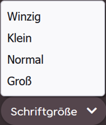

# BBCode

**BBCode** ist eine [Auszeichnungssprache](https://de.wikipedia.org/wiki/Auszeichnungssprache) (Markup), die im osu!-Forum und, in einem größeren Umfang, in den meisten Foren im Internet genutzt wird. Damit die Rich-Text-Formatierung möglich wird, umranden Tags Text, um die Formatierung, Attribute, Einbettung usw. festzulegen. Es wird auf verschiedenen Seiten auf der osu!-Webseite verwendet, wie z. B. in Forumsbeiträgen, Signaturen, Benutzerseiten und Beatmapbeschreibungen.


## Verhalten

Wenn vor dem Drücken des Markup-Buttons kein Text markiert wurde, wird um den Cursor ein öffnendes sowie schließendes Tag im Beitragseditor hinzugefügt. Sofern Text vorher markiert wurde, werden die Tags um den markierten Text gesetzt.

Benutzer, die die Formatierung in einem einzigen Textabschnitt setzen möchten, können BBCode-Tags um die Sektion setzen. Allerdings muss die Reihenfolge und die Verschachtelung der Tags **beachtet werden**. Ansonsten wird der Text nicht formatiert.

Beispiele für die korrekte und inkorrekte Benutzung von verschachtelten Tags sind unten näher beschrieben:

- `[centre][b]Text[/b][/centre]` ist korrekt
- `[b][centre]Text[/b][/centre]` ist inkorrekt

## Tags

BBCode, wie viele andere Markup-Sprachen, formatiert Text durch ein System von Tags, die durch ein Paar eckiger Klammern (`[]`) gekennzeichnet sind. Diese Tags sind aufgeteilt in "öffnende" und "schließende" Tags, die durch das Einfügen eines Schrägstrichs (`/`) unterscheidbar werden. D. h., dass schließende Tags einen Schrägstrich direkt nach der öffnenden Klammer haben, wohingegen öffnende Tags dies nicht haben.

Es ist auch wichtig zu wissen, dass öffnende Tags manchmal Gleichheitszeichen (`=`) enthalten, um URLs, Schriftgröße und andere derartige Elemente zu markieren.

BBCode-Tags, die von der osu!-Webseite unterstützt werden, sind unten aufgelistet und näher erläutert.

### Fettschrift

```
[b]Text[/b]
```

Das Tag `[b]` wird benutzt, um Text mit Hilfe von Fettschrift stark zu betonen. Die Schriftgröße wird hierbei nicht verändert.

Schaltfläche in der Symbolleiste: 

### Kursivschrift

```
[i]Text[/i]
```

Das Tag `[i]` wird benutzt, um Text mit Hilfe einer Schräglage leicht zu betonen (d. h. in kursiv setzen).

Schaltfläche in der Symbolleiste: 

### Unterstreichen

```
[u]Text[/u]
```

Das Tag `[u]` wird benutzt, um mit Hilfe einer horizontalen Linie Text hervorzuheben (d. h. unterstreichen). Die horizontale Linie wird von anderen Tags beeinflusst, wie Fettschrift und Kursivschrift.

### Durchstreichen

```
[strike]Text[/strike]
```

*Anmerkung: Im Englischen wird "strikethrough", also durchgestrichen, auch als "strike" bezeichnet.*

Das Tag `[strike]` wird benutzt, um die Entfernung eines zuvor enthaltenen Text zu markieren. Die Kennzeichnung erfolgt durch eine horizontale Linie, die den Text durchstreicht.

Schaltfläche in der Symbolleiste: 

### Farbe

```
[color=#HEXCODE]Text[/color]
```

*Für eine Liste aller Farbkodierungen, siehe [X11 Farbkodierung](https://de.abcdef.wiki/wiki/X11_color_names)*

Das Tag `[color]` wird benutzt, um Text mit unterschiedlichen Webfarben zu gestalten. Es wird das [Hexadezimalsystem](https://de.wikipedia.org/wiki/Webfarbe#RGB-Farbraum) verwendet, um die Farbe zu spezifizieren. Die Farbe kann aber auch durch HTML-Farbnamen, wie z. B. "red" oder "green" notiert werden. Um dem Text eine Farbe zu geben, ersetze das Argument `#HEXCODE` mit einem Hexadezimal- oder HTML-Farbcode.

Das zuvor genannte Argument darf keine Anführungszeichen (`"`) enthalten und hat keinen Standardwert. Wenn kein Wert festgelegt wurde oder wenn Anführungszeichen benutzt werden, dann wird das Tag nicht als BBCode-Tag verarbeitet.

### Schriftgröße

```
[size=NUMMER]Text[/size]
```

Das Tag `[size]` wird benutzt, um Text durch verschiedene Schriftgrößen zu gestalten. Momentan werden vier Größen von der osu!-Webseite unterstützt: 50, 85, 100, und 150. Die Größen werden intern als "winzig", "klein", "normal" und "groß" entsprechend bezeichnet.

Das Argument `NUMMER` akzeptiert keine Anführungszeichen und nimmt nur eine der vier unterstützten Größen an. Wenn eine Nummer eingeben wird, die nicht einer der vier unterstützten entspricht, dann wird die Textgröße auf den Standardwert zurückgesetzt.

Schaltfläche in der Symbolleiste: 

### Spoiler

*Nicht zu verwechseln mit [Spoilerbox](#spoilerbox).*

```
[spoiler]Text[/spoiler]
```

Das Tag `[spoiler]` wird benutzt, um sensitive Daten mit einem schwarzen Vordergrund zu verdecken. Diese Daten werden beim Markieren sichtbar. Wenn der Vordergrund mit dem Farb-Tag [`[color]`](#farbe) gestapelt wird, dann wird der schwarze Vordergrund davon nicht beeinflusst. Allerdings wird der Text unter dem schwarzen Vordergrund unabhängig von der Lesbarkeit gefärbt sein.

Das Tag wird meistens benutzt, um kritische/sensitive Informationen über eine TV-Show, einen Film oder andere Medien zu verstecken, damit Leute nicht gespoilert werden. Es wird manchmal auch verwendet, um einen komödiantischen Effekt oder eine Betonung zu erzeugen.

### Box

*Nicht zu verwechseln mit [Spoilerbox](#spoilerbox).*

```
[box=NAME]
Text
[/box]
```

Das Tag `[box]` wird verwendet, um Texte und Bilder in einem anklickbaren Hyperlink zu verstecken. Beim Klicken wird der Inhalt in der Box ähnlich wie in einem Dropdown-Menü aufgedeckt.

Der benutzerdefinierte Hyperlink wird durch das Argument `NAME` bestimmt. Die Spezifizierung dieses Arguments wird eine Überschrift in der Box anhand des Arguments erstellen und wird die Größe der Box entsprechend anpassen. Wenn `NAME` nicht definiert wird, dann erstellt das Tag `[box]` eine Box ohne Überschrift. Das Argument benutzt keine Anführungszeichen (`"`) und stellt Leerzeichen dar.

Das Tag wird meistens benutzt, um große Fluten an Text und Bildern zu verstecken, die den Forumsbeitrag immens verlängern. Am meisten sichtbar in den FAQ oder in [Skin](/wiki/Skinning)-Veröffentlichungsbeiträgen.

*Anmerkung: Die Schaltfläche der BBCode-Box in der Symbolleiste wird "Spoiler" genannt, aber sie erstellt kein `[spoiler]` oder `[spoilerbox]` Tag.*

Schaltfläche in der Symbolleiste: 

### Spoilerbox

```
[spoilerbox]Text[/spoilerbox]
```

Eine *Spoilerbox* ist eine spezielle Art von BBCode-Box, die kein spezifizierbares Argument `NAME` hat. Der Name einer Spoilerbox wird immer als `SPOILER` angezeigt. Spoilerboxen haben ihr eigenes Tag (`[spoilerbox]`), jedoch sind sie funktional identisch zu [BBCode-Boxen](#box).

### Zitat

```
[quote="NAME"]
Text
[/quote]
```

Das Tag `[quote]` wird benutzt, um lange Zitate stilistisch durch Einrückung, Färbung, Fettschrift und einer pinken vertikalen Linie zu formatieren. Der tatsächliche Inhalt des Zitats wird zwischen dem öffnenden und dem schließenden Tag platziert, während das Argument `NAME` den Autor des Zitats spezifiziert (das ist optional). Der Text innerhalb des Zitats stellt Leerzeichen und Zeilenumbrüche dar.

*Hinweis: Das Argument `NAME` muss zwischen Anführungszeichen (`"`) gesetzt werden.*

Lange Zitate werden typischerweise in formalen Schreiben bei Texten verwendet, die länger als zwei Zeilen sind. Innerhalb der osu!-Foren werden sie allerdings meistens genutzt, um auf den Kommentar eines anderen Nutzers zu antworten. Das kann über den Button `Beitrag in der Antwort zitieren` in der rechten oberen Ecke des entsprechenden Kommentars gemacht werden (unten gezeigt). Dieser Button wird **nur erscheinen, wenn der Cursor in der Nähe ist**.


### Inline-Code

*Nicht zu verwechseln mit [Codeblock](#codeblock).*

```
[c]Text[/c]
```

Das Tag `[c]` ermöglicht die Hervorhebung von Inline-Text in einer Monospace-Schriftart. Auf der osu!-Webseite wird der Text mit einem grauen Rahmen formatiert. Im Gegensatz zu [Codeblöcken](#codeblock) kann das Tag nur in einzelnen Zeilen platziert werden.

In den osu!-Foren ist dies nützlich, um zum Beispiel Tastenkürzel oder Buttonbeschreibungen zu betonen.

### Codeblock

*Nicht zu verwechseln mit [Inline-Code](#inline-code).*

```
[code]
Text
[/code]
```

Das Tag `[code]` wird benutzt, um *vorformatierte Codeblöcke* (auch *vorformatierter Text*) zu erstellen. Auf der osu!-Webseite formatiert dieses Tag Text in einer Monospace-Schriftart innerhalb einer halbtransparenten grauen Box. Die Formatierung von Text innerhalb eines Codeblocks behandelt der Editor als reinen Text, sodass dieser nicht als Quellcode oder ähnliches interpretiert wird.

In den osu!-Foren werden Codeblöcke meistens verwendet, um Quellcode für ein [Storyboard](/wiki/Storyboard) zu zeigen, oder in Tutorials, die die Syntax für Tags, Befehle oder Quellcode präsentieren.

### Zentrierung

```
[centre]Text[/centre]
```

Das Tag `[centre]` wird benutzt, um Text mittig in einer Box zu platzieren. Es wird meistens für den stilistischen Effekt in Titeln, Überschriften oder Gedichten verwendet. Wenn Text innerhalb des Tags `[quote]` gesetzt wird, dann wird dieser innerhalb des Zitatblocks zentriert sein, aber die stilistischen Linien usw. werden es nicht.

### URL

```
[url=LINK]Text[/url]
```

Das Tag `[url]` wird benutzt, um normalen Text in einen anklickbaren Hyperlink zu verwandeln.

*Anmerkung: Diesen Tag zu benutzen ist nicht notwendig, sollte man keine benutzerdefinierten Hyperlinks verwenden wollen, da der Forum-Editor richtige URLs automatisch verarbeitet.*

Benutzer müssen zwei Argumente spezifizieren, um Hyperlinks mit dem Tag `[url]` zu erstellen: der verlinkte Text, der angezeigt wird, und die spezifische URL, auf die verlinkt wird. Das erste muss zwischen dem öffnenden sowie dem schließenden Tag gesetzt werden. Das zweite muss im Argument `LINK` ohne Anführungszeichen (`"`) spezifiziert werden. Wenn kein Text spezifiziert wird, dann wird der Text die URL als Standardwert haben.

Schaltfläche in der Symbolleiste: 

### Profil

```
[profile=userid]Benutzername[/profile]
```

Das Tag `[profile]` wird benutzt, um zu der osu!-Profilseite eines Benutzers mit Hilfe seines Namens oder seiner Benutzer-ID zu verlinken. Der Unterschied zwischen dem Tag `[profile]` und dem Tag `[url]` besteht darin, dass beim Tag `[profile]` eine Benutzerkarte angezeigt wird, sobald der Cursor über den Link fährt.

*Anmerkung: Die Benutzer-ID ist eine Zeichenkette an Nummern, die direkt dem `/users/` in der URL einer osu!-Profilseite folgen.*

Wenn nur die Benutzer-ID verwendet wird, dann ist ein Platzhaltertext zwischen dem öffnenden sowie schließenden Tags erforderlich. Dadurch wird der Benutzername anstatt des Platzhaltertexts auf der eigentlichen Seite angezeigt. Sofern nur der Benutzername spezifiziert wird und der besagte Benutzer seinen Namen ändert, funktioniert der Link nicht mehr.

### Formatierte Listen

```
[list=TYP]
[*]Punkt 1
[*]Punkt 2
[*]Punkt 3
[/list]
```

Das Tag `[list]` wird benutzt, um automatisch zwei unterschiedliche Arten von Listen in den osu!-Foren zu formatieren. Dabei wird ein Stern in eckigen Klammern (`[*]`) verwendet, um einen neuen Punkt in der Liste zu markieren (oben gezeigt). Das wird standardmäßig eine einfache Aufzählungsliste generieren.

Wenn das Argument `TYP` spezifiziert wird (der tatsächliche Wert spielt keine Rolle), wird eine nummerierte Liste erstellt.

*Hinweis: BBCode-formatierte Listen können aufeinander gestapelt und ineinander verschachtelt werden. Manchmal kann das jedoch zu Fehlern in der Formatierung führen.*

Schaltfläche in der Symbolleiste:  

### E-Mail

```
[email=ADRESSE]text[/email]
```

Das Tag `[email]` erstellt einen anklickbaren Hyperlink, der eine neue E-Mail im standardmäßigen E-Mail-Programm mit bereits ausgefülltem Adressfeld anlegt.

Um einen Link zu kreieren, müssen zwei Argumente definiert werden: das Argument `ADRESSE` muss einer validen E-Mail-Adresse entsprechen, wohingegen `text` der dargestellte Text ist, der als Hyperlink dient. Wenn das Argument `text` nicht spezifiziert wird, wird der Hyperlink nicht korrekt erstellt.

### Bilder

```
[img]ADRESSE[/img]
```

Das Tag `[img]` wird benutzt, um Bilder aus dem Internet in osu!-Forumsbeiträgen einzubinden. Für die Benutzung des Tags müssen Nutzer den direkten Bildlink von einer Webseite einbinden (repräsentiert durch das Argument `ADRESSE`). Lokale Dateipfade (z. B. `C:\Users\Name\Pictures\image.jpg`) **werden nicht funktionieren**.

*Hinweis: Die URL einer Webseite ist **nicht** dasselbe wie eine Bildadresse.*

Um an die Bildadresse zu gelangen, muss man auf die Webseite gehen, auf der das Bild ist. Dann muss man mit der Maus über das Bild fahren, einen Rechtsklick auf das Bild machen und `Grafikadresse kopieren` wählen. Anschließend sollte die Adresse zwischen den Tags eingefügt werden.

Obwohl Bilder von überall aus verlinkt werden können, empfiehlt osu!, dass Nutzer Bilder auf seriösen Filehosting-Diensten wie [ImgBB](https://imgbb.com/) hochladen, da manche Webseiten die direkte Verlinkung zu Bildern nicht erlauben (auch bekannt als "Hotlinks").

*Hinweis: Imgur blockiert IP-Adressen der osu!-Webseite. Das bedeutet, dass dort neu hochgeladene Bilder nicht mehr länger angezeigt werden können.*[^imgur-blocked-ip]

Schaltfläche in der Symbolleiste: 

### Imagemap

```
[imagemap]
ADRESSE
X Y BREITE HÖHE WEITERLEITUNG TITEL
[/imagemap]
```

Das Tag `[imagemap]` wird verwendet, um einen oder mehrere Hyperlinks in Form von rechteckigen Bereichen in ein Bild zu integrieren.

Das auf der Webseite eingebettete Bild wird durch das Argument `ADRESSE` dargestellt. Es muss direkt auf ein Bild verweisen, welches auf einer Webseite gehostet wird.

Um einen anklickbaren Bereich hinzuzufügen, muss nach dem Argument `ADRESSE` eine Zeile mit der x- und y-Position des Bereichs, der Breite und Höhe des Bereichs sowie einem Link zur Weiterleitung eingefügt werden. Darüber hinaus wird der im optionalen Argument `TITEL` angegebene Text angezeigt, sobald der Mauszeiger über die Fläche bewegt wird. Im Argument `WEITERLEITUNG` kann ein Link angegeben oder mit einer Raute (`#`) weggelassen werden. Jede Größeneinheit (`X`, `Y`, `BREITE` und `HÖHE`) ist ein prozentualer Wert (0 bis 100) ohne das Prozentzeichen.

Schaltfläche in der Symbolleiste: 

### YouTube

```
[youtube]VIDEO_ID[/youtube]
```

Das Tag `[youtube]` wird verwendet, um ein Video von [YouTube](https://youtube.com) auf der Webseite einzubetten. Für das Tag muss nur die Video-ID (**nicht** nicht die gesamte URL) zwischen den beiden Tags (repräsentiert durch das Argument `VIDEO_ID`) angegeben werden.

Eine YouTube-Video-ID ist in der URL eines Videos enthalten und ist die Zeichenkette von 11 Zeichen *direkt nach* `v=`.

### Audio

```
[audio]URL[/audio]
```

Das Tag `[audio]` wird benutzt, um einen [HTML5](https://en.wikipedia.org/wiki/HTML5) Audioplayer einer Audioquelle auf der Webseite einzubinden. Audiodateien können von überall verlinkt werden, solange die Datei von einer angegebenen URL existiert. Lokale Dateipfade (z. B. `C:\Users\Name\Music\audio.mp3`) **werden nicht funktionieren**.

*Vorsicht: Bitte sei dir bewusst, dass nicht alle Filesharing-Dienste das direkte Verlinken von Audiodateien auf Grund von Bedenken wegen Musikpiraterie erlauben. osu! ist nicht verantwortlich für jegliche Urheberrechtsverstöße durch Nutzer.*

Um Audiodateien mit Hilfe dieser Methode einzubinden, müssen Nutzer die URL (z. B. `https://www.example.com/example.mp3`) zwischen die beiden Tags `[audio]` setzen.

<!-- Example online audio file URL for wiki editors: https://actions.google.com/sounds/v1/alarms/digital_watch_alarm_long.ogg -->

### Überschrift (v1)

```
[heading]Text[/heading]
```

Das Tag `[heading]` wird benutzt, um Text als große, pinke Überschrift zu formatieren. Hierbei werden keine mehrstufigen Überschriften unterstützt und die Überschriften können nicht direkt verlinkt werden.

Schaltfläche in der Symbolleiste: 

### Hinweis

```
[notice]
Text
[/notice]
```

Das Tag `[notice]` wird benutzt, um Paragraphen in große, umrandete Boxen mit einer dunklen Hintergrundfarbe zu platzieren. Der Button wird hauptsächlich verwendet, um Hinweise oder Warnungen zu einem bestimmten Thema auf der Webseite zu platzieren.

## Legacy

Die folgenden BBCode-Tags, die früher an verschiedenen Orten innerhalb der osu!-Webseite benutzt wurden, stehen jetzt nicht mehr zur Verfügung. Ihre Benutzung wird für historische Zwecke unten genauer erläutert.

### Google

```
[google]Suchbegriff[/google]
```

Das Tag `[google]` ist ein nicht mehr aktuelles Tag, welches in den osu!-Foren benutzt wurde, um auf eine Google-Suche mit Hilfe des Textes zwischen den beiden Tags zu verweisen.

Das Tag leitete Nutzer über ihren Account auf eine Google-Suche um. D. h., dass jeder Nutzer ein anderes Ergebnis erhalten würde, da Google die Suchergebnisse personalisiert. Ebenso bedeutet das auch, dass manche Suchergebnisse für bestimme Nutzer verborgen bleiben, aufgrund von Sprachunterschieden oder Länderbeschränkungen.

### Lucky

```
[lucky]Suchbegriff[/lucky]
```

Das Tag `[lucky]` ist ein veraltetes Tag, das früher verwendet wurde, um in den osu!-Foren auf Googles `I'm Feeling Lucky` mit dem angegebenen Text zu verweisen. Die verlinkte Webseite ist aufgrund des Verhaltens des Buttons nicht dieselbe für alle.

### Überschrift (v2)

```
[text]
```

Das Tag *Überschrift (v2)* ist ein nicht mehr aktuelles Tag, das früher in den osu!-Foren benutzt wurde, um Text in eine schicker aussehende violette Überschrift mit einer horizontalen Linie zu formatieren. Das Tag hat nur in den Beatmap-Foren funktioniert und erschien nur nach der Beitragsveröffentlichung (nicht in der Vorschau). Es gab dafür keinen Button während die Überschrift zur Verfügung stand und wurde durch eine öffnende sowie eine schließende eckige Klammer (kein öffnendes sowie schließendes Tag) markiert.

## Trivia

- Dieser Wikiartikel wurde adaptiert aus dem Forumsbeitrag ["HOW TO: Forum BBCodes"](https://osu.ppy.sh/community/forums/topics/445599) von [Stefan](https://osu.ppy.sh/users/626907).
- Es gab einen Bug, der Nutzern erlaubte, den Text transparent zu machen durch die Benutzung des [Farb-Tags](#farbe) und die Beschriftung "transparent" nach dem Gleichheitszeichen (`=`).
  - Der Text wird heute zu der Standardfarbe (weiß) zurückgesetzt, sobald das passiert.
- Bevor das Tag `imagemap` hinzugefügt wurde, war es möglich, einen Hyperlink zu einem Bild hinzuzufügen, indem die Tags `url` und `img` kombiniert wurden. Jedoch kann nur ein Hyperlink pro Bild gesetzt werden. Dazu muss man das Originalbild in mehrere Teile zerschneiden (also für jeden Link ein Teilbild) und diese horizontal nebeneinander anordnen.

## Referenzen

[^imgur-blocked-ip]: [Tweet von @ppy (29.06.2023)](https://twitter.com/ppy/status/1674439849749913602)
