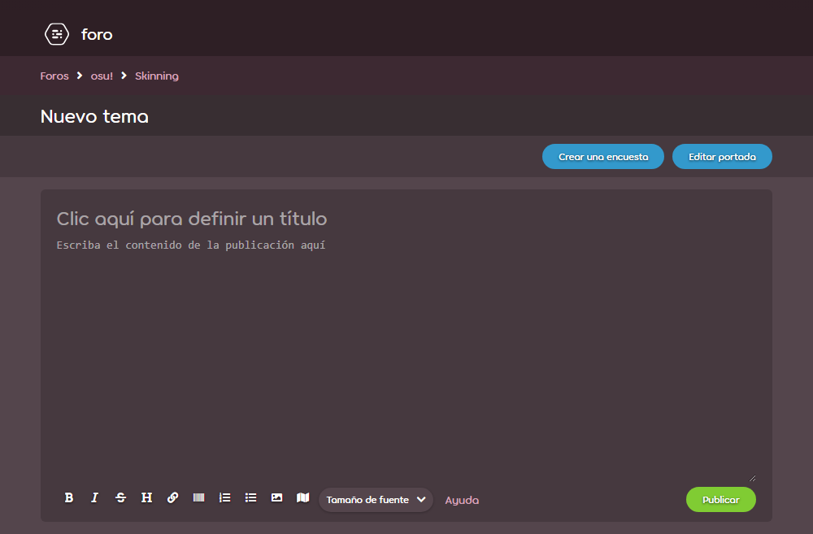
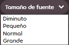

# BBCode

**BBCode** es un [lenguaje de marcado](https://es.wikipedia.org/wiki/Lenguaje_de_marcado) que se usa en los foros de osu! y, en mayor medida, la gran mayoría de foros en internet. Se utiliza para habilitar el formato de texto enriquecido, se compone de etiquetas que rodean el texto para indicar formato, atributos, incrustaciones y más. Se usa en varios lugares del sitio web de osu!, como publicaciones en foros, firmas, páginas de usuario y descripciones de beatmaps.



## Comportamiento

Al hacer clic en un botón de marcado sin resaltar ningún texto, se creará un conjunto de etiquetas abiertas y cerradas alrededor del cursor de texto en el editor de publicaciones. Resaltar el texto antes de hacer clic en un botón de marcado rodeará dicho texto con las etiquetas.

Los usuarios que deseen combinar el formato en una sola sección de texto, pueden hacerlo colocando etiquetas BBCode una dentro de otra. Sin embargo, el orden y el anidamiento de estas etiquetas **debe respetarse** al combinar. Si no lo hace, se romperá el formato.

A continuación se describe un conjunto de usos correctos e incorrectos de las etiquetas anidadas:

- `[centre][b]text[/b][/centre]` es correcto
- `[b][centre]text[/b][/centre]` es incorrecto

## Etiquetas

BBCode, como muchos otros lenguajes de marcado, formatea el texto mediante un sistema de etiquetas, que se indica mediante un par de corchetes (`[]`). Estas etiquetas se dividen en etiquetas de «apertura» y «cierre», que se diferencian mediante la inclusión de una barra diagonal (`/`). Específicamente, las etiquetas de cierre contienen una barra inclinada justo después del corchete de apertura, mientras que las etiquetas de apertura no.

También es importante tener en cuenta que las etiquetas abiertas ocasionalmente incluyen signos de igual (`=`) dentro para indicar direcciones URL, tamaños de fuente y otros elementos similares.

Las etiquetas BBCode, que son compatibles con el sitio web de osu!, se enumeran y describen en detalle a continuación.

### Negrita

```
[b]texto[/b]
```

La etiqueta `[b]` se usa para enfatizar mucho el texto mediante el uso de negrita. La negrita de BBCode no afecta el tamaño de la fuente.

Botón de la barra de herramientas: 

### Cursiva

```
[i]texto[/i]
```

La etiqueta `[i]` se usa para enfatizar ligeramente el texto inclinando el texto hacia adelante (es decir, en cursiva).

Botón de la barra de herramientas: 

### Subrayado

```
[u]texto[/u]
```

La etiqueta `[u]` se usa para enfatizar el texto dibujando una línea horizontal debajo de dicho texto (es decir, subrayado). La línea horizontal que se dibuja se verá afectada por otras etiquetas como negrita y cursiva.

### Tachado

```
[strike]texto[/strike]
```

*Nota: «tachado» también puede ser conocido como «tachar».*

La etiqueta `[strike]` se usa para indicar la eliminación de texto incluido anteriormente mediante el uso de una línea horizontal que «tacha» el texto (es decir, un «tachado»).

Botón de la barra de herramientas: 

### Color

```
[color=#CÓDIGOHEX]texto[/color]
```

*Para obtener una lista de todos los nombres de colores, véase [X11 color names](https://en.wikipedia.org/wiki/X11_color_names#Color_name_chart)*

La etiqueta `[color]` se usa para estilizar el texto a través de varios tipos de colores seguros para la web. La etiqueta usa el formato del [código HEX](https://es.wikipedia.org/wiki/Colores_web#RGB) para especificar el color, aunque también se puede especificar a través de nombres de color HTML como «red» o «green». Para especificar, reemplace el argumento `#CÓDIGOHEX` con el código HEX o nombre HTML correspondiente de un color.

El argumento mencionado anteriormente no lleva comillas (`"`) y no tiene un color predeterminado. Si no se especifica ningún argumento, o si se utilizan comillas, la etiqueta no se analizará como una etiqueta de BBCode.

### Tamaño de fuente

```
[size=NÚMERO]texto[/size]
```

La etiqueta `[size]` se usa para estilizar el texto mediante el uso de diferentes tamaños de fuente. Actualmente, hay cuatro tamaños compatibles con el sitio web de osu!: 50, 85, 100 y 150. Los tamaños se denominan internamente «diminuto», «pequeño», «normal» y «grande», respectivamente.

El argumento `NÚMERO` no acepta comillas y solo acepta uno de los cuatro tamaños admitidos. Si se ingresa un número que no es uno de los cuatro admitidos, el texto volverá al tamaño predeterminado.

Botón de la barra de herramientas: 

### Spoiler

*No debe confundirse con [Caja de spoiler](#caja-de-spoiler).*

```
[spoiler]texto[/spoiler]
```

La etiqueta `[spoiler]` se usa para ocultar información confidencial con un primer plano negro sólido que revela el texto debajo al resaltarlo. Si se apila con la etiqueta [`[color]`](#color), la cubierta negra no se verá afectada. Sin embargo, el texto debajo de la cubierta negra seguirá estando coloreado, sea legible o no.

La etiqueta se usa más comúnmente para evitar estropear información crítica/sensible sobre un programa de televisión, una película u otros medios. A veces también se usa para efectos cómicos o énfasis.

### Caja

*No debe confundirse con [Caja de spoiler](#caja-de-spoiler).*

```
[box=NOMBRE]
texto
[/box]
```

La etiqueta `[box]` se usa para ocultar texto e imágenes dentro de un hipervínculo en el que se puede hacer clic. Al hacer clic, el contenido del interior se revelará de manera similar a un menú desplegable.

El texto del hipervínculo personalizado se indica mediante el argumento `NAME`. Especificar este argumento creará un texto de encabezado dentro de la caja usando ese argumento y ajustará el tamaño de la caja en consecuencia. Si `NAME` se deja sin especificar, la etiqueta `[box]` creará una caja sin texto de encabezado dentro. El argumento no usa comillas (`"`), y generará espacios en blanco.

La etiqueta se usa más comúnmente para ocultar grandes paredes de texto e imágenes que pueden aumentar el tamaño de una publicación en el foro. Más notablemente en las publicaciones de preguntas frecuentes o de [skins](/wiki/Skinning).

*Nota: el botón de la barra de herramientas de la caja se llama «Caja de spoiler», pero no crea una etiqueta `[spoilerbox]`.*

Botón de la barra de herramientas: 

### Caja de spoiler

```
[spoilerbox]texto[/spoilerbox]
```

Una *caja de spoiler* es un tipo especial de caja BBCode que no tiene un argumento `NOMBRE` especificable. El nombre de una caja de spoiler siempre se muestra como `SPOILER`. Las cajas de spoiler tienen su propia etiqueta (`[spoilerbox]`) pero son funcionalmente idénticas a las [cajas](#caja).

### Cita

```
[quote="NOMBRE"]
texto
[/quote]
```

La etiqueta `[quote]` se usa para dar formato estilístico a citas largas (también conocidas como «citas en bloque») mediante el uso de sangría, color, negrita y separación del texto a través de una línea vertical rosa. El contenido real de la cita se coloca entre las etiquetas abiertas y cerradas, mientras que el argumento `NOMBRE` especifica el autor de la cita (aunque esto es opcional). El texto dentro de las comillas generará espacios en blanco y saltos de línea.

*Aviso: el argumento `NOMBRE` debe estar entre comillas (`"`).*

Las citas largas generalmente se usan en los escritos más formales en lugar de citas en línea cuando dicha cita tiene tres o más líneas. Sin embargo, dentro de los foros de osu!, se usan más comúnmente para responder al comentario de otro usuario, lo que se puede hacer automáticamente a través del botón `Citar y responder` ubicado en la parte superior derecha del comentario deseado (que se muestra a continuación). Sin embargo, este botón **solo aparecerá si el cursor está cerca**.


### Código en línea

*No debe confundirse con [Bloque de código](#bloque-de-código).*

```
[c]texto[/c]
```

La etiqueta `[c]` permite resaltar texto en línea en una fuente monoespaciada. En el sitio web de osu!, el texto se formateará con un cuadro gris a su alrededor. A diferencia de los [bloques de código](#bloque-de-código), la etiqueta solo se puede colocar en líneas individuales.

Dentro de los foros de osu!, esto es útil para enfatizar, por ejemplo, atajos de teclado o descripciones de botones.

### Bloque de código

*No debe confundirse con [Código en línea](#código-en-línea).*

```
[code]
texto
[/code]
```

La etiqueta `[code]` se usa para crear *bloques de código preformateados* (también conocido como *texto preformateado*). En el sitio web de osu!, la etiqueta `[code]` formateará el texto en una fuente monoespaciada dentro de un cuadro gris semitransparente. Dar formato al texto dentro de un bloque de código le indicará al editor que trate el texto entre esas etiquetas literalmente, evitando así la conversión de cualquier etiqueta o código fuente en otra cosa.

Dentro de los foros de osu!, los bloques de código se utilizan con mayor frecuencia para publicar el código fuente de un [storyboard](/wiki/Storyboard), o en tutoriales que requieren mostrar la sintaxis de las etiquetas, los comandos o el código fuente.

### Centrar

```
[centre]texto[/centre]
```

La etiqueta `[centre]` se usa para alinear el texto al centro de una caja. Esto se usa con mayor frecuencia para efectos estilísticos en títulos, encabezados o poemas. Si se coloca dentro o alrededor de una etiqueta `[quote]`, el texto dentro del bloque de citas estará centrado, pero las líneas estilísticas y demás no.

### URL

```
[url=ENLACE]texto[/url]
```

La etiqueta `[url]` se usa para convertir texto regular en hipervínculos en los que se puede hacer clic.

*Nota: El uso de esta etiqueta no es necesario si no se desea utilizar texto de hipervínculo personalizado, ya que el editor del foro analiza las URL adecuadas en enlaces automáticamente.*

Para crear hipervínculos con la etiqueta `[url]`, los usuarios deben especificar dos argumentos: el texto vinculado que se mostrará, y la URL específica del sitio web al que navegar. El primero debe especificarse entre las etiquetas abiertas y cerradas, y el último debe especificarse como el argumento `ENLACE`, sin comillas (`"`). Si no se especifica ningún texto, el texto predeterminado será el nombre de la URL.

Botón de la barra de herramientas: 

### Perfil

```
[profile=iddeusuario]nombre de usuario[/profile]
```

La etiqueta `[profile]` se usa para enlazar la página de perfil de osu! de un usuario usando su nombre de usuario o ID de usuario. El uso de la etiqueta `[profile]` difiere del uso de la etiqueta `[url]` en que la etiqueta `[profile]` muestra una tarjeta de usuario al pasar el cursor sobre el enlace creado por la etiqueta.

*Nota: El ID de usuario es una cadena de números que siguen directamente a `/users/` en la URL de una página de perfil de osu!.*

Al especificar usuarios solo por sus ID de usuario, se requiere un texto de marcador de posición entre las etiquetas abiertas y cerradas. Al hacerlo, se mostrará el nombre de usuario en la página real, no el texto del marcador de posición. Al especificar usuarios solo por su nombre de usuario, el enlace no funcionará una vez que cambien su nombre de usuario.

### Listas formateadas

```
[list=TIPO]
[*]ítem 1
[*]ítem 2
[*]ítem 3
[/list]
```

La etiqueta `[list]` se usa para formatear automáticamente dos tipos diferentes de listas en todos los foros de el osu! usando un asterisco entre corchetes (`[*]`) para indicar un nuevo elemento en la lista (que se muestra arriba). De forma predeterminada, esto creará una lista simple con viñetas.

Si se especifica el argumento `TIPO` (el valor real no importa), creará una lista numerada.

*Aviso: las listas con formato de BBCode se pueden apilar una encima de otra y colocarse una dentro de otra, aunque se sabe que esto causa problemas con el formato.*

Botón de la barra de herramientas:  

### Correo electrónico

```
[email=DIRECCIÓN]texto[/email]
```

La etiqueta `[email]` crea un hipervínculo en el que se puede hacer clic, que abre un nuevo correo electrónico en el programa de correo predeterminado con el campo de dirección rellenado previamente.

Para crear un enlace, se deben especificar dos argumentos: el argumento `DIRECCIÓN` debe ser una dirección de correo electrónico válida, mientras que `texto` es el texto que se muestra y sirve como hipervínculo. Si el argumento `texto` no está definido, el hipervínculo no se creará correctamente.

### Imágenes

```
[img]DIRECCIÓN[/img]
```

La etiqueta `[img]` se usa para incluir imágenes en línea en las publicaciones de foro de osu!. Para usar la etiqueta, los usuarios deben pegar la dirección de la imagen directa (representada por el argumento `DIRECCIÓN` anterior) procedente de un sitio web. Las rutas de archivos locales (por ejemplo, `C:\Users\Name\Pictures\image.jpg`) **no funcionarán**.

*Aviso: la URL de un sitio web **no** es lo mismo que la dirección de una imagen.*

Para obtener una dirección de imagen, uno debe navegar al sitio web en el que se encuentra, pasar el ratón sobre la imagen, hacer clic con el botón derecho en la imagen y seleccionar `Copiar dirección de la imagen`. Luego, la dirección debe copiarse y pegarse entre las etiquetas.

Aunque las imágenes se pueden obtener desde cualquier lugar, osu! recomienda que los usuarios carguen imágenes en sitios de intercambio de imágenes acreditados como [ImgBB](https://imgbb.com/), ya que algunos sitios web no aprecian los enlaces directos a sus imágenes (también conocidos como «hotlinks»).

*Aviso: Imgur ha bloqueado las IP del sitio web de osu!, por lo que las nuevas imágenes alojadas allí ya no se pueden mostrar.*[^imgur-blocked-ip]

Botón de la barra de herramientas: 

### Mapa de imágenes

```
[imagemap]
URL_DE_LA_IMAGEN
X Y ANCHO ALTURA REDIRECCIÓN TÍTULO
[/imagemap]
```

La etiqueta `[imagemap]` se utiliza para integrar uno o más hipervínculos en una imagen en áreas rectangulares.

La imagen, que está incrustada en el sitio web, está representada por el argumento `URL_DE_LA_IMAGEN`. Debe referirse directamente a una imagen alojada en un sitio web.

Para agregar un área en la que se puede hacer clic, se debe insertar una nueva línea que contenga la posición x e y del área, el ancho y el alto del área, así como un enlace para redirigir después del argumento `URL_DE_LA_IMAGEN`. Además, se mostrará un argumento `TÍTULO` opcional al pasar el cursor por el área si se especifica. Un enlace se puede especificar con el argumento `REDIRECCIÓN` u omitirse con `#`. Cada unidad de tamaño (`X`, `Y`, `ANCHO` y `ALTURA`) es un porcentaje (0–100) sin el signo de porcentaje.

Botón de la barra de herramientas: 

### YouTube

```
[youtube]ID_DEL_VÍDEO[/youtube]
```

La etiqueta `[youtube]` se usa para incrustar un vídeo de [YouTube](https://youtube.com) en el sitio web. La etiqueta requiere que el usuario ingrese solo el ID del vídeo (**no** la URL completa) entre las dos etiquetas (representadas por el argumento `ID_DEL_VÍDEO` anterior).

El ID de un vídeo de YouTube se encuentra en la URL del vídeo y es la cadena de 11 caracteres *directamente después* de `v=`.

### Audio

```
[audio]URL[/audio]
```

La etiqueta `[audio]` se usa para incrustar un reproductor de audio [HTML5](https://es.wikipedia.org/wiki/HTML5) desde una fuente de audio en línea. Los archivos de audio se pueden obtener desde cualquier lugar, siempre que el archivo exista desde una URL determinada. Las rutas de archivos locales (por ejemplo, `C:\Users\Name\Music\audio.mp3`) **no funcionarán**.

*Precaución: tenga en cuenta que no todos los servicios de intercambio de archivos aprecian la copia de sus archivos de audio debido a las preocupaciones sobre la piratería de música. osu! no es responsable de ningún problema de derechos de autor que los usuarios puedan encontrar en ese sentido.*

Para incrustar archivos de audio a través de este método, los usuarios deben pegar su URL de origen (por ejemplo, `https://www.example.com/example.mp3`) entre las dos etiquetas `[audio]`.

### Encabezado (v1)

```
[heading]texto[/heading]
```

La etiqueta `[heading]` se usa para dar formato al texto en grandes encabezados de color rosa. La etiqueta no admite encabezados de varios niveles y no se puede vincular específicamente.

Botón de la barra de herramientas: 

### Anuncio

```
[notice]
texto
[/notice]
```

La etiqueta `[notice]` se usa para colocar párrafos en un cuadro grande y delineado con un cuerpo de color oscuro. El botón se utiliza principalmente para indicar anuncios o advertencias sobre un determinado tema en el sitio web.

## Antiguas

Las siguientes son etiquetas BBCode que alguna vez se usaron en varios lugares del sitio web de osu!, pero ahora no están disponibles para su uso. Sus usos y sintaxis se describen a continuación con fines históricos.

### Google

```
[google]consulta de búsqueda[/google]
```

La etiqueta `[google]` es una etiqueta obsoleta que alguna vez se usó en los foros de osu! para vincular a una consulta de búsqueda de Google utilizando el texto proporcionado entre dos etiquetas.

La etiqueta redirigiría a los usuarios a una búsqueda de Google a través de su cuenta, lo que significa que no se darían exactamente los mismos resultados a todos, ya que Google personaliza los resultados de los usuarios. Asimismo, esto también significa que algunos resultados de búsqueda estarían ocultos para ciertos usuarios debido a restricciones de idioma o país.

### Suerte

```
[lucky]consulta de búsqueda[/lucky]
```

La etiqueta `[lucky]` es una etiqueta obsoleta que alguna vez se usó en los foros de osu! para vincular a un sitio web dirigido desde el botón `Voy a tener suerte` de Google utilizando el texto proporcionado. El sitio web vinculado a través de esta etiqueta no sería el mismo para todos debido a la naturaleza del botón en sí.

### Encabezado (v2)

```
[texto]
```

La etiqueta *encabezado (v2)* es una etiqueta desactualizada que alguna vez se usó en los foros de osu! para dar formato al texto en un encabezado púrpura de apariencia más elegante con una línea horizontal. La etiqueta solo funcionó en el foro Beatmaps, y solo aparecia después de la publicación (no en la vista previa). No tenía botón cuando estaba en servicio y se indicaba con un corchete abierto y cerrado (sin etiquetas de apertura y cierre).

## Curiosidades

- Este artículo de la wiki fue adaptado del hilo del foro [«HOW TO: Forum BBCodes»](https://osu.ppy.sh/community/forums/topics/445599) por [Stefan](https://osu.ppy.sh/users/626907).
- Solía haber un error que permitía a los usuarios hacer que el texto fuera transparente usando la [etiqueta de color](#color) y escribiendo «transparent» después del signo igual (`=`).
  - A partir de ahora, el texto volverá al color predeterminado (blanco) cuando esto suceda.
- Antes de que se agregara la etiqueta `imagemap`, era posible agregar un hipervínculo a una imagen combinando las etiquetas `url` e `img`; sin embargo, solo se puede establecer un hipervínculo por imagen. Esto requeriría cortar la imagen original en varias piezas (es decir, una imagen parcial para cada enlace) y colocarlas horizontalmente una al lado de la otra.

## Referencias

[^imgur-blocked-ip]: [Tuit por @ppy (29/6/2023)](https://twitter.com/ppy/status/1674439849749913602)
