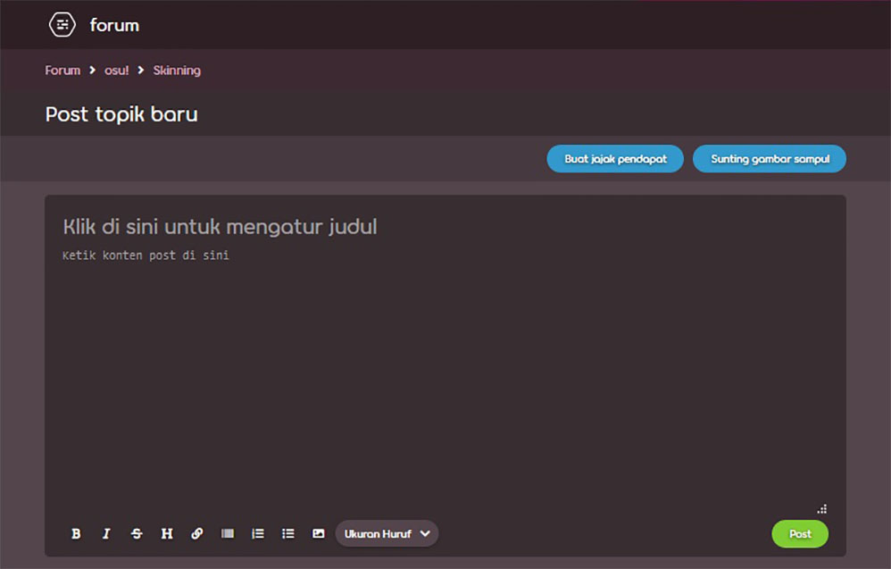
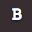
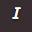
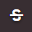
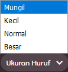
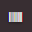
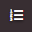
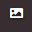
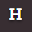

<!--The imagemap button was added to the toolbar in osu-web#9972. When updating this article, keep in mind translating the new "Help" string on Crowdin and updating the editor.jpg file.-->

# BBCode

BBCode merupakan [bahasa *markup*](https://en.wikipedia.org/wiki/Markup_language) yang digunakan pada forum osu! dan hampir seluruh forum internet lain pada umumnya. Bahasa ini berfungsi untuk menampilkan tulisan dalam format *rich text* melalui berbagai tag, di mana masing-masing tag memiliki fungsinya tersendiri seperti memformat teks, memberikan atribut, menyematkan konten, dan lain sebagainya. Pada situs web osu!, BBCode digunakan di berbagai tempat seperti postingan forum, tanda tangan (*signature*), laman pengguna (*user page*), dan kolom deskripsi beatmap.



## Perilaku

Tag BBCode dapat dimunculkan dengan mengklik tombol *markup* yang tertera pada toolbar editor post. Pada saat tombol ini diklik tanpa ada teks yang diseleksi, tag akan dimunculkan di sekitar kursor teks pada editor post. Sebaliknya, apabila terdapat teks yang diseleksi, tag tersebut akan mengelilingi teks yang bersangkutan.

Tag BBCode yang ada dapat saling digabungkan dan ditempatkan di dalam satu sama lain. Meskipun demikian, dalam prosesnya, urutan dan tingkatan tag yang digunakan **tidak boleh saling tertukar**. Apabila hal ini sampai terjadi, teks yang muncul tidak akan terformat dengan benar.

Berikut merupakan contoh penulisan tag BBCode gabungan yang benar dan salah:

- `[centre][b]teks[/b][/centre]` benar
- `[b][centre]teks[/b][/centre]` salah

## Tag

BBCode, sebagaimana bahasa *markup* lain pada umumnya, digunakan untuk memformat teks dengan menggunakan tag yang ditempatkan di antara sepasang tanda kurung siku (`[]`). Setiap tag tersusun atas unsur tag "pembuka" dan "penutup", di mana tag pembuka ditulis tanpa tanda garis miring (`/`) dan tag penutup ditulis dengan tanda garis miring.

Beberapa tag memiliki argumen tambahan yang dapat dibubuhkan pada tag pembuka melalui tanda sama dengan (`=`). Argumen ini digunakan untuk menunjukkan URL, ukuran huruf, atau elemen lain yang berkaitan dengan tag tersebut.

Berikut merupakan daftar tag BBCode yang didukung oleh situs web osu! beserta penjelasannya.

### Bold

```
[b]teks[/b]
```

Tag `[b]` atau *cetak tebal* digunakan untuk menguatkan teks melalui penggunaan huruf yang dicetak tebal. Ketebalan huruf ini tidak memengaruhi ukuran huruf.

Tombol pada toolbar: 

### Italic

```
[i]teks[/i]
```

Tag `[i]` atau *cetak miring* digunakan untuk memberikan penekanan ringan pada teks melalui penggunaan huruf yang dicetak miring.

Tombol pada toolbar: 

### Underline

```
[u]teks[/u]
```

Tag `[u]` atau *garis bawah* digunakan untuk memberikan penekanan pada teks melalui penggunaan garis bawah. Garis yang tergambar dapat dipengaruhi oleh tag lain seperti [bold](#bold) dan [italic](#italic).

### Strikethrough

```
[strike]teks[/strike]
```

*Dikenal juga sebagai **strike**.*

Tag `[strike]` atau *coret* digunakan untuk memberikan kesan "salah ketik" pada teks melalui paparan garis horizontal yang mencoret teks.

Tombol pada toolbar: 

### Colour

```
[color=#KODE HEX]teks[/color]
```

*Untuk daftar nama warna yang didukung oleh tag ini, kunjungi laman [X11 color names](https://en.wikipedia.org/wiki/X11_color_names#Color_name_chart)*.

Tag `[color]` atau *pewarnaan* digunakan untuk mewarnai teks dengan warna yang ramah web (*web-safe colours*). Tag ini menggunakan format [kode HEX](https://en.wikipedia.org/wiki/Web_colors#Hex_triplet) dalam pewarnaannya, meskipun warna yang ada juga dapat ditentukan secara langsung melalui nama umumnya seperti "Red" atau "Green". Untuk mewarnai teks, ubah argumen `#KODE HEX` pada contoh di atas dengan kode HEX atau nama warna yang sesuai.

Argumen warna pada tag ini tidak ditulis dengan tanda kutip (`"`) serta tidak memiliki nilai *default*. Apabila argumen ini dikosongkan atau apabila warna yang ada ditulis dengan tanda kutip, tag ini tidak akan diuraikan sebagai tag BBCode yang sah.

### Font size

```
[size=UKURAN]teks[/size]
```

Tag `[size]` atau *ukuran huruf* digunakan untuk mengubah ukuran huruf pada teks. Saat ini, terdapat empat ukuran huruf yang didukung oleh situs web osu!: 50, 85, 100, dan 150, atau yang dikenal juga dengan nama "Mungil", "Kecil", "Normal", dan "Besar".

Argumen `UKURAN` pada tag ini tidak ditulis dengan tanda kutip dan hanya dapat diisi dengan salah satu dari empat ukuran huruf yang didukung. Apabila ukuran huruf yang dimasukkan bukan merupakan salah satu dari empat ukuran yang tertera di atas, teks akan ditulis dalam ukuran normal.

Tombol pada toolbar: 

### Spoiler

```
[spoiler]teks[/spoiler]
```

*Tag ini tidak sama dengan [Spoilerbox](#spoilerbox).*

Tag `[spoiler]` digunakan untuk menutupi teks yang berisi informasi sensitif dengan latar berwarna hitam. Teks yang tertutup oleh spoiler hanya akan dapat dilihat pada saat di-*highlight* oleh pengguna. Apabila digunakan bersamaan dengan tag [`[color]`](#colour), latar hitam yang ada tidak akan terpengaruh, namun teks asli yang ditutupi oleh tag ini akan tetap berubah warna.

Tag ini pada umumnya digunakan untuk menyembunyikan informasi penting/sensitif seputar acara TV, film, atau media lainnya. Terkadang, tag ini juga digunakan untuk memberikan penekanan pada teks atau sebagai guyonan belaka.

### Box

```
[box=JUDUL]
teks
[/box]
```

*Tag ini tidak sama dengan [Spoilerbox](#spoilerbox).*

Tag `[box]` atau *kotak spoiler* digunakan untuk menyembunyikan teks dan gambar di dalam boks yang dapat dibuka dan ditutup. Pada saat diklik, konten yang terdapat di dalam boks akan tersingkap seperti layaknya pada menu *dropdown*.

Tag ini memiliki argumen `JUDUL` yang digunakan untuk menentukan judul boks. Apabila argumen ini dikosongkan, tag `[box]` akan menghasilkan kotak spoiler tanpa keterangan judul di dalamnya. Argumen ini tidak ditulis dengan tanda kutip (`"`) dan judul yang tertera akan didahului oleh karakter spasi.

Tag ini pada umumnya digunakan untuk menyembunyikan teks yang panjang dan gambar yang berukuran besar pada postingan forum, terutama pada laman FAQ atau utas forum [skin](/wiki/Skinning).

*Catatan: Pada toolbar, tombol BBCode yang berfungsi untuk membuat kotak spoiler memiliki nama "spoiler box". Meskipun demikian, tombol ini tidak menghasilkan tag `[spoilerbox]`.*

Tombol pada toolbar: 

### Spoilerbox

```
[spoilerbox]teks[/spoilerbox]
```

Spoilerbox merupakan tag BBCode yang serupa dengan `[box]`, namun tanpa argumen `JUDUL`. Kotak spoiler yang dihasilkan oleh tag `[spoilerbox]` akan selalu mengusung `SPOILER` sebagai judulnya. Walaupun spoilerbox memiliki tag-nya tersendiri, secara fungsi tag ini serupa dengan tag [box](#box).

### Quote

```
[quote="NAMA"]
teks
[/quote]
```

Tag `[quote]` atau *kutipan* digunakan untuk menampilkan teks dalam bentuk blok kutipan (*block quote*) melalui penggunaan indentasi, pewarnaan, huruf yang dicetak tebal, dan garis pemisah berwarna merah muda. Untuk menggunakan tag ini, tempatkan teks yang ingin dikutip di antara tag pembuka dan penutup serta isi argumen `NAMA` dengan nama penulis kutipan (walaupun argumen ini tidak wajib diisi). Teks yang dikutip akan muncul pada post dengan didahului oleh spasi dan jeda baris.

*Catatan: Argumen `NAMA` pada tag ini wajib ditulis dengan tanda kutip (`"`).*

Tag ini dapat digunakan untuk menampilkan kutipan panjang/*long quote* (yang pada umumnya digunakan pada tulisan yang lebih formal) ataupun kutipan sebaris/*inline quote*. Pada forum osu!, tag ini pada umumnya digunakan untuk membalas komentar pengguna lain melalui tombol `Kutip posting untuk balasan` (sebagaimana yang tertera di bawah). Tombol ini dapat dimunculkan dengan cara menyeret kursor ke pojok kanan atas postingan milik pengguna lain dan **hanya akan muncul apabila didekati oleh kursor**.


### Inline code

*Tag ini tidak sama dengan [Code block](#code-block).*

```
[c]teks[/c]
```

Tag `[c]` atau *baris kode* digunakan untuk menampilkan teks di dalam boks berwarna abu-abu dengan jenis huruf monospace. Tidak seperti tag [code block](#code-block), tag ini hanya dapat diaplikasikan pada satu baris tulisan.

Pada forum osu!, tag ini berguna untuk memberikan penekanan kepada hal-hal seperti pintasan keyboard atau deskripsi tombol.

### Code block

```
[code]
teks
[/code]
```

Tag `[code]` atau *blok kode* digunakan untuk menampilkan teks secara mentah *dalam bentuk aslinya* (*preformatted text*). Sebagaimana tag `[c]`, tag `[code]` akan menampilkan teks di dalam boks abu-abu dengan jenis huruf monospace. Teks yang dikelilingi oleh tag ini akan ditampilkan sebagaimana adanya, dan kode serta tag lain yang terdapat dalam teks tersebut akan diabaikan.

Tag ini pada umumnya digunakan untuk memposting kode sumber [storyboard](/wiki/Storyboard) atau untuk menampilkan sintaks tag, perintah, dan kode pada utas tutorial.

### Centre

```
[centre]teks[/centre]
```

Tag `[centre]` atau *rata tengah* digunakan untuk meratakan teks ke tengah. Tag ini pada umumnya digunakan untuk memperindah teks judul, tajuk, atau puisi. Apabila tag ini ditempatkan di dalam atau di sekitar tag [`[quote]`](#quote), teks yang dikutip akan muncul secara rata tengah, namun elemen blok kutipan lainnya (seperti garis pemisah) tidak akan ikut diratakan ke tengah.

### URL

```
[url=TAUTAN]teks[/url]
```

Tag `[TAUTAN]` atau *tautan* digunakan untuk mengubah teks menjadi tautan yang dapat diklik.

*Catatan: Tag ini tidak diperlukan apabila teks yang dimaksud sudah merupakan sebuah tautan, karena forum osu! akan mengurai URL yang valid menjadi tautan secara otomatis.*

Untuk membuat tautan dengan tag `[url]`, pengguna harus menentukan dua argumen: teks yang akan ditampilkan sebagai tautan, dan URL situs web yang ingin ditautkan. Argumen pertama harus ditempatkan di antara tag pembuka dan penutup, sedangkan argumen kedua harus ditulis sebagai argumen `TAUTAN` tanpa tanda kutip (`"`). Apabila tidak ada teks yang dimasukkan, maka nama URL akan digunakan sebagai teks tautan.

Tombol pada toolbar: 

### Profile

```
[profile=userid]nama pengguna[/profile]
```

Tag `[profile]` atau *profil* digunakan untuk menautkan laman profil pengguna osu! berdasarkan nama atau ID pengguna mereka. Tautan yang dihasilkan oleh tag `[profile]` berbeda dengan tautan yang dihasilkan oleh tag [`[url]`](#url), karena tautan dari tag ini akan menampilkan kartu pengguna (*user card*) milik pengguna yang bersangkutan pada saat kursor diarahkan ke tautan tersebut.

*Catatan: ID pengguna merupakan rangkaian angka yang mengikuti `/users/` pada URL laman profil masing-masing pengguna.*

Apabila tag ini digunakan hanya dengan ID pengguna sebagai acuannya, teks yang berada di antara tag pembuka dan penutup akan diabaikan. Di sisi lain, apabila tag ini digunakan hanya dengan nama pengguna sebagai acuannya, tautan yang dihasilkan tidak akan lagi berfungsi sebagaimana mestinya apabila pengguna yang bersangkutan mengubah nama penggunanya.

### Formatted list

```
[list=JENIS]
[*]item 1
[*]item 2
[*]item 3
[/list]
```

Tag `[list]` atau *daftar* digunakan untuk membuat daftar pada forum osu!, baik itu yang diurutkan dengan poin (*bulleted list*) atau dengan angka (*numbered list*). Masing-masing item dalam daftar dinyatakan dengan simbol bintang yang diapit oleh dua tanda kurung (`[*]`) sebagaimana yang dicontohkan di atas.

Secara *default*, apabila argumen `JENIS` tidak ditentukan, tag ini akan menghasilkan daftar yang diurutkan dengan poin. Sebaliknya, apabila argumen ini diisi dengan sesuatu (terlepas dari apapun itu isinya), tag ini akan menghasilkan daftar yang diurutkan dengan angka.

*Catatan: Daftar yang ada dapat saling ditumpuk dan ditempatkan di dalam satu sama lain, meskipun hal ini diketahui dapat mengacaukan tampilan daftar yang dihasilkan.*

Tombol pada toolbar:  

### Email

```
[email=ALAMAT]teks[/email]
```

Tag `[email]` digunakan untuk menghasilkan tautan email yang akan membuka draf email baru pada program email pada saat diklik. Draf ini akan mengusung alamat yang diinputkan sebagai alamat tujuannya.

Untuk membuat tautan email, terdapat dua argumen yang harus diisi: argumen `ALAMAT` yang berisi alamat email yang ingin ditautkan, dan argumen `teks` yang berisi tulisan yang ingin ditampilkan sebagai tautan. Apabila argumen `teks` ini tidak diisi, tautan email tidak akan muncul sebagaimana mestinya.

### Image

```
[img]ALAMAT[/img]
```

Tag `[img]` atau *gambar* digunakan untuk menyematkan gambar dari situs web lain. Untuk menggunakan tag ini, pengguna harus menyertakan alamat *online* gambar yang ingin disematkan pada argumen `ALAMAT` di atas. Gambar yang berasal dari sumber lokal/*offline* (semisal `C:\Users\Name\Pictures\image.jpg`) **tidak dapat digunakan untuk tag ini**.

*Catatan: URL situs web **tidak sama** dengan alamat gambar.*

Untuk memperoleh alamat gambar, pengguna harus membuka situs web tempat gambar tersebut berasal, mengarahkan kursor ke gambar, mengklik kanan gambar, dan memilih `Salin alamat gambar` (`Copy image address`). Setelahnya, alamat ini dapat disisipkan ke dalam tag.

Walaupun gambar yang disematkan pada tag ini dapat bersumber dari situs web mana pun, osu! menyarankan agar gambar yang digunakan berasal dari situs *file sharing* ternama seperti [Imgur](https://imgur.com). Hal ini dikarenakan terdapat beberapa situs web yang tidak mengizinkan gambar mereka untuk digunakan oleh situs web lain (atau yang dikenal dengan istilah "*hotlink*").

Tombol pada toolbar: 

### Imagemap

```
[imagemap]
URL_GAMBAR
X Y LEBAR TINGGI TAUTAN JUDUL
[/imagemap]
```

Tag `[imagemap]` atau *peta gambar* digunakan untuk menyisipkan satu atau lebih tautan di berbagai area pada gambar.

Pada tag ini, URL gambar diinputkan pada argumen `IMAGE_URL`. Sama seperti tag `[image]`, gambar yang disertakan harus berasal dari sumber *online* agar tag ini dapat berfungsi.

Untuk menambahkan area yang dapat diklik pada gambar, masukkan posisi x dan y area tautan, lebar dan tinggi area tautan, serta situs yang ingin ditautkan pada baris baru di bawah argumen `IMAGE_URL`. Walaupun tidak wajib, argumen `JUDUL` dapat diisi untuk menampilkan teks tertentu pada saat kursor dilayangkan di atas area tautan. Adapun setiap argumen yang melambangkan ukuran atau posisi (`X`, `Y`, `LEBAR`, dan `TINGGI`) ditulis dalam satuan persentase (0-100) relatif terhadap ukuran dan posisi gambar tanpa tanda persen.

Tombol pada toolbar: 

### YouTube

```
[youtube]VIDEO_ID[/youtube]
```

Tag `[youtube]` digunakan untuk menyematkan video [YouTube](https://youtube.com) ke dalam situs web osu!. Untuk menggunakan tag ini, pengguna hanya harus memasukkan ID video yang ingin disematkan (**bukan** seluruh URL video) pada argumen `VIDEO_ID` di atas.

Pada YouTube, ID video merupakan 11 karakter yang *secara langsung* mengikuti `v=` pada URL video.

### Audio

```
[audio]URL[/audio]
```

Tag `[audio]` digunakan untuk menyematkan audio dari situs web lain melalui pemutar audio [HTML5](https://en.wikipedia.org/wiki/HTML5). Berkas audio yang digunakan untuk tag ini dapat berasal dari sumber *online* mana pun, selama berkas tersebut memiliki URL-nya tersendiri yang dapat ditautkan. Audio yang berasal dari sumber lokal/*offline* (semisal `C:\Users\Name\Music\audio.mp3`) **tidak dapat digunakan untuk tag ini**.

*Perhatian: Karena masalah pembajakan lagu, tidak semua layanan file sharing mendukung pemutaran audio secara langsung dari situs web mereka. osu! tidak bertanggung jawab atas masalah hak cipta yang dapat ditimbulkan oleh penggunaan tag ini.*

Untuk menyematkan audio melalui tag ini, pengguna harus memasukkan URL berkas audio yang bersangkutan lengkap dengan ekstensinya (semisal `https://www.example.com/example.mp3`) di antara dua tag `[audio]`.

<!-- Contoh URL file audio online untuk editor wiki: https://actions.google.com/sounds/v1/alarms/digital_watch_alarm_long.ogg -->

### Heading (v1)

```
[heading]teks[/heading]
```

Tag `[heading]` atau *tajuk* digunakan untuk menampilkan teks sebagai tulisan tajuk besar berwarna merah jambu. Tag ini tidak mendukung penggunaan tajuk bertingkat (*multi-level header*), dan tulisan tajuk yang dihasilkan tidak dapat ditautkan.

Tombol pada toolbar: 

### Notice

```
[notice]
teks
[/notice]
```

Tag `[notice]` atau *pemberitahuan* digunakan untuk menampilkan paragraf dalam kotak khusus yang berukuran besar, bergaris tepi, dan berwarna latar gelap. Tag ini pada umumnya digunakan untuk menampilkan pemberitahuan atau peringatan seputar topik tertentu.

## Tag lawas yang tidak lagi digunakan

Berikut merupakan daftar tag BBCode yang telah dipensiunkan dari situs web osu!. Walaupun tag-tag ini sudah tidak lagi digunakan, fungsi dan tata cara penulisannya masing-masing turut didokumentasikan di bawah ini untuk keperluan sejarah.

### Google

```
[google]kueri pencarian[/google]
```

Tag `[google]` merupakan tag lawas yang dahulu digunakan untuk menautkan teks ke kueri pencarian Google.

Tag ini akan mengarahkan pengguna ke laman pencarian Google melalui akun mereka. Berhubung Google menyesuaikan hasil pencarian masing-masing penggunanya, hasil pencarian yang ditampilkan tidak akan sama untuk semua orang. Karena hal ini pula, sebagian hasil pencarian dapat tidak muncul bagi pengguna tertentu karena batasan bahasa atau negara.

### Lucky

```
[lucky]kueri pencarian[/lucky]
```

Tag `[lucky]` merupakan tag lawas yang dahulu digunakan untuk menautkan teks ke situs web yang ditentukan oleh tombol `Saya Lagi Beruntung` (*I'm Feeling Lucky*) milik Google. Karena sifat dari tombol ini, situs web yang ditautkan oleh tag ini tidak akan sama untuk semua orang.

### Heading (v2)

```
[teks]
```

Tag *Heading (v2)* merupakan tag lawas yang dahulu digunakan untuk menampilkan teks sebagai tulisan tajuk (*heading*) berwarna ungu dengan garis horizontal. Penggunaan tag ini terbatas pada forum Beatmaps, dan teks yang bersangkutan hanya akan muncul sebagai tajuk setelah post diterbitkan (tajuk ini tidak akan muncul pada layar pratinjau). Tag ini tidak memiliki tombol khusus dan hanya dilambangkan dengan sepasang tanda kurung tanpa tag pembuka dan penutup.

## Trivia

- Artikel ini diadaptasi dari utas forum ["HOW TO: Forum BBCodes"](https://osu.ppy.sh/community/forums/topics/445599) yang ditulis oleh [Stefan](https://osu.ppy.sh/users/626907).
- Dahulu kala, terdapat sebuah *bug* yang memungkinkan pengguna untuk membuat teks transparan dengan mencantumkan warna "transparent" pada [tag colour](#colour) (`colour=transparent`).
  - Saat ini, teks yang ada akan kembali ke warna *default* (putih) pada saat warna ini dipilih.
- Sebelum tag `imagemap` diperkenalkan, tautan dapat dibubuhkan kepada gambar dengan menggabungkan tag `url` dan `img`. Meskipun demikian, cara ini hanya dapat digunakan untuk membubuhkan satu tautan per gambarnya. Untuk membubuhkan lebih dari satu tautan, gambar tersebut harus terlebih dahulu dipotong menjadi beberapa bagian, ditautkan secara terpisah, dan kemudian disusun kembali secara berdampingan.
