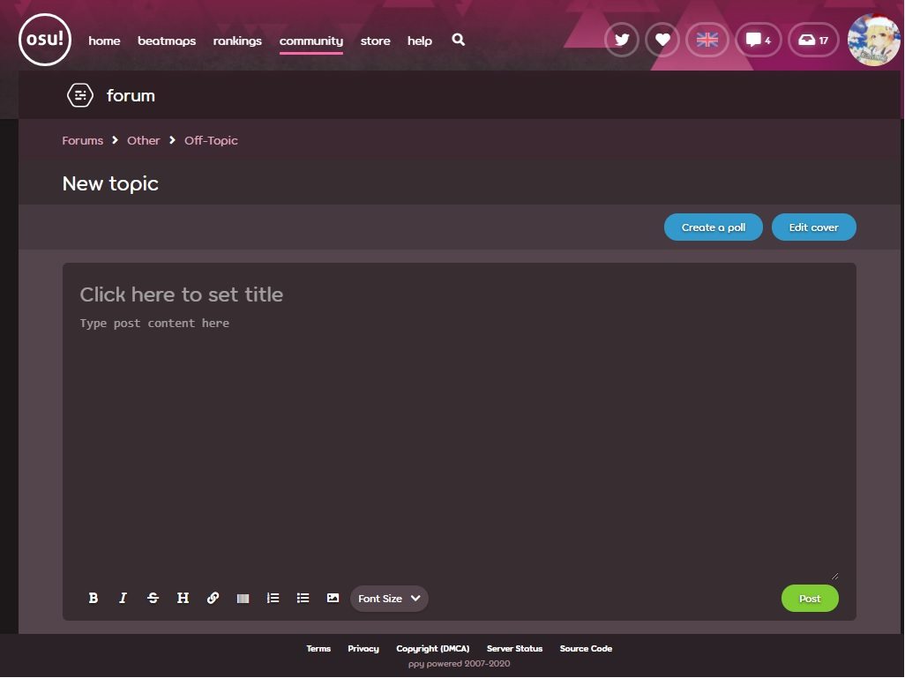

# BBCode



BBCode란 오스 포럼에서 사용되며, 더 넓게는 rich text formatting을 가능하게 하기 위해 대개의 온라인 포럼에서 사용되는 마크업 용어입니다. 텍스트를 감싸는 tag들과 attribute들로 이루어져 있죠.

osu!web에서 BBCode는 포럼 글, 시그니처와 유저페이지에 사용됩니다.

## 알아 둘 것

글쓰기 에디터 화면이 글을 포맷하기 위한 간단한 도구들을 제공해주긴 하지만, BBCode는 직접 사용자가 수동으로 작성할 수도 있습니다.

BBCode에 사용되는 tag들은 대소문자 구분이 없습니다.

### BBCode 버튼 사용 이해

아무 텍스트도 선택하지 않은 채 BBCode 버튼을 누르면 글쓰기 화면에 커서가 위치한 곳 양쪽으로 tag가 생성됩니다.

글쓰기 화면에 텍스트를 선택 한 후 BBCode 버튼을 누르면 tag가 선택된 텍스트 양면에 자동으로 생성됩니다.

### 여러 tag들 합쳐 사용하기

더더욱 화려한 연출을 위해 여러 가지 tag들을 섞어 사용할 수 있습니다.

이렇게 여러 tag들을 사용할 때 중요한 것은, 꼭 tag들이 열린 순서에 맞게 닫히도록 나열해주세요.
순서에 맞지 않게 tag들을 나열하거나 닫은 경우 해당 글의 포맷팅 또는 포럼의 해당 페이지에 버그가 생기는 불상사가 발생할 수 있습니다.

예를 들면 (tag들의 순서에 주목해주세요):

- `[centre]` `[b]` *text* `[/b]` `[/centre]` 는 순서에 맞게 나열되었지만
- `[b]` `[centre]` *text* `[/b]` `[/centre]` 는 순서에 맞지 않아 사용 불가합니다.

## BBCode Tag 리스트

### Bold (강조체)

단어 또는 문장을 **강조** 하거나 [기운 글꼴을 사용하는 것보다](#italic-(기울임체)) **더 강력하게** 어필하는 방법입니다.

- 사용하는 버튼: 
- 알아둘 점:
  - 너무 과다하게 사용하지 마세요.
    자주 사용하다 보면 글을 읽기에 불편하거나 글을 읽기 어려워질 수도 있습니다.
- 사용법:
  ```
  [b] ... [/b]
  ```

### Italic (기울임체)

[강조체](#bold-(강조체)) 보다 더 *약한* 방법으로 단어 또는 문장을 **강조**하는 방법입니다.

- 사용하는 버튼: 
- 알아둘 점:
  - 너무 과다하게 사용하지 마세요.
    자주 사용하다 보면 강조한 점이 오히려 흐지부지 될 수 있습니다.
- 사용법:
  ```
  [i] ... [/i]
  ```

### Underline (밑줄)

단어 또는 문장 밑에 **밑줄을** 긋습니다.

- 사용하는 버튼: *없음*
- 알아둘 점:
  - 너무 과다하게 사용하지 마세요.
    자주 사용하다 보면 글을 읽기에 불편하거나 글을 읽기 어려워질 수도 있습니다.
- 사용법:
  ```
  [u] ... [/u]
  ```

### Strike (취소선)

단어 또는 문장의 중앙에 **취소선을** 긋습니다.

- 사용하는 버튼: 
- 알아둘 점:
  - 너무 과다하게 사용하지 마세요.
    자주 사용하다 보면 글을 읽기에 불편하거나 글을 읽기 어려워질 수도 있습니다.
- 사용법:
  ```
  [strike] ... [/strike]
  ```

### Colour (색상)

*BBCode에서는 해당 "Color" 철자를 사용합니다.*

텍스트에 **색상을** 입힙니다.

- 사용하는 버튼: *없음*
- 알아둘 점:
  - 색상 파레트는 텍스트 에디터의 오른쪽에 위치해 있습니.
  - 너무 과다하게 사용하지 마세요.
    자주 사용하다 보면 글을 읽는 사용자분들이 눈의 불편함을 호소할 수 있습니다.
    이 기능을 아무렇게나 사용한다면 글을 읽지 못하는 사태가 발생할 수도 있습니다.
  - 색깔을 정한다면, 바탕화면과 구분이 확실히 가는 색상을 선택해 모든 사람들이 읽을 수 있도록 배려해 줍시다.
  - `#HEXCODE` 인자를 사용할 때에는 작은따옴표를 포함하지 않아야 합니다.
- 사용법:
  - `#HEXCODE`가 색깔의 헥스갋이거나 색깔 이름일 때,
    - 헥스값이라면 `#`로 시작하며 여섯 글자(0 - 9, A - F)를 포함해야 하고,
    - 색깔 이름이라면 html에 존재하는 색깔 이름이어야 합니다.
  ```
  [color=#HEXCODE] ... [/color]
  ```

색상의 리스트를 보시려면 [이 X11 color names 리스트를](https://ko.wikipedia.org/wiki/X11_색_이름#색_이름_목록) 참조하시기 바랍니다.

### Font Size (텍스트 크기)

텍스트 크기를 조절합니다.

- 사용하는 버튼: 
- 알아둘 점:
  - 너무 과다하게 사용하지 마세요.
  - 사용할 수 있는 사이즈는 다음 네 가지로 제한되어 있습니다.
    - `50` (tiny)
    - `85` (small)
    - `100` (normal; default)
    - `150` (large)
  - 만약에 위의 값이 아닌 다른 값을 입력한다면 디폴트 (기본) 텍스트 크기로 자동 변환됩니다.
  - `NUMBER` 인자는 작은따옴표를 포함하지 않아야 합니다.
- 사용법:
  - `NUMBER`가 해당 (`50`, `85`, `100`, or `150`) 사이즈 일 때.
  ```
  [size=NUMBER] ... [/size]
  ```

### Spoiler (스포일러)

*[스포일러 상자](#spoilerbox-(스포일러-박스))와 헷갈리지 않도록 주의해주세요.*

**검은 바탕으로** 텍스트를 감쌉니다.

이 기능은 티비쇼나 영화, 애니메이션에서의 중요한 씬에 대해 토론하고 싶지만 해당 회차를 아직 시청하지 않은 사용자들에게 스포일러를 하지 않고 싶을 때 사용하는 기능입니다.
글의 독자들은 이 기능을 사용한 텍스트를 드래그하여 선택해 안의 글씨를 읽을 수 있습니다.

- 사용하는 버튼: *없음*
- 알아둘 점:
  - 해당 기능과 함께 [색상](#colour-(색상)) tag를 사용한다면, 해당 tag가 사용된 글씨는 검은 바탕에 띄워지게 됩니다.
- 사용법:
  ```
  [spoiler] ... [/spoiler]
  ```

### Spoilerbox (스포일러 박스)

*[박스](#box-(박스)) 또는 [스포일러](#spoiler-(스포일러))와 헷갈리지 않도록 주의해주세요.*

글을 읽고 있는 사용자가 바로 읽지 못하도록 미리 이름이 정해져 있는 상자 속에 **문장을 숨깁니다**.
해당 글을 읽고 있는 사용자는 이 스포일러 박스를 클릭해 숨겨진 문단을 연 후 속에 있는 문장들을 읽을 수 있습니다.

- 사용하는 버튼: 
- 알아둘 점:
  - 아래의 방법으로 만든 스포일러 박스는 `collapsed text`라는 이름을 가진 [박스](#box-(박스))를 생성할 것입니다.
- 사용법:
  ```
  [spoilerbox]
  ...
  [/spoilerbox]
  ```

### Box (박스)

*[스포일러 박스](#spoilerbox-(스포일러-박스))와 헷갈리지 않도록 주의해주세요.*

 글을 읽는 사용자가 바로 읽지 못하도록 글쓴이가 직접 이름을 지은 상자 속에 **문장을 숨깁니다**.
해당 글을 읽고 있는 사용자는 이 박스를 클릭해 숨겨진 문단을 연 후 속에 있는 문장들을 읽을 수 있습니다.

이 상자들은 대개 크기가 큰 사진들 또는 여러 장의 사진들을 넣기 위해 사용합니다. 상자 안에 사진을 넣어 닫아 두면 데이터를 사용중이거나 인터넷이 느린 사용자들이 불편함 없이 글을 볼 수 있기 때문이죠.

- 사용하는 버튼: *없음*
- 알아둘 점:
  - 기본적으로, 이 tag는 제목이 없는 상자를 생성할 것입니다.
    - 혹시 `NAME` 부분을 공백으로 남겨놓는다면, 상자를 열기 위한 손잡이 부분이 매우 얇아지게 됩니다. (상자를 열기 어려워질 수 있어요)
  - `NAME` 인자는 작은따옴표를 포함하지 않아야 합니다.
  - `NAME` 인자는 띄어쓰기를 포함해도 됩니다.
- 사용법:
  - `NAME`이 상자의 이름일 때
  ```
  [box=NAME]
  ...
  [/box]
  ```

### Quote (인용)

단어 혹은 문장을 인용 할 떄.

- 사용하는 버튼: *없음*
- 알아둘 점:
  - 누군가를 인용한다면 해당 글의 글쓴이를 포함하는 것도 좋겠죠. (`NAME` 인자를 사용하면 된답니다).
  - `NAME` 인자는 **꼭** 큰따옴표를 사용하도록 해요.
  - 게시판에서는 자동으로 해당 글을 인용해주는 버튼이 있습니다. 각 게시글의 오른쪽 아래에 있는 보라색 "Quote" 버튼을 누르면 해당 게시글을 바로 인용할 수 있는 화면으로 이동합니다.
    - 만약에 이렇게 하여 인용을 했다면 해당 인용글이 사용자분이 게시한 글(`Post`를 눌러 게시한 글)에 자동으로 인용되게 됩니다.
- 사용법:
  - `NAME`이 인용한 사용자의 이름일 때 (**무조건** 큰따옴표에 둘러싸여 있어야 함).
  ```
  [quote=NAME]
  ...
  [/quote]
  ```

### Code (코드)

해당 텍스트를 일정한 공백을 갖고있는 폰트로 바꾸어 회색 상자 안에 넣습니다.
스토리보드를 위한 코드나 어떤 프로젝트의 소스코드를 게시할 때 사용하기 좋은 tag입니다.

- 사용하는 버튼: *없음*
- 알아둘 점:
  - 이 기능은 화이트스페이싱(공백)을 유지하므로, 사용자가 직접 엔터를 쳐 줄바꿈을 하기 전에는 자동으로 줄바꿈을 해주지 않습니다.
  - 가로로 너무 긴 줄은 (화면에서 벗어나는 길이를 가진 텍스트는) 가로로 된 스크롤 가능한 화면을 만듭니다.
- 사용법:
  ```
  [code]
  ...
  [/code]
  ```

### Centre (중심)

문단을 중심에 맞게 포맷팅 해주는 tag입니다. 주로 제목 또는 소제목에 사용합니다.

- 사용하는 버튼: *없음*
- 알아둘 점:
  - tag의 철자가 `center`가 아닌 `centre`이어야 하는 것에 유의합시다. (마지막 두 글자가 다릅니다).
- 사용법:
  ```
  [centre]
  ...
  [/centre]
  ```

### URL (링크)

링크를 추가합니다.

링크에 딱히 부가 설명 또는 이름을 포함하고 싶지 않다면 이 tag를 사용하지 않아도 됩니다.
게시글에 URL 링크만 붙여넣고 (tag 없이) 글을 게시한다면 오스 포럼에서는 자동으로 해당 링크를 클릭 가능하게 포맷팅하여 게시를 합니다.

- 사용하는 버튼: 
- 알아둘 점:
  - `LINK` 인자는 큰따옴표를 포함하지 않아야 합니다.
- 사용법:
  - `LINK`가 url 이고.
  - `TEXT`가 url주소에 알맞는 제목 또는 이름일 때,
  ```
  [url=LINK]TEXT[/url]
  ```

### Profile (프로필)

사용자의 인게임 이름(닉네임/유저네임)을 사용해 자동으로 해당 유저의 프로필을 링크해 줍니다.

이 버튼의 사용은 매우 **추천하지 않습니다**.
이 tag의 문제점은 [osu!supporter tag](/wiki/osu!supporter)를 구매하면 유저네임을 교체할 수 있다는 것에 있는데요.
이렇게 하여 유저네임을 수정하게 된다면 링크가 더이상 작동하지 않게 됩니다.

 방법 대신 해당 유저의 id 넘버를 사용하여 [URL](#url-(링크)) tag를 사용하는것을 추천드립니다.

- 사용하는 버튼: *없음*
- 알아둘 점
  - 이 방법을 사용하는 것은 비추천.
  - `USER` 인자가 꼭 있어야 합니다.
- 사용법:
  - `USER` 인자가 해당 사용자의 닉네임 일 때,
  ```
  [profile]USER[/profile]
  ```

### Google (구글)

주어진 단어의 구글 검색을 자동으로 링크해 줍니다.

- 사용하는 버튼: *없음*
- 알아둘 점:
  - 구글 검색은 개인에 맞춰져 있으므로 다른 사람에게는 다른 검색 결과가 보여질 수도 있다는 것에 유의하세요.
    - 몇몇 검색 결과는 언어 또는 지역에 따라 가려질 수도 있습니다.
- 사용법:
  ```
  [google]...[/google]
  ```

### Lucky

주어진 단어로 구글에서 *I'm Feeling Lucky* 검색을 하여 **나온 결과물의 링크**를 표시합니다.

- 사용하는 버튼: *없음*
- 알아둘 점:
  - 이 검색은 개인에 맞춰져 있으므로 다른 사람에게는 다른 검색 결과가 보여질 수도 있다는 것에 유의하세요.
    - 몇몇 검색 결과는 언어 또는 지역에 따라 가려질 수도 있습니다.
- 사용법:
  ```
  [lucky]...[/lucky]
  ```

### List (목록)

주어진 텍스트를 목록으로 자동 포맷합니다.

BBCode에는 목록을 만들기 위해 필요한 요소가 두 가지 있는데요, wrapper과 bullet이라고 합니다.
Wrapper는 목록의 베이스와 포맷팅을 담당하고 있는 것이고, bullets는 해당 목록에 들어있는 요소들이죠.

- 사용하는 버튼:
  - List (목록) : 
  - List bullet (목록 요소): *없음*
  - List type (목록 종류) : *없음*
- 알아둘 점:
  - 모든 요소들은 **무조건** 목록/목록 종류 (list/list type) tag들에 둘러싸여 있어야 합니다.
  - 아래의 목록은 `TYPE`에 사용할 수 있는 인자들 입니다.
    - *(공백)* - 검은 네모
    - `1` - 숫자로 된 목록
    - `a` - 소문자로 된 목록
    - `A` - 대문자로 된 목록
    - `i` - 로마 숫자(소문자)로 된 목록
    - `I` - 로마 숫자(대문자)로 된 목록
  - 기본으로, 목록은 검은 네모를 기준으로 사용합니다.
  - 목록 속에 목록을 만드는 건 버그가 있기로 알려져 있습니다. 사용하지 않는 것을 추천드립니다.
- 사용법:
  - `TYPE`은 위에 나열 된 종류 중 하나이며
  - `TYPE`이 공백이라면 나열을 위해 문자 또는 숫자 대신 검은 네모가 사용 될 것입니다.
  ```
  [list=TYPE]
  [*]...
  [/list]
  ```

### Image (이미지)

**인터넷에 올려진 사진을 표시합니다**.

이미지의 링크가 존재하는 한 아무 곳에서나 이미지를 가져와도 됩니다.

**로컬 사용자의 파일 경로를 복사해 붙히지 마세요.**
`C:\Users\Name\Pictures\image.jpg`를 사용하면 **안됩니다**.

[imgur](https://imgur.com) 또는 [puush](https://puush.me)같은 안전한 이미지 공유용 사이트에 이미지를 업로드 한 후, 성공적으로 게시되었는지 확인 한 후 게시된 사진의 링크를 복사해 (이 링크들은 대개 .png 또는 .jpg로 끝납니다.) 이미지 tag 사이에 붙여넣기 하면 됩니다.

몇 사이트들은 *핫링크* 라고도 알려진, 외부에서 자신의 사이트 이미지에 직접 엑세스 하는것을 꺼려 할 때도 있습니다.
그렇기 때문에 위에 제공된 것과 같은 사진 공유용 사이트를 사용하는것을 추천드립니다. 사진 공유용 사이트는 사진을 공유하기 위해 만들어진 사이트이니까요.

- 사용하는 버튼: 
- 알아둘 점:
  - 사진이 여러장이거나 사이즈가 크다면 [박스](#box-박스)속에 넣는 것을 추천합니다.
- 사용법:
  - `LINK`가 어떠한 사진의 URL일 때,
  ```
  [img]LINK[/img]
  ```

### Youtube

게시글에 YouTube 동영상을 포함합니다.

- 사용하는 버튼: *없음*
- 알아둘 점:
  - 유튜브 영상이 여러개일 때는 [박스](#box-박스) 속에 넣는 것을 추천합니다.
- 사용법:
  - `YT-ID`가 어떠한 YouTube 영상 ID일 때 (11글자),
    - 이것은 URL 전체를 뜻하는 것이 **아닙니다**.
    - YouTube 영상 ID 는 URL에서 `?v=` 이후에 적혀 있습니다.
  ```
  [youtube]YT-ID[/youtube]
  ```

### Heading (v1) (헤딩: v1)

크고 아름다운 분홍색 제목을 만들어 냅니다.
게시글에서 새로운 섹션을 나누고 싶을 때 주로 사용되죠.

- 사용하는 버튼: 
- 알아둘 점:
  - 사용자가 tag를 직접 입력해야 합니다.
- 사용법:
  ```
  [heading]...[/heading]
  ```

### Heading (v2) (헤딩: v2)

크고 아름다운 보라색 제목을 만들어 냅니다.
게시글에서 새로운 섹션을 나누고 싶을 때 주로 사용되죠.

- 사용하는 버튼: *없음*
- 알아둘 점:
  - 해당 기능은 비트맵 포럼에서만 사용가능합니다!
  - 이 제목은 게시글을 올렸을 때에만 보입니다 (미리보기로는 볼 수 없습니다.)
  - 사용자가 tag를 직접 입력해야 합니다.
- 사용법:
  ```
  [...]
  ```

### Notice (공지)

문단을 하얀 상자 안에 넣습니다.

- 사용하는 버튼: *없음*
- 알아둘 점:
  - 사용자가 tag를 직접 입력해야 합니다.
- 사용법:
  ```
  [notice]
  ...
  [/notice]
  ```

## Trivia (기타)

- 해당 글 원본: [Stefan](https://osu.ppy.sh/users/626907)의 [HOW TO: Forum BBCodes](https://osu.ppy.sh/community/forums/topics/445599)
