# BBCode

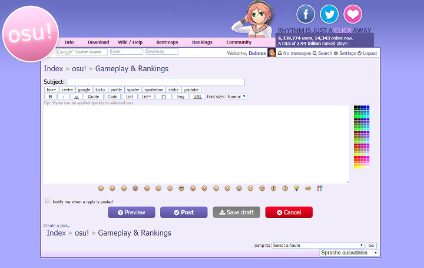

**BBCode** é uma sintaxe de marcação que é usada nos fóruns do osu! e, em um contexto maior, na grande maioria de fóruns da internet. Seu intuito é de habilitar a formatação do texto em RTF (Rich Text Formatting).
Ele é composto por tags que rodeiam excertos do texto para enriquecê-lo com propriedades e atributos.

No osu!web, BBCode é utilizado nas postagens dos fóruns, assinaturas e páginas de usuários.

## Avisos

Embora o editor de postagens ofereça algumas ferramentas de formatação básicas, também é possível escrever manualmente a sintaxe do BBCode.

As tags do BBCode são fazem distinção com letras maiúsculas ou minúsculas (ou seja, são case-insensitive).

### Comportamento de Botões do BBCode

Quando não há algum texto selecionado, clicar o botão irá cercar as tags em volta da posição atual do cursor de texto no editor da postagem.

Quando há algum texto selecionado no editor de postagem, clicar no botão irá cercar as tags ao redor do texto selecionado.

### Combinando tags

Tags podem ser combinadas para uma formatação mais rica/sofisticada.

A ordem/aninhamento das tags **precisam** ser respeitados quando combinadas. Falhar ao se adequar às regras pode quebrar a formatação da postagem.

Por exemplo (preste atenção à ordem do código):

- `[centre]` `[b]` _text_ `[/b]` `[/centre]` está correto, mas
- `[b]` `[centre]` _text_ `[/b]` `[/centre]` está errado.

## Lista de Tags do BBCode

### Negrito

**Enfatizar** palavras ou um parágrafo inteiro de uma maneira **mais pesada** do que [itálicos](#italic).

- Botão dedicado: 
- Avisos:
  - Use com cautela.
    Uso excessivo pode causar desconforto e tornar a postagem mais difícil de se ler.
- Sintaxe:
```prolog
[b] ... [/b]
```

### Itálico

**Enfatizar** palavras ou um parágrafo inteiro de uma maneira _mais leve_ do que [negritos](#bold).

- Botão dedicado: 
- Avisos:
  - Use com cautela.
    Uso excessivo irá enfraquecer a efetividade da ênfase.
- Sintaxe:
```prolog
[i] ... [/i]
```

### Underline

**Desenha uma linha abaixo** da(s) palavra(s) ou um parágrafo inteiro.

- Botão dedicado: 
- Avisos:
  - Use com cautela.
    Uso excessivo pode causar desconforto e tornar a postagem mais difícil de se ler.
- Sintaxe:
```prolog
[u] ... [/u]
```

### Strike

_Também conhecido como **strikethrough**._

**Desenha uma linha horizontal através do meio** de palavra(s) ou um parágrafo inteiro.

- Botão dedicado: 
- Notes:
  - Use com cautela.
    Uso excessivo pode causar desconforto e tornar a postagem mais difícil de se ler.
- Sintaxe:
```prolog
[strike] ... [/strike]
```

### Coloração

_BBCode chama isso de "Color"._

**Adiciona coloração** a algum texto.

- Botões dedicados:

- Avisos:
  - A Caixa de Cores está localizada ao lado direito da caixa de texto.
  - Use essa tag com cautela.
    Uso excessivo causará desconforto nos olhos do leitor.
    Uso incorreto tornará o seu texto ilegível.
  - Se você escolher uma cor assegure que existe um contraste com o plano de fundo, para que assim todos consigam ler.
  - O argumento `HEXCODE` não deve usar apóstrofos.
- Sintaxes:
  - Onde `HEXCODE` é um código da cor em hexadecimal ou nome da cor.
    - Para hexadecimais, deverá começar com `#`, seguido de seis caracteres hexadecimais (0 - 9, A - F).
    - Para nomes de cores, precisará ser uma cor válida em HTML.
```prolog
[color=HEXCODE] ... [/color]
```

Para a lista de nomes de cores, veja [X11 color names](https://en.wikipedia.org/wiki/X11_color_names#Color_name_chart).

### Tamanho da fonte

Ajusta o tamanho do texto relativamente.

- Botões dedicados:
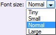
- Avisos:
  - Use essa tag com cautela.
  - Só existem quatro tamanhos que você pode user:
    - `50` (minúsculo)
    - `85` (pequeno)
    - `100` (normal; padrão)
    - `150` (largo)
  - Se você inserir um valor que não está listado acima, o tamanho utilizado será o padrão.
  - O argumento `NUMBER` não deve usar apóstrofos.
- Sintaxe:
  - Onde `NUMBER` é um dos valores citados acima (`50`, `85`, `100` ou `150`).
```prolog
[size=NUMBER] ... [/size]
```

### Spoiler

_Não deve ser confundido com [Spoilerbox](#spoilerbox)._

**Esconde o texto** com um fundo preto.

Isso pode ser útil se você estiver falando sobre uma cena crítica em um programa de TV, filme ou anime e não queira dar spoiler para os outros.
O leitor, de qualquer forma, ainda poderá ler o texto ao selecioná-lo com um mouse.

- Botão dedicado: 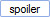
- Avisos:
  - Se você utilizar a tag de [Coloração](#coloração) em conjunto com essa, a cor será utilizada no texto com um fundo preto.
- Sintaxe:
```prolog
[spoiler] ... [/spoiler]
```

### Spoilerbox

_Não deve ser confundido com [Caixa](#box) ou [Spoiler](#spoiler)._

**Esconde um parágrafo**, na perspectiva do leitor, dentro de uma caixa pré-nomeada.
O leitor ainda poderá, de qualquer forma, ler o parágrafo ao clicar na Spoilerbox para alternar a visualização do parágrafo oculto.

- Botão dedicado: 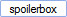
- Avisos:
  - Isso criará uma [Caixa](#box) com o cabeçalho de um `texto colapsado`.
- Sintaxe:
```prolog
[spoilerbox]
...
[/spoilerbox]
```

### Caixa

_Não deve ser confundido com [Spoilerbox](#spoilerbox)._

**Esconde o parágrafo**, na perspectiva do leitor, dentro de uma caixa nomeável.
O leitor, de qualquer forma, ainda poderá ler o parágrafo ao clicar na caixa para alternar a visualização do parágrafo oculto.

Elas são geralmente usadas para esconder imagens grandes ou uma grande quantidade de imagens.

- Botão dedicado: 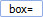
- Avisos:
  - Por padrão, o botão criará uma caixa sem texto de cabeçalho.
    - Se você optar por deixar o argumento `NAME` em branco (ou não incluir ele), a altura da caixa ficará muito pequena!
  - O argumento `NAME` não deverá usar apóstrofos.
  - O argumento `NAME` não pode conter espaços.
- Sintaxe:
  - Onde `NAME` é o nome da caixa.
```prolog
[box=NAME]
...
[/box]
```

### Citação

Formata a palavra/parágrafo como citação.

- Botão dedicado: 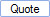
- Avisos:
  - É recomendado que se inclua o nome do autor da citação, caso você esteja citando alguém (use o argumento `NAME`).
  - O argumento `NAME` **precisa** usar apóstrofos.
  - Existe um botão de citação por postagem (canto baixo-direito) que irá automaticamente citar o texto de um usuário.
    - Se fizer isso, a postagem também incluirá a citação do texto quando você a enviar (clicando em `Post`).
- Sintaxe:
  - Onde `NAME` é o nome para a caixa (**precisa** ser cercado com apóstrofos).
```prolog
[quote=NAME]
...
[/quote]
```

### Código

Formata o texto com uma fonte da família monospaced e o coloca dentro de uma caixa cinza.
É útil quando você está postando o código de uma storyboard ou código-fonte de algum projeto.

- Botão dedicado: 
- Avisos:
  - Os espaços em branco do texto serão preservados, o que significa que todas as quebras de linha não funcionarão a não ser que você mesmo faça isso.
  - Linhas de texto que ultrapassem o tamanho da postagem habilitarão uma barra de rolagem horizontal.
- Sintaxe:
```prolog
[code]
...
[/code]
```

### Centralizar

Centraliza o alinhamento de um parágrafo; isso é tipicamente usados para títulos ou cabeçalhos.

- Botões dedicados: 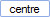
- Avisos:
  - As tags **precisam** ser escritas como `centre` e não `center` (preste atenção às duas últimas letras das palavras).
- Sintaxe:
```prolog
[centre]
...
[/centre]
```

### URL

Adiciona um hyperlink.

Você não precisa utilizar essa tag caso não queira utilizar um texto específico para o link.
Os fóruns do osu! automaticamente criarão um link para URLs inseridas em uma postagem.

- Botão dedicado: 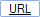
- Avisos:
  - O argumento `LINK` não deve usar apóstrofos.
- Sintaxe:
  - Onde `LINK` é o URL.
  - Onde `TEXT` é o texto do link.
```prolog
[url=LINK]TEXT[/url]
```

### Perfil

Cria um link para o perfil do usuário, utilizando o nome do usuário como texto.

A utilização desse botão é **altamente desencorajada**!
O problema em utilizar essa tag é que os nomes dos usuários pode ser mudados quando eles obtêm a [osu!supporter tag](/wiki/osu!supporter).
Uma vez que eles o façam, o seu link irá quebrar.

É recomendado que se use o [URL](#url) ao invés dele (utilizando o ID do usuário).

- Botão dedicado: 
- Avisos:
  - Não recomendado!
  - O argumento `USER` **tem** que ser definido.
- Sintaxe:
  - Onde `USER` é o nome do usuário.
```prolog
[profile]USER[/profile]
```

### Google

Automaticamente cria um link para uma pesquisa do Google utilizando o texto providenciado.

- Botão dedicado: 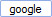
- Avisos:
  - Saiba que a pesquisa não irá retornar os mesmos resultados para todo mundo; alguns resultados da pesquisa podem não ser mostrados devido à linguagem ou localização.
- Sintaxe:
```prolog
[google]...[/google]
```

### Lucky

**Adiciona o link direto para uma página** utilizando a funcionalidade *Estou com sorte* do Google com o texto providenciado.

- Botão dedicado: 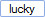
- Avisos:
  - Saiba que a pesquisa não irá retornar os mesmos resultados para todo mundo; alguns resultados da pesquisa podem não ser mostrados devido à linguagem ou localização.
- Sintaxe:
```prolog
[lucky]...[/lucky]
```

### Lista

Formata o texto em uma lista.

No BBCode, existem duas partes na construção de uma lista: o contêiner e os marcadores dos itens. Os marcadores são inseridos dentro do contêiner.

- Botões dedicados:
  - List: 
  - List type: 
  - List bullet: 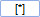
- Avisos:
  - Todos os marcadores devem ser cercados com tags do tipo LIST.
  - Estes são os valores válidos para o argumento `TYPE`:
    - _(empty)_ - pontuada
    - `1` - numerada
    - `a` - letrada (em minúsculo)
    - `A` - letrada (em maiúsculo)
    - `i` - numerada em romano (em minúsculo)
    - `I` - numerada em romano (em maiúsculo)
  - Por padrão, listas utilizam marcadores como pontos quadrados.
  - Listas inseridas dentro de listas podem ficar bugadas.
- Sintaxe:
  - Onde `TYPE` é um dos tipos de lista citados acima.
  - Se um `TYPE` não for definido, a marcação padrão será utilizada.
```prolog
[list=TYPE]
[*] ITEM
[*] ITEM...
[/list]
```

### Imagem

**Mostra umaa imagem de alguma fonte online**.

As imagens podem ser mostradas de qualquer fonte, desde que ela realmente exista na URL providenciada.

**Não tente linkar uma imagem diretamente do seu computador**
Por exemplo, utilizar `C:\Users\Name\Pictures\image.jpg` **não irá funcionar**!

Por favor, envie as suas imagens para sites de compartilhamento de imagens bem conceituados como o  [imgur](https://imgur.com/ "imgur") or [puush](https://puush.me/ "puush").
Uma vez que a imagem seja enviada com sucesso, copie e cole o link direto entre as tags `LINK`.

Note também que alguns sites não gostam de links diretos para as imagens deles (também conhecidos como _hotlinks_).
Sites específicos para compartilhamento de imagens, como os que foram citados no parágrafo acima, provavelmente permitirão links diretos.

- Botão dedicado: 
- Avisos:
  - Se a sua imagem for grande ou se você tiver muitas imagens, é recomendado que você as coloque dentro de uma [Caixa](#box).
- Sintaxe:
  - Onde `LINK` é um link direto para a imagem.
```prolog
[img]LINK[/img]
```

### Youtube

Insere um vídeo do Youtube na sua postagem.

- Botão dedicado: 
- Avisos:
  - Se você tiver muitos vídeos, é recomendado que os coloque dentro de uma [Caixa](#box).
- Sintaxe:
  - Onde `YT-ID` é somente o ID do vídeo (11 characters long), **não** a URL toda!
    - O ID do vídeo pode ser encontrado após o parâmetro `?v=` na URL.
```prolog
[youtube]YT-ID[/youtube]
```

### Cabeçalho (v1)

Adiciona um cabeçalho grande bem chique e rosa.
Isso geralmente é utilizado para denotar uma nova seção na sua postagem.

- Botão dedicado: _não tem_
- Aviso:
  - Você precisa inserir a sintaxe manualmente por digitação.
- Sintaxe:
```prolog
[heading]...[/heading]
```

### Cabeçalho (v2)

Adiciona um cabeçalho grande bem chique e roxo, com uma linha horizontal.
Isso geralmente é utilizado para denotar uma nova sub-seção na sua postagem.

- Botão dedicado: _não tem_
- Avisos:
  - Isso só funciona em fóruns de beatmaps!
  - Aparece **somente após a postagem** e não no modo de preview.
  - Você precisa inserir a sintaxe manualmente por digitação.
- Sintaxe:
```prolog
[...]
```

### Alerta

Coloca o parágrafo dentro de uma caixa branca.

- Botão dedicado: _não tem_
- Avisos:
  - Você precisa inserir a sintaxe manualmente por digitação.
- Sintaxe:
```prolog
[notice]
...
[/notice]
```

## Conhecimentos gerais

- Postagem original no fórum: [HOW TO: Forum BBCodes](https://osu.ppy.sh/community/forums/topics/445599) por [Stefan](https://osu.ppy.sh/users/626907)
