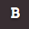
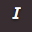
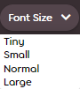

# BBCode

**BBCode** — это [язык разметки](https://ru.wikipedia.org/wiki/Язык_разметки), который используется на большинстве интернет-форумов. Он позволяет менять стиль текста или добавлять функциональные элементы с помощью специальных меток, или тегов (англ. *tag*). BBCode применяется для оформления текста в различных местах веб-сайта osu!: в постах и подписях на форуме, на юзерпейдже и в описании карт.


## Механизм работы

При нажатии на одну из кнопок разметки вокруг курсора появятся открывающий и закрывающий теги. Если перед нажатием на кнопку в редакторе выделить текст, теги появятся вокруг него.

Если необходимо применить несколько тегов сразу, можно «вложить» их один в другой. Теги при этом должны **закрываться в обратном порядке**, иначе форматирование сломается. Примеры:

- `[centre][b]текст[/b][/centre]` — правильно
- `[b][centre]текст[/b][/centre]` — неправильно

## Выравнивание

Теги выравнивания задают, как текст и другие элементы BBCode располагаются по горизонтали. Если использовать их внутри `[quote]` или вокруг него, то текст цитаты выровняется, а вот вертикальная черта останется слева.

### По левому краю

```
[left]текст[/left]
```

Тег `[left]` выравнивает содержимое по левому краю (по умолчанию всё и так выровнено влево).

### По центру

```
[centre]текст[/centre]
```

Тег `[centre]` выравнивает содержимое по центру. Чаще всего так оформляют заголовки, названия или стихотворные фрагменты.

### По правому краю

```
[right]текст[/right]
```

Тег `[right]` выравнивает содержимое по правому краю.

## Теги

Все теги BBCode заключены в квадратные скобки (`[]`). Эффект, связанный с каким-либо тегом, начинает действовать после его упоминания и заканчивается в момент появления закрывающего тега с таким же именем, перед названием которого есть слэш (`/`).

Помимо этого, у некоторых тегов есть параметры, которые задаются после знака равенства (`=`).

Ниже приведён список тегов BBCode, разрешённых на сайте osu!.

### Полужирный

```
[b]текст[/b]
```

Тег `[b]` используется для изменения начертания шрифта на полужирное. Он не изменяет размер шрифта.

Кнопка: 

### Курсив

```
[i]текст[/i]
```

Тег `[i]` придаёт тексту начертание курсива, чуть наклоняя его.

Кнопка: 

### Подчёркивание

```
[u]текст[/u]
```

Тег `[u]` рисует под текстом горизонтальную черту, толщина которой также зависит от начертания шрифта.

### Зачёркивание

```
[s]текст[/s]
```

Тег `[s]` перечёркивает текст по горизонтали. Вместо него можно использовать `[strike]` — это одно и то же.

Кнопка: 

### Цвет шрифта

```
[color=#HEXCODE]текст[/color]
```

::: alert-note
**См. также:** [Список цветов в X11](https://ru.wikipedia.org/wiki/Список_цветов_в_X11#Список_цветов_[2])
:::

Тег `[color]` изменяет цвет текста. Сам цвет задаётся либо [шестнадцатеричным кодом](https://ru.wikipedia.org/wiki/Цвета_HTML#Hex_triplet), либо ключевым словом вроде `red` или `green`, которые нужно подставить в примере вместо `#HEXCODE`. Кавычки в параметре использовать не нужно.

Если цвет не задан, то тег не подействует и будет работать как обычный текст.

### Размер шрифта

```
[size=NUMBER]текст[/size]
```

Тег `[size]` изменяет размер шрифта.

Параметр `NUMBER` задаёт размер в процентах от стандартного (100%): при значении `50` текст станет вдвое меньше, а при `150` — в полтора раза больше. Кавычки в параметре использовать не нужно. Само значение может быть двух видов:

- целое число от 30 до 200;
- одно из четырёх ключевых слов: «tiny», «small», «normal» или «large», что соответствует 50, 85, 100 и 150.

Если значение указано неверно, то тег не подействует.

Для четырёх указанных выше размеров на панели разметки имеется отдельная кнопка.

Кнопка: 

### Спойлер

::: alert-note
**Примечание:** не путать со [спойлербоксом](#спойлербокс).
:::

```
[spoiler]текст[/spoiler]
```

Тег `[spoiler]` скрывает текст с помощью чёрного фона. Чтобы прочитать скрытый текст, выделите его курсором. Если использовать этот тег внутри [`[color]`](#цвет-шрифта), то текст изменит цвет, но фон у него будет по-прежнему чёрного цвета.

Спойлеры часто используют для скрытия важной сюжетной информации о сериалах, фильмах, книгах и т.д., а также для создания комического эффекта, построенного на внезапности.

### Контейнер

::: alert-note
**Примечание:** не путать со [спойлербоксом](#спойлербокс).
:::

```
[box=NAME]
текст
[/box]
```

Тег `[box]` используется для скрытия текста и изображений в контейнере, который открывается по клику.

Название контейнера задаётся аргументом `NAME` и показывается на самом контейнере. Если название не указано, контейнер можно будет открыть, только кликнув по стрелке слева. Если в названии есть несколько пробелов подряд, они будут оставлены как есть. Кавычки в параметре использовать не нужно.

Контейнеры часто используют для того, чтобы улучшить читаемость поста и ограничить его размер — например, при составлении FAQ или анонсировании [скинов](/wiki/Skinning).

::: alert-notice
**Внимание**
Кнопка, создающая контейнер, называется «spoiler box», но не использует тег `[spoilerbox]`.
:::

Кнопка: 

### Спойлербокс

```
[spoilerbox]текст[/spoilerbox]
```

*Спойлербокс* — особый вид контейнера, где в качестве имени используется слово `SPOILER`. Для его создания используется отдельный тег, но функциональность полностью повторяет обыкновенные [контейнеры](#контейнер).

### Цитата

```
[quote="NAME"]
текст
[/quote]
```

Тег `[quote]` применяется при цитировании: слева от выделенного текста рисуется вертикальная черта и добавляется отступ. Саму цитату необходимо поместить между открывающим и закрывающим тегами. Для упоминания имени автора можно использовать необязательный аргумент `NAME`.

::: alert-notice
**Внимание**
При замене аргумента `NAME` кавычки обязательны (`"`).
:::

На форумах osu! цитаты чаще всего используются для ответа на чей-то пост. Их можно добавить автоматически с помощью кнопки `Quote reply`, расположенной справа вверху у каждого поста и видной **только** при наведении курсора на эту область.

Кнопка ответа с цитированием: 

### Код

::: alert-note
**Примечание:** не путать с [фрагментом кода](#фрагмент-кода).
:::

```
[c]текст[/c]
```

Тег `[c]` включает моноширинный шрифт и меняет цвет фона текста на серый. В противовес [фрагменту кода](#фрагмент-кода), этот тег работает только с текстом, набранным в одну строку.

На форумах osu! кодом часто обозначаются сочетания клавиш, подписи в интерфейсах и тому подобные вещи.

### Фрагмент кода

::: alert-note
**Примечание:** не путать с [кодом](#код).
:::

```
[code]
текст
[/code]
```

Тег `[code]` включает моноширинный шрифт. Текст, заключённый в `[code]`, будет иметь серый фон, и никакие другие теги внутри него не будут работать.

На форумах osu! в виде фрагментов кода чаще всего оформляются [сториборды](/wiki/Storyboard), а также параграфы, где необходимо подчеркнуть обязательное использование тегов.

### Ссылка

```
[url=LINK]текст[/url]
```

Тег `[url]` создаёт ссылку с указанным названием.

::: alert-notice
**Внимание**
Можно не использовать `[url]`, если название ссылки не важно: просто ссылка без тега будет работать и так.
:::

Чтобы вставить ссылку, укажите вместо параметра `LINK` адрес сайта (кавычки при этом не нужны), а между открывающим и закрывающим тегами — название ссылки. Если название не указать, ссылка отобразится неправильно.

Работает и вариант `[url]LINK[/url]`, но особого смысла в нём нет: обычные ссылки и так определяются автоматически.

::: alert-notice
**Внимание**
Любая ссылка, как с применением `[url]`, так и без, должна быть корректной и начинаться либо с протокола (`http://`, `https://`, `ftp://`), либо с `www.`, иначе она не будет работать.
:::

Кнопка: 

### Профиль

```
[profile=userid]username[/profile]
```

Тег `[profile]` создаёт ссылку на профиль в osu! по нику пользователя или по его идентификатору. В отличие от обычной ссылки, при наведении курсора появится карточка игрока.

Чтобы вставить такую ссылку, укажите вместо параметра `userid` числовой идентификатор игрока (кавычки при этом не нужны), а между открывающим и закрывающим тегами — его ник.

Лучше всего указывать и то, и другое: ссылка точно будет работать, даже если игрок потом поменяет ник, а если указать только ник, то ссылка сломается сразу после его смены.

В постах на форуме, подписях и описаниях карт сайт osu! умеет сам исправлять и обновлять тег `[profile]`, если ник неверный, или если идентификатор неверный или вообще не указан. В этом случае достаточно знать *либо* идентификатор, *либо* ник — указывать оба параметра сразу не обязательно.

::: alert-notice
**Внимание**
Идентификатор пользователя — это число после `/users/` в ссылке на его профиль.
:::

### Список

```
[list] LIST_NAME
[*]пункт 1
[*]пункт 2
[*]пункт 3
[/list]
```

либо

```
[list=TYPE] LIST_NAME
[*]пункт 1
[*]пункт 2
[*]пункт 3
[/list]
```

Тег `[list]` создаёт список (по умолчанию он будет ненумерованным). Каждый новый пункт помечается звёздочкой в квадратных скобках (`[*]`).

Если вместо `TYPE` что-нибудь указать, то список будет нумерованным.

Необязательный параметр `LIST_NAME` добавляет над списком заголовок с отступом. Если его не указать, заголовка не будет.

::: alert-notice
**Внимание**
Списки в BBCode можно вкладывать друг в друга и объединять, но форматирование в них иногда ломается.
:::

Кнопки:  

### Email

```
[email=ADDRESS]текст[/email]
```

Тег `[email]` вставляет ссылку, при нажатии на которую запустится программа для отправки почты на указанный адрес.

Чтобы вставить такую ссылку, укажите вместо параметра `ADDRESS` адрес электронной почты (кавычки при этом не нужны), а между открывающим и закрывающим тегами — название ссылки. Если название не указать, ссылка отобразится неправильно.

Работает и вариант `[email]ADDRESS[/email]`, но особого смысла в нём нет: обычные адреса и так определяются автоматически.

### Изображение

```
[img]ADDRESS[/img]
```

Тег `[img]` вставляет изображение. Вместо `ADDRESS` нужно указать **прямую** ссылку на картинку из интернета (ссылки на файлы на вашем компьютере, вроде `C:\Users\Name\Pictures\image.jpg`, работать не будут).

Чтобы найти правильную ссылку, откройте страницу с изображением, кликните по нему правой клавишей и выберите `Копировать ссылку на изображение` или пункт с похожим названием.

Источник может быть любым, но стоит учесть, что некоторые сайты могут запрещать прямые ссылки на свои изображения или со временем их удалять. Если нужно, чтобы изображение было всегда доступно, загрузите его на любой известный хостинг картинок вроде [ImgBB](https://imgbb.com).

*Примечание: сервис картинок Imgur в какой-то момент заблокировал IP-адреса сервисов osu!, поэтому новые картинки, залитые на Imgur, не будут видны на сайте.*[^imgur-blocked-ip]

Кнопка: 

### Карта изображений

```
[imagemap]
IMAGE_URL
X Y WIDTH HEIGHT REDIRECT TITLE
[/imagemap]
```

С помощью тега `[imagemap]` изображение можно разделить на несколько прямоугольных областей, у каждой из которых будет своя собственная ссылка.

Вместо `IMAGE_URL` нужно вписать ссылку на картинку, которую вы хотите использовать. Ссылка должна быть прямой.

Следующие строки описывают, как нужно разметить картинку. `X` и `Y` — это координаты верхнего левого угла прямоугольника, по которому можно будет кликнуть, а `WIDTH` и `HEIGHT` — его ширина и высота. Вместо `REDIRECT` нужно вставить ссылку (или пропустить её, указав вместо ссылки `#`), а вместо `TITLE` — указать подпись, которая будет показана при наведении курсора на область. Координаты и размеры прямоугольника (`X`, `Y`, `WIDTH` и `HEIGHT`) измеряются в процентах от общего размера картинки, сам символ процента указывать не надо.

Кнопка: 

### YouTube

```
[youtube]VIDEO_ID[/youtube]
```

Тег `[youtube]` встраивает в пост видео с [YouTube](https://youtube.com). Для этого нужно заменить `VIDEO_ID` на код видео — 11 символов, которые идут сразу после `?v=` или `&v=` в ссылке на него (ссылку целиком вставлять не нужно).

### Аудио

```
[audio]URL[/audio]
```

Тег `[audio]` добавляет [HTML5](https://ru.wikipedia.org/wiki/HTML5)-плеер, воспроизводящий аудио. Вместо `URL` нужно указать **прямую** ссылку на аудио из интернета (ссылки на файлы на вашем компьютере, вроде `C:\Users\Name\Music\audio.mp3`, работать не будут).

::: alert-warning
**Предупреждение**
Далеко не все сайты разрешают прямые ссылки на свои аудиофайлы. osu! не несёт ответственности за любые проблемы, связанные с нарушением авторских прав и вызванные использованием ссылок на аудио.
:::

### Заголовок (вариант 1)

```
[heading]текст[/heading]
```

Тег `[heading]` создаёт большой заголовок розового цвета. Такие заголовки имеют только один размер, и на них нельзя ссылаться.

Кнопка: 

### Примечание

```
[notice]
текст
[/notice]
```

Тег `[notice]` обводит параграф с текстом и помещает его в контейнер тёмного цвета.

## Устаревшие теги

Эти теги убраны с сайта osu! и больше не работают (однако имеют некоторую историческую ценность).

### Поиск Google

```
[google]поисковый запрос[/google]
```

Тег `[google]` раньше вставлял ссылку на поисковую выдачу Google по указанному запросу. Как тогда, так и сейчас поисковая выдача в разных странах и у разных пользователей отличается из-за поисковых фильтров и персонализации.

### Мне повезёт

```
[lucky]поисковый запрос[/lucky]
```

Тег `[lucky]` раньше вставлял ссылку на первый результат поисковой выдачи Google по указанному запросу, имитируя нажатие на кнопку `I'm Feeling Lucky` (в русской редакции — `Мне повезёт`). Как и в случае обычного поискового запроса, адрес первого результата у разных пользователей может отличаться.

### Заголовок (вариант 2)

```
[текст]
```

Ранее заголовок можно было создать двумя способами: как с помощью тега `[heading]`, так и путём заключения текста в квадратные скобки. Текст, оформленный вторым образом (который, к слову, действовал только в подфоруме с картами), имел пурпурный цвет и слабое свечение.

## Инструменты

Проекты, перечисленные ниже, облегчают разметку текста с помощью BBCode:

| Название | Автор | Описание |
| :-: | :-: | :-- |
| [OSUWME](https://osu.ppy.sh/community/forums/topics/2029947) | ::{ flag=ID }:: [rezzvy](https://osu.ppy.sh/users/8804560) | Редактор BBCode для юзерпейджа с мгновенным показом результата |
| [osu! BBCode Editor](https://github.com/NoelleTGS/osu-bbcode-editor) | ::{ flag=CA }:: [HonokaKousakaTV](https://osu.ppy.sh/users/18595366) | Редактор BBCode для юзерпейджа с мгновенным показом результата (проект заброшен) |
| [osu-gradient](https://osu-gradient.jgroup.top/) | ::{ flag=RU }:: [[_____________]](https://osu.ppy.sh/users/12036908) | Создание цветовых градиентов для юзерпейджа |
| [osu-web enhanced](https://osu.ppy.sh/community/forums/topics/1361818) | ::{ flag=DE }:: [RockRoller](https://osu.ppy.sh/users/8388854) | Расширение для браузера, добавляющее на сайт osu! дополнительные кнопки BBCode и другие возможности |
| [textcolorizer](https://www.stuffbydavid.com/textcolorizer) | david | Раскраска текста в BBCode и HTML |

## Заметки

- Эта статья — переработанное руководство [HOW TO: Forum BBCodes](https://osu.ppy.sh/community/forums/topics/445599) от [Stefan](https://osu.ppy.sh/users/626907).
- Когда-то при указании [цвета шрифта](#цвет-шрифта) можно было использовать слово `transparent`, делающее его прозрачным. В настоящее время эта возможность не работает (текст сохраняет белый цвет).
- До добавления тега `imagemap` к картинке можно было добавлять ссылку, комбинируя теги `url` и `img`, — но всего одну. Если требовалось создать несколько ссылок, картинку приходилось резать на индивидуальные мелкие фрагменты, а затем вставлять и размечать каждый из них отдельно.

## Ссылки

[^imgur-blocked-ip]: [Твит @ppy, 29.06.2023)](https://twitter.com/ppy/status/1674439849749913602)
