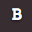
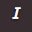
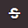
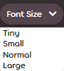
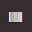
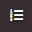

# BBCode

**BBCode** เป็น [ภาษาจัดรูปแบบ (Markup language)](https://en.wikipedia.org/wiki/Markup_language) ที่ใช้ในฟอรัมของ osu! และยังเป็นที่นิยมใช้ในฟอรัมส่วนใหญ่บนอินเทอร์เน็ต BBCode ใช้เพื่อให้สามารถจัดรูปแบบข้อความที่ซับซ้อนได้ โดยประกอบด้วยแท็ก (Tags) ที่ล้อมรอบข้อความเพื่อระบุการจัดรูปแบบ, คุณลักษณะ (Attributes), การฝังเนื้อหา (Embedding) และอื่นๆ BBCode ถูกนำไปใช้ในหลายส่วนบนเว็บไซต์ osu! เช่น โพสต์ในฟอรัม, ลายเซ็น (Signatures), หน้าโปรไฟล์ผู้ใช้ และคำอธิบายของ Beatmap


## พฤติกรรมการใช้งาน (Behaviour)

การคลิกปุ่มจัดรูปแบบโดยที่ไม่ได้คลุมแถบสีข้อความใดๆ จะเป็นการสร้างชุดแท็กเปิดและปิดขึ้นมาที่ตำแหน่งเคอร์เซอร์ในตัวแก้ไขโพสต์ หากมีการคลุมแถบสีข้อความก่อนคลิกปุ่มจัดรูปแบบ แท็กเหล่านั้นจะล้อมรอบข้อความที่เลือกไว้โดยอัตโนมัติ

สำหรับผู้ใช้ที่ต้องการผสมรูปแบบหลายอย่างเข้าด้วยกันในข้อความส่วนเดียว สามารถทำได้โดยการวางแท็ก BBCode ไว้ซ้อนข้างในกัน อย่างไรก็ตาม **ต้องรักษาสลับลำดับและการซ้อนกัน** ของแท็กเหล่านี้ให้ถูกต้อง หากทำไม่ถูกต้อง รูปแบบข้อความอาจแสดงผลผิดเพี้ยนได้

ตัวอย่างการใช้แท็กซ้อนกันที่ถูกต้องและไม่ถูกต้อง:

- `[centre][b]ข้อความ[/b][/centre]` คือสิ่งที่ **ถูกต้อง**
- `[b][centre]ข้อความ[/b][/centre]` คือสิ่งที่ **ไม่ถูกต้อง**

## แท็ก (Tags)

BBCode เช่นเดียวกับภาษาจัดรูปแบบอื่นๆ จะจัดรูปแบบข้อความโดยใช้ระบบแท็ก ซึ่งระบุด้วยวงเล็บเหลี่ยมหนึ่งคู่ (`[]`) แท็กเหล่านี้แบ่งออกเป็นแท็ก "เปิด" และแท็ก "ปิด" ซึ่งแยกแยะได้จากการมีเครื่องหมายทับ (`/`) โดยเฉพาะอย่างยิ่ง แท็กปิดจะมีเครื่องหมายทับอยู่หลังวงเล็บเปิดทันที ในขณะที่แท็กเปิดจะไม่มี

นอกจากนี้ แท็กเปิดบางชนิดอาจมีเครื่องหมายเท่ากับ (`=`) อยู่ข้างในเพื่อระบุ URL, ขนาดฟอนต์ หรือองค์ประกอบอื่นๆ

รายการแท็ก BBCode ที่รองรับบนเว็บไซต์ osu! มีรายละเอียดดังนี้:

### ตัวหนา (Bold)

```
[b]ข้อความ[/b]
```

แท็ก `[b]` ใช้สำหรับเน้นข้อความให้เด่นชัดด้วยตัวหนา การทำตัวหนาด้วย BBCode จะไม่ส่งผลต่อขนาดของฟอนต์

ปุ่มบนแถบเครื่องมือ: 

### ตัวเอียง (Italic)

```
[i]ข้อความ[/i]
```

แท็ก `[i]` ใช้สำหรับเน้นข้อความเล็กน้อยโดยการทำให้ข้อความเอียงไปด้านหน้า

ปุ่มบนแถบเครื่องมือ: 

### ขีดเส้นใต้ (Underline)

```
[u]ข้อความ[/u]
```

แท็ก `[u]` ใช้เน้นข้อความโดยการลากเส้นแนวนอนไว้ใต้ข้อความ เส้นที่ขีดจะได้รับผลกระทบจากแท็กอื่นด้วย เช่น ตัวหนาหรือตัวเอียง

### ขีดฆ่า (Strikethrough)

```
[s]ข้อความ[/s]
```

แท็ก `[s]` ใช้เพื่อระบุว่าข้อความส่วนนั้นถูกลบออกไป โดยใช้เส้นแนวนอน "ขีดฆ่า" ข้อความทับลงไป (หรือที่เรียกว่า "strike") นอกจากนี้ยังสามารถใช้คำว่า `[strike]` แทนได้เช่นกัน

ปุ่มบนแถบเครื่องมือ: 

### สี (Colour)

```
[color=#HEXCODE]ข้อความ[/color]
```

*สำหรับรายชื่อสีทั้งหมด ดูที่ [X11 color names](https://en.wikipedia.org/wiki/X11_color_names#Color_name_chart)*

แท็ก `[color]` ใช้สำหรับปรับแต่งสีของข้อความผ่านรหัสสีที่ปลอดภัยสำหรับเว็บ (Web-safe colours) โดยใช้รูปแบบ [รหัส HEX](https://en.wikipedia.org/wiki/Web_colors#Hex_triplet) หรือจะระบุผ่านชื่อสี HTML เช่น "red" หรือ "green" ก็ได้ ในการใช้งานให้เปลี่ยนส่วน `#HEXCODE` เป็นรหัสสีหรือชื่อสีที่ต้องการ

ส่วนของการระบุสีนี้ไม่ต้องใส่เครื่องหมายอัญประกาศ (`"`) และไม่มีสีพื้นฐาน (Default) หากไม่ได้ระบุสีหรือมีการใส่เครื่องหมายอัญประกาศ แท็กนี้จะไม่แสดงผลเป็น BBCode

### ขนาดฟอนต์ (Font size)

```
[size=NUMBER]ข้อความ[/size]
```

แท็ก `[size]` ใช้สำหรับปรับลักษณะของข้อความโดยการเปลี่ยนขนาดฟอนต์

ค่า `NUMBER` จะระบุเป็นเปอร์เซ็นต์เมื่อเทียบกับขนาดฟอนต์พื้นฐาน (100%) ตัวอย่างเช่น `50` จะลดขนาดข้อความลงเหลือครึ่งหนึ่งของปกติ ขณะที่ `150` จะเพิ่มขนาดเป็นหนึ่งเท่าครึ่ง ค่านี้ไม่ต้องใส่เครื่องหมายอัญประกาศและรองรับค่าสองประเภท:

- จำนวนเต็ม (ไม่อนุญาตให้ใช้ทศนิยม) ตั้งแต่ 30 ถึง 200
- คำหลักระบุขนาดที่กำหนดไว้: "tiny", "small", "normal" และ "large" ซึ่งเทียบเท่ากับค่า 50, 85, 100 และ 150 ตามลำดับ

หากใส่ค่าที่ไม่ถูกต้อง แท็กจะไม่แสดงผล

มีปุ่มบนแถบเครื่องมือสำหรับเลือกขนาดพื้นฐานทั้งสี่ขนาดนี้ได้อย่างรวดเร็ว

ปุ่มบนแถบเครื่องมือ: 

### สปอยเลอร์ (Spoiler)

*อย่าสับสนกับ [Spoilerbox](#กล่องสปอยเลอร์-(spoilerbox))*

```
[spoiler]ข้อความ[/spoiler]
```

แท็ก `[spoiler]` ใช้สำหรับปกปิดข้อมูลสำคัญด้วยแถบสีดำทึบ ซึ่งจะแสดงข้อความข้างใต้เมื่อมีการคลุมแถบสี (Highlight) หากใช้ร่วมกับแท็ก [`[color]`](#สี-(colour)) แถบสีดำที่ปิดทับจะไม่เปลี่ยนไป แต่ข้อความข้างใต้จะยังมีสีตามที่กำหนดไว้ไม่ว่าจะอ่านออกหรือไม่ก็ตาม

แท็กนี้มักใช้เพื่อป้องกันการเปิดเผยเนื้อหาสำคัญ (Spoil) ของรายการทีวี, ภาพยนตร์ หรือสื่ออื่นๆ และบางครั้งก็ใช้เพื่อจุดประสงค์ในการยิงมุกตลกหรือเพื่อการเน้นคำ

### กล่องข้อความ (Box)

*อย่าสับสนกับ [Spoilerbox](#กล่องสปอยเลอร์-(spoilerbox))*

```
[box=NAME]
ข้อความ
[/box]
```

แท็ก `[box]` ใช้สำหรับซ่อนข้อความและรูปภาพไว้ในลิงก์ที่คลิกได้ เมื่อคลิกแล้วเนื้อหาภายในจะถูกแสดงออกมาในลักษณะคล้ายกับเมนูแบบดรอปดาวน์

ข้อความบนลิงก์จะถูกกำหนดโดยค่า `NAME` ซึ่งจะเป็นหัวข้อของกล่องและปรับขนาดกล่องตามความยาวของหัวข้อ หากไม่ได้ระบุ `NAME` แท็ก `[box]` จะสร้างกล่องที่ไม่มีหัวข้อข้างใน ค่านี้ไม่ต้องใส่เครื่องหมายอัญประกาศ (`"`) และรองรับการเว้นวรรค

แท็กนี้มักใช้เพื่อซ่อนข้อความหรือรูปภาพจำนวนมากที่อาจทำให้โพสต์ในฟอรัมดูยาวเกินไป โดยเฉพาะในหน้า FAQ หรือโพสต์แจก [Skin](/wiki/Skinning)

*หมายเหตุ: ปุ่มบนแถบเครื่องมือของ BBCode box จะถูกเรียกว่า "spoiler box" แต่จะไม่ได้สร้างแท็ก `[spoilerbox]`*

ปุ่มบนแถบเครื่องมือ: 

### กล่องสปอยเลอร์ (Spoilerbox)

```
[spoilerbox]ข้อความ[/spoilerbox]
```

*Spoilerbox* เป็นกล่อง BBCode ประเภทพิเศษที่ไม่สามารถระบุชื่อ `NAME` ได้ โดยชื่อของกล่องจะถูกแสดงเป็นคำว่า `SPOILER` เสมอ กล่องสปอยเลอร์มีแท็กเฉพาะของตัวเอง (`[spoilerbox]`) แต่การทำงานเหมือนกับ [กล่องข้อความ (Box)](#กล่องข้อความ-(box)) ทุกประการ

### การยกข้อความ (Quote)

```
[quote="NAME"]
ข้อความ
[/quote]
```

แท็ก `[quote]` ใช้สำหรับจัดรูปแบบข้อความที่ยกมา (Block quotes) ให้ดูสวยงาม โดยมีการย่อหน้า, เปลี่ยนสี, ทำตัวหนา และคั่นด้วยเส้นแนวตั้งสีชมพู เนื้อหาที่ยกมาจะวางไว้ระหว่างแท็กเปิดและปิด ส่วนค่า `NAME` ใช้สำหรับระบุชื่อผู้พูด (ซึ่งจะใส่หรือไม่ก็ได้) ข้อความภายในการยกคำพูดนี้จะรองรับการเว้นวรรคและการขึ้นบรรทัดใหม่

*ประกาศ: ค่า `NAME` จะต้องล้อมรอบด้วยเครื่องหมายอัญประกาศ (`"`) เสมอ*

การยกข้อความยาวๆ มักใช้ในการเขียนที่เป็นทางการแทนการยกข้อความในบรรทัดปกติเมื่อข้อความนั้นมีความยาวตั้งแต่สามบรรทัดขึ้นไป อย่างไรก็ตาม ในฟอรัมของ osu! มักใช้คำสั่งนี้เพื่อตอบกลับความเห็นของผู้ใช้อื่น ซึ่งสามารถทำได้โดยอัตโนมัติผ่านปุ่ม `Quote reply` ที่มุมขวาบนของข้อความนั้นๆ (ตามภาพด้านล่าง) โดยปุ่มนี้จะ **ปรากฏขึ้นเมื่อเลื่อนเคอร์เซอร์ไปใกล้ๆ เท่านั้น**

ปุ่ม Quote reply: 

### โค้ดในบรรทัด (Inline code)

*อย่าสับสนกับ [บล็อกโค้ด (Code block)](#บล็อกโค้ด-(code-block))*

```
[c]ข้อความ[/c]
```

แท็ก `[c]` ใช้สำหรับเน้นข้อความในบรรทัดด้วยฟอนต์แบบความกว้างคงที่ (Monospace) บนเว็บไซต์ osu! ข้อความจะถูกจัดรูปแบบให้อยู่ในกล่องสีเทา แท็กนี้ต่างจาก [บล็อกโค้ด](#บล็อกโค้ด-(code-block)) ตรงที่สามารถใช้ได้เฉพาะในบรรทัดเดียวเท่านั้น

ในฟอรัม osu! แท็กนี้มีประโยชน์มากสำหรับการเน้นสิ่งต่างๆ เช่น ปุ่มลัดบนคีย์บอร์ด หรือคำอธิบายปุ่มกด

### บล็อกโค้ด (Code block)

*อย่าสับสนกับ [โค้ดในบรรทัด (Inline code)](#โค้ดในบรรทัด-(inline-code))*

```
[code]
ข้อความ
[/code]
```

แท็ก `[code]` ใช้สำหรับสร้าง *บล็อกข้อความที่จัดรูปแบบไว้ล่วงหน้า (Preformatted code blocks)* บนเว็บไซต์ osu! แท็ก `[code]` จะจัดรูปแบบข้อความด้วยฟอนต์ Monospace ภายในกล่องสีเทาแบบโปร่งแสง การใส่ข้อความไว้ในบล็อกโค้ดจะเป็นการบอกให้ตัวแก้ไขข้อความแสดงผลข้อความตามตัวอักษรทุกประการ (Literally) เพื่อป้องกันไม่ให้แท็กหรือซอร์สโค้ดต่างๆ ถูกแปลงเป็นรูปแบบอื่น

ในฟอรัม osu! บล็อกโค้ดมักใช้ในการโพสต์ซอร์สโค้ดสำหรับ [Storyboard](/wiki/Storyboard) หรือในบทช่วยสอนที่ต้องแสดงไวยากรณ์ของแท็ก, คำสั่ง หรือซอร์สโค้ด

### จัดกึ่งกลาง (Centre)

```
[centre]ข้อความ[/centre]
```

แท็ก `[centre]` ใช้สำหรับจัดข้อความให้อยู่กึ่งกลางของกล่อง มักใช้เพื่อความสวยงามในชื่อเรื่อง, หัวข้อ หรือบทกวี หากวางไว้ข้างในหรือล้อมรอบแท็ก `[quote]` ข้อความภายในการยกคำพูดจะถูกจัดกึ่งกลาง แต่เส้นประดับต่างๆ จะไม่ถูกจัดกึ่งกลางตามไปด้วย

### ลิงก์ URL (URL)

```
[url=LINK]ข้อความ[/url]
```

แท็ก `[url]` ใช้สำหรับเปลี่ยนข้อความธรรมดาให้เป็นไฮเปอร์ลิงก์ที่คลิกได้

*หมายเหตุ: ไม่จำเป็นต้องใช้แท็กนี้หากคุณไม่ต้องการใช้ข้อความลิงก์ที่กำหนดเอง เพราะตัวแก้ไขฟอรัมจะแปลง URL ที่ถูกต้องให้เป็นลิงก์โดยอัตโนมัติอยู่แล้ว*

ในการสร้างไฮเปอร์ลิงก์ด้วยแท็ก `[url]` ผู้ใช้ต้องระบุค่าสองอย่าง คือ URL ของเว็บไซต์ที่ต้องการลิงก์ไป (ระบุที่ค่า `LINK` โดยไม่ต้องใส่เครื่องหมายอัญประกาศ `"`) และข้อความที่จะแสดงผลบนลิงก์ (ระบุระหว่างแท็กเปิดและปิด) หากไม่ได้ระบุข้อความที่จะแสดงผล ลิงก์จะไม่แสดงผลอย่างถูกต้อง

นอกจากนี้ยังรองรับรูปแบบ `[url]LINK[/url]` ด้วย แต่ส่วนใหญ่จะไม่จำเป็นเพราะ URL ปกติจะถูกแปลงโดยอัตโนมัติอยู่แล้ว

*ประกาศ: URL ทั้งหมด — ไม่ว่าจะใช้กับแท็ก `[url]` หรือเป็นข้อความธรรมดา — จะต้องมีความถูกต้องและมีโปรโตคอล (`http://`, `https://`, `ftp://`) หรือขึ้นต้นด้วย `www.` มิฉะนั้นลิงก์จะไม่สามารถใช้งานได้*

ปุ่มบนแถบเครื่องมือ: 

### โปรไฟล์ (Profile)

```
[profile=userid]ชื่อผู้ใช้[/profile]
```

แท็ก `[profile]` ใช้สำหรับลิงก์ไปยังหน้าโปรไฟล์ osu! ของผู้ใช้ โดยใช้ได้ทั้งชื่อผู้ใช้หรือ ID ผู้ใช้ จุดเด่นที่ต่างจากลิงก์ URL ทั่วไปคือเมื่อเลื่อนเมาส์ไปวางเหนือลิงก์นี้ จะมีการแสดงบัตรข้อมูลผู้ใช้ (User card) แบบโต้ตอบได้

ในการสร้างลิงก์โปรไฟล์ ผู้ใช้ต้องระบุค่าสองอย่าง คือ ID ผู้ใช้ที่เป็นตัวเลข (ระบุที่ค่า `userid` โดยไม่ต้องใส่เครื่องหมายอัญประกาศ) และชื่อผู้ใช้ (ระบุระหว่างแท็กเปิดและปิด)

เพื่อผลลัพธ์ที่ดีที่สุด ควรระบุทั้ง ID ผู้ใช้ที่ถูกต้องและชื่อผู้ใช้ที่ตรงกัน เพื่อให้แน่ใจว่าลิงก์จะทำงานได้ตามที่คาดหวังและยังคงใช้งานได้แม้ว่าผู้ใช้นั้นจะเปลี่ยนชื่อในภายหลัง หากระบุเพียงชื่อผู้ใช้ ลิงก์อาจใช้งานไม่ได้หากผู้ใช้นั้นเปลี่ยนชื่อ

เมื่อใช้แท็กนี้ในฟอรัม, ลายเซ็น หรือคำอธิบาย Beatmap เว็บไซต์ osu! จะสามารถแก้ไขและอัปเดตแท็ก `[profile]` ให้โดยอัตโนมัติหากชื่อผู้ใช้ไม่ถูกต้อง หรือ ID ผู้ใช้ไม่ถูกต้อง/สูญหาย ซึ่งช่วยให้คุณใส่ลิงก์โปรไฟล์ได้อย่างรวดเร็วเพียงแค่รู้ *อย่างใดอย่างหนึ่ง* ระหว่าง ID หรือชื่อผู้ใช้ โดยไม่ต้องไปค้นหาข้อมูลทั้งสองอย่าง

*หมายเหตุ: ID ผู้ใช้คือชุดตัวเลขที่อยู่หลังคำว่า `/users/` ใน URL ของหน้าโปรไฟล์ osu!*

### รายการแบบจัดรูปแบบ (Formatted lists)

```
[list] ชื่อรายการ
[*]รายการที่ 1
[*]รายการที่ 2
[*]รายการที่ 3
[/list]
```

หรือ

```
[list=TYPE] ชื่อรายการ
[*]รายการที่ 1
[*]รายการที่ 2
[*]รายการที่ 3
[/list]
```

แท็ก `[list]` ใช้สำหรับจัดรูปแบบรายการสองประเภทในฟอรัม osu! โดยแต่ละหัวข้อย่อยจะระบุด้วยเครื่องหมาย `[*]`. หากใช้รูปแบบปกติจะเป็นรายการแบบจุดนำ (Bullet)

หากระบุค่า `TYPE` (ค่าจะเป็นอะไรก็ได้) จะเป็นการสร้างรายการแบบใส่ลำดับตัวเลข

ค่า `ชื่อรายการ (LIST_NAME)` เป็นส่วนเสริมสำหรับใส่หัวข้อเหนือรายการ หากไม่ใส่ก็จะไม่มีหัวข้อแสดงผล

*ประกาศ: รายการ BBCode สามารถวางซ้อนกันหรือวางต่อกันได้ แต่บางครั้งอาจทำให้เกิดปัญหาการจัดรูปแบบได้*

ปุ่มบนแถบเครื่องมือ:  

### อีเมล (Email)

```
[email=ADDRESS]ข้อความ[/email]
```

แท็ก `[email]` ใช้สร้างลิงก์อีเมลที่คลิกได้พร้อมข้อความที่กำหนดเอง เมื่อคลิกแล้วจะเปิดโปรแกรมส่งอีเมลพื้นฐานในเครื่องพร้อมระบุที่อยู่ผู้รับให้โดยอัตนิวัติ

ในการสร้างลิงก์อีเมล ผู้ใช้ต้องระบุค่าสองอย่าง คือที่อยู่อีเมล (ระบุที่ค่า `ADDRESS` โดยไม่ต้องใส่เครื่องหมายอัญประกาศ) และข้อความที่จะแสดงผลบนลิงก์ หากไม่ได้ระบุข้อความที่จะแสดง ลิงก์จะไม่แสดงผลอย่างถูกต้อง

นอกจากนี้ยังรองรับรูปแบบ `[email]ADDRESS[/email]` ด้วย แต่ส่วนใหญ่จะไม่จำเป็นเนื่องจากอีเมลปกติจะถูกแปลงโดยอัตโนมัติอยู่แล้ว

### รูปภาพ (Images)

```
[img]ที่อยู่รูปภาพ[/img]
```

แท็ก `[img]` ใช้สำหรับใส่รูปภาพออนไลน์ลงในโพสต์ฟอรัม osu! ในการใช้งาน ผู้ใช้ต้องวาง "ที่อยู่รูปภาพโดยตรง" (Direct image address) จากเว็บไซต์ลงในช่อง `ที่อยู่รูปภาพ` การใช้ที่อยู่ไฟล์ในเครื่อง (เช่น `C:\Users\Name\Pictures\image.jpg`) **จะไม่สามารถใช้งานได้**

*ประกาศ: URL ของเว็บไซต์ **ไม่ใช่** สิ่งเดียวกับที่อยู่รูปภาพ*

วิธีการคัดลอกที่อยู่รูปภาพ ให้ไปที่เว็บไซต์ต้นทางของรูปภาพนั้น เลื่อนเมาส์ไปวางเหนือรูปภาพ คลิกขวาแล้วเลือก `คัดลอกที่อยู่รูปภาพ (Copy image address)` จากนั้นจึงนำที่อยู่มาวางระหว่างแท็ก

แม้จะสามารถนำรูปภาพมาจากที่ใดก็ได้ แต่ osu! แนะนำให้ผู้ใช้อัปโหลดรูปภาพไปยังเว็บไซต์ฝากรูปที่น่าเชื่อถืออย่าง [ImgBB](https://imgbb.com/) เนื่องจากบางเว็บไซต์ไม่อนุญาตให้ลิงก์รูปภาพโดยตรงจากเซิร์ฟเวอร์ของเขา (หรือที่เรียกว่า "hotlinks")

*ประกาศ: Imgur ได้ทำการบล็อก IP ของเว็บไซต์ osu! ดังนั้นรูปภาพใหม่ๆ ที่โฮสต์บนนั้นจะไม่สามารถแสดงผลได้อีกต่อไป*[^imgur-blocked-ip]

ปุ่มบนแถบเครื่องมือ: 

### แผนผังรูปภาพ (Imagemap)

```
[imagemap]
IMAGE_URL
X Y WIDTH HEIGHT REDIRECT TITLE
[/imagemap]
```

แท็ก `[imagemap]` ใช้สำหรับรวมไฮเปอร์ลิงก์ตั้งแต่หนึ่งลิงก์ขึ้นไปเข้ากับรูปภาพในพื้นที่รูปทรงสี่เหลี่ยมที่กำหนด

รูปภาพที่ต้องการฝังจะระบุด้วยค่า `IMAGE_URL` ซึ่งต้องเป็นที่อยู่รูปภาพโดยตรงจากเว็บไซต์

หากต้องการเพิ่มพื้นที่ที่คลิกได้ ให้เพิ่มบรรทัดใหม่ต่อจาก `IMAGE_URL` โดยระบุตำแหน่ง X และ Y, ความกว้าง (Width) และความสูง (Height) ของพื้นที่นั้น รวมถึงลิงก์ที่ต้องการให้ไป (Redirect) นอกจากนี้ยังสามารถระบุค่า `TITLE` (ตัวเลือกเสริม) เพื่อให้แสดงข้อความเมื่อเลื่อนเมาส์ไปวางเหนือพื้นที่นั้นได้ หากไม่ต้องการใส่ลิงก์ในช่อง `REDIRECT` ให้ใส่เครื่องหมาย `#` แทน โดยหน่วยของขนาดทั้งหมด (`X`, `Y`, `WIDTH`, `HEIGHT`) จะเป็นค่าเปอร์เซ็นต์ (0–100) โดยไม่ต้องใส่เครื่องหมายเปอร์เซ็นต์

ปุ่มบนแถบเครื่องมือ: 

### YouTube

```
[youtube]VIDEO_ID[/youtube]
```

แท็ก `[youtube]` ใช้สำหรับฝังวิดีโอจาก [YouTube](https://youtube.com) ลงบนเว็บไซต์ โดยผู้ใช้ต้องใส่เพียง "ID ของวิดีโอ" เท่านั้น (**ไม่ใช่** URL ทั้งหมด) ลงระหว่างแท็กทั้งสอง (ระบุในส่วน `VIDEO_ID` ด้านบน)

ID ของวิดีโอ YouTube สามารถดูได้จาก URL ของวิดีโอนั้นๆ โดยจะเป็นชุดตัวอักษร 11 ตัวที่อยู่ *ต่อจาก* `v=` ทันที

### เสียง (Audio)

```
[audio]URL[/audio]
```

แท็ก `[audio]` ใช้สำหรับฝังเครื่องเล่นเสียง [HTML5](https://en.wikipedia.org/wiki/HTML5) จากแหล่งเสียงออนไลน์ ไฟล์เสียงสามารถมาจากที่ใดก็ได้ตราบใดที่ไฟล์นั้นเข้าถึงได้ผ่าน URL ที่ระบุ การใช้ที่อยู่ไฟล์ในเครื่อง (เช่น `C:\Users\Name\Music\audio.mp3`) **จะไม่สามารถใช้งานได้**

*ข้อควรระวัง: โปรดทราบว่าบริการฝากไฟล์บางแห่งอาจไม่อนุญาตให้ดึงไฟล์เสียงไปใช้โดยตรงเนื่องจากเหตุผลด้านลิขสิทธิ์เพลง osu! จะไม่รับผิดชอบต่อปัญหาลิขสิทธิ์ใดๆ ที่ผู้ใช้อาจพบเจอในกรณีดังกล่าว*

ในการฝังไฟล์เสียงด้วยวิธีนี้ ผู้ใช้ต้องวาง URL ต้นทางของไฟล์ (เช่น `https://www.example.com/example.mp3`) ลงระหว่างแท็ก `[audio]` ทั้งสอง

### หัวข้อ v1 (Heading v1)

```
[heading]ข้อความ[/heading]
```

แท็ก `[heading]` ใช้สำหรับจัดรูปแบบข้อความเป็นหัวข้อขนาดใหญ่สีชมพู แท็กนี้ไม่รองรับหัวข้อหลายระดับ และไม่สามารถสร้างลิงก์ชี้ตรงมายังหัวข้อนี้ได้

ปุ่มบนแถบเครื่องมือ: 

### ประกาศ (Notice)

```
[notice]
ข้อความ
[/notice]
```

แท็ก `[notice]` ใช้สำหรับจัดย่อหน้าให้อยู่ในกล่องสี่เหลี่ยมขนาดใหญ่ที่มีเส้นขอบและมีสีพื้นหลังสีเข้ม ปุ่มนี้ใช้สำหรับแจ้งข้อความเตือนหรือประกาศที่สำคัญเกี่ยวกับหัวข้อนั้นๆ บนเว็บไซต์

## แท็กเก่าที่เลิกใช้แล้ว (Legacy)

แท็กต่อไปนี้คือแท็ก BBCode ที่เคยถูกนำมาใช้ในหลายส่วนบนเว็บไซต์ osu! แต่ปัจจุบันไม่สามารถใช้งานได้แล้ว ข้อมูลและไวยากรณ์เหล่านี้ระบุไว้เพื่อเป็นข้อมูลทางประวัติศาสตร์เท่านั้น

### Google

```
[google]ข้อความค้นหา[/google]
```

แท็ก `[google]` เป็นแท็กเก่าที่เคยใช้ในฟอรัม osu! เพื่อสร้างลิงก์ไปยังผลการค้นหาบน Google โดยใช้ข้อความที่ระบุระหว่างแท็ก

แท็กนี้จะเปลี่ยนเส้นทางผู้ใช้ไปยังการค้นหา Google ผ่านบัญชีของพวกเขา ซึ่งหมายความว่าผลการค้นหาของแต่ละคนอาจไม่เหมือนกัน เนื่องจาก Google จะปรับผลการค้นหาให้เหมาะสมกับผู้ใช้แต่ละราย นอกจากนี้ยังหมายความว่าผลการค้นหาบางอย่างอาจถูกซ่อนไว้สำหรับผู้ใช้บางรายเนื่องจากข้อจำกัดด้านภาษาหรือประเทศ

### Lucky

```
[lucky]ข้อความค้นหา[/lucky]
```

แท็ก `[lucky]` เป็นแท็กเก่าที่เคยใช้ในฟอรัม osu! เพื่อลิงก์ไปยังเว็บไซต์ที่ได้จากปุ่ม "ดีใจจัง ค้นหาแล้วเจอเลย (I'm Feeling Lucky)" ของ Google โดยใช้ข้อความที่ระบุ เว็บไซต์ที่ลิงก์ผ่านแท็กนี้อาจไม่เหมือนกันสำหรับทุกคนเนื่องจากลักษณะการทำงานของปุ่มนั้นเอง

### หัวข้อ v2 (Heading v2)

```
[ข้อความ]
```

แท็ก *Heading (v2)* เป็นแท็กเก่าที่เคยใช้ในฟอรัม Beatmaps เพื่อจัดรูปแบบข้อความให้เป็นหัวข้อสีม่วงที่ดูสวยงามพร้อมเส้นแนวนอน แท็กนี้ใช้งานได้เฉพาะในฟอรัม Beatmaps เท่านั้น และจะแสดงผลหลังจากโพสต์เสร็จแล้วเท่านั้น (ไม่แสดงในหน้า Preview) แท็กนี้ไม่มีปุ่มบนแถบเครื่องมือ และระบุโดยใช้วงเล็บเปิดและปิดเท่านั้น (ไม่มีแท็กเปิดและปิดแยกกัน)

## เครื่องมือช่วยเหลือ (Tools)

โปรเจกต์เหล่านี้ช่วยให้การจัดรูปแบบข้อความด้วย BBCode ทำได้ง่ายขึ้น:

| ชื่อเครื่องมือ | ผู้พัฒนาหลัก | รายละเอียด |
| :-: | :-: | :-- |
| [OSUWME](https://osu.ppy.sh/community/forums/topics/2029947) | ::{ flag=ID }:: [rezzvy](https://osu.ppy.sh/users/8804560) | ตัวแก้ไข BBCode พร้อมการแสดงผลแบบเรียลไทม์สำหรับโปรไฟล์ osu! |
| [osu! BBCode Editor](https://github.com/NoelleTGS/osu-bbcode-editor) | ::{ flag=CA }:: [HonokaKousakaTV](https://osu.ppy.sh/users/18595366) | ตัวแก้ไข BBCode พร้อมการแสดงผลแบบเรียลไทม์สำหรับโปรไฟล์ osu! (เลิกพัฒนาแล้ว) |
| [osu-gradient](https://osu-gradient.jgroup.top/) | ::{ flag=RU }:: [[_____________]](https://osu.ppy.sh/users/12036908) | สร้างข้อความไล่สี (Gradients) สำหรับโปรไฟล์ osu! |
| [osu-web enhanced](https://osu.ppy.sh/community/forums/topics/1361818) | ::{ flag=DE }:: [RockRoller](https://osu.ppy.sh/users/8388854) | ส่วนขยายเบราว์เซอร์ที่เพิ่มปุ่ม BBCode และฟีเจอร์อื่นๆ บนเว็บไซต์ osu! |
| [textcolorizer](https://www.stuffbydavid.com/textcolorizer/) | david | เครื่องมือทำข้อความสีสำหรับ BBCode และ HTML |

## เกร็ดน่ารู้ (Trivia)

- บทความวิกินี้เดิมทีดัดแปลงมาจากกระทู้ฟอรัม ["HOW TO: Forum BBCodes"](https://osu.ppy.sh/community/forums/topics/445599) โดย [Stefan](https://osu.ppy.sh/users/626907)
- เคยมีบัคที่ทำให้ผู้ใช้สามารถทำข้อความโปร่งใสได้โดยการใช้ [แท็กสี](#สี-(colour)) และพิมพ์คำว่า "transparent" หลังเครื่องหมายเท่ากับ (`=`)
  - ปัจจุบัน หากทำเช่นนั้นข้อความจะเปลี่ยนกลับเป็นสีพื้นฐาน (สีขาว) แทน
- ก่อนที่จะมีการเพิ่มแท็ก `imagemap` ผู้ใช้สามารถใส่ลิงก์ในรูปภาพได้โดยการรวมแท็ก `url` และ `img` เข้าด้วยกัน อย่างไรก็ตาม จะสามารถใส่ลิงก์ได้เพียงลิงก์เดียวต่อหนึ่งรูปภาพเท่านั้น หากต้องการใส่หลายลิงก์ในภาพเดียว จะต้องใช้วิธีตัดแบ่งรูปภาพต้นฉบับออกเป็นหลายส่วน (หนึ่งส่วนต่อหนึ่งลิงก์) แล้วนำมาวางเรียงต่อกันในแนวนอน

## อ้างอิง (References)

[^imgur-blocked-ip]: [ทวีตโดย @ppy (2023-06-29)](https://twitter.com/ppy/status/1674439849749913602)
