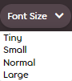

# BBCode

**BBCode**, osu! forumlarında ve büyük ölçüde internetteki diğer forumlarda kullanılan bir [işaretleme dilidir](https://en.wikipedia.org/wiki/Markup_language). Zengin metin düzenlemeyi mümkün kılmak için kullanılan BBCode, biçimlendirme, özellik kazandırma, gömülü içerik ekleme, ve daha pek çoğunu ifade etmek için metni çevreleyen etiketlerden oluşmuştur. BBCode, osu! web sitesinde, forum gönderileri, imzalar, kullanıcı sayfaları, ve beatmap açıklamaları gibi pek çok yerde kullanılır.


## Davranış

Herhangi bir metni seçmeden işaretleme butonlarından birine tıklamak gönderi düzenleyicisinde metin imlecinin etrafında bir dizi açık ve kapalı etiket oluşturacaktır. İşaretleme butonuna tıklamadan önce belirli bir metni seçmek, bu metni ilgili etiketler ile çevreleyecektir.

Metnin belirli bir kısmı için biçimlendirmeyi birleştirmek isteyen kullanıcılar, BBCode etiketlerini birbirlerinin içine yerleştirerek bunu sağlayabilir. Ancak birleştirirken bu etiketlerin sırası ve yuvalanması **doğru dizilmelidir**. Hatalı dizilim biçimlendirmeyi bozacaktır.

Yuvalanmış bir dizi etiketin doğru ve yanlış kullanımları aşağıda belirtilmiştir:

- `[centre][b]metin[/b][/centre]` doğru
- `[b][centre]metin[/b][/centre]` yanlış

## Etiketler

Diğer pek çok işaretleme dili gibi, BBCode, metni biçimlendirmek için bir çift köşeli parantez (`[]`) ile belirtilen bir etiket sistemi kullanır. Bu etiketler, eğik çizgi (`/`) işaretinin olup olmamasıyla ayırt edilen "açılış" ve "kapanış" etiketleri olmak üzere ikiye ayrılır. Spesifik olarak, kapanış etiketleri aç parantezin hemen ardından gelen bir eğik çizgi içerir, ancak açılış etiketleri bunu içermez.

Ek olarak açılış etiketleri URL'leri, metin boyutlarını, ve benzeri elementleri belirtmek için eşittir sembolü (`=`) içerebilir.

osu! web sitesinde desteklenen BBCode etiketleri aşağıda detaylı bir şekilde listelenmiştir.

### Kalın

```
[b]metin[/b]
```

`[b]` etiketi metni kalınlaştırarak ona güçlü bir vurgu eklemek için kullanılır. BBCode kalınlaştırması yazı boyutunu etkilemez.

Araç çubuğu butonu: 

### İtalik

```
[i]metin[/i]
```

`[i]` etiketi metni yana yatırarak ona hafif bir vurgu eklemek için kullanılır (örn. italiklendirme).

Araç çubuğu butonu: 

### Alt çizgi

```
[u]metin[/u]
```

`[u]` etiketi ilgili metnin altını çizerek ona vurgu eklemek için kullanılır. Çizilen bu alt çizgi kalınlaştırma ve italikleştirme gibi diğer etiketlerden etkilenecektir.

### Üstü çizili

```
[strike]metin[/strike]
```

`[strike]` etiketi mevcut bir metnin üstünü yatay bir çizgiyle çizerek onun kaldırılmasını ifade etmek için kullanılır.

Araç çubuğu butonu: 

### Renk

```
[color=#HEXCODE]metin[/color]
```

*Tüm renk adlarının bir listesi için, bakınız: [X11 renk adları](https://tr.wikipedia.org/wiki/X11_renk_adlar%C4%B1)*

`[color]` etiketi metni pek çok türdeki web-güvenli renklerle biçimlendirmek için kullanılır. Bu etiket rengi belirtmek için [HEX kodu](https://tr.wikipedia.org/wiki/Web_renkleri#%C3%9C%C3%A7l%C3%BC_Hex) formatını kullanır, ancak bu renkler aynı zamanda "red" (kırmızı) veya "green" (yeşil) gibi HTML renk isimleriyle de belirtilebilir. Belirtmek için `#HEXCODE` argümanı yerine ilgili rengin HEX kodunu veya HTML ismini yazmanız yeterlidir.

Yukarıda belirtilen argüman tırnak işareti (`"`) içermez, ve herhangi bir varsayılan renge sahip değildir. Eğer herhangi bir argüman belirtilmemişse, ya da tırnak işareti kullanılmışsa, bu etiket bir BBCode etiketi olarak algılanmayacaktır.

### Yazı tipi boyutu

```
[size=SAYI]metin[/size]
```

`[size]` etiketi metni farklı yazı tipi boyutlarıyla biçimlendirmek için kullanılır. osu! websitesi şu anda yalnızca dört adet yazı tipi boyutunu desteklemektedir: 50, 85, 100, ve 150. Bu boyutlar sitede sırasıyla "ufak", "küçük", "normal", ve "büyük" olarak tanımlanır.

`SAYI` argümanı tırnak işareti almaz, ve yalnızca dört adet boyut değerini destekler. Eğer bu dört desteklenen boyuttan biri olmayan bir sayı girilirse, metin varsayılan boyutuna geri döner.

Araç çubuğu butonu: 

### Spoiler

*[Spoiler Kutusu](#spoiler-kutusu) ile karıştırılmamalıdır.*

```
[spoiler]metin[/spoiler]
```

`[spoiler]` etiketi hassas bilgi içeren metinleri mat siyah bir renkle kapatarak, bu metnin yalnızca imleç ile seçildiğinde ortaya çıkmasını sağlar. Eğer [`[color]`](#renk) etiketiyle birleştirilirse, siyah örtü bundan etkilenmeyecektir. Ancak, bu siyah ürtünün ardındaki metin, okunabilir olsun veya olmasın, yine de renklendirilmiş olacaktır.

Bu etiket, genellikle TV dizileri, filmler, ve benzeri diğer medya ürünleri ile ilgili hassas/önemli bilgilerin sızdırılmaması için kullanılır. Bununla beraber, bu etiket aynı zamanda espritüel efekt veya vurgu ekleme amacıyla da kullanılmaktadır.

### Kutu

*[Spoiler Kutusu](#spoiler-kutusu) ile karıştırılmamalıdır.*

```
[box=İSİM]
metin
[/box]
```

`[box]` etiketi metin ve görselleri tıklanabilir bir bağlantı içerisinde saklamak için kullanılır. Üzerine tıklandığında, saklanan içerikler bir açılır liste gibi ortaya çıkar.

Bağlantı yazısı `İSİM` argümanıyla belirtilir. Bu argüman belirtildiğinde, kutu içerisinde bu isimde bir başlık oluşturulur, ve kutunun boyutu buna göre ayarlanır. Eğer boş bırakıldıysa, `[box]` etiketi varsayılan olarak üzerine tıklanamayan başlıksız bir kutucuk oluşturacaktır. Argüman tırnak işareti (`"`) kullanmaz, ve bırakılan boşlukları yoksaymaz.

Bu etiket çoğunlukla forum gönderisinin boyutunu arttırabilecek uzun yazıları ve resimleri gizlemek için kullanılır, özellikle SSS veya [tema](/wiki/Skinning) gönderilerinde.

*Not: BBCode kutusunun araç çubuğu butonu "spoiler kutusu" olarak adlandırılır, fakat bir `[spoilerbox]` etiketi oluşturmaz.

Araç çubuğu butonu: 

### Spoiler kutusu

```
[spoilerbox]metin[/spoilerbox]
```

*Spoiler kutusu*, `İSİM` argümanı barındırmayan özel bir tür BBCode kutusudur. Spoiler kutusunun ismi her daim `SPOILER` olarak gösterilir. Spoiler kutularının kendilerine özel bir etiketi vardır (`[spoilerbox]`) ama çalışma prensipleri BBCode [kutularıyla](#kutu) tamamen aynıdır.

### Alıntı

```
[quote="İSİM"]
metin
[/quote]
```

`[quote]` etiketi uzun alıntılamaları paragraf başı yaparak, renklendirerek, kalınlaştırarak, ve pembe yatay bir çizgiyle ana metinden ayırarak biçimlendirmek için kullanılır. Alıntının asıl içeriği açılış ve kapanış etiketleri arasına yerleştirilirken, `İSİM` argümanı alıntının yazarını belirtir (ancak bu opsiyoneldir). Alıntı içerisindeki metin boşlukları ve satır aralarını da içerir.

*Bildirim: `İSİM` argümanı tırnak içinde (`"`) yazılmalıdır.*

Uzun alıntılar genellikle daha resmi yazılarda ilgili alıntı, üç veya daha fazla satır uzunluktaysa satır-içi alıntılarının yerine kullanılır. Lakin osu! forumlarında bunlar çoğunlukla başka bir kullanıcının yorumunu yanıtlamak amacıyla kullanılabilir, ki bu işlem ilgili yorumun sağ-üst köşesinde yer alan `Alıntı yaparak cevap ver` butonu üzerinden otomatik olarak yapılabilir (aşağıda mevcut). Ancak bu buton **yalnızca imleç yakınlardaysa gözükür**.


### Kod bloğu

```
[code]
metin
[/code]
```

`[code]` etiketi *biçimlendirilmemiş kod bloklarını* (diğer bir deyişle: *biçimlendirilmemiş metin*) oluşturmak için kullanılır. osu! websitesinde, `[code]` etiketi metni yarı-şeffaf, gri bir kutucuk içerisinde sabit-aralıklı (monospace) bir yazı tipi ile biçimlendirecektir. Bir kod bloğu içerisinde metni biçimlendirmek, düzenleyicinin bu etiketler arasındaki yazıyı olduğu gibi algılamasını sağlayarak, içeriğindeki diğer etiketlerin veya kaynak kodunun başka bir şeye dönüşmesini engelleyecektir.

osu! forumları içerisinde, kod blokları sıklıkla bir [storyboard](/wiki/Storyboard) için kaynak kodu göndermek adına, ya da etiketler, komutlar, veya çeşitli kodlar için sözdizimi (syntax) gösterilmesi gereken öğretici rehberlerde kullanılır.

### Ortala

```
[centre]metin[/centre]
```

`[centre]` etiketi metni ortaya hizalamak için kullanılır. Bu etiket başlıklara, alt-başlıklara, veya şiirlere biçimsel efektler kazandırmak amacıyla sıklıkla kullanılır. Eğer `[quote]` etiketinin içerisinde veya onu etraflayacak biçimde kullanılırsa, alıntı bloğunun içerisinde yer alan metin ortalanacaktır, fakat alıntı çizgisi gibi biçimsel elementler ortalanmayacaktır.

### URL

```
[url=BAĞLANTI]metin[/url]
```

`[url]` etiketi metni tıklanabilir bir köprüye dönüştürür.

*Not: Köprülenmiş metin oluşturmak istenmiyorsa bu etiketin kullanılması zorunlu değildir. Forum sitesi düzgün URL'leri otomatik olarak bağlantıya dönüştürecektir.*

`[url]` etiketiyle köprü oluşturmak için, kullanıcılar iki argüman belirtmelilerdir: gösterilecek bağlantı metni, ve yönlendirilecek bağlantı adresi. İlki açılış ve kapanış etiketlerinin arasında belirtilmeli, ikincisiyse tırnak işareti (`"`) kullanmadan `BAĞLANTI` argümanının yerine yerleştirilmelidir. Eğer herhangi bir metin belirtilmediyse, metin kısmı URL'nin ismi olarak yer alacaktır.

Araç çubuğu butonu: 

### Profil

```
[profile=kullanıcıid]kullanıcı adı[/profile]
```

`[profile]` etiketi bir kullanıcının osu! profil sayfasını, kullanıcı adlarını veya ID'lerini kullanarak linklemek için kullanılır. `[profile]` etiketinin `[url]` etiketinden ayrıldığı en önemli nokta `[profile]` etiketiyle oluşturulmuş bir bağlantının imleç ile üzerine gelindiğinde bir kullanıcı kartı görüntülemesidir.

*Not: Kullanıcı ID'si, herhangi bir osu! profil sayfasının URL'sinde `/users/` kısmından sonra gelen sayı dizisine verilen isimdir.*

Eğer kullanıcı ID'si aracılığıyla belirtildiyse, açılış ve kapanış etiketlerinin arasında yer alan metin yerine kullanıcının mevcut kullanıcı adı görüntülenecektir. Fakat, eğer profil sayfası bir kullanıcı adı aracılığıyla belirtildiyse, ve ilgili kullanıcı da ismini değiştirdiyse, bağlantı çalışmayı durduracaktır.

### Biçimlendirilmiş listeler

```
[list=TÜR]
[*]öge 1
[*]öge 2
[*]öge 3
[/list]
```

`[list]` etiketi osu! forumlarında çeşitli şekillerde yer alan listeleri otomatik olarak biçimlendirmek için kullanılır. Yukarıdaki gibi, köşeli parantezlerin arasına yıldız konularak (`[*]`) liste ögeleri belirtilebilir. Bu, varsayılan olarak, bir mermi imli liste oluşturur.

Diğer liste türleri ise `TÜR` argümanı yerine `1`, `a`, `A`, `i`, ya da `I` (sırasıyla: numaralandırılmış, harflendirilmiş (küçük harf), harflendirilmiş (büyük harf), roma rakamlarıyla (küçük harf), ve roma rakamlarıyla (büyük harf)) kullanılarak farklı türlerde biçimlendirilebilir.

*Bildirim: BBCode ile biçimlendirilmiş listeler üst üste veya iç içe yerleştirilebilir, ancak biçimlendirme sorunlarına neden olduğu bilinmektedir.*

Araç çubuğu butonları:  

### Görseller

```
[img]ADRES[/img]
```

`[img]` etiketi osu! forum gönderilerine çevrimiçi görseller eklemek için kullanılır. Etiketi kullanmak için, kullanıcılar, yukarıda `ADRES` argümanıyla belirtilen yere görselin bağlantı adresini yerleştirmelidir. Yerel dosya konumları (örn. `C:\Users\Name\Pictures\image.jpg`) **çalışmayacaktır**.

*Bildirim: Web sayfası URL'si ile görsel bağlantı adresi aynı **değildir**.*

Görsel bağlantı adresini elde etmek için görselin bulunduğu web sitesine gidin, imlecinizi görselin üzerine getirin, görselin üzerine sağ-tıklayın ve `Görselin adresini kopyala` seçeneğini seçin. Daha sonra, kopyaladığınız bu adresi etiketlerin arasına yapıştırabilirsiniz.

Görsel içerikler her yerden alıntılanabilse bile, osu!, kullanıcıların [Imgur](https://imgur.com) gibi herkesçe bilinen görsel paylaşım sitelerini kullanmasını öneriyor, çünkü bazı web siteleri barındırdıkları görsellere yönlendiren direkt bağlantılardan (diğer bir deyişle "dinamik linkler") hoşlanmıyor.

Araç çubuğu butonu: 

### YouTube

```
[youtube]VIDEO_ID[/youtube]
```

`[youtube]` etiketi web sayfası üzerinde bir [YouTube](https://youtube.com) videosunu gömülü içerik olarak barındırmak için kullanılır. Etiketin çalışması için, kullanıcının iki etiket arasında `VIDEO_ID` argümanıyla belirtilen yere yalnızca video ID'si (tüm URL **değil**) yerleştirmesi yeterlidir.

YouTube videolarının ID'leri videonun URL'sinde bulunur, ve `v=` kısmından *hemen sonra* gelen 11 karakter uzunluğunda bir metin dizisidir.

### Ses

```
[audio]URL[/audio]
```

`[audio]` etiketi çevrimiçi bir ses kaynağından alıntılanan bir [HTML5](https://tr.wikipedia.org/wiki/HTML5) ses oynatıcısını gömülü içerik olarak barındırmak için kullanılır. Ses dosyaları, bir URL aracılığıyla erişilebildiği sürece herhangi bir kaynaktan alınabilir. Yerel dosya konumları (örn., `C:\Users\Name\Music\audio.mp3`) **çalışmayacaktır**.

*Dikkat: Korsan içerik endişelerinden ötürü, her dosya paylaşım servisinin barındırdığı ses dosyalarının doğrudan farklı mecralarda kullanılmasını hoş karşılamayacağını unutmayın. osu!, kullanıcıların bu doğrultuda karşılaşabileceği telif hakkı sorunlarından sorumlu değildir.

Ses dosyalarını gömülü içerik olarak ekleyebilmek için, kullanıcıların dosyanın kaynak URL'sini (örn. `https://www.example.com/example.mp3`) iki `[audio]` etiketi arasına yerleştirmeleri gerekmektedir.

### Başlık (v1)

```
[heading]metin[/heading]
```

`[heading]` etiketi metni büyük, pembe bir başlık olarak biçimlendirmek için kullanılır. Bu etiket çoklu-katmanlı başlıkları desteklemez, ve spesifik olarak bu başlıklara yönlendiren bağlantılar kurulamaz.

Araç çubuğu butonu: 

### Bildirim

```
[notice]
metin
[/notice]
```

`[notice]` etiketi paragrafları büyük, etrafı çizgiyle çevrilmiş siyah bir gövde rengine sahip bir kutucuğa yerleştirmek için kullanılır. Bu etiket çoğunlukla web sitesinde bulunan belirli bir konu hakkında bildirimleri veya uyarıları belirtmek için kullanılır.

## Eski etiketler

Aşağıdakiler, bir zamanlar osu! web sitesinde pek çok yerde kullanılan, fakat artık kullanımı mevcut olmayan BBCode etiketleridir. Onların kullanımı ve söz dizimi tarihsel nedenlerden dolayı listelenmiştir.

### Google

```
[google]arama sorgusu[/google]
```

`[google]` etiketi eskiden osu! forumlarında iki etiket arasına yerleştirilen metni Google'da aramak için kullanılan eskimiş bir etikettir.

Bu etiket kullanıcıları kendi hesapları üzerinden Google'da arama yapmaya yönlendirir, yani, Google kullanıcı aramalarını herkes için kişiselleştirdiğinden, çıkan arama sonuçları herkes için aynı olmaz. Aynı şekilde, dil veya ülke kısıtlamaları sebebiyle birtakım arama sonuçları bazı kullanıcılardan gizlenir.

### Şanslı

```
[lucky]arama sorgusu[/lucky]
```

`[lucky]` etiketi eskiden osu! forumlarında verilen metni kullanarak Google'ın `Kendimi Şanslı Hissediyorum` butonu aracılığıyla bir web sitesine yönlendirmek için kullanılan eskimiş bir etikettir. Bu etiket aracılığıyla yönlendirilen web sitesi butonun doğası gereği herkes için aynı olmayacaktır.

### Başlık (v2)

```
[metin]
```

*Başlık (v2)* etiketi eskiden osu! forumlarında metni; havalı görünen, altı çizili, mor bir başlığa dönüştürmek için kullanılan eskimiş bir etikettir. Bu etiket yalnızca Beatmapler forumunda kullanılırdı, ve gönderildiğinde görüntüleniyordu (önizlemede değil). Kullanımdayken herhangi bir butona sahip değildi, ve açılış ile kapanış etiketlerinden ziyade iki adet köşeli parantez arasında belirtiliyordu.

## Ek bilgiler

- Bu wiki makalesi [Stefan](https://osu.ppy.sh/users/626907) tarafından oluşturulan ["HOW TO: Forum BBCodes"](https://osu.ppy.sh/community/forums/topics/445599) forum gönderisinden uyarlanmıştır.
- Eskiden, kullanıcıların [renk etiketini](#renk) kullanarak ve eşittir sembolünden (`=`) sonra "transparent" (şeffaf) yazarak metni şeffaf hale getirmesini sağlayan bir kodlama hatası vardı.
  - Şu an itibariyle, böyle bir durum oluştuğunda metin varsayılan rengine (beyaz) geri dönüştürülür.
