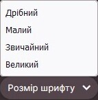

# BBCode

**BBCode** це [Мова розмітки](https://uk.wikipedia.org/wiki/Мова_розмітки_даних) яка використовується на форумах osu! і, по великому рахунку, на більшості форумах в інтернеті. Вона використовується для широких можливостей форматування тексту. Ця мова складається з тегів, які записуються по обидві сторони тексту, вказуючи на його форматування, атрибути, вкладення та багато іншого. Вона використовується в багатьох місцях на сайті osu!, наприклад, в публікаціях на форумах, підписах, сторінках користувачів та описах мап.


## Використання

Натиснувши кнопку розмітки без виділення тексту, створиться набір відкритих і закритих тегів на місці текстового курсора у вікні редактора. Виділивши текст перед натисканням кнопки розмітки, створить теги з обох сторін цього тексту.

Користувачі, які хочуть застосувати декілька тегів до одного і того ж тексту, можуть зробити це вклавши теги один в одного, Проте, послідовність і спосіб вкладання цих тегів **є важливим** при їх об'єднанні. При неправильному використанні, форматування буде невдале.

Нижче показано правильне і неправильне використання вкладених тегів:

- `[centre][b]текст[/b][/centre]` Правильно
- `[b][centre]текст[/b][/centre]` Неправильно

## Теги

BBCode, як і багато інших мов розмітки, форматує текст використовуючи систему тегів, які позначаються парою квадратних дужок (`[]`). Ці теги розділені на "відкриваючі" та "закриваючі", які відрізняються додаванням слешу (`/`). Якщо точніше, то закриваючі теги мають слеш відразу після відкриваючої дужки, в той час як відкриваючі теги не містять слешу.

Також, важливо відмітити, що відкриваючі теги іноді мають в собі знак рівності (`=`), щоб вказати на посилання, розміри шрифту, та інші подібні елементи.

Нижче, перераховані та описані в деталях, BBCode теги, які підтримуються сайтом osu!

### Жирний шрифт

```
[b]текст[/b]
```

Тег `[b]` використовується, щоб надати виразності тексту за допомогою жирного шрифту. Цей тег не змінює розмір шрифту.

Кнопка на панелі форматування: 

### Курсив

```
[i]текст[/i]
```

Тег `[i]` використовується, щоб злегка надати виразності тексту, нахиливши його.

Кнопка на панелі форматування 

### Підкреслення

```
[u]текст[/u]
```

Тег `[u]` використовується, щоб надати виразності тексту, намалювавши горизонтальну лінію під ним. Ця лінія буде модифікована іншими тегами, такими як жирний шрифт і курсив.

### Перекреслення

```
[strike]текст[/strike]
```

Тег `[strike]` використовується, щоб відмітити видалення попередньо написаного тексту, за допомогою горизонтальної лінії, яка "перекреслює" текст.

Кнопка на панелі форматування: 

### Колір

```
[color=#HEXCODE]текст[/color]
```

*Щоб дзінатися всі кольори, перегляньте сторінку [назви кольорів в X11](https://uk.wikipedia.org/wiki/%D0%9A%D0%BE%D0%BB%D1%8C%D0%BE%D1%80%D0%B8_HTML#%D0%9D%D0%B0%D0%B7%D0%B2%D0%B8_%D0%BA%D0%BE%D0%BB%D1%8C%D0%BE%D1%80%D1%96%D0%B2_%D0%B2_X11)*

Тег `[color]` використовується, щоб стилізувати текст різними кольорами. Тег використовує формат [HEX коду](https://en.wikipedia.org/wiki/Web_colors#Hex_triplet), щоб вказати колір, також можна використовувати назви кольорів HTML, такі як "red" або "green". Щоб вказати колір, замініть аргумент `#HEXCODE` на відповідний HEX код або HTML назву.

Вищевказаний аргумент не повинен мати лапки (`"`) і не має стандартного кольору. Якщо ніякий аргумент не вказано, або використовуються лапки, тег не буде вважатися тегом BBCode.

### Розмір шрифту

```
[size=NUMBER]текст[/size]
```

Тег `[size]` використовується, щоб стилізувати текст шляхом застосування різних розмірів шрифту. На даний момент, веб сайт osu! підтримує чотири розміри шрифту: 50, 85, 100 і 150. На сайті розміри називаються: "дрібний", "малий", "звичайний" та "великий" відповідно.

Аргумент `NUMBER` не приймає лапки, а приймає лише один із чотирьох розмірів, які підтримуються. Якщо введене число не є одним з чотирьох, які підтримуються, текст повернеться до стандартного роміру.

Кнопка на панелі форматування: 

### Спойлер

*Не плутати із [спойлербоксом](#спойлербокс).*

```
[spoiler]текст[/spoiler]
```

Тег `[spoiler]` використовується, щоб закрити небажану для деяких людей інформацію, суцільним чорним кольором, який розкриває прихований текст при його виділені. Якщо об'єднати з тегом [`[color]`](#колір), чорне покриття не буде змінено, але текст під ним буде кольоровим, незважаючи чи можливо його прочитати чи ні.

Тег найчастіше вживається для запобігання виказання критичної/чутливої інформації про ТБ шоу, фільм або інші медіа. Також, це іноді використовується для комедійного ефекту або виділення.

### Контейнер

*Не плутати із [спойлербоксом](#спойлербокс).*

```
[box=NAME]
текст
[/box]
```

Тег `[box]` використовується, щоб сховати текст і картинки в посилання, яке можна натиснути. При натисканні, вміст буде показаний по аналогії з випадаючим меню.

Текст посилання вказується аргументом `NAME`. Вказавши цей аргумент ви створите заголовок всередині контейнера. Розмір контейнера буде підлаштований відповідно до заголовку. Якщо `NAME` не вказано, тоді тег `[box]` створить контейнер без заголовку. Аргумент не використовує лапки (`"`), і буде замінювати їх на пробіли.

Тег переважно використовується, щоб сховати величезну кількість тексту і картинок, які можуть занадто збільшити розмір публікації. Часто можна побачити в FAQ або [skin](/wiki/Skinning) реліз постах.

*Зауважте: На панелі форматування, кнопка яка створює контейнер, хоч і називається "Спойлер", вона не створює `[spoilerbox]`*

Кнопка на панелі форматування: 

### Спойлербокс

```
[spoilerbox]текст[/spoilerbox]
```

*Спойлербокс* — це особливий тип контейнера, який немає аргументу `NAME`. Заголовок цього контейнера, завжди показується як `SPOILER`. Спойлербокси мають свій власний тег (`[spoilerbox]`), проте їх функціонал є ідентичним з тегом [контейнер](#контейнер).

### Цитата

```
[quote="NAME"]
текст
[/quote]
```

Тег `[quote]` використовується для оформлення довгих цитат за допомогою відступів, кольору, жирності та відокремлення тексту за подопомогою рожевої вертикальної лінії. Вміст цитати розміщений між відкриваючими і закриваючими тегами. В той час як аргумент `NAME` вказує на автора цитати (проте цей аргумент не обов'язковий). Текст в середині цитати враховує всі пробіли та переноси на новий рядок.

*Зауважте: аргумент `NAME` має бути в лапках (`"`).*

Довгі цитати зазвичай використовуються замість однорядкових цитат в більш формальних розмовах, коли цитата має довжину три або більше рядки. Проте, на форумах osu! вони зазвичай використовуються для відповіді на коментар іншого користувача, що може бути зроблено автоматично за допомогою кнопки `Відповісти з цитуванням`, яка знаходиться в верхньому правому куті коментаря (показано нижче). Проте ця кнопка **з'явиться лише тоді, коли курсор наведений на коментар**.


### Вбудований код

*Не плутати з [блочним кодом](#блочний-код).*

```
[c]текст[/c]
```

Тег `[c]` дозволяє виділяти текст в середині речення моноширинним шрифтом. На сайті osu! такий текст буде оточений сірим прямокутником. На відміну від [блочного коду](#блочний-код), цей тег може бути використаний лише для текстів розміром в один рядок.

На форумах osu!, це може бути корисним для виділення, наприклад, скоречень клавіш або описів кнопок.

### Блочний код

*Не плутати з [вбудованим кодом](#вбудований-код).*

```
[code]
текст
[/code]
```

Тег `[code]` використовується для створення *попередньо відформатованих блоків коду*. На сайті osu!, тег `[code]` відформатує текст моноширинним шрифтом в середині напівпрозорих сірих контейнерів. Форматування тексту в середині блочного коду буде сприйнято редактором буквально, що запобігає небажаній зміні будь-яких тегів або програмного коду в щось інше.

На форумах osu!, блоки коду найчастіше використовуються для публікацій програмного коду [сторібордів](/wiki/Storyboard), або в туторіалах, які потребують синтаксис для тегів, команд, або програмного коду.

### Центрування

```
[centre]текст[/centre]
```

Тег `[centre]` використовується для вирівнювання тексту по центру контейнера. Найчастіше це використовується для стилізування назв, заголовків, або поем. Якщо тег розміщений в середині, або навколо тегу `[quote]`, текст в середині блоку цитати буде вирівняний по центру, проте стилістичні лінії та інші подібні речі не будуть.

### Посилання

```
[url=LINK]текст[/url]
```

Тег `[url]` використовується, щоб перетворити звичайний текст в посилання, яке можна натиснути.

*Зауважте: Використання цього тегу не є обов'язковим, якщо ви не бажаєте змінювати текст посилання, оскільки парсер редактора на форумі автоматично створює можливість переходу за посиланням*

Щоб створити посилання за допомогою тегу `[url]`, користувачі повинні вказати два аргументи: текст який буде відображений та посилання на сайт куди потрібно скерувати. Текст має бути вказаний між відрикваючим та закриваючим тегами, а посилання потрібно вказати на місці аргументу `LINK`, без лапків (`"`). Якщо текст не вказано, буде відображено адресу посилання.

Кнопка на панелі форматування: 

### Профіль

```
[profile=userid]ім'я користувача[/profile]
```

Тег `[profile]` використовується, щоб прикріпити посилання на профіль користувача osu! за допомогою його імені користувача, або ID користувача. Використання тегу `[profile]` відрізняється від використання тегу `[url]` тим, що тег `[profile]` відображає картку профілю при наведені на посилання, яке створене цим тегом.

*Зауважте: ID користувача - це рядок цифр після `/users/` в посиланні на сторінку профілю osu!.*

Якщо вказати користувача лише за його ID, необхідно вписати текст між відкриваючим і закриваючим тегами. Зробивши це, буде відрображено ім'я користувача з профілю, а не власний текст. Якщо ж вказати користувача за його іменем, посилання перестане працювати у разі, якщо він змінить ім'я.

### Форматовані списки

```
[list=TYPE]
[*]пункт 1
[*]пункт 2
[*]пункт 3
[/list]
```

Тег `[list]` використовується, щоб автоматично відформатувати два різних типи списків, які використовуються на форумах osu!. За допомогою зірочки в квадратних дужках (`[*]`) ви вказуєте новий пункт списку (як показано вище). За замовучвання, це створить простий маркований список.

Якщо вказати аргумент `TYPE` (не важливо, що саме ви напишете), буде створено нумерований список.

*Зауважте: форматовані списки можуть накладатися та вкладатися, але досить часто це спричиняє проблеми з форматуванням.*

Кнопка на панелі форматування:  

### Електронна адреса

```
[email=ADDRESS]текст[/email]
```

Tег `[email]` створює посилання, яке відкриває новий емейл в програмі за замовчуванням з попередньо заповненим полем адреси.

Щоб створити посилання, потрібно вказати два аргументи: `ADDRESS` з валідною електронною адресою і `текст`, який вуде відображено як текст посилання. Якщо аргумент `текст` не вказано, посилання буде створено не коректно.

### Зображення

```
[img]ADDRESS[/img]
```

Тег `[img]` використовується, щоб вставляти зображення в публікації на форумах osu!. Щоб застосувати цей тег, користувач повинен вставити пряме посилання на зображення (вказується в аргументі `ADDRESS`, як показано вище). Локальний шлях (наприклад, `C:\Users\Name\Pictures\image.jpg`) **працювати не буде**.

*Зауважте: Посилання сайту це **не** те саме, що й посилання на зображення.*

Щоб отримати посилання на зображення, вам потрібно перейти на сайт на якому воно розміщено, навести на нього курсор, натиснути праву кнопку миші та обрати `Копіювати адресу зображення`. Після чого, посилання має бути скопійоване і вставлене між відриваючим і закриваючим тегами.

Хоч зображення й можна брати де завгодно, osu! рекомендує публікувати його на довірених сайтах для обміну зображеннями, таких як [Imgur](https://imgur.com), оскільки деякі сайти не підтримують прямих посиланням на їхні зображення.

Кнопка на панелі форматування: 

### Карта зображень

```
[imagemap]
IMAGE_URL
X Y WIDTH HEIGHT REDIRECT TITLE
[/imagemap]
```

Тег `[imagemap]` використовується, щоб інтегрувати одне або декілька посилань в зображення на прямокутній області.

Зображення, яке потрібно розмістити вказується в аргументі `IMAGE_URL`. Цей аргумент повинен бути прямим посиланням на зображення.

Щоб додати область на яку можна натиснути, потрібно записати новий рядок в якому вказується: координати `X` та `Y`, які відповідають за позицію, ширину (`WIDTH`) та висоту (`HEIGHT`) області, а також посилання (`REDIRECT`), куди ви бажаєте скерувати користувача. За бажанням, можна вказати аргумент `TITLE`, який буде показуватися при наведені курсором на цю область. Аргумент `REDIRECT` можна пропустити вписавши на його місці `#`. Кожна одиниця розміру (`X`, `Y`, `WIDTH` і `HEIGHT`) вказується у відсотках (0-100) без знаку відсотка.

Кнопка на панелі форматування: 

### YouTube

```
[youtube]VIDEO_ID[/youtube]
```

Тег `[youtube]` використовується для вставлення [YouTube](https://youtube.com) відео на сайті. Для тегу потрібно вказати лише ID відео (**не** все посилання) між вікдриваючим і закриваючим тегами (продемонстровано вище з аргументом `VIDEO_ID`).

ID YouTube відео знаходиться в посиланні на відео. Це рядок з 11 символів *відразу після* `v=`.

### Аудіо

```
[audio]URL[/audio]
```

Тег `[audio]` використовується для вставлення [HTML5](https://uk.wikipedia.org/wiki/HTML5) аудіо плеєра з онлайн джерела. Аудіо файли можуть бути розміщенні де завгодно, допоки файл існує за вказаним посиланням. Локальний шлях (наприклад, `C:\Users\Name\Music\audio.mp3`) **працювати не буде**.

*Увага: Не всім сайтам з музикою подобається використання їх аудіо файлів на сторонніх ресурсах через занепокоєння про піратство. osu! не несе відповідальності за будь-які проблеми з авторськими правами, з якими можуть зіткнутися користувачі в звязку з цим.*

Щоб прикріпити аудіо файл таким способом, користувач повинен вставити посилання на цей файл (наприклад, `https://www.example.com/example.mp3`) між двома тегами `[audio]`.

<!-- Example online audio file URL for wiki editors: https://actions.google.com/sounds/v1/alarms/digital_watch_alarm_long.ogg -->

### Заголовок (v1)

```
[heading]текст[/heading]
```

Тег `[heading]` використовується для форматування тексту в великі, рожеві заголовки. Тег не підтримує багаторівневі заголовки.

Кнопка на панелі форматування: 

### Замітка

```
[notice]
текст
[/notice]
```

Тег `[notice]` використовується, щоб помістити параграф у великий, обведений контейнер з фоном темного кольору. Тег часто використовується для позначення заміток або попереджень, які стосуються певної теми на сайті.

## Застарілі теги

Теги які знаходяться нижче, це ті які колись використовувалися у різних місцях на сайті osu!, але більше вони не доступні для використання. Їх використання та синтаксис описані нижче для історичного призначення.

### Google

```
[google]пошуковий запит[/google]
```

Тег `[google]` це застарілий тег, який колись використовувався на форумах osu!, щоб створити посилання на пошуковий запит Google, використовуючи текст, що знаходиться між двома тегами.

Цей тег скеровував користувачів на сторінку пошуку Google через їх акаунт, тому результат для кожного міг відрізнятися, оскільки Google має систему персоналізованого пошуку. Це також означає, що деякі результати пошуку були приховані для деяких користувачів, через мову або обмеження країни.

### Lucky

```
[lucky]пошуковий запит[/lucky]
```

Тег `[lucky]` це застарілий тег, який колись використовувався на форумах osu!, щоб скерувати на пошуковий запит Google створений кнопкою "Мені пощастить", використовуючи вказаний текст. Сайт, на який вказував цей тег буде відрізнятися для кожного, оскільки так працює кнопка само по собі.

### Заголовок (v2)

```
[text]
```

Тег *Heading (v2)* це застарілий тег, який колись використовувався на форумах osu!, щоб зробити текст красивішим, фіолетового кольору з горизонтальними лініями. Цей тег працював лише на форумі Бітмап і з'являвся лише після публікації (не на прев'ю). Він не власної кнопки і записувався за допомогою відкритою і закритою квадратної дужки (без відкриваючого і закриваючого тегів).

## Дрібниці

- Ця стаття була адаптована з ["HOW TO: Forum BBCodes"](https://osu.ppy.sh/community/forums/topics/445599) користувачем [Stefan](https://osu.ppy.sh/users/626907).
- Раніше був баг який дозволяв користувачам використовувати прозорий текст за допомогою [тегу Колір](#колір) і "transparent" написаному після знаку рівності (`=`).
  - Зараз текст повернеться до станлартного кольору (білий), якщо таке станеться.
- Перед тим як додали тег `imagemap`, було можливо додати посилання на зобарження об'єднавши тег `url` та `img`, проте, лише одне посилання може бути задане для одного зображення. Тому потрібно було розрізати оригінальне зображення на декілька окремих (тобто, для кожного посилання окрема частина зображення) і поміщати їх горизонтально одне біля одного.
