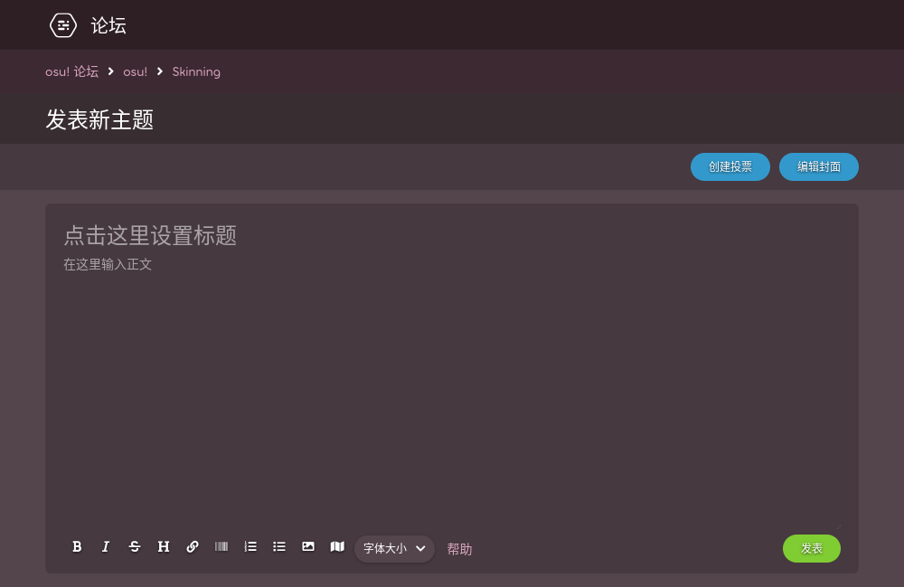
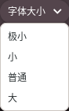

# BBCode

**BBCode** 是一种在 osu! 论坛中使用的[标记语言](https://zh.wikipedia.org/wiki/%E7%BD%AE%E6%A0%87%E8%AF%AD%E8%A8%80)。往更大了说，它也用于互联网上的其他绝大多数论坛。它由环绕文本的标记组成，用于表示用于启用富文本的格式、属性、嵌入等。在 osu! 网站的各个地方都可以使用BBCode，比如论坛贴、玩家签名、玩家主页和谱面描述。



## 行为

不框选文本，直接单击标记按钮时，文本编辑器会在光标前后会插入一组标记。但如果框选了文本，编辑器会在框选文本前后添加标记。

若要在一整段中组合使用多种格式，用户可以在一段标签内部使用其他标签。然而，使用的顺序和配对必须**一一对应**，错位将导致格式失效。

以下是嵌套标签的正确和错误用法：

- `[centre][b]文本[/b][/centre]` 正确
- `[b][centre]文本[/b][/centre]` 错误

## 标签

像其他许多标记语言一样，BBCode 内格式化文本的标记由一对方括号 (`[]`) 表示。标签分为开始和结束两种，区别在于后者包含正斜杠 (`/`)，而前者没有。

同样需要注意的是，开始标签内偶尔也会含有用于指示 URL、字体大小或其他参数的等号 (`=`)。

下面列出了在 osu! 网站内支持的 BBCode 标签。

### 粗体

```
[b]文本[/b]
```

`[b]` 粗体标签用于强烈地强调文本。BBCode 加粗不会影响字体大小。

工具栏按钮：

### 斜体

*注：斜体也叫做意大利体。*

```
[i]文本[/i]
```

`[i]` 斜体标签通过将文本向后倾斜，用于轻微地强调文本。

工具栏按钮：

### 下划线

```
[u]文本[/u]
```

`[u]` 下划线标签通过在文本下添加横线，用于强调文本。下划线也会影响粗体或斜体的文本。

### 删除线

```
[strike]文本[/strike]
```

***备注：删除线("strikethrough")英文也称作"strike"***

`[strike]` 删除线标签用于在文本中间添加横线，标记这段文本将要被移除。

工具栏按钮：

### 颜色

```
[color=#HEXCODE]文本[/color]
```

*关于所有颜色名，参见：[X11 颜色名](https://en.wikipedia.org/wiki/X11_color_names#Color_name_chart)*

`[color]` 颜色标签通过使用各种类型的网络安全颜色，给文本上色。标记使用 [HEX（十六位）色彩格式](https://en.wikipedia.org/wiki/Web_colors#Hex_triplet)来指定颜色，但也可以通过 “red” 或 “green” 等 HTML 颜色名来指定。如果需要指定一个特殊颜色，使用 HEX 色彩或 HTML 颜色名替代 `#HEXCODE` 参数即可。

`#HEXCODE` 参数前后不需要添加引号 (`“`)，也没有默认颜色。如果未指定参数，或者参数前后含有引号，那么这个标记不会解析为 BBCode 标记。

### 字体大小

```
[size=NUMBER]文本[/size]
```

`[size]` 字体大小标签通过设定字体的大小来区分不同风格的文本。目前，只有 4 种字体大小可以在 osu! 网站内使用：50、85、100、150。在内部，这四种大小常称为“极小”、“小”、“普通”、“大”。

`NUMBER` 参数前后不需要添加引号，并且只能使用上述的 4 种字体大小对应的数字。

工具栏按钮：

### 剧透条

*注：剧透条也叫做涂黑条。不要与[剧透框](#剧透框)相混淆。*

```
[spoiler]文本[/spoiler]
```

`[spoiler]` 剧透条标签通过用一个实心黑色的长条盖住敏感信息，从而保护它不会轻易被他人看见。当文本被高亮选中时，才会显示。如果同时使用 [`[color]`](#颜色) 标签，将不会影响到覆盖用的黑色长条。同时，不管使用颜色标签的文本是否可读，之下的文本依旧会上色。

这个标签通常用于避免让他人轻易看见敏感或容易剧透的信息（来自于 TV 秀、电影或其他媒体）。也可以用于添加幽默效果或强调。

### 折叠框

*不要与[剧透框](#剧透框)相混淆。*

```
[box=NAME]
文本
[/box]
```

`[box]` 折叠框标签用于将文本和图片隐藏在一个可点击的超链接内。点击超链接后，其中的内容会以下拉菜单的形式显示。

`NAME` 参数可填写自定义的超链接文本。如果指定了这个参数，将会在折叠框内创建以这个参数为名的标题文本，并相应地调整折叠框的大小。如果未指定参数，则 `[box]` 标签会创建一个不包含标题文本的折叠框。这个参数前后不需要添加引号 (`"`)，并且空格也会被渲染。

这个标签通常用于隐藏超大篇幅，会占据论坛贴很多空间的文本和图片。通常可以在 FAQ 或[自定义皮肤](/wiki/Skinning)相关的论坛贴内看到。

*注意：BBCode 的折叠框工具栏按钮不会创建 `[spoilerbox]` 标签。*

工具栏按钮：

### 剧透框

```
[spoilerbox]文本[/spoilerbox]
```

*剧透框* 是一类特殊的，不包含 `NAME` 参数的 BBCode 折叠框标签。剧透框的名称总是 `SPOILER`。剧透框有专属的标签 (`[spoilerbox]`)，但是功能上与 BBCode [折叠框](#折叠框)完全一致。

### 引用

```
[quote="NAME"]
文本
[/quote]
```

`[quote]` 引诱标签通过使用缩进、着色。加粗、使用粉色竖线来标记文本，用于标记出长引用（也被称为块引用）的文体风格。引用的内容位于开始和结束标签之间，`NAME` 参数用于标记引用的来源作者（可选）。引用中的文本可以留出空白或换行。

*注意：`NAME` 参数前后必须添加引号 (`"`)。*

如果引用的文本大于等于三行，则通常会使用正式的文体来写作，而不是直接引用。然而，在 osu! 论坛内，引用通常用于回复另一个玩家的评论。这能通过使用评论右上角的“引用回复”按钮来自动完成（如下所示）。但是，这个按钮只有当**光标位于评论右上角附近**时，才会出现。


### 行内代码

*注意：不要与[代码块](#代码块)相混淆。*

```
[c]文本[/c]
```

`[c]` 行内代码标签会将一行内的文本使用等宽字体来高亮显示。在 osu! 网站内，文本周围会含有一个灰色方框。与[代码块](#代码块)不同，这个标签只能用于单行。

在 osu! 论坛内，这个标签可以用于强调比如键盘快捷键或按钮之类的描述。

### 代码块

*注意：不要与[行内代码](#行内代码)相混淆。*

```
[code]
文本
[/code]
```

`[code]` 代码块标签用于创建*预格式化代码块*。在 osu! 网站内，`[code]` 标签会将其中的文本以等宽字体渲染，并在周围附上半透明的灰色方框。代码块中的格式化文本将告诉编辑器只需要从字面上处理这些标记之间的文本，从而防止任何标记或源代码转换为其他内容。

在 osu! 论坛内，这个标签可以用于展示[故事板](/wiki/Storyboard)的源代码，或是用于需要展示标签语法、指令、源代码的教程。

### 居中

```
[centre]文本[/centre]
```

`[centre]` 居中标签用于将文本与显示区域的中心对齐。这通常用于标题、标题或诗歌的文体效果。如果放置在 `[quote]` 标记内或周围，引号块内的文本将居中，但样式行等部件不会居中。

### URL

```
[url=LINK]文本[/url]
```

`[url]` 链接标签用于将普通文本转换成可点击的超链接。

*注意：如果不想自定义超链接的标题文本，则不需要使用这个标签。论坛编辑器会自动将合适的 URL 转换为链接。*

要创建带有 `[url]` 标记的超链接，则用户必须指定两个参数：要显示的链接文本和要导航到的网站的特定 URL。前者必须填写在开始和结束标签之间，后者必须写在 `LINK` 参数内，并且不带引号 (`"`)。如果未指定文本，则显示的超链接文本将默认为 URL 的名称。

工具栏按钮：

### 主页

```
[profile=userid]玩家名[/profile]
```

`[profile]` 主页标签通过读取设定的玩家名或玩家 ID，提供一个可以访问玩家主页的链接。与 `[url]` 标签不同的是，`[profile]` 标签在光标悬停在链接上时，会显示玩家卡片。

*注意：玩家 ID 即玩家个人主页链接 `/users/` 之后的一串数字。*

如果只通过玩家 ID 来指定玩家时，需要在开始和结束标签之间添加占位文本。这么做的话，会在实际页面上显示玩家的名字，而不是占位文本。如果只通过玩家名来指定玩家时，只要玩家修改了名称，链接将失效。

### 列表

```
[list=TYPE]
[*]选项 1
[*]选项 2
[*]选项 3
[/list]
```

`[list]` 标签用于在 osu! 论坛中自动格式化两种不同类型的列表，通过使用方括号中的星号 (`[*]`) 来标示列表中的新项目（如上所示）。默认情况下，这将创建一个简单的项目符号列表。

如果 `TYPE` 参数被指定（无论是什么值），会创建有序列表。

*注意：尽管这会导致格式问题，但是 BBCode 格式的列表依旧可以层层嵌套，也可以放在一起，*

工具栏按钮： 

### 邮箱

```
[email=ADDRESS]文本[/email]
```

`[email]` 邮箱标签创建一个可点击的超链接，点击它会在默认邮件程序中创建一封新的电子邮件，并会预先填充收件地址字段。

为了创建超链接，需要指定两个参数：在 `ADDRESS` 参数中指定有效的邮箱地址，`text` 参数中指定超链接的标题文本。如果不指定 `text` 参数，超链接则无法正常显示。

### 图片

```
[img]图床链接[/img]
```

`[img]` 图片标签用于在 osu! 论坛中显示在线图片。若要使用这个标签，则用户必须粘贴图片的直链（在 `图床链接` 参数中指定）。本地文件路径（比如 `C:\Users\Name\Pictures\image.jpg`）**将不起作用**。

*注意：网站的 URL **不等同于**图片的直链。*

如果想获得图片的直链，则必须访问图片来源的网站，并将光标悬停在图像上，右键单击，选择“复制图片地址”，之后，将复制好的图片直链粘贴在开始和结束标签之间。

尽管图片的直链可以从任何网站获取，因为一些网站可能会阻止其他网站使用他们图片的直链（或称为“热链接”），osu! 仍旧建议用户将图片上传到信誉良好的图片共享网站，比如 [ImgBB](https://imgbb.com/)。

*注意：Imgur 已经拉黑了 osu! 网站的 IP，所以上传到那里的图片将不再会显示。*[^imgur-blocked-ip]

工具栏按钮：

### 图片映射

```
[imagemap]
IMAGE_URL
X Y WIDTH HEIGHT REDIRECT TITLE
[/imagemap]
```

`[imagemap]` 图片映射标签通过将图片划分成数个矩形区域，来给图片的不同区域添加不同的超链接。

嵌入在网站上的图片由 `IMAGE_URL` 参数指定。它需要直接引用其他图床网站上托管的图片。

要添加一个可点击的区域，需要在 `IMAGE_URL` 参数其后添加新行。首先，X 和 Y 指定了区域的位置（左上角），WIDTH 和 HEIGHT 指定了区域的宽高。另外，`TITLE` 参数可以根据需要添加，当光标悬停到这一区域时，会弹出这个参数。如果想要这个区域链接到其他页面，在 `REDIRECT` 参数指定超链接。或是用 `#` 符号省略。所有尺寸（`X`、`Y`、`WIDTH`、`HEIGHT`）的范围是 0-100，即不含百分号的百分数。

工具栏按钮：

### YouTube

```
[youtube]视频 ID[/youtube]
```

`[youtube]` 标签用于在网站上嵌入 [YouTube](https://youtube.com) 视频。标签需要用户仅仅在开始和结束标签之间（`视频 ID` 参数位置）输入视频 ID（**并不是**整个 URL）。

YouTube 的视频 ID 位于该视频网站链接的末尾，它由 11 个字符组成，*之前的字符是*`v=`。

### 音频

```
[audio]URL[/audio]
```

`[audio]` 标签通过嵌入的 [HTML5](https://zh.wikipedia.org/wiki/HTML5) 音频播放器，播放在线音频。只要能获取音频文件，则音频文件的来源可以来自于任何地方。本地文件路径（比如 `C:\Users\Name\Music\audio.mp3`）**将不起作用**。

*注意：由于音乐盗版问题，并非所有文件共享服务都允许其他网站通过直链访问其音频文件。osu! 对用户可能遇到的任何版权问题不承担任何责任。*

要通过这种方法嵌入音频文件，用户必须在 `[audio]` 标签直接粘贴来源 URL（比如 `https://www.example.com/example.mp3`）

<!-- Example online audio file URL for wiki editors: https://actions.google.com/sounds/v1/alarms/digital_watch_alarm_long.ogg -->

### 标题 (v1)

```
[heading]文本[/heading]
```

`[heading]` 标题标签用于格式化文本成较大的粉色标题。这个标签不支持多行标题，也不支持添加超链接。

工具栏按钮：

### 通知

```
[notice]
文本
[/notice]
```

`[notice]` 通知标签用于将段落放置在一个巨大、含有外边框、暗色背景的方框内。这个按钮主要用于表示网站上关于某个主题的通知或警告。

## 旧版本

以下是曾经在 osu! 网站内使用的 BBCode 标签，但现在已经无法使用。出于历史目的，下文介绍了它们的用法和语法。

### Google

```
[google]搜索参数[/google]
```

`[google]` 标签已经过时，曾经能在 osu! 论坛中使用。它使用两个标签之间提供的文本链接到 Google 搜索查询。

这个标签会通过玩家的账户重定向至 Google 搜索。因为 Google 会个性化设置用户的结果，或是由于语言或国家的限制，不展示某些搜索结果，因此每个人的查询结果不会完全相同。

### 手气不错

```
[lucky]搜索参数[/lucky]
```

`[lucky]` 手气不错标签（`I'm Feeling Lucky`）已经过时，曾经能在 osu! 论坛中使用。它通过 Google 搜索的同名按钮搜索并导航。由于这个按钮本身的性质，因此通过该链接访问到的网站对每个人来说都不一样。

### 标题 (v2)

```
[文本]
```

*Heading (v2)* 标题标签已经过时，曾经能在 osu! 论坛中使用。它将文本格式化为一个看起来更花哨的紫色标题，并且添加一条水平线。这个标签仅在谱面论坛中有效，并且只会在发贴之后显示（无法预览效果）。在使用时，它没有按钮，只用开始和结束的中括号表示（并不含开始或结束标签）。

## 冷知识

- 这篇 wiki 文章改编自 [Stefan](https://osu.ppy.sh/users/626907) 撰写的 ["HOW TO: Forum BBCodes"](https://osu.ppy.sh/community/forums/topics/445599) 论坛讨论串。
- 曾经，用户在使用颜色标签时，会遇到一个 Bug：在等号 (`=`) 后面输入 "transparent" 会导致文本变成透明。
  - 目前，这么做只会让文本变成默认颜色（白色）。
- 在 `imagemap` 标签添加之前，可以通过混合使用 `url` 和 `img` 标签来在图片中添加超链接。然而，一张图片只能添加一个超链接。所以这需要将原图片裁切成多个小块（每一部分图片设定一个链接）并且将它们水平连接起来。

## 参考

[^imgur-blocked-ip]: [@ppy 发送的推特 (2023-06-29)](https://twitter.com/ppy/status/1674439849749913602)
