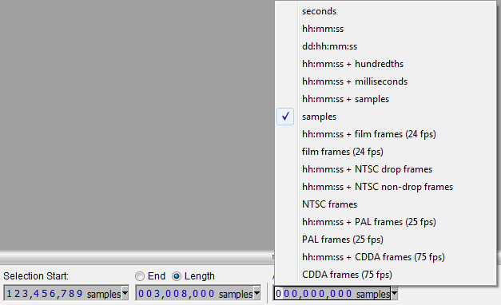
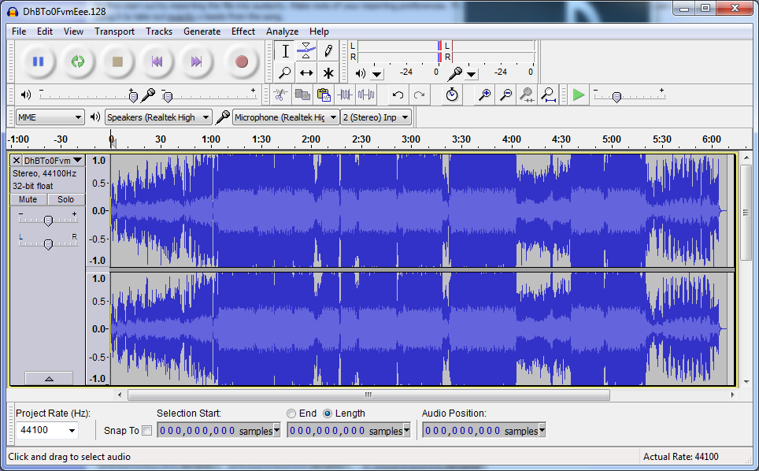

***Also checkout:** [Audio editing](Audio_editing "wikilink")*

Lowering/Raising the volume
---------------------------

[*Please use mp3DirectCut to edit mp3s (lossless)* by Intermezzo](https://osu.ppy.sh/forum/t/34303)

It has come under 's attention that mappers often turn up the volume of mp3's using tools like audacity. These tools cause quality degradation of the music as the mp3 file needs to be re-encoded. Please use **[mp3DirectCut](http://www.mpesch3.de1.cc/mp3dc.html)** instead, which allows basic operations like cutting or turning up the volume without re-encoding.

Trimming MP3 files
------------------

[*\[Tutorial\] How to cut MP3s - Lossless* by ziin](https://osu.ppy.sh/forum/t/84226)

First, this guide assumes a few things:

-   The MP3 has a known static BPM
-   You have a high quality source
-   You want to cut the <u>middle</u> of the song, not the beginning, or the end

If at all possible you should use **[mp3DirectCut](http://www.mpesch3.de1.cc/mp3dc.html)**, which allows lossless editing. However when cutting a song, it's *not* lossless, as the data stream is not at the same rate as the BPM of the music. You can fudge along and approximate, but then it's *wrong*. I'd rather have a slight quality loss over a BPM that changes from 0 ms to +5 ms after the cut.

So first start out by importing the file into audacity. Make note of your importing preferences. The default is usually 44100 Hz. This is important because we're going to be using it to take out <u>exactly</u> x beats from the song.

If you are at all familiar with science, you will be familiar with units. In this case, let's say we have 180 BPM song, with a sample rate of 44100 Hz. Orient the units properly so that the units cancel, and you get samples/beat.

|                                         |                      |
|-----------------------------------------|----------------------|
| 1 Minute \* 60 Seconds \* 44100 Samples | = 14700 Samples/Beat |
| 180 Beats \* 1 Minute \* 1 Second       |

Now that we know how *long* a beat is, we can easily select a portion of a song, and delete exactly that many beats.

You likely have an area that you want to cut out already, so zoom in and find the beat where it starts. This part doesn't have to be 100% accurate, since much like timing a song, you have to guess at the offset. Well what's the offset of this beat? It's right before that big series of peaks. Put your cursor somewhere in there and then select exactly how many samples you want to cut out.

You will have to change it to samples, and make sure the selection is length, not end time.

If you really want to get fancy, you can figure out the offset of the song in something like osu, then calculate exactly how many beats it is until the beat you want to cut, then cut there.
For now, let's see what we can do with this song:

BPM is 174, so each beat is 15206.9 samples (carry the decimal out when you do calculations).
Lets cut out most of the intro, some of the repeating parts, and some of the lyrics.

Zoom in. Lucky for me, there's a nice jagged point there so I know where the downbeat is. I'm going to use this spot as the basis of the rest of the song. Now select the number of beats we want out. Let's knock out the first 336. Then move forward 288 measures. Cut the next 192, and cut the ending short 104 later for 96 measures as well.

And there you have it. Over half the song cut out, as close to perfectly as you can. [<http://up.ppy.sh/files/dhbto0fvmeee.mp3>](http://up.ppy.sh/files/dhbto0fvmeee.mp3)

Left channel is the original, right channel is the cut version. Note that while they don't always mesh properly, it's always in time.
