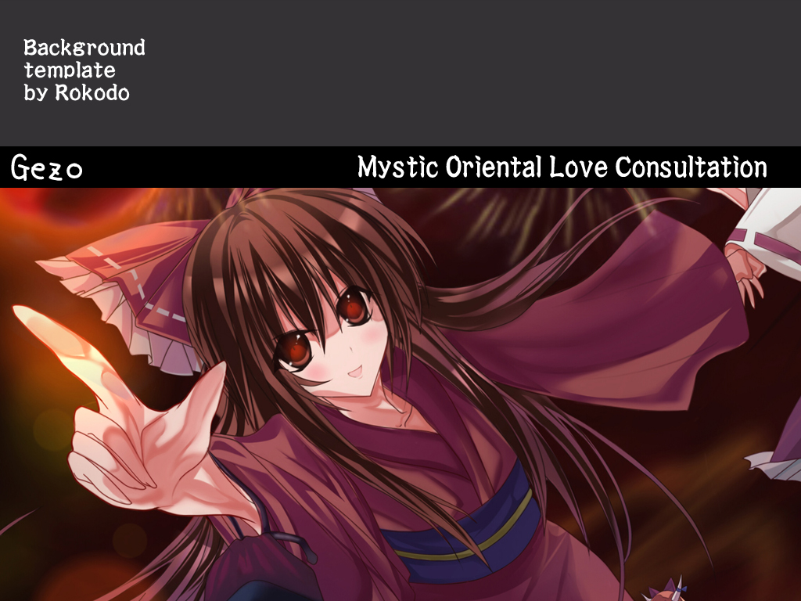
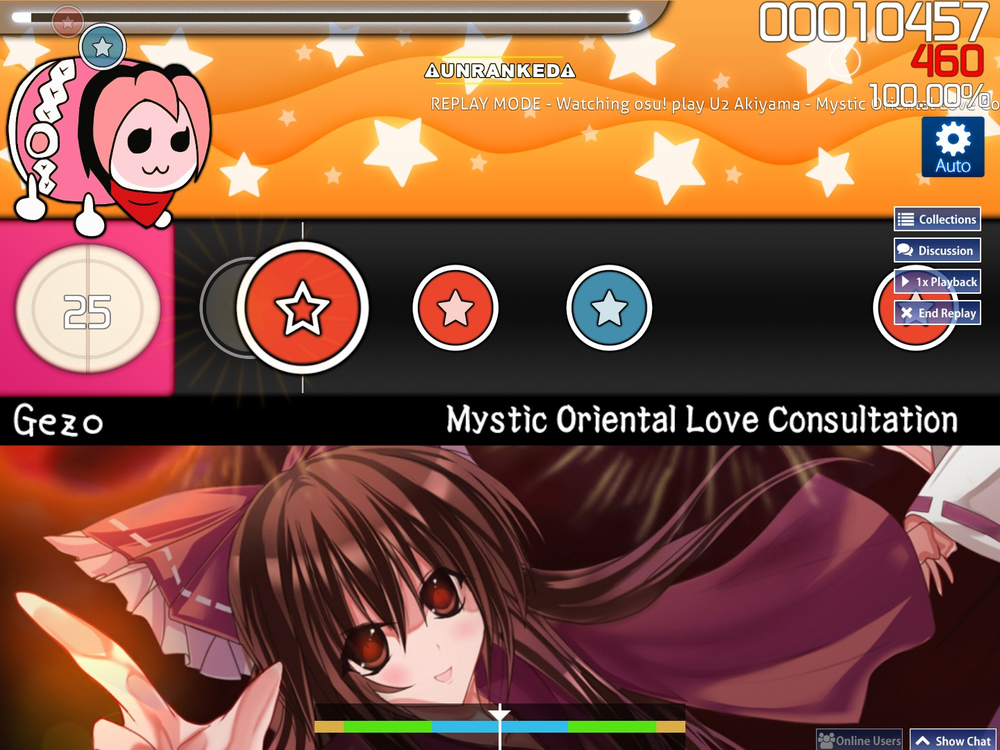
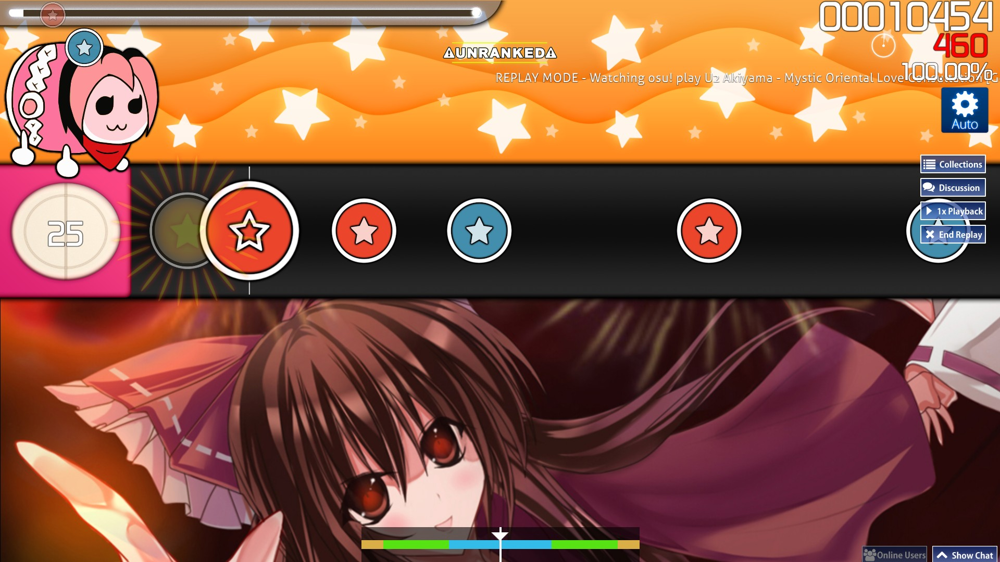

# Taiko-Vorlagenhintergrund

::: Infobox

:::

Ein Taiko-Vorlagenhintergrund ist ein Hintergrundbild, das verwendet wird, um authentisches Gameplay aus Taiko no Tatsujin zu simulieren. Es enthält üblicherweise einen schwarzen Balken, der den Künstler und den Songtitel in weiß unter dem Spielfeld anzeigt.

Taiko-Vorlagenhintergründe wurden bis 2012 häufig benutzt, als sie schließlich von den [Ranking-Kriterien](/wiki/Ranking_criteria/osu!taiko) nicht mehr zugelassen wurden, da sie bei anderen Seitenverhältnissen als 4:3 nicht so funktionieren, wie sie ursprünglich gedacht waren.

## Beispiel für ein inkompatibles Seitenverhältnis

Das folgende Beispiel nutzt den Taiko-Vorlagenhintergrund der Beatmap [U2 Akiyama - Mystic Oriental Love Consultation [Gezo's Taiko Oni]](https://osu.ppy.sh/beatmapsets/24830#taiko/113409).

| Bei Seitenverhältnis 4:3 | Bei Seitenverhältnis 16:9 |
| --: | :-- |
|  |  |
