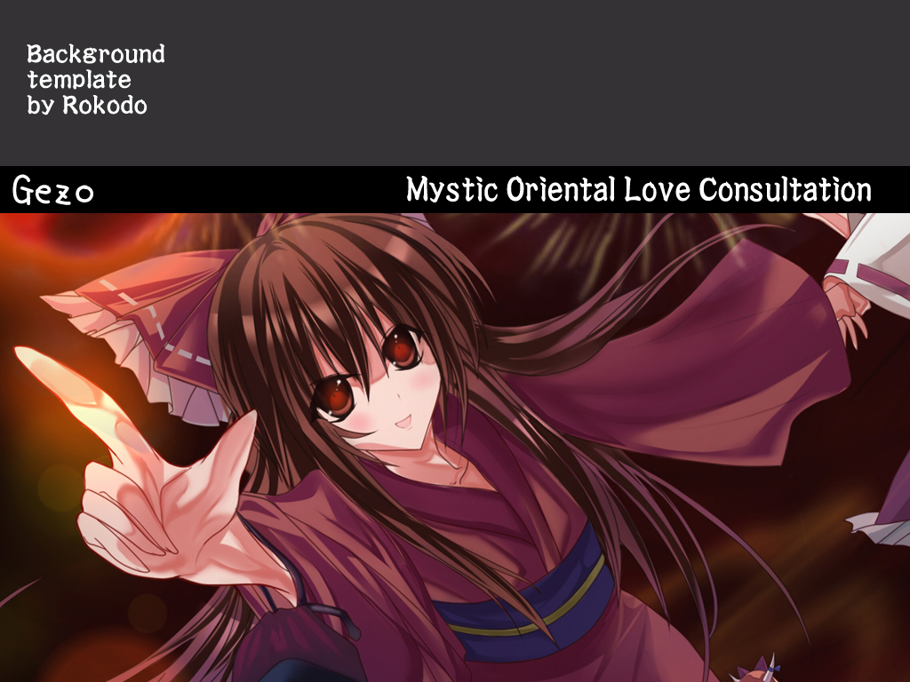
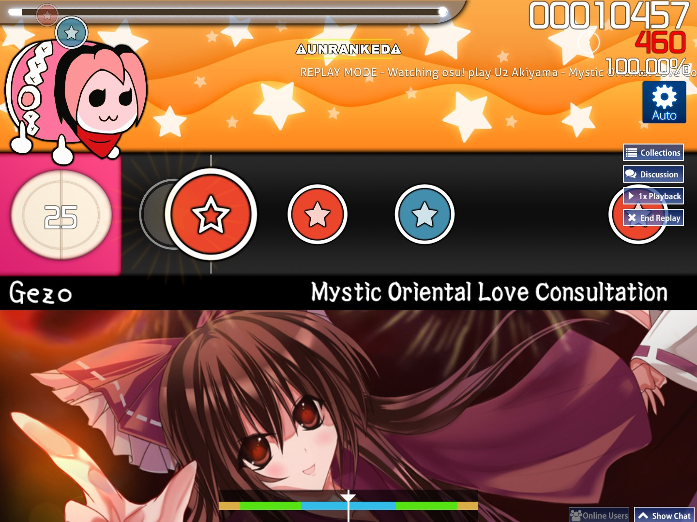
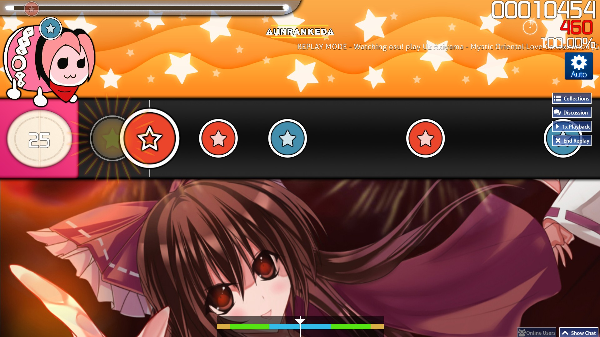

# Plantilla para los fondo de Taiko

::: Infobox

:::

Una plantilla de un fondo de Taiko es una imagen de fondo que se usa para simular la jugabilidad auténtica de Taiko no Tatsujin. Por lo general, incluye una barra negra que muestra el nombre del artista y el título de la canción en blanco debajo del campo de juego.

Las plantillas para los fondos de Taiko se usaban mucho hasta 2012, cuando se dejaron de permitir en los [criterios de clasificación](/wiki/Ranking_criteria/osu!taiko) porque no funcionaban como se esperaba en relaciones de aspecto distintas a 4:3.

## Ejemplo de la incompatibilidad entre las relaciones de aspecto

El siguiente ejemplo se realizó usando la plantilla de fondo de [U2 Akiyama - Mystic Oriental Love Consultation [Gezo's Taiko Oni]](https://osu.ppy.sh/beatmapsets/24830#taiko/113409).

| Usando una relación de aspecto de 4:3 | Usando una relación de aspecto de 16:9 |
| --: | :-- |
|  |  |
