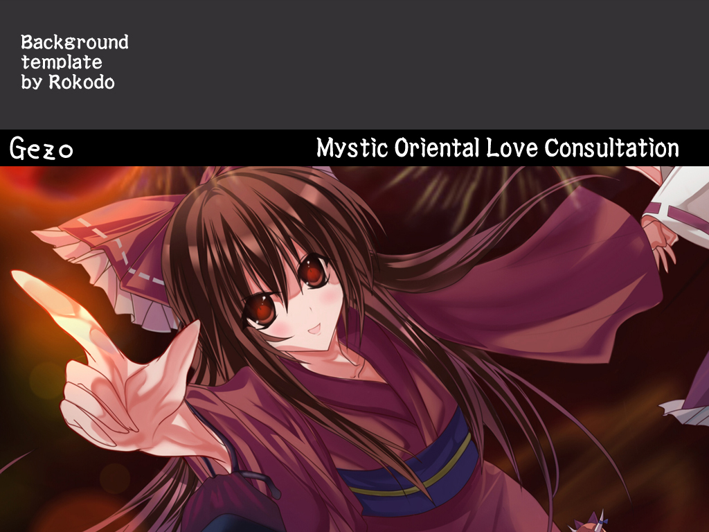
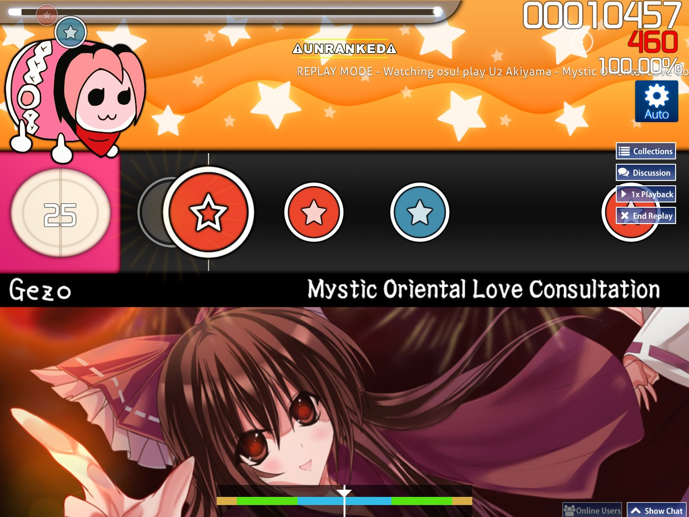
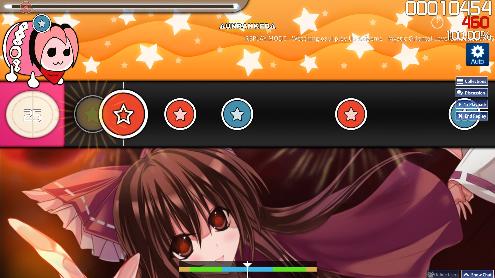

# Taiko template background

::: Infobox

:::

Taiko template background คือภาพพื้นหลังที่ใช้จำลองการเล่นแบบ Taiko no Tatsujin ดั้งเดิม โดยปกติจะมีแถบสีดำด้านล่างเพลย์ฟีลด์ พร้อมชื่อศิลปินและชื่อเพลงเป็นตัวอักษรสีขาว

Taiko template background เคยถูกใช้อย่างแพร่หลายจนถึงปี 2012 ก่อนจะถูกห้ามใช้ใน [ranking criteria](/wiki/Ranking_criteria/osu!taiko) เพราะมันไม่ทำงานตามที่ตั้งใจไว้บนอัตราส่วนหน้าจออื่นที่ไม่ใช่ 4:3

<!-- TODO: pinpoint when they were disallowed exactly -->

## ตัวอย่างปัญหากับอัตราส่วนหน้าจอ

ตัวอย่างต่อไปนี้ทำขึ้นโดยใช้ Taiko template background จาก [U2 Akiyama - Mystic Oriental Love Consultation [Gezo's Taiko Oni]](https://osu.ppy.sh/beatmapsets/24830#taiko/113409)

| ใช้อัตราส่วน 4:3 | ใช้อัตราส่วน 16:9 |
| --: | :-- |
|  |  |
