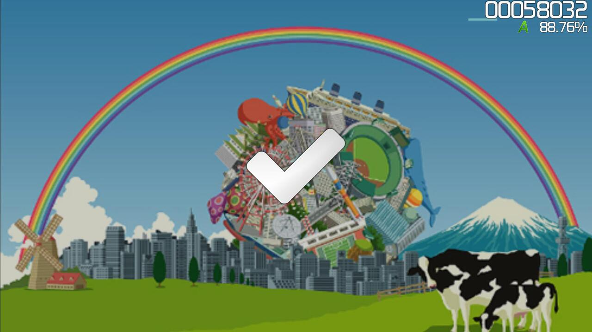

# Break

**Break** merupakan bagian dari [beatmap](/wiki/Beatmap) yang tidak terisi oleh [hit object](/wiki/Gameplay/Hit_object). Pada rentang waktu ini, [health drain](/wiki/Gameplay/Health) pemain akan sementara dihentikan. Break pada umumnya memungkinkan pemain untuk dapat beristirahat dan mengatur kembali posisi [perangkat input](/wiki/Gameplay/Input_device) yang mereka gunakan.

Tergantung pada [pengaturan](/wiki/Client/Beatmap_editor/Song_setup) yang aktif, kotak hitam (*letterbox*) dapat muncul ketika waktu break dimulai. Selain itu, indikator pass atau fail dalam bentuk grafis dan audio dapat muncul untuk memberitahu pemain apakah mereka bermain dengan baik atau tidak. Fitur ini hanya akan muncul apabila terdapat cukup waktu.

