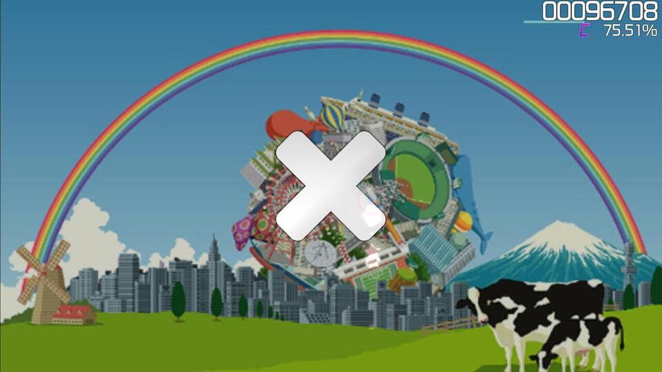

# Pause

Le **pause** sono sezioni di una [beatmap](/wiki/Beatmap) prive di [oggetti da colpire](/wiki/Gameplay/Hit_object). Durante questo tempo, la [perdita di HP](/wiki/Gameplay/Health) è temporaneamente interrotta. Le pause di solito permettono al giocatore di riposare il braccio per un breve lasso di tempo e di riposizionare il proprio [dispositivo di input](/wiki/Gameplay/Input_device).

In tutte le modalità di gioco tranne osu!mania, se c'è abbastanza tempo durante una pausa, possono apparire una grafica e un suono che indicano se un giocatore sta andando bene o male, insieme al [voto](/wiki/Gameplay/Grade) corrente nell'angolo in alto a destra dello schermo. Inoltre, le pause attivano i letterbox sullo sfondo se la corrispondente [impostazione beatmap](/wiki/Client/Beatmap_editor/Song_setup) è abilitata.

