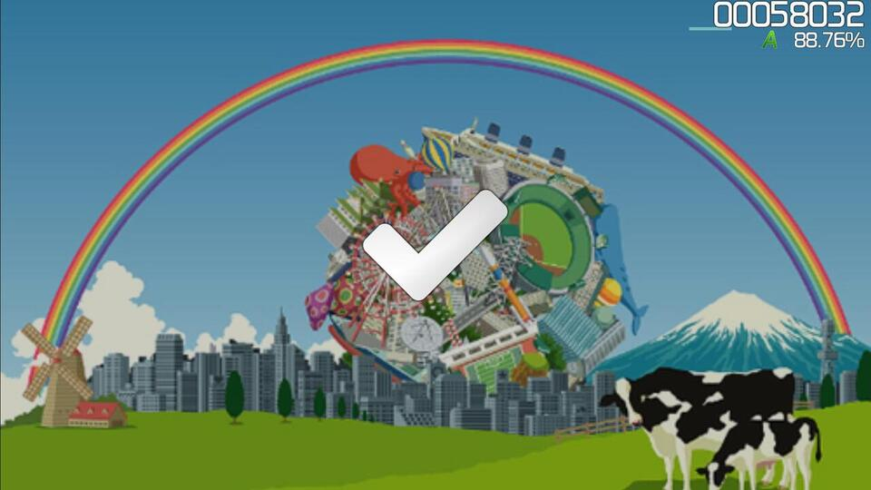
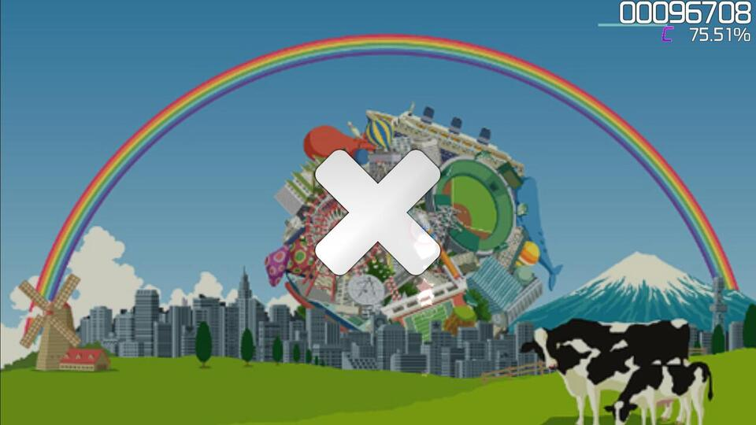

# Break

**Breaks** หรือ **ช่วงพัก** คือส่วนของ [Beatmap](/wiki/Beatmap) ที่ไม่มี [Hit objects](/wiki/Gameplay/Hit_object) วางอยู่ ในช่วงเวลานี้ การลดลงของ [พลังชีวิต (Health drain)](/wiki/Gameplay/Health) จะหยุดลงชั่วคราว ช่วงพักมักจะช่วยให้ผู้เล่นได้พักแขนในระยะเวลาสั้นๆ และปรับตำแหน่งของ [อุปกรณ์ควบคุม (Input device)](/wiki/Gameplay/Input_device) ใหม่

ในทุกโหมดเกมยกเว้น osu!mania หากมีเวลาพักนานพอ ระบบจะแสดงกราฟิกและเสียงแจ้งเตือนสถานะการเล่นว่ากำลังไปได้สวย (Pass) หรือกำลังจะแย่ (Fail) พร้อมกับแสดง [เกรด (Grade)](/wiki/Gameplay/Grade) ปัจจุบันที่มุมขวาบนของหน้าจอ นอกจากนี้ ช่วงพักจะทำให้เกิดแถบสีดำ (Letterboxes) บนภาพพื้นหลัง หากมีการเปิดใช้งาน [การตั้งค่า Beatmap](/wiki/Client/Beatmap_editor/Song_setup) ที่เกี่ยวข้องไว้

