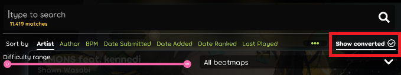

---
tags:
  - convert beatmaps
  - converted beatmaps
  - 转谱
---

# 转谱

**转谱** 是指 osu! 客户端按照规则，将一张特定[游戏模式](/wiki/Game_mode)的[谱面](/wiki/Beatmap)，转换成原本没有的，其他模式的谱面。所有转谱都是基于原谱呈现的参数自动生成的。

目前, osu! 支持由 [osu!standard](/wiki/Game_mode/osu!) 转换成 [osu!taiko](/wiki/Game_mode/osu!taiko)、[osu!catch](/wiki/Game_mode/osu!catch) 和 [osu!mania](/wiki/Game_mode/osu!mania)。

## 转换规则

### osu! 转 osu!taiko

*另见: [osu!taiko 的转谱规则](/wiki/Game_mode/osu!taiko#osu!-转谱提示)*

osu!taiko 的转谱依据是原谱的[打击音效](/wiki/Beatmapping/Hitsound)排布、节奏和滑条速度变化。原谱的[打击物件](/wiki/Gameplay/Hit_object)及其音效决定了转谱的打击物件：

- 对于圆圈、滑条头、滑条尾和折返滑条，转谱的物件由音效决定：
  - 默认音效的，转换成红色音符（Don）；
  - 设置了哨声、掌声（或两者均含有）的，转换成蓝色音符（Kat）；
  - 设置了结束音效的，转换成大红色音符；
  - **既**设置了结束音效，**也**设置了哨声、掌声（或两者均含有）的，转换成大蓝色音符；
- 长滑条，转换成长条（drumrolls）；
- 转盘，转换成拨浪鼓（shakers）。

<!-- TODO: link (https://github.com/ppy/osu-wiki/issues/3152) -->

### osu! 转 osu!catch

*另见: [osu!catch 的转谱规则](/wiki/Game_mode/osu!catch#osu!-转谱提示)*

osu!catch 的转谱依据是原谱的节奏和打击物件*水平位置*（比如x轴坐标）：

- 圆圈、滑条头、滑条尾和折返滑条转换为[大果](/wiki/Gameplay/Hit_object/Fruit)；
- 滑条点转换为[中果](/wiki/Gameplay/Hit_object/Juice_stream#中果)；
- 滑条的主要部分转换为[小果](/wiki/Gameplay/Hit_object/Juice_stream#小果)；
- 转盘转换为[香蕉](/wiki/Gameplay/Hit_object/Banana)。

### osu! 转 osu!mania

osu!mania 的转谱基本上取决于原谱的节奏，而且比其他模式更随机。但这并不意味着 osu!mania 转谱转的不精确，转换规则大致如下：

- 圆圈和短滑条（例如 [1/4 时值的滑条](/wiki/Client/Beatmap_editor/Beat_snap_divisor)），转换为普通音符；
- 转盘和长滑条转换为长按音符。

<!-- TODO: link (https://github.com/ppy/osu-wiki/issues/3152) -->

此外， osu!mania 的转谱还会特别地根据原谱的难度转成 [4K，5K 或 7K](/wiki/Gameplay/Game_modifier/xK)。
