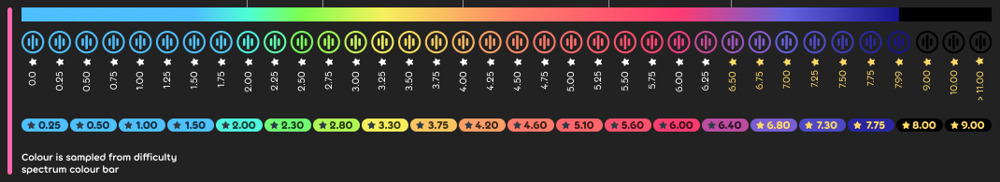

---
tags:
  - difficulty
  - difficulty name
  - SR
  - star rating
  - stars
---

# Tingkat kesulitan

*Berbeda konteks dengan [Beatmap](/wiki/Beatmap).*

Sebuah **tingkat kesulitan beatmap** adalah sebuah level permainan yang tersimpan dalam bentuk teks di sebuah file dengan [ekstensi `.osu`](/wiki/osu!_File_Formats/Osu_(file_format)). Masing-masing level berisikan [*hit object*](/wiki/Hit_object) berdasarkan [mode permainan](/wiki/Game_mode) terkait yang diatur sesuai dengan [waktu (*timing*)](/wiki/Beatmapping/Timing_section) yang telah ditentukan. Masing-masing tingkat kesulitan memiliki aspek yang berbeda, yang secara langsung dapat memengaruhi pengalaman pemain. Nama dari sebuah tingkat kesulitan dan [*star rating*](/wiki/Beatmapping/Star_rating) biasanya memberikan cukup informasi bagi pemain, apakah ini menantang atau tidak.

*Hit object* dari sebuah tingkat kesulitan disusun dalam sebuah [pola](/wiki/Beatmap/Pattern) yang bervariasi pada masing-masing mode permainan dan diatur sesuai dengan nada sehingga mewakili tampilan dan perasaan secara keseluruhan saat sedang dimainkan. Permainan dari sebuah tingkat kesulitan beatmap juga dapat diubah melalui [pengaturan kesulitan](/wiki/Beatmap_Editor/Song_Setup#difficulty) yang diatur oleh pemilik beatmap atau diubah dengan menggunakan [*game modifier*](/wiki/Game_modifier).

Dari perspektif pendengar, sebuah tingkat kesulitan dapat memperkuat lagu dengan menambahkan satu atau beberapa set sampel audio, atau [*hitsound*](/wiki/Beatmapping/Hitsound) yang berfungsi sebagai umpan balik saat sedang bermain.

[Komponen visual](/wiki/Beatmap) dari sebuah tingkat kesulitan berbeda dengan polanya, dan dapat memberikan pengalaman tambahan selama bermain. Komponen visual tersebut sebagian besar dapat dinonaktifkan melalui menu [*visual setting*](/wiki/Visual_Settings). Sementara itu, beberapa diantaranya seperti [*storyboard*](/wiki/Storyboard) atau [*custom skin*](/wiki/Skinning) dari sebuah beatmap secara keseluruhan, sebagian besar komponen visual tersebut dapat bervariasi pada masing-masing tingkat kesulitan (contohnya, bagian [kiai](/wiki/Kiai_time) dan [warna kombo](/wiki/Glossary/Combo_colour)).

## Nama-nama tingkat kesulitan

*Lihat juga: [Penamaan Tingkat Kesulitan](/wiki/Ranking_Criteria/Difficulty_Naming)*

Berikut adalah nama-nama tingkat kesulitan yang umum dipergunakan dalam suatu beatmap. Definisi tiap-tiap tingkat kesulitan beserta panduan tata cara pemakaiannya dapat dilihat pada laman [*ranking criteria*](/wiki/Ranking_Criteria) masing-masing mode permainan.

###  osu!

-  Easy
-  Normal
-  Hard
-  Insane
-  Expert
-  Expert+

###  osu!taiko

-  Kantan
-  Futsuu
-  Muzukashii
-  Oni
-  Inner/Ura Oni
-  Hell Oni

###  osu!catch

-  Cup
-  Salad
-  Platter
-  Rain
-  Overdose
-  Overdose+

###  osu!mania

-  Easy
-  Normal
-  Hard
-  Insane
-  Expert
-  Expert+

## Star rating

Mulai dari 27 Juli 2021, situs web osu! secara otomatis menetapkan warna pada sebuah tingkat kesulitan beatmap berdasarkan *star rating* yang merujuk kepada spektrum berikut:

Dalam beberapa kasus, seperti [*AIMod*](/wiki/Beatmap_Editor/AiMod), tingkat kesulitan dikelompokkan dalam enam rentang level berdasarkan *star rating* sebagai berikut:

-  Easy: 0.0★–1.99★
-  Normal: 2.0★–2.69★
-  Hard: 2.7★–3.99★
-  Insane: 4.0★–5.29★
-  Expert: 5.3★–6.49★
-  Expert+: 6.5★ atau lebih

Perlu diperhatikan bahwa terdapat beberapa tingkat kesulitan dari sebagian besar beatmap sesuai dengan warna atau rentang level yang diberikan, tetapi juga terdapat beberapa yang menyimpang secara signifikan karena faktor-faktor tertentu. Inilah mengapa [*ranking criteria*](/wiki/Ranking_Criteria) memberikan aturan dasar yang lebih sesuai untuk menentukan penamaan tingkat kesulitan beatmap dan pembagiannya tanpa harus terpaku dengan *star rating*-nya.
