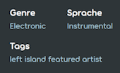
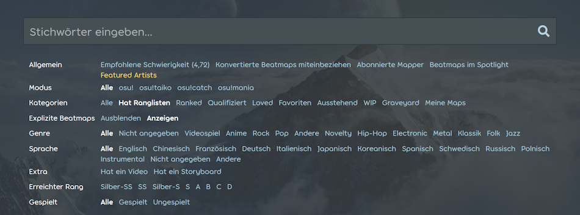

---
tags:
  - genres
  - languages
  - metadata
  - Sprachen
---

# Genre und Sprache

[Beatmaps](/wiki/Beatmap), die auf die Webseite hochgeladen werden, haben Felder für das **Genre** und die **Sprache**, um bei der Kategorisierung von Songs zu helfen. Sie werden als Teil der [Metadaten](/wiki/Client/Beatmap_editor/Song_setup#song-and-map-metadata) einer Beatmap angesehen.

Das Genre und die Sprache haben keine Funktion im Spiel, sind aber als Suchoptionen in [osu!(lazer)](/wiki/Client/Release_stream/Lazer) verfügbar.

## Beatmap-Auflistung

Die [Beatmap-Auflistung](https://osu.ppy.sh/beatmapsets) hat Filter für das Genre und die Sprache im Dropdown-Menü `Mehr Suchoptionen`.

## Das Genre und die Sprache einer Beatmap ändern

Das Genre und die Sprache können auf der Webseite geändert werden, indem man mit dem Mauszeiger über die Details einer Beatmap fährt und auf das Bleistiftsymbol klickt. Dabei bestimmen die [Benutzergruppe](/wiki/People/User_group) des Nutzers und die [Kategorie](/wiki/Beatmap/Category#aktuelle-kategorien) der Beatmap die jeweiligen Rechte:

- Beatmap-Eigentümer dürfen Änderungen vornehmen, wenn sich die Beatmap in der Kategorie [WIP](/wiki/Beatmap/Category#wip-and-pending), [Ausstehend](/wiki/Beatmap/Category#wip-and-pending) oder [Friedhof](/wiki/Beatmap/Category#graveyard) befindet und keine [Nominierungen](/wiki/Beatmap_ranking_procedure#nominations) hat.
- [Beatmap Nominator](/wiki/People/Beatmap_Nominators) dürfen Änderungen vornehmen, wenn sich die Beatmap in der Kategorie [Qualifiziert](/wiki/Beatmap/Category#qualified), WIP oder Ausstehend befindet.
- Mitglieder des [Project Loved Teams](/wiki/People/Project_Loved_Team) dürfen Änderungen vornehmen, wenn sich die Beatmap in der Kategorie [Loved](/wiki/Beatmap/Category#loved) befindet.
- Mitglieder des [Nomination Assessment Teams](/wiki/People/Nomination_Assessment_Team) und des [Globalen Moderationsteams](/wiki/People/Global_Moderation_Team) dürfen Änderungen in allen Kategorien vornehmen.

Eine Beatmap kann nicht [nominiert](/wiki/Beatmap_ranking_procedure#nominations) werden, wenn die Sprache oder das Genre auf `Nicht angegeben` eingestellt ist.

## Liste der Genres

| Genre | Merkmale entsprechender Songs |
| :-- | :-- |
| Nicht angegeben | Keine Songs treffen zu. Dieses Genre ist ein Platzhalter, bis ein geeignetes Genre festgelegt ist. |
| Videospiel | Gemacht für oder populär geworden durch ein Videospiel. Dies wird auch für Arrangements und Remixes dieser Songs verwendet. |
| Anime | Produziert für oder bekannt geworden durch einen Anime oder ein vergleichbares Medium. |
| Rock | Mit einem Schwerpunkt auf Gitarren, Schlagzeug und Bass, typischerweise auf der Grundlage von einfachen synkopischen Rhythmen basierend und von Live-Auftritten und einem Fokus auf ernste sowie progressive Motive charakterisiert ([*Rockmusik* auf Wikipedia](https://de.wikipedia.org/wiki/Rockmusik)). |
| Pop | In der Popkultur weit verbreitet und durch die Verwendung einer einfachen Struktur und wiederholter Refrains oder Melodien eingängig komponiert. |
| Andere | Keinem der aufgeführten Genres zuzuordnen. |
| Novelty | Lustig oder ungewöhnlich. In osu! beinhaltet diese Kategorie hauptsächlich Songs wie "YouTube Poops", "Niconico MADs" und Meme-Musik. |
| Hip-Hop | Stilisierte rhythmische Musik, die häufig das Rappen begleitet und manchmal Samples oder Bassaufnahmen verwendet ([*Hip-Hop* auf Wikipedia](https://de.wikipedia.org/wiki/Hip-Hop)). |
| Electronic | Digital oder mit elektronischen Instrumenten komponiert. |
| Metal | Ausdrucksstarker Sound mit lauten, verzerrten E-Gitarren und Bässen sowie schnellen Schlagzeugrhythmen. |
| Klassik | Formal, auf der Grundlage fortgeschrittener Musiktheorie strukturiert und in der alten westlichen Kultur verwurzelt oder von ihr inspiriert. |
| Folk | Traditionell oder persönlich, locker und die Identität einer Kultur oder einer Gruppe von Menschen widerspiegelnd. |
| Jazz | Der Schwerpunkt liegt auf Improvisation und dem Entlehnen afrikanischer und kubanischer Rhythmen. Enthält typischerweise Pianos und Instrumente aus Marschkapellen. |

## Liste der Sprachen

- Englisch
- Chinesisch
- Französisch
- Deutsch
- Italienisch
- Japanisch
- Koreanisch
- Spanisch
- Schwedisch
- Russisch
- Polnisch
- Instrumental
- Nicht angegeben
- Andere (einschließlich Songs mit mehreren Sprachen)
