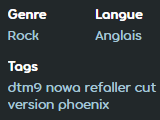

---
tags:
  - genres
  - languages
  - metadata
  - langue
outdated_translation: true
outdated_since: 26dcaa7c6a1a7d47d0c5cb61dd01f45263a970bb
---

<!--The citation in the rock genre was changed from unsyncopated to syncopated. When updating this article, please make sure if this needs to be adjusted here.-->

# Genre et langue

Les [beatmaps](/wiki/Beatmap) soumises au site web ont des champs **genre** et **langue** pour aider à catégoriser les musiques. Ils sont considérés comme faisant partie des [métadonnées](/wiki/Client/Beatmap_editor/Song_setup#métadonnées-des-musiques-et-des-beatmaps) d'une beatmap.

Le genre et la langue n'ont pas de fonction dans le jeu, mais seront disponibles comme options de recherche dans [osu!(lazer)](/wiki/Client/Release_stream/Lazer).

## Liste des beatmaps

La [liste des beatmaps](https://osu.ppy.sh/beatmapsets) dispose de filtres pour le genre et la langue dans la liste déroulante `Plus de critères de recherche`.

## Changer le genre et la langue d'une beatmap

Le genre et la langue peuvent être modifiés sur le site Web en cliquant sur l'icône en forme de crayon lorsque vous survolez les détails d'une beatmap. Cette possibilité est déterminée par les [groupes d'utilisateurs](/wiki/People/User_group) et la [catégorie](/wiki/Beatmap/Category#catégories-actuelles) de la beatmap :

- Les propriétaires de beatmaps sont autorisés lorsque la beatmap est dans les catégories [WIP](/wiki/Beatmap/Category#wip-and-pending), [en attente](/wiki/Beatmap/Category#wip-and-pending), ou [cimetière](/wiki/Beatmap/Category#graveyard), et n'a pas de [nominations](/wiki/Beatmap_ranking_procedure#nominations).
- Les membres de la [Beatmap Nominators](/wiki/People/Beatmap_Nominators) sont autorisés lorsque la beatmap se trouve dans les catégories [qualifiée](/wiki/Beatmap/Category#qualified), WIP, ou en attente.
- Les membres de la [Project Loved Team](/wiki/People/Project_Loved_Team) sont autorisés lorsque la beatmap se trouve dans la catégorie [loved](/wiki/Beatmap/Category#loved).
- Les membres de la [Nomination Assessment Team](/wiki/People/Nomination_Assessment_Team) et des [Global Moderation Team](/wiki/People/Global_Moderation_Team) sont autorisés pour toutes les catégories.

Une beatmap ne peut pas être [nominée](/wiki/Beatmap_ranking_procedure#nominations) si elle a le genre ou la langue `non spécifié`.

## Liste des genres

| Genre | Traits des musiques applicables |
| :-- | :-- |
| Non spécifié | Aucune musique n'est applicable. Ce genre est un substitut jusqu'à ce qu'un genre approprié soit défini. |
| Jeu vidéo | Fait pour ou rendu populaire par un jeu vidéo. Ce terme est également utilisé pour les arrangements et les remixes de ces musiques. |
| Anime | Réalisé pour ou rendu populaire par un anime ou un média similaire. |
| Rock | Se concentrant principalement sur les guitares, la batterie et la basse, typiquement "construit sur une base de rythmes simples et non syncopés" et caractérisé par "des performances en direct et une concentration sur des thèmes sérieux et progressifs". ([La *Musique rock* sur Wikipédia](https://fr.wikipedia.org/wiki/Rock#Caract%C3%A9ristiques)). |
| Pop | Très présent dans la culture pop, et composé pour être accrocheur grâce à une structure simple et des refrains ou mélodies répétés. |
| Autre | N'appartient pas à l'un des genres énumérés. |
| Novelty | Comique ou inhabituel. Chez osu!, cette catégorie comprend principalement des musiques comme YouTube Poops, Niconico MADs, et la musique même. |
| Hip Hop | "Musique rythmique stylisée qui accompagne généralement le rap", parfois "en échantillonnant les rythmes ou les lignes de basse des disques". ([La *Musique hip-hop* sur Wikipédia](https://fr.wikipedia.org/wiki/Hip-hop#Caract%C3%A9ristiques)). |
| Électronique | Composé numériquement ou avec des instruments électroniques. |
| Métal | Avoir un son lourd, utilisant des guitares électriques et des basses fortes et distordues, et contenant des rythmes de batterie rapides ou denses. |
| Classique | Formel, structuré autour de la théorie musicale avancée, et ayant des racines dans la vieille culture occidentale ou s'en inspirant. |
| Folk | Traditionnel ou personnel, décontracté, et reflétant l'identité d'une culture ou d'un groupe de personnes. |
| Jazz | Se concentre sur l'improvisation et emprunte les styles rythmiques africains et cubains. On y trouve généralement des pianos et des instruments utilisés dans les fanfares. |

## Liste des langues

- Anglais
- Chinois
- Français
- Allemand
- Italien
- Japonais
- Coréen
- Espagnol
- Suédois
- Russe
- Polonais
- Instrumental
- Non spécifié
- Autre (y compris les musiques comportant plusieurs langues principales)
