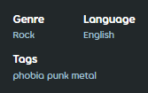

---
tags:
  - genres
  - languages
  - metadata
---

# แนวเพลงและภาษา (Genre and language)

[Beatmap](/wiki/Beatmap) ที่ส่งขึ้นสู่เว็บไซต์จะมีช่องข้อมูล **แนวเพลง (Genre)** และ **ภาษา (Language)** เพื่อช่วยในการจัดหมวดหมู่ ข้อมูลส่วนนี้ถือเป็นส่วนหนึ่งของ [Metadata](/wiki/Client/Beatmap_editor/Song_setup#general) ของ Beatmap

แนวเพลงและภาษาไม่มีผลต่อการทำงานภายในเกมในปัจจุบัน แต่จะสามารถใช้เป็นตัวเลือกในการค้นหาได้ใน [osu!(lazer)](/wiki/Client/Release_stream/Lazer)

## รายการ Beatmap (Beatmap listing)

ในหน้า [รายการ Beatmap (Beatmap listing)](https://osu.ppy.sh/beatmapsets) จะมีตัวกรองสำหรับแนวเพลงและภาษาอยู่ในเมนู `More Search Options`

## การเปลี่ยนแนวเพลงและภาษาของ Beatmap

คุณสามารถเปลี่ยนแนวเพลงและภาษาได้บนเว็บไซต์โดยคลิกที่ไอคอนรูปดินสอเมื่อวางเมาส์เหนือรายละเอียดของ Beatmap สิทธิ์ในการเปลี่ยนข้อมูลนี้จะขึ้นอยู่กับ [กลุ่มผู้ใช้ (User groups)](/wiki/People/User_group) และ [หมวดหมู่ (Category)](/wiki/Beatmap/Category#present-categories) ของ Beatmap นั้นๆ ดังนี้:

- **เจ้าของชุดแมพ (Mapset owners)** สามารถเปลี่ยนได้เมื่อ Beatmap อยู่ในหมวด [WIP](/wiki/Beatmap/Category#wip-and-pending), [Pending](/wiki/Beatmap/Category#wip-and-pending) หรือ [Graveyard](/wiki/Beatmap/Category#graveyard) และต้องยังไม่ได้รับ [การเสนอชื่อ (Nominations)](/wiki/Beatmap_ranking_procedure#nominations) ใดๆ
- **[Beatmap Nominators](/wiki/People/Beatmap_Nominators)** สามารถเปลี่ยนได้เมื่อ Beatmap อยู่ในหมวด [Qualified](/wiki/Beatmap/Category#qualified), WIP หรือ Pending
- **สมาชิก [Project Loved Team](/wiki/People/Project_Loved_Team)** สามารถเปลี่ยนได้เมื่อ Beatmap อยู่ในหมวด [Loved](/wiki/Beatmap/Category#loved)
- **สมาชิก [Nomination Assessment Team](/wiki/People/Nomination_Assessment_Team)** และ **[Global Moderation Team](/wiki/People/Global_Moderation_Team)** สามารถเปลี่ยนได้ในทุกหมวดหมู่

Beatmap จะไม่สามารถถูก [เสนอชื่อ (Nominated)](/wiki/Beatmap_ranking_procedure#nominations) ได้หากยังระบุแนวเพลงหรือภาษาเป็น `Unspecified` (ไม่ได้ระบุ)

## รายชื่อแนวเพลง (List of genres)

| แนวเพลง (Genre) | ลักษณะของเพลงที่เข้าข่าย |
| :-- | :-- |
| Unspecified | ไม่ได้ระบุแนวเพลง ใช้เป็นตัวสำรองจนกว่าจะมีการตั้งค่าที่ถูกต้อง |
| Video Game | เพลงที่สร้างขึ้นเพื่อใช้ในวิดีโอเกม หรือมีชื่อเสียงมาจากวิดีโอเกม รวมถึงเพลงฉบับเรียบเรียง (Arrangements) และรีมิกซ์ของเพลงเหล่านั้น |
| Anime | เพลงที่สร้างขึ้นเพื่อใช้ในอนิเมะ หรือมีชื่อเสียงมาจากอนิเมะหรือสื่อที่ใกล้เคียงกัน |
| Rock | เน้นการใช้กีตาร์, กลอง และเบส โดยปกติจะ "สร้างขึ้นบนพื้นฐานของจังหวะขัด (Syncopated) ที่เรียบง่าย" และมีลักษณะเด่นคือ "เป็นการแสดงสดและเน้นเนื้อหาที่จริงจังหรือล้ำสมัย" |
| Pop | เป็นที่นิยมในวัฒนธรรมกระแสหลัก (Pop culture) และแต่งขึ้นเพื่อให้ติดหูโดยใช้โครงสร้างที่เรียบง่ายและมีท่อนฮุคหรือทำนองที่ซ้ำไปมา |
| Other | ไม่เข้าข่ายแนวเพลงใดๆ ที่ระบุไว้ข้างต้น |
| Novelty | เพลงตลกขบขันหรือผิดปกติ ใน osu! หมวดหมู่นี้มักจะรวมเพลงประเภท YouTube Poops, Niconico MADs และเพลงมีม (Meme music) ต่างๆ |
| Hip Hop | "ดนตรีที่มีจังหวะเป็นเอกลักษณ์ซึ่งมักจะมาคู่กับการแร็ป" บางครั้งมีการ "แซมพลิง (Sampling) บีทหรือไลน์เบสจากแผ่นเสียง" |
| Electronic | แต่งขึ้นด้วยระบบดิจิทัลหรือเครื่องดนตรีอิเล็กทรอนิกส์ |
| Metal | มีเสียงที่หนักหน่วง มีการใช้กีตาร์ไฟฟ้าและเบสที่เสียงดังและแตกพร่า (Distorted) รวมถึงมีจังหวะกลองที่เร็วหรือหนาแน่น |
| Classical | เพลงคลาสสิกที่มีรูปแบบเป็นทางการ โครงสร้างตามทฤษฎีดนตรีขั้นสูง และมีรากฐานมาจากวัฒนธรรมตะวันตกสมัยเก่าหรือได้รับแรงบันดาลใจจากสิ่งนั้น |
| Folk | เพลงพื้นบ้านที่มีความดั้งเดิมหรือมีความเป็นส่วนตัว เป็นกันเอง และสะท้อนถึงเอกลักษณ์ของวัฒนธรรมหรือกลุ่มคน |
| Jazz | เน้นการด้นสด (Improvisation) และหยิบยืมสไตล์จังหวะแบบแอฟริกันและคิวบัน มักมีการใช้เปียโนและเครื่องเป่าที่ใช้ในวงโยธวาทิต |

## รายชื่อภาษา (List of languages)

- English (อังกฤษ)
- Chinese (จีน)
- French (ฝรั่งเศส)
- German (เยอรมัน)
- Italian (อิตาลี)
- Japanese (ญี่ปุ่น)
- Korean (เกาหลี)
- Spanish (สเปน)
- Swedish (สวีเดน)
- Russian (รัสเซีย)
- Polish (โปแลนด์)
- Instrumental (บรรเลง - ไม่มีเนื้อร้อง)
- Unspecified (ไม่ได้ระบุ)
- Other (อื่นๆ รวมถึงเพลงที่มีหลายภาษาที่โดดเด่นพร้อมกัน)
