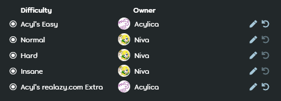

---
tags:
  - GD
  - guest beatmap
  - guest difficulties
  - guest map
---

# Gastschwierigkeit

*Für Regeln zu Gastschwierigkeiten, siehe: [Ranking-Kriterien](/wiki/Ranking_criteria)*

Eine **Gastschwierigkeit** (engl. **guest difficulty**, kurz *GD*) ist ein [Schwierigkeitsgrad](/wiki/Beatmap/Difficulty) einer [Beatmap](/wiki/Beatmap), der nicht vom [Besitzer der Beatmap](/wiki/Beatmap/Beatmap_host) erstellt wurde. Eine Gastschwierigkeit kann üblicherweise daran erkannt werden, dass ihr Name den Benutzernamen des Gast-Mappers enthält.

Obwohl es nicht verpflichtend ist, kann es in vielen Situationen vorteilhaft sein, Gastschwierigkeiten zu verwenden, da sie oft komplett unterschiedliche Mapping-Stile enthalten, was das Mapset diversifiziert und dabei hilft, Burnout durch Mapping zu reduzieren. Gastschwierigkeiten werden meistens durch Privatnachrichten zwischen Mappern angefragt, sie können jedoch auch auf andere Weise angefragt werden, z. B. im `#mapping`-Kanal oder in [Modding-Warteschlangen](/wiki/Community/Forum/Modding_Queues).

Gastschwierigkeiten sind nicht zu verwechseln mit Schwierigkeitsgraden, die von mehreren Mappern erstellt wurden, bekannt als [Kollaborationen](/wiki/Beatmap/Beatmap_collaborations).

## Difficulty-Besitzer

::: Infobox

:::

Auf der [Beatmap-Diskussionsseite](/wiki/Beatmap_discussion) kann der Besitzer der Beatmap über den Button `Difficulty-Besitzer` die entsprechenden Mapper als Besitzer der Gastschwierigkeiten festlegen. Dadurch können diese offene Probleme in ihren jeweiligen Schwierigkeitsgraden selbst lösen.

Sobald eine Beatmap eine der Kategorien [Qualifiziert](/wiki/Beatmap/Category#qualifiziert), [Ranked](/wiki/Beatmap/Category#ranked) oder [Loved](/wiki/Beatmap/Category#loved) erreicht, können die Besitzer der Gastschwierigkeiten nicht mehr geändert werden, außer von Mitgliedern des [globalen Moderationsteams](/wiki/People/Global_Moderation_Team) oder des [Nomination-Assessment-Teams](/wiki/People/Nomination_Assessment_Team).
