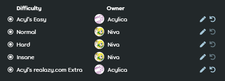

---
tags:
  - GD
  - guest beatmap
  - guest difficulties
  - guest map
  - 客串
  - 客串谱面
  - 客串难度
  - 客串图
---

# 客串难度

*对于客串难度相关的规定，参见：[谱面上架标准 (RC)](/wiki/Ranking_criteria)*

**客串难度 (Guest difficulties)** 简称为 *GD*，指的是[谱面](/wiki/Beatmap)中制作者不是[谱面所有者](/wiki/Beatmap/Beatmap_host)的[难度](/wiki/Beatmap/Difficulty)。通常可以通过含有客串制图者用户名的难度名辨别出客串难度。

尽管不强求添加客串难度，但它在许多方面是有益的，因为这些难度会体现出谱师间完全不同的作图风格，使谱面多样化，并帮助减轻作图疲劳。谱师间寻求客串难度最常使用的方法是私信，但也可以使用其他方法，比如游戏内的 `#mapping` 频道或[摸图队列](/wiki/Community/Forum/Modding_Queues)。

不要将客串难度与含有多位谱师特征的难度相混淆，后者被称作[合作难度](/wiki/Beatmap/Beatmap_collaborations)。

## 所有权

::: Infobox

:::

在[谱面讨论帖](/wiki/Beatmap_discussion)上，谱面所有者可以用`难度作者`按钮让对应谱师拥有客串难度所有权。这可以让客串难度所有者自己解决难度中待处理的问题。

如果谱面处于[过审 (Qualified)](/wiki/Beatmap/Category#qualified)、[上架 (Ranked)](/wiki/Beatmap/Category#ranked) 或[社区喜爱 (Loved)](/wiki/Beatmap/Category#loved) 状态，除非 [GMT](/wiki/People/Global_Moderation_Team) 或 [NAT](/wiki/People/Nomination_Assessment_Team) 成员许可，否则无法更改客串难度所有权。
