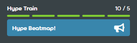

---
tags:
  - train
  - hype train
---

# Hype

::: Infobox

:::

Beim Beatmapping wird mit einem **Hype** grob dargestellt, wie viele Spieler möchten, dass eine bestimmte Beatmap in die Kategorie [Ranked](/wiki/Beatmap/Category#ranked) kommt. Nutzer können Beiträge auf der [Diskussionsseite](/wiki/Beatmap_discussion) der Beatmap veröffentlichen und die Option `Hype!` verwenden, um zum **Hype-Train** beizutragen.

Da Hypes ein aktiver Bestandteil des [Ranking-Verfahrens](/wiki/Beatmap_ranking_procedure) sind, können sie nur an Beatmaps vergeben werden, die den Kategorien [Work in Progress oder Ausstehend](/wiki/Beatmap/Category#wip-and-pending) zugeordnet sind.

## Ranking-Voraussetzung

Beatmaps benötigen mindestens **5 Hypes** (oder eine vollständige Leiste des Hype-Trains) von anderen Nutzern, um für eine [Nominierung](/wiki/Beatmap_ranking_procedure#nominations) infrage zu kommen. Weitere Hypes ändern nichts am Zulassungsstatus der Beatmap, aber sie helfen dabei, dass die Beatmap besser in der [Beatmap-Auflistung](https://osu.ppy.sh/beatmapsets) zur Geltung kommt, wenn man nach Beatmaps basierend auf ihrem [Nominierungsstatus](https://osu.ppy.sh/beatmapsets?sort=nominations_desc&s=pending) sucht.

## Limit

Nutzer haben anfangs 10 Hypes zur Verfügung. Jeder Hype wird eine Woche nach der Verwendung wieder aufgeladen; nach einer ganzen Woche sind also alle Hypes wieder verfügbar.
