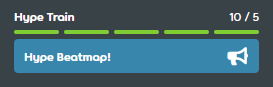

---
tags:
  - train
  - hype train
---

# Hype

::: Infobox

:::

In beatmapping terms, a **hype** is a unit that roughly represents how many people are interested in seeing a particular beatmap to be [ranked](/wiki/Beatmap/Category#ranked). Hypes are awarded by posting in the beatmap's [discussion page](/wiki/Beatmap_discussion) with the `Hype!` option and contribute to the beatmap's **hype train**.

As hypes are an active part of the [ranking process](/wiki/Beatmap_ranking_procedure), they can only be granted to beatmaps that are either [Work in Progress or Pending](/wiki/Beatmap/Category#wip-and-pending).

## Ranking requirement

In order to be eligible for [nomination](/wiki/Beatmap_ranking_procedure#nominations), a beatmap needs to accumulate at least **5 hypes** (or one complete bar of the hype train) from other users. Additional hypes do not contribute towards the beatmap's eligibility, although they do help in making the beatmap more visible in the [beatmap listing](https://osu.ppy.sh/beatmapsets) when searching for beatmaps based on their [nomination status](https://osu.ppy.sh/beatmapsets?sort=nominations_desc&s=pending).

## Limit

Users start with 10 hypes, and they are consumed when used on beatmaps. Each hype takes a week to become available again.
