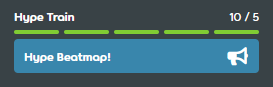

---
tags:
  - train
  - hype train
---

# Hype

::: Infobox

:::

ในบริบทของการสร้าง Beatmap **Hype** (ไฮป์) คือหน่วยที่แสดงให้เห็นคร่าวๆ ว่ามีคนกี่คนที่สนใจอยากให้ Beatmap นั้นๆ ได้รับการ [จัดอันดับ (Ranked)](/wiki/Beatmap/Category#ranked) การมอบ Hype สามารถทำได้โดยการโพสต์ใน [หน้าการสนทนาของ Beatmap (Beatmap discussion page)](/wiki/Beatmap_discussion) พร้อมเลือกตัวเลือก `Hype!` ซึ่งจะช่วยสะสมคะแนนให้กับ **Hype train** ของ Beatmap นั้น

เนื่องจาก Hype เป็นส่วนหนึ่งของ [ขั้นตอนการจัดอันดับ (Ranking process)](/wiki/Beatmap_ranking_procedure) จึงสามารถมอบให้กับ Beatmap ที่อยู่ในหมวด [Work in Progress หรือ Pending](/wiki/Beatmap/Category#wip-and-pending) ได้เท่านั้น

## ข้อกำหนดในการจัดอันดับ

เพื่อให้ Beatmap มีสิทธิ์รับ [การเสนอชื่อ (Nomination)](/wiki/Beatmap_ranking_procedure#nominations) Beatmap นั้นจำเป็นต้องสะสม Hype จากผู้ใช้คนอื่นๆ อย่างน้อย **5 Hype** (หรือสะสมจนเต็มหนึ่งแถบของ Hype train) ทั้งนี้ Hype ที่เกินจาก 5 จะไม่มีผลต่อสิทธิ์การเสนอชื่อเพิ่มเติม แต่จะช่วยให้ Beatmap นั้นถูกค้นหาเจอได้ง่ายขึ้นในหน้า [รายการ Beatmap (Beatmap listing)](https://osu.ppy.sh/beatmapsets) เมื่อผู้เล่นเลือกค้นหาตาม [สถานะการเสนอชื่อ](https://osu.ppy.sh/beatmapsets?sort=nominations_desc&s=pending)

## ขีดจำกัด

ผู้ใช้จะเริ่มด้วยจำนวน 10 Hype และจะถูกหักออกเมื่อนำไปใช้กับ Beatmap โดยแต่ละ Hype จะต้องใช้เวลา 1 สัปดาห์จึงจะกลับมาให้ใช้งานได้อีกครั้ง
