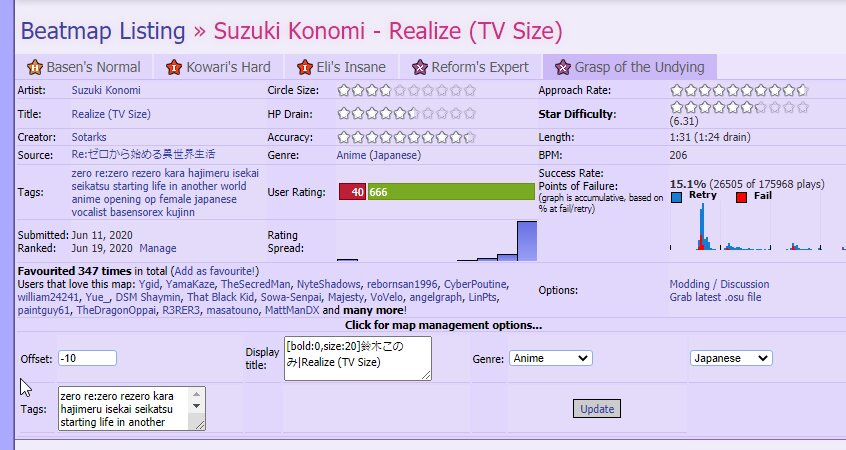

---
tags:
  - online song offset
outdated_translation: true
outdated_since: d4dc177e49049cea28274febee6d73247f0862ab
---

# 在线偏移量

*其他用途，请参见 [偏移量 (解疑)](/wiki/Disambiguation/Offset).*

**在线偏移量** 是在谱面[ranked](/wiki/Beatmap/Category#ranked)后可以应用于谱面的偏移量。这通常是在[谱面](/wiki/Beatmap)需要微调的时候完成的。在线偏移量的优先级在玩家的全局偏移值和局部偏移值之上。

它可以由 [提名评估团队](/wiki/People/The_Team/Nomination_Assessment_Team) (NAT)的成员设置，并被一些高级用户看到，如 [谱面提名小组](/wiki/People/The_Team/Beatmap_Nominators) (BN) 和 [开发人员](/wiki/People/The_Team/Global_Moderation_Team) 。这也意味着在线偏移量对网站上的普通用户是不可见的，但它会在游戏中显示出来。下面显示了在线偏移量如何显示给高级用户:

所有在线偏移量值都存储在本地以供以后使用。即使玩家离线游玩，只要他们在导入或播放谱面之前已经连接到网络，这些值也可以被应用。
