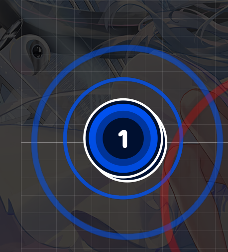
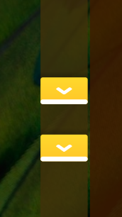
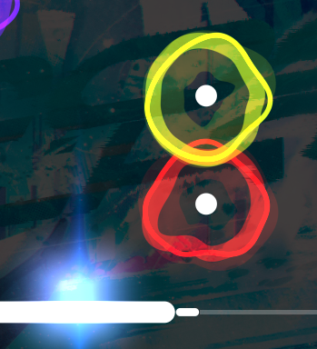

# Doubles

Wzór **Double** powstaje kiedy 2 [hit objects](/wiki/Gameplay/Hit_object) występują po sobie w odstępach rytmicznych 1/2 i szybszych na tej samej pozycji.

W [osu!](/wiki/Game_mode/osu!), Double powstają kiedy dwa [hit circles](/wiki/Gameplay/Hit_object/Hit_circle) są na sobie [stackowane](/wiki/Beatmapping/Mapping_techniques/Stack).

W [osu!mania](/wiki/Game_mode/osu!mania), Double są znane jako [jump chordy](/wiki/Beatmap/Pattern/osu!mania/Chord)

