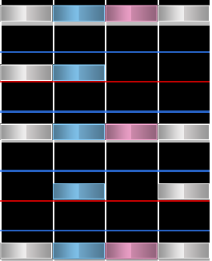

# Anchor

**Anchors**, usually referring to a byproduct of [streams](/wiki/Beatmap/Pattern/osu!mania/Stream) or sometimes [chordjacks](/wiki/Beatmap/Pattern/osu!mania/Jack#chordjack), are a high concentration of notes in one column that appear consecutively within the same snap interval, typically in 1/2nd snap intervals. The name **anchor** comes from the motion the pattern creates, in which your finger is essentially anchored to that key due to the consecutive, intervallic presses. 

