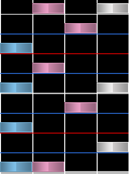
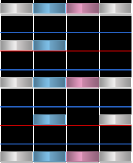

# Anchor

Los **anchors** o *anclas* generalmente se refieren a un subproducto de los [streams](/wiki/Beatmap/Pattern/osu!mania/Stream) o, a veces, [chordjacks](/wiki/Beatmap/Pattern/osu!mania/Jack#chordjack), son una alta concentración de notas en una columna que aparecen consecutivamente dentro del mismo intervalo rápido, normalmente 1/2. El nombre *anchor* proviene del movimiento de la mano que crea el patrón, en el que un dedo está esencialmente anclado a una tecla específica debido a las pulsaciones consecutivas e interválicas. 

