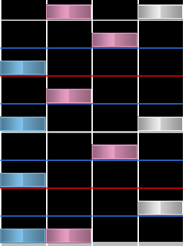
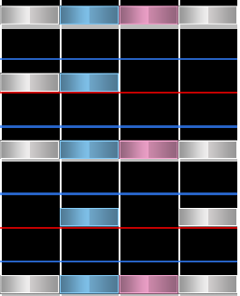

# Anchor (สมอเรือ)

**Anchors** (แองเคอร์) มักจะหมายถึงผลพลอยได้จากรูปแบบ [สตรีม (Streams)](/wiki/Beatmap/Pattern/osu!mania/Stream) หรือบางครั้งก็พบใน [Chordjacks](/wiki/Beatmap/Pattern/osu!mania/Jack#chordjack) โดยเป็นลักษณะที่มีโน้ตจำนวนมากในแถวเดิมปรากฏขึ้นติดต่อกันในช่วงจังหวะ (Snap interval) ที่สม่ำเสมอ ซึ่งปกติจะเป็นจังหวะ 1/2 ที่มาของชื่อ *Anchor* (สมอเรือ) มาจากลักษณะการเคลื่อนไหวของมือที่รูปแบบนี้สร้างขึ้น ซึ่งนิ้วมือจะถูกยึดติดอยู่กับปุ่มใดปุ่มหนึ่งโดยเฉพาะ เนื่องจากการกดที่ต่อเนื่องและเป็นจังหวะที่สม่ำเสมอนั่นเอง

