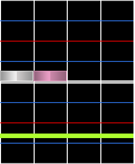
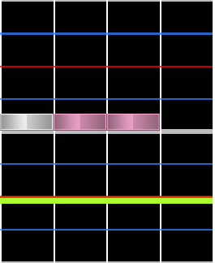
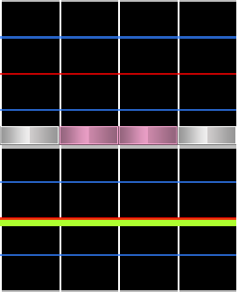
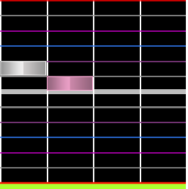

# Chord

Un **chord** est un groupe de deux notes ou plus à jouer en même temps. Ils sont connus pour augmenter la densité et mettre en valeur différents sons dans la musique.

## Jump

Aussi connus sous le nom de doubles, les **jumps** sont deux notes jouées en même temps. C'est le type de chord le plus courant en osu!mania 4K.

Ce terme vient de *Dance Dance Revolution* et d'autres jeux similaires dans lesquels les doubles nécessitent que le joueur saute littéralement entre les flèches sur le tapis de danse.

## Hand

Aussi connus sous le nom de triples, les **hands** sont trois notes jouées en même temps.

## Quad et autres tailles de chords

Les **quads** sont quatre notes jouées en même temps. Au-delà de ce nombre de notes, les chords sont généralement appelées numériquement, tels que "five-note chord", ou "six-note chord". Les plus grandes tailles de chords comme celles-ci sont plus courantes dans les modes de touches supérieures à 4K.

## Grace note

Les **grace notes** sont deux ou plusieurs notes dans des colonnes différentes qui doivent être jouées en succession rapide l'une de l'autre. Cela se fait généralement avec des snappings supérieurs à 1/6. Pendant le gameplay, ils ressemblent beaucoup aux chords.

