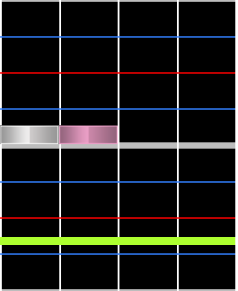
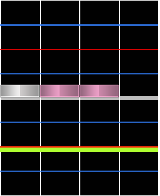
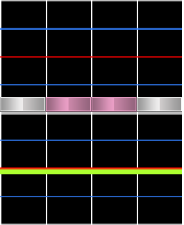
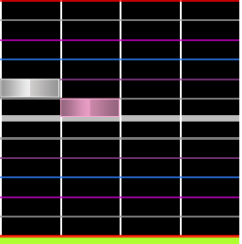

# Chord

**Chord** คือกลุ่มโน้ตตั้งแต่สองตัวขึ้นไปที่ต้องกดพร้อมกัน เป็นที่รู้กันว่าช่วยเพิ่มความหนาแน่นและเน้นเสียงต่าง ๆ ในเพลง

## Jump

หรือที่เรียกว่า doubles, **jumps** คือโน้ตสองตัวที่กดพร้อมกัน นี่เป็นประเภท chord ที่พบบ่อยที่สุดใน 4K osu!mania

คำนี้มาจาก *Dance Dance Revolution* และเกมแนวเดียวกัน ที่การทำ doubles ต้องให้ผู้เล่นกระโดดจริง ๆ ระหว่างลูกศรที่ตรงกันบนแผ่นคอนโทรลเลอร์

## Hand

หรือที่เรียกว่า triples, **hands** คือโน้ตสามตัวที่กดพร้อมกัน

## Quad and other chord sizes

**Quads** คือโน้ตสี่ตัวที่กดพร้อมกัน หากมากกว่านี้ chords มักถูกเรียกด้วยจำนวนตัวเลข เช่น "five-note chord" หรือ "six-note chord" chord sizes ที่ใหญ่แบบนี้พบได้บ่อยกว่าใน key modes ที่สูงกว่า 4K

## Grace note

**Grace notes** คือโน้ตตั้งแต่สองตัวขึ้นไปในคนละคอลัมน์ที่ตั้งใจให้เล่นต่อกันอย่างรวดเร็ว โดยทั่วไปมักใช้ snappings ที่เร็วกว่า 1/6 ระหว่าง gameplay จะดูคล้าย chords มาก

