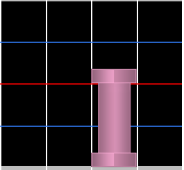
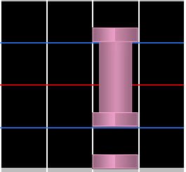
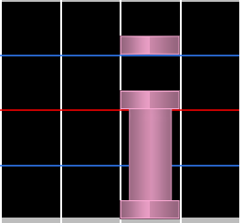
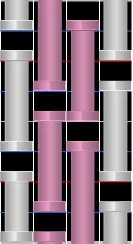

# Hold note

Les **hold notes** (aussi connues sous le nom de **long notes**) sont des notes qu'il faut maintenir puis relâcher. Elles sont souvent appelés "noodles" ou "LNs" (pour Long Notes) et sont utilisées pour représenter des sons prolongés dans la musique.

Les **releases** sont la fin des hold notes, la partie qui demande de relâcher la touche. Elles ont une importance particulière en raison de la prise en compte du timing des releases dans le [système de jugement d'osu!mania](/wiki/Gameplay/Judgement/osu!mania).

## Shield

Les **shields** se produisent lorsqu'une note est placée juste avant une hold note dans la même colonne. Ils se jouent de manière très similaire aux [minijacks](/wiki/Beatmap/Pattern/osu!mania/Jack#minijack).

Les **reverse shields** se produisent lorsqu'une note est placée juste après la release d'une hold note dans la même colonne.

## Inverse

L'**inverse** est un type de pattern de hold notes dans lequel toutes les notes sont remplacées par des hold notes qui s'étendent juste avant la suivante dans la même colonne. Cela crée ce qui s'apparente à un mur de hold notes et forme des patterns denses qui comptent beaucoup sur la capacité du joueur à lire les patterns.

