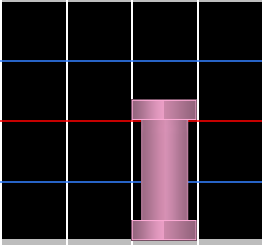
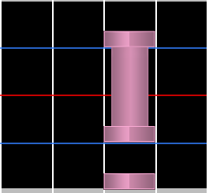
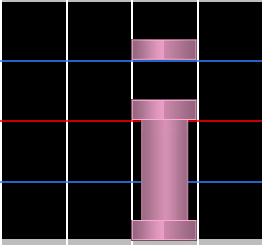
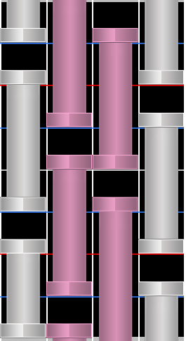

# Hold note

**Hold notes** (หรือ **long notes**) คือโน้ตที่ต้องกดค้างไว้แล้วปล่อยหลังจากนั้น มักถูกเรียกว่า "noodles" หรือ "LNs" ด้วย และใช้แทนเสียงที่ลากยาวในเพลง

**Releases** หมายถึงปลายของ hold note หรือส่วนที่ต้องปล่อยปุ่ม มีความสำคัญเป็นพิเศษ เพราะ release timing ถูกนำมาคิดใน[ระบบ judgement ของ osu!mania](/wiki/Gameplay/Judgement/osu!mania)

## Shield

**Shields** เกิดขึ้นเมื่อมีโน้ตวางต่อเนื่องก่อน hold note ในคอลัมน์เดียวกัน วิธีเล่นจะคล้ายกับ [minijacks](/wiki/Beatmap/Pattern/osu!mania/Jack#minijack) มาก

**Reverse shields** เกิดขึ้นเมื่อมีโน้ตต่อเนื่องตามหลัง release ของ hold note ในคอลัมน์เดียวกัน

## Inverse

**Inverse** คือ hold note pattern ประเภทหนึ่งที่โน้ตทั้งหมดถูกแทนด้วย hold notes ซึ่งยาวไปถึงก่อนโน้ตถัดไปในคอลัมน์เดียวกันพอดี สิ่งนี้สร้างภาพเหมือนกำแพง hold notes และเกิด patterning ที่หนาแน่นซึ่งพึ่งพาความสามารถด้าน reading มากขึ้น

