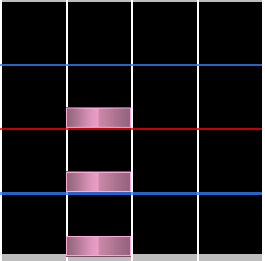
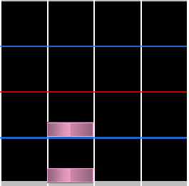
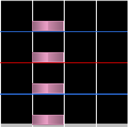
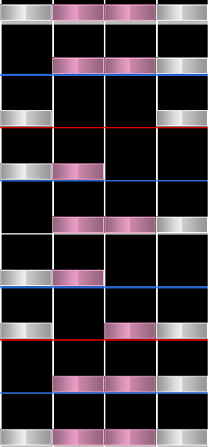

# Jack

I **jack** si riferiscono tipicamente a 3 o più note consecutive all'interno della stessa colonna. Sono tipicamente posizionati con un intervallo di snap di 1/4 o superiore e tendono a presentare meno note in generale, differenziandosi dagli [anchor](/wiki/Beatmap/Pattern/osu!mania/Anchor). I jack rappresentano spesso suoni ripetuti consecutivamente che si verificano nella musica.

Vengono chiamati **jack** perché il movimento richiesto per giocarli è simile a quello di un martello pneumatico (in inglese jackhammer).

## Minijack

Un **minijack** è un tipo di jack che presenta solo 2 note ed è la versione meno impegnativa di un jack.

## Longjack

Un **longjack** è un tipo di jack più impegnativo che utilizza 4 o più note consecutive, tipicamente isolate da qualsiasi altro pattern. Questo termine può essere usato anche quando vengono usati consecutivamente gli stessi [jump](/wiki/Beatmap/Pattern/osu!mania/Chord#jump) o [hand](/wiki/Beatmap/Pattern/osu!mania/Chord#hand).

## Chordjack

I **Chordjack** presentano un mix di diversi tipi di jack insieme a [chord](/wiki/Beatmap/Pattern/osu!mania/Chord). Questo termine è tipicamente usato solo per pattern più densi dei [quadstream](/wiki/Beatmap/Pattern/osu!mania/Stream#quadstream) e come tale l'uso più frequente di chord viene enfatizzato.

