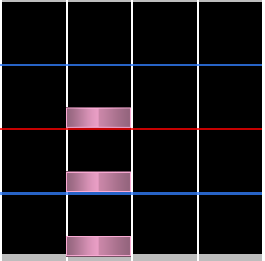
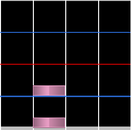
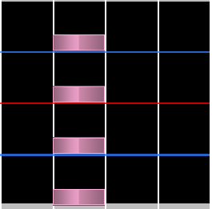
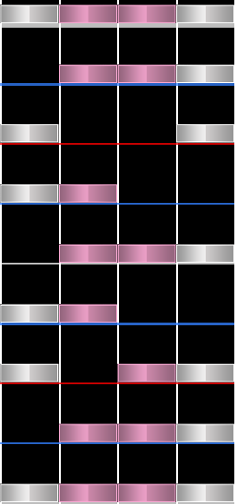

# Jack

**Jacks** โดยทั่วไปหมายถึงโน้ตต่อเนื่อง 3 ตัวขึ้นไปในคอลัมน์เดียวกัน Jacks มัก snap ที่ snap interval 1/4 หรือสูงกว่า และโดยรวมมักมีจำนวนโน้ตน้อยกว่า ซึ่งทำให้ต่างจาก [anchors](/wiki/Beatmap/Pattern/osu!mania/Anchor) Jacks มักแทนเสียงซ้ำต่อเนื่องที่เกิดขึ้นในเพลง

คำว่า **jacks** ใช้เพราะการเคลื่อนไหวที่ต้องใช้ในการเล่นคล้ายการทำงานของ jackhammer

## Minijack

**Minijack** คือ jack ประเภทหนึ่งที่มีโน้ตแค่ 2 ตัว และเป็น jack เวอร์ชันที่ใช้แรงน้อยที่สุด

## Longjack

**Longjack** คือ jack ประเภทที่หนักกว่า ใช้โน้ตต่อเนื่องตั้งแต่ 4 ตัวขึ้นไป โดยปกติจะแยกออกจาก pattern อื่น คำนี้อาจใช้เมื่อ [jumps](/wiki/Beatmap/Pattern/osu!mania/Chord#jump) หรือ [hands](/wiki/Beatmap/Pattern/osu!mania/Chord#hand) เดิมถูกใช้ต่อเนื่องกันด้วย

## Chordjack

**Chordjacks** มี jack หลายประเภทรวมกับ [chords](/wiki/Beatmap/Pattern/osu!mania/Chord) คำนี้มักใช้เฉพาะกับ patterns ที่หนาแน่นกว่า [quadstreams](/wiki/Beatmap/Pattern/osu!mania/Stream#quadstream) และจึงเน้นการใช้ chords ที่ถี่กว่า

