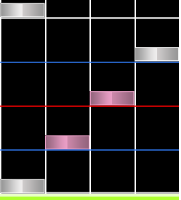
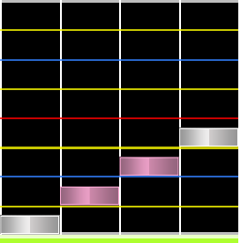
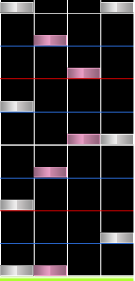
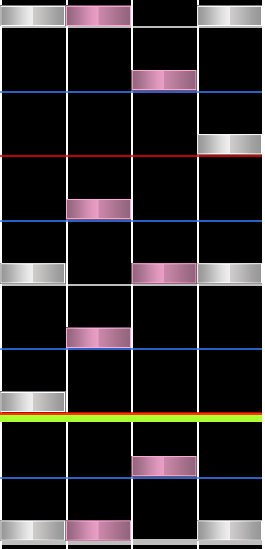
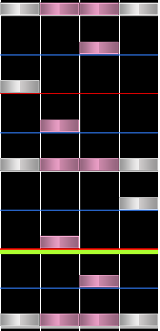
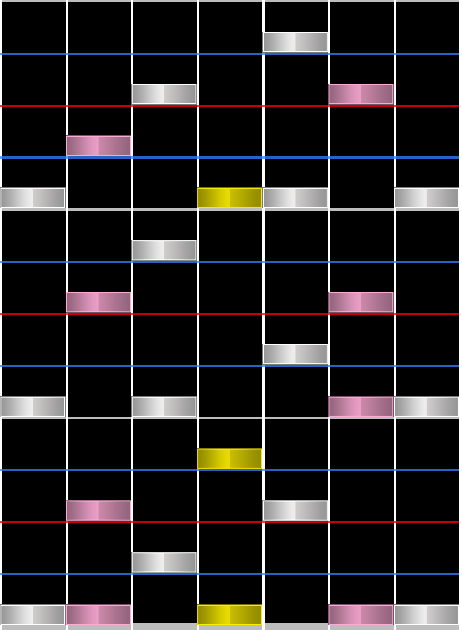
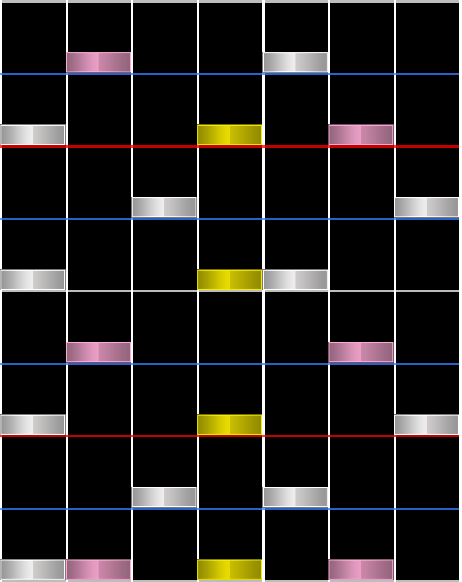
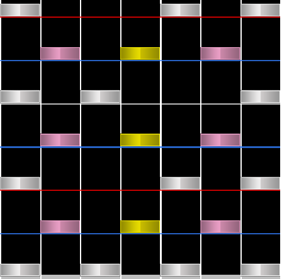

# Stream

## Stream de una sola nota

Un **stream** es un conjunto constante de notas con el mismo intervalo rápido. Hay muchos tipos diferentes de streams que imponen diferentes niveles de tensión al jugador. Los **streams de una sola nota** son el tipo de stream más básico y se componen exclusivamente de notas individuales consecutivas.

Un **roll** es una variación común de un stream que consta de notas que recorren todas las columnas en secuencia.

Los streams con notas que aparecen en intervalos más rápidos que un pulso se suelen llamar **bursts**. Suelen usar ajustes superiores a 1/4.

## Jumpstream

Los **jumpstreams** son streams que involucran [jumps](/wiki/Beatmap/Pattern/osu!mania/Chord#jump). Por lo general, el stream en sí se realiza en ajustes de 1/4, mientras que los jumps aterrizan en ajustes más altos. Este es el tipo de stream más común usado en osu!mania 4K.

Este término se usa principalmente en osu!mania 4K.

## Handstream

Los **handstreams** son streams que involucran [hands](/wiki/Beatmap/Pattern/osu!mania/Chord#hand), y también pueden involucrar jumps. Al igual que los jumpstreams, el stream en sí se realiza en ajustes de 1/4, mientras que los jumps aterrizan en ajustes más altos.

Este término también se usa principalmente en osu!mania 4K.

## Quadstream

**Quadstream** es un término usado exclusivamente en osu!mania 4K. Al igual que los dos tipos de streams anteriores, es un stream que implica el uso de cuádruples y otros chords más pequeños. En osu!mania 4K, los cuádruples en los quadstreams crean [minijacks](/wiki/Beatmap/Pattern/osu!mania/Jack#minijack) con la nota antes o después del cuádruple.

## Chordstream

Los **chordstreams** son un tipo de stream que involucra diferentes tamaños de chords. El stream suele ser de 1/4, con chords en cada intervalo de ajuste de 1/1 o 1/2. En los modos fuera de 4K, «chordstream» generalmente se refiere a streams que involucran 3 o más notas dentro de los chords. Por lo tanto, el término se usa casi exclusivamente en modos que no son 4K.

Los **chordstreams** también pueden incluir **streams dobles**, que son dos streams que ocurren simultáneamente. Estos son más comunes en los modos 7K y superiores de osu!mania.

## Bracket

Los **brackets** son un tipo específico de chordstream que implica el uso de 2 o más [trills](/wiki/Beatmap/Pattern/osu!mania/Trill) que ocurren al mismo tiempo, aunque los trills pueden cambiar de columna. Por lo general, ocurren cuando los chordstreams son bastante densos con el uso de chords y generalmente mezclan trills con una y dos manos.

Este término es exclusivo de los modos de osu!mania que no son 4K.
