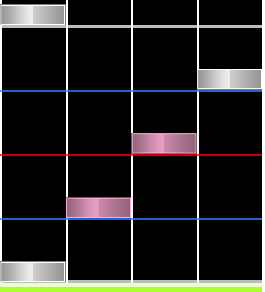
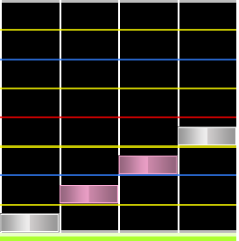
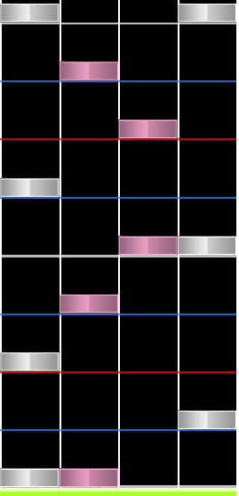
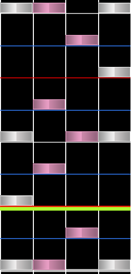
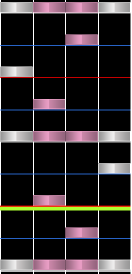
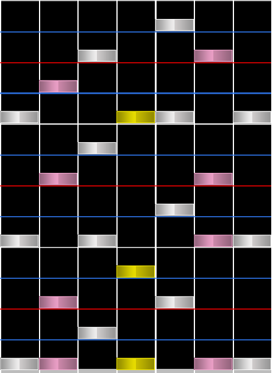
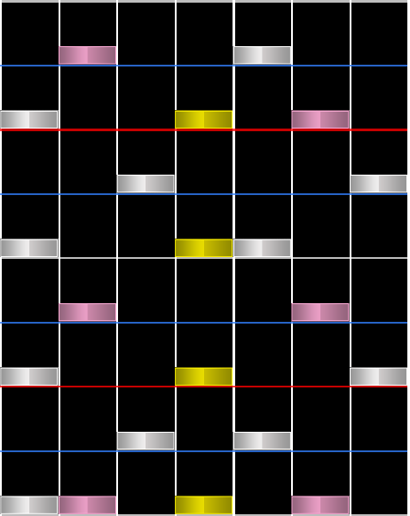
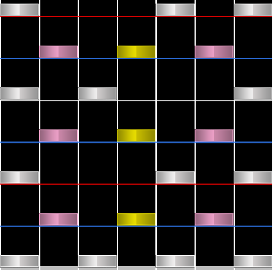

# Stream (สตรีม)

## Single-note stream

**Stream** (สตรีม) คือชุดของโน้ตที่วางต่อเนื่องกันด้วยระยะห่าง (Snap interval) ที่เท่ากัน มีสตรีมหลายประเภทที่สร้างความล้าให้กับผู้เล่นในระดับที่ต่างกัน **Single-note stream** คือประเภทสตรีมพื้นฐานที่สุด ซึ่งประกอบด้วยโน้ตเดี่ยวที่วางเรียงต่อกันเท่านั้น

**Roll** คือรูปแบบหนึ่งของสตรีมที่พบบ่อย ซึ่งประกอบด้วยโน้ตที่วางไล่เรียงกันไปตามลำดับแถวทั้งหมดในแมพ

สตรีมที่มีโน้ตปรากฏขึ้นถี่กว่าหนึ่งจังหวะมักจะเรียกว่า **Bursts** โดยปกติจะใช้ตัวแบ่งจังหวะ (Snaps) ที่เร็วกว่า 1/4

## Jumpstream

**Jumpstreams** คือสตรีมที่มีการใช้ [Jump](/wiki/Beatmap/Pattern/osu!mania/Chord#jump) (โน้ตคู่) ร่วมด้วย โดยปกติแล้วตัวสตรีมจะอยู่ในจังหวะ 1/4 ในขณะที่ Jump จะอยู่ในจังหวะที่ช้ากว่า นี่คือรูปแบบสตรีมที่พบบ่อยที่สุดในโหมด 4K osu!mania

คำนี้ส่วนใหญ่จะใช้ในโหมด 4K osu!mania

## Handstream

**Handstreams** คือสตรีมที่มีการใช้ [Hand](/wiki/Beatmap/Pattern/osu!mania/Chord#hand) (โน้ตสาม) และอาจมีการใช้ Jump ร่วมด้วย เช่นเดียวกับ Jumpstream ตัวสตรีมจะอยู่ในจังหวะ 1/4 ในขณะที่ Jump หรือ Hand จะอยู่ในจังหวะที่ช้ากว่า

คำนี้ส่วนใหญ่ใช้ในโหมด 4K osu!mania เช่นกัน

## Quadstream

**Quadstream** เป็นคำที่ใช้เฉพาะในโหมด 4K osu!mania มีลักษณะคล้ายกับสตรีมสองประเภทก่อนหน้า แต่มีการใช้ Quad (โน้ตสี่) ร่วมกับคอร์ดขนาดเล็กอื่นๆ ในโหมด 4K osu!mania โน้ต Quad ใน Quadstream จะทำให้เกิด [Minijack](/wiki/Beatmap/Pattern/osu!mania/Jack#minijack) กับโน้ตก่อนหน้าหรือหลัง Quad นั้น

## Chordstream

**Chordstreams** คือประเภทของสตรีมที่มีการใช้คอร์ดหลายขนาดผสมกัน โดยปกติสตรีมจะอยู่ในจังหวะ 1/4 และมีคอร์ดอยู่ในทุกช่วงจังหวะ 1/1 หรือ 1/2 ในโหมดที่มีจำนวนปุ่มมากกว่า 4K คำว่า "Chordstream" มักจะสื่อถึงสตรีมที่มีคอร์ดตั้งแต่ 3 โน้ตขึ้นไป ดังนั้นคำนี้จึงมักถูกใช้เฉพาะในโหมดที่ไม่ใช่ 4K

**Chordstreams** อาจรวมถึง **Double streams** ซึ่งเป็นสตรีมสองสายที่เกิดขึ้นพร้อมกัน รูปแบบนี้จะพบบ่อยในโหมด 7K และโหมดที่มีจำนวนปุ่มสูงกว่าของ osu!mania

## Bracket

**Brackets** คือประเภทเฉพาะของ Chordstream ที่มีการใช้ [Trills](/wiki/Beatmap/Pattern/osu!mania/Trill) ตั้งแต่ 2 สายขึ้นไปเกิดขึ้นพร้อมกัน แม้ว่า Trill นั้นอาจจะมีการเปลี่ยนแถวไปมาก็ตาม รูปแบบนี้มักเกิดขึ้นเมื่อ Chordstream มีความหนาแน่นของการใช้คอร์ดค่อนข้างสูง และมักจะผสมผสานระหว่าง Trill มือเดียวและสองมือเข้าด้วยกัน

คำนี้ใช้เฉพาะในโหมด osu!mania ที่ไม่ใช่ 4K
