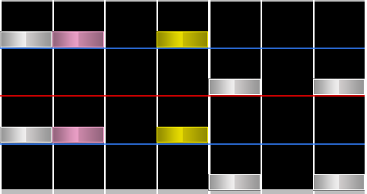
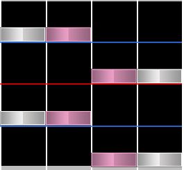
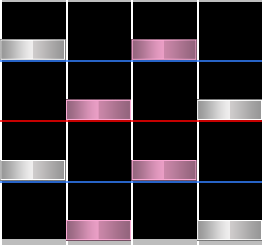

# Trill

A **trill** is three or more consecutive notes that alternate between two columns.

Trills are often characterised based on whether they require one or two hands to perform. These are known as **one-handed trills** and **two-handed trills**.

## Chordtrill, jumptrill and split trill

**Chordtrills** make use of two alternating chords instead of singular notes. They can also be imagined as multiple trills occurring at once.

There are two main types of chordtrills. One requires each chord to be played with one hand, known as a **jumptrill**.

The other type, **split trill**, requires each chord to be played with two hands.

For 4K osu!mania, these are the only types of **chordtrills**. As such, the term **chordtrill** is more likely to be used in higher key modes.
