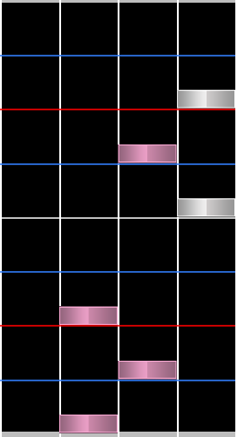
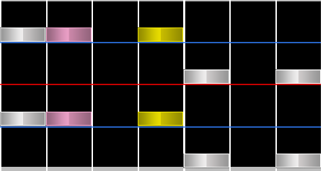
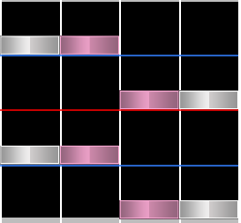
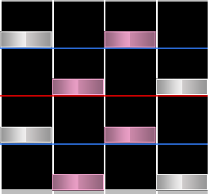

# Trill

**Trill** คือโน้ตต่อเนื่องตั้งแต่สามตัวขึ้นไปที่สลับกันระหว่างสองคอลัมน์

Trills มักถูกแบ่งลักษณะตามว่าต้องใช้มือเดียวหรือสองมือในการเล่น ซึ่งเรียกว่า **one-handed trills** และ **two-handed trills**

## Chordtrill, jumptrill and split trill

**Chordtrills** ใช้ chords สองชุดสลับกันแทนที่จะใช้โน้ตเดี่ยว นอกจากนี้ยังมองได้ว่าเป็น trills หลายชุดที่เกิดพร้อมกัน

Chordtrills มีสองประเภทหลัก ประเภทหนึ่งต้องเล่น chord แต่ละชุดด้วยมือเดียว เรียกว่า **jumptrill**

อีกประเภทคือ **split trill** ซึ่งต้องเล่น chord แต่ละชุดด้วยสองมือ

สำหรับ 4K osu!mania นี่คือประเภททั้งหมดของ **chordtrills** ดังนั้นคำว่า **chordtrill** จึงมีแนวโน้มถูกใช้ใน key modes ที่สูงกว่า
