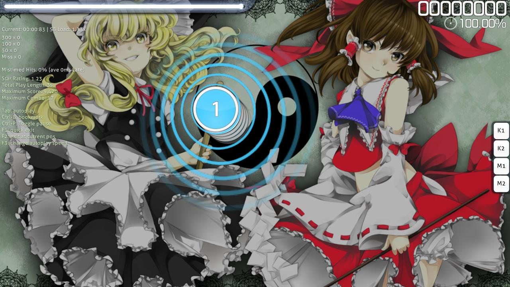

---
tags:
  - stacking
  - stack
  - stack lenience
  - stacking leniency
  - stacking lenience
  - automatic stack
  - automated stack
  - automatic stacking
  - automated stacking
  - autostacking
  - стек
  - стекинг
  - стак
  - стакинг
  - автостек
  - автостак
  - авто стек
  - авто стак
  - автоматический стек
  - автоматический стак
---

# Stack leniency

**Stack leniency** — параметр [карты](/wiki/Beatmap), отвечающий в режиме [osu!](/wiki/Game_mode/osu!) за формирование автоматических [стеков](/wiki/Beatmapping/Mapping_techniques/Stack) (стопок) из [нот](/wiki/Gameplay/Hit_object/Hit_circle) и [слайдеров](/wiki/Gameplay/Hit_object/Slider). Низкое значение stack leniency уменьшает промежуток времени, после которого osu! перестаёт объединять [игровые объекты](/wiki/Gameplay/Hit_object) в стек. По аналогии, высокое значение stack leniency заставит osu! объединять в стек объекты, между которыми проходит больше времени.

Значение stack leniency можно поменять в [редакторе карт](/wiki/Client/Beatmap_editor), открыв окно [Song Setup](/wiki/Client/Beatmap_editor/Song_setup) и перейдя на вкладку `Advanced`. Несмотря на то, что там показан диапазон от `0` до `10`, соответствующий параметр `StackLeniency` в [файле `.osu`](/wiki/Client/File_formats/osu_(file_format)) будет изменяться от `0` до `1.0`.

## Поведение

Параметр stack leniency вместе с [approach rate](/wiki/Beatmap/Approach_rate) влияет на то, какие ноты и компоненты слайдеров будут объединяться в стек.[^stacking-algorithm] Стек будет состоять из объектов, между которыми проходит не более `preempt * StackLeniency` миллисекунд, где `preempt` — [время видимости объекта](/wiki/Beatmap/Approach_rate#время-анимации), а `StackLeniency` — соответствующее значение из файла `.osu`.

Минимальное значение stack leniency, `0`, полностью отключает автоматические стеки. При максимальном значении — `1` — объекты начинают объединяться в стек с момента их появления на поле.

## Примечания

[^stacking-algorithm]: [«osu! stacking algorithm», фрагмент кода от peppy, 24.08.2011](https://gist.github.com/peppy/1167470)
